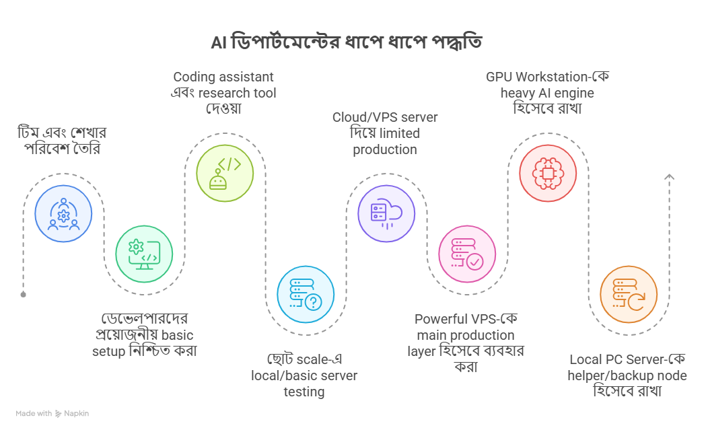
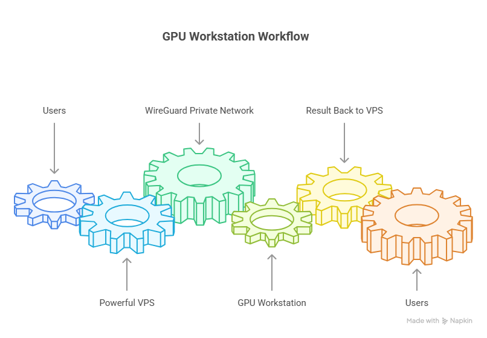

# AI ডিপার্টমেন্ট কীভাবে ধাপে ধাপে গ্রো করা উচিত

<a id="index"></a>

## Index

<!-- tutorial-index:start -->
- [AI ডিপার্টমেন্টের বাস্তবতা](#section-1)
- [প্রোডাক্ট কাঠামো (গুরুত্বপূর্ণ)](#section-2)
- [হুট করে বড় সার্ভার বা GPU সেটআপ কেন করা উচিত নয়](#section-3)
- [আমাদের ধাপে ধাপে যাওয়ার প্রস্তাবিত পদ্ধতি](#section-4)
  - [ধাপ ১: টিম এবং শেখার পরিবেশ তৈরি](#section-5)
  - [ধাপ ২: ডেভেলপারদের প্রয়োজনীয় basic setup নিশ্চিত করা](#section-6)
  - [ধাপ ৩: Coding assistant এবং research tool দেওয়া](#section-7)
  - [ধাপ ৪: ছোট scale-এ local/basic server testing এবং infrastructure understanding](#section-8)
  - [ধাপ ৫: Cloud/VPS server দিয়ে limited production বা pilot](#section-9)
  - [ধাপ ৬: Powerful VPS-কে main production layer হিসেবে ব্যবহার করা](#section-10)
  - [ধাপ ৭: GPU Workstation-কে heavy AI engine হিসেবে রাখা](#section-11)
  - [ধাপ ৮: Local PC Server-কে helper/backup node হিসেবে রাখা](#section-12)
  - [ধাপ ৯: Hybrid infrastructure দিয়ে workload split করা](#section-13)
  - [ধাপ ১০: Scaling plan আগে থেকেই মাথায় রাখা](#section-14)
  - [ধাপ ১১: Heavy training/fine-tuning-এর জন্য temporary cloud GPU ব্যবহার করা](#section-15)
  - [ধাপ ১২: Cost এবং requirement দেখে GPU সিদ্ধান্ত নেওয়া](#section-16)
  - [ধাপ ১৩: চূড়ান্ত প্রস্তাবিত দিকনির্দেশনা (Final Recommended Direction)](#section-17)
<!-- tutorial-index:end -->

---

আসসালামু আলাইকুম ভাই। এটা আমার একটা ছোট্ট চিন্তা, আপনার সাথে শেয়ার করলাম। এর অনেক কিছুই হয়তো আপনি আগে থেকেই জানেন, তবুও পুরোটা একটু কষ্ট করে পড়বেন।

<a id="section-1"></a>

## AI ডিপার্টমেন্টের বাস্তবতা

আমরা যদি একদিনেই OpenAI বা Google-এর মতো কিছু বানাতে চাই, তা বাস্তবসম্মত নয়। সেই পর্যায়ে যেতে হলে দরকার বিশাল টিম, বড় সার্ভার, অসংখ্য GPU, প্রচুর গবেষণা এবং উচ্চ দক্ষতার ইঞ্জিনিয়ার। বাংলাদেশে এমন প্রস্তুত লোকবলও খুব সীমিত। তাই আমাদের লক্ষ্য হওয়া উচিত—ধাপে ধাপে নিজেদের সক্ষমতা তৈরি করা।

প্রথম লক্ষ্য হওয়া উচিত: আমাদের প্রতিষ্ঠানের কাজে AI কীভাবে ব্যবহার করা যায়, কোথায় খরচ কমানো যায়, কোথায় নিজস্ব সিস্টেম বানানো যায়, এবং কীভাবে ধীরে ধীরে একটি কার্যকর AI টিম গড়ে তোলা যায়।

AI-ভিত্তিক কাজ মানে শুধু একটি চ্যাটবট বানানো নয়। এখানে সফটওয়্যার, ডাটা, অ্যালগরিদম, AI মডেল, সার্ভার, GPU, ডেভেলপার টুলস, রিসার্চ এবং প্রোডাকশন কস্ট—সবকিছু জড়িত। তাই এই ডিপার্টমেন্টকে শুধু "প্রজেক্ট বানানোর টিম" হিসেবে দেখলে হবে না; বরং এটি হওয়া উচিত একটি দীর্ঘমেয়াদি R&D ও প্রোডাকশন সক্ষমতা তৈরির জায়গা।

<!-- tutorial-nav:back -->
[Back to Index](#index)

<a id="section-2"></a>

## প্রোডাক্ট কাঠামো (গুরুত্বপূর্ণ)

আমরা যে ধরনের AI প্রোডাক্টই বানাই না কেন, তার ভেতরে সাধারণত কয়েকটি অংশ থাকে:

1. **সফটওয়্যার লজিক / অ্যালগরিদম** — এখানে অ্যালগরিদম বলতে খুব জটিল কিছু বোঝানো হচ্ছে না; বরং সফটওয়্যার কীভাবে কাজ করবে, কোন ইনপুট নেবে, কীভাবে প্রসেস করবে, কোথায় ডাটা রাখবে, কীভাবে রেসপন্স দেবে—এই পুরো লজিকটা।

2. **AI মডেল / AI-ভিত্তিক অংশ** — এটি হতে পারে embedding model, language model, speech-to-text, OCR, reranking model বা অন্য কোনো AI কম্পোনেন্ট।

3. **ডাটাবেস এবং স্টোরেজ** — যেমন কোনো ফতোয়া-ভিত্তিক সিস্টেম হলে সেখানে বই, ডকুমেন্ট, রেফারেন্স, প্রশ্নোত্তর, ভেক্টর ডাটা—সব সঠিকভাবে সংরক্ষণ করতে হবে।

4. **সার্ভার / হোস্টিং ব্যবস্থা** — প্রোডাক্টটি কোথায় চলবে, কীভাবে ইউজার ব্যবহার করবে, কতজন একসাথে ব্যবহার করতে পারবে—এসব সার্ভারের ওপর নির্ভর করে।

5. **GPU / কম্পিউটেশনাল পাওয়ার** — AI-ভিত্তিক কাজের জন্য শক্তিশালী কম্পিউটেশনাল পাওয়ার দরকার হতে পারে। তবে সব সময়, সব পর্যায়ে, সব প্রজেক্টে GPU দরকার হবে—এমন নয়।

এখানেই আমাদের সবচেয়ে গুরুত্বপূর্ণ সিদ্ধান্ত নিতে হবে: **কোন জিনিস এখন দরকার, কোনটা পরে দরকার, আর কোনটা শুধু ভবিষ্যতের লক্ষ্য হিসেবে রাখা উচিত।**

<!-- tutorial-nav:back -->
[Back to Index](#index)

<a id="section-3"></a>

## হুট করে বড় সার্ভার বা GPU সেটআপ কেন করা উচিত নয়

আমাদের end goal হতে পারে—নিজস্ব AI সার্ভার, নিজস্ব GPU setup, নিজস্ব model hosting, এমনকি ভবিষ্যতে model fine-tuning বা self-hosted AI infrastructure। কিন্তু **end goal আর immediate requirement এক জিনিস নয়।**

শুরুতেই যদি আমরা বড় সার্ভার, GPU সার্ভার বা ভারী infrastructure কিনে ফেলি, তাহলে কয়েকটি সমস্যা তৈরি হবে:

- **প্রথম সমস্যা:** প্রোডাক্ট যদি এখনো production-ready না হয়, তাহলে আগে সার্ভার কিনে কোনো বাস্তব লাভ নেই। সার্ভার দরকার তখন, যখন প্রোডাক্ট তৈরি, টেস্টেড এবং deployment-এর জন্য প্রস্তুত। তার আগে সার্ভার কিনলে সেটা idle পড়ে থাকবে।

- **দ্বিতীয় সমস্যা:** বড় সার্ভার মানেই শুধু একবারের খরচ নয়। এর সাথে জড়িত maintenance, networking, cooling, electricity, security, DevOps, monitoring, backup, hardware failure—আরও অনেক কিছু। এগুলো চালানোর জন্য আলাদা দক্ষ লোক দরকার, তার আবার আলাদা বেতন।

- **তৃতীয় সমস্যা:** GPU সার্ভার খুব ব্যয়বহুল। অথচ অনেক AI প্রজেক্টে শুরুতে GPU দরকারই নাও হতে পারে। যেমন RAG-ভিত্তিক কোনো সিস্টেমে যদি আমরা embedding, retrieval এবং reference handling ভালোভাবে optimize করি, তাহলে অনেক অংশ CPU-ভিত্তিক বা low-cost infrastructure-এ চালানো সম্ভব।

- **চতুর্থ সমস্যা:** প্রজেক্টের আগে infrastructure কিনলে টিমের মনোযোগ product development থেকে সরে গিয়ে hardware management-এ চলে যায়। তখন মূল কাজের গতি কমে যায়।

তাই আমার মতে আমাদের পদ্ধতি হওয়া উচিত: **আগে প্রোডাক্ট, তারপর প্রয়োজন অনুযায়ী infrastructure। আগে টিম, তারপর বড় setup। আগে ছোট স্কেলে কাজ প্রমাণ করা, তারপর ধাপে ধাপে বড় করা।**

<!-- tutorial-nav:back -->
[Back to Index](#index)

<a id="section-4"></a>

## আমাদের ধাপে ধাপে যাওয়ার প্রস্তাবিত পদ্ধতি

নিচের ১৩টি ধাপে আমি একটি বাস্তবসম্মত রোডম্যাপ সাজিয়েছি—টিম তৈরি থেকে শুরু করে ধীরে ধীরে infrastructure ও GPU সিদ্ধান্ত পর্যন্ত।

<!-- tutorial-nav:back -->
[Back to Index](#index)

<a id="section-5"></a>

### ধাপ ১: টিম এবং শেখার পরিবেশ তৈরি

এখানে সবচেয়ে গুরুত্বপূর্ণ বিষয় হলো—প্রস্তুত expert পাওয়া কঠিন। বাংলাদেশে এমন লোক খুব কম, যারা একসাথে AI, server, GPU, DevOps, model optimization, RAG, fine-tuning এবং production scaling—সবকিছু ভালোভাবে জানে।

তাই আমাদের বাস্তবসম্মত approach হওয়া উচিত: এমন মানুষ নির্বাচন করা, যারা শেখার ক্ষমতা রাখে, নিজে নিজে গবেষণা করতে পারে, নতুন টুলস বুঝতে পারে এবং কাজ করতে করতে expert হয়ে উঠতে পারে। একদম তৈরি expert hire করার চেয়ে learning-capable মানুষ নিয়ে একটি শেখার পরিবেশ তৈরি করা অনেক বেশি কার্যকর হতে পারে। কারণ একদম টপ-লেভেল expert hire করতে গেলে প্রায় Google-এর মতো বেতন দিতে হবে।

এখানে টিমের learning curve খুব গুরুত্বপূর্ণ। টিম যদি নিজে নিজে শিখতে পারে, research করতে পারে, test করে সিদ্ধান্ত নিতে পারে—তাহলে দীর্ঘমেয়াদে এই টিমই প্রতিষ্ঠানের বড় asset হয়ে উঠবে।

আলহামদুলিল্লাহ, আস-সুন্নাহতে এখন আমাদের যে টিম আছে, মাশাআল্লাহ খুবই দক্ষ। AI ইঞ্জিনিয়ার হিসেবে বাংলাদেশের টপ ডেভেলপারদের থেকে কোনো অংশে কম নয়। এদিক থেকে আপনি সন্তুষ্ট থাকতে পারেন, ভাই। যদিও তা আমাদের কাজ দিয়েই প্রমাণ করতে হবে। আর সেটার জন্যই দরকার দ্বিতীয় ধাপ।

<!-- tutorial-nav:back -->
[Back to Index](#index)

<a id="section-6"></a>

### ধাপ ২: ডেভেলপারদের প্রয়োজনীয় basic setup নিশ্চিত করা



যারা AI প্রোডাক্ট build করবে, তাদের হাতে ন্যূনতম ভালো development setup থাকতে হবে। একজন ডেভেলপারকে যদি খুব দুর্বল কম্পিউটারে কাজ করতে দেওয়া হয়, তাহলে সে AI-based কাজগুলো ঠিকভাবে test করতে পারবে না।

"একটা জিনিস সার্ভারে চলবে"—এটা বলার আগে developer-এর নিজের machine বা local test environment-এ সেটা চালিয়ে দেখা দরকার। কিছু কাজ CPU-তে চলবে, কিছু কাজ GPU ছাড়া চলবে না, আবার কিছু কাজ optimize করলে GPU ছাড়াও সম্ভব হবে—এসব test করার জন্য ভালো PC দরকার।

তাই শুরুতেই বড় server না কিনে, employee/developer side-এর setup-এ মনোযোগ দেওয়া বেশি জরুরি। কারণ প্রোডাক্ট বানাবে মানুষ। মানুষ যদি হাত-পা বাঁধা অবস্থায় থাকে, তাহলে ভালো প্রোডাক্ট তৈরি হবে না।

<!-- tutorial-nav:back -->
[Back to Index](#index)

<a id="section-7"></a>

### ধাপ ৩: Coding assistant এবং research tool দেওয়া

বর্তমান সময়ে coding assistant কোনো luxury নয়, বিশেষ করে AI ডেভেলপমেন্টের ক্ষেত্রে। একজন developer-এর সাথে যদি ভালো coding assistant থাকে, তার productivity অনেক বেড়ে যায়। সে দ্রুত research করতে পারে, দ্রুত prototype বানাতে পারে, error debug করতে পারে, architecture compare করতে পারে এবং বিভিন্ন approach test করতে পারে।

এখানে **Claude Code, GitHub Copilot, Cursor** বা এ ধরনের tool ব্যবহার করা যেতে পারে। উদ্দেশ্য হলো developer-এর কাজকে দ্রুত করা এবং decision-making উন্নত করা।

AI প্রোডাক্ট বানানোর ক্ষেত্রে শুধু কোড লেখা যথেষ্ট নয়। এখানে প্রচুর paper, documentation, benchmark, model comparison, architecture review এবং cost analysis দেখতে হয়। MIT, Harvard, Intel, Nvidia, চীনা research group বা open-source community—অনেক জায়গার research follow করতে হয়। AI assistant থাকলে এই research process অনেক দ্রুত হয়।

বাস্তব হিসাব হলো: একজন developer যদি research, coding, testing, debugging এবং documentation—সবকিছু manually করে, তার অনেক সময় চলে যায়। কিন্তু AI assistant থাকলে একই developer কম সময়ে বেশি experiment করতে পারে, একাধিক approach compare করতে পারে, এবং ভুল সিদ্ধান্ত নেওয়ার ঝুঁকি কমে। ফলে salary cost, development time এবং failed prototype—সবকিছুই কমানো যায়।

<!-- tutorial-nav:back -->
[Back to Index](#index)

<a id="section-8"></a>

### ধাপ ৪: ছোট scale-এ local/basic server testing এবং infrastructure understanding

শুরুতে আমাদের লক্ষ্য হওয়া উচিত production-ready বড় deployment নয়; বরং ছোট scale-এ একটি বাস্তব testing environment তৈরি করা। এখানে একটি সাধারণ server PC বা low-cost cloud/VPS environment ব্যবহার করে application, database, API, retrieval system, UI, authentication, monitoring—এসব বাস্তবে চালিয়ে দেখা যেতে পারে।

এই ধাপের মূল উদ্দেশ্য হবে **capability prove করা।** অর্থাৎ—টিম কি local server configure করতে পারে? deployment করতে পারে? database maintain করতে পারে? API security, backup, monitoring, networking—এসবের practical understanding তৈরি করতে পারে? কারণ AI product build করা আর production environment বোঝা—দুইটা আলাদা skill।

এখানে গুরুত্বপূর্ণ বিষয় হলো—শুরুতেই বড় infrastructure কিনে ফেলা জরুরি নয়। বরং ছোট environment-এ বারবার test করে টিমের হাতে বাস্তব experience তৈরি করা বেশি গুরুত্বপূর্ণ। টিম যদি ছোট setup-এ confidently কাজ করতে পারে, deployment issue solve করতে পারে, debugging করতে পারে—তাহলে ধীরে ধীরে পরের ধাপে যাওয়া যৌক্তিক হবে।

<!-- tutorial-nav:back -->
[Back to Index](#index)

<a id="section-9"></a>

### ধাপ ৫: Cloud/VPS server দিয়ে limited production বা pilot

যখন product-এর একটি ব্যবহারযোগ্য (usable) version তৈরি হবে, তখন সেটি limited scale-এ একটি cloud/VPS server-এর মাধ্যমে চালানো যেতে পারে। এই ধাপে আমাদের লক্ষ্য হবে—real environment-এ product-এর behavior বোঝা।

এখানে VPS server শুধু hosting নয়; বরং public-facing layer হিসেবে কাজ করতে পারে। অর্থাৎ domain, SSL/HTTPS, authentication, API gateway, routing, monitoring, security, logging—এসব VPS layer থেকে handle করা যেতে পারে। এতে production environment সম্পর্কে বাস্তব understanding তৈরি হবে।

এই ধাপে আমরা যে বাস্তব data পাবো:

- real user load কেমন
- server cost কত
- API বা inference cost কত
- latency কোথায় হচ্ছে
- কোন component bottleneck তৈরি করছে
- maintenance workload কতটা

গুরুত্বপূর্ণ বিষয় হলো—শুরুতেই expensive infrastructure না কিনে, small-scale production বা pilot phase চালিয়ে বাস্তব data সংগ্রহ করা। এতে সিদ্ধান্ত emotion-based না হয়ে data-driven হবে।

<!-- tutorial-nav:back -->
[Back to Index](#index)

<a id="section-10"></a>

### ধাপ ৬: Powerful VPS-কে main production layer হিসেবে ব্যবহার করা

আমাদের জন্য একটি strong approach হতে পারে—একটি ভালো configuration-এর VPS নেওয়া, যেখানে public-facing system থাকবে (অথবা শুধু front-end-এর জন্য আমরা আলাদা একটি সার্ভারও ব্যবহার করতে পারি)। অর্থাৎ user সরাসরি VPS-এর সাথে connect করবে।

VPS-এ থাকবে:

- Backend / API
- Authentication
- Database
- Caching
- Small to medium vector DB
- File processing
- OCR / text parsing-এর basic layer
- Automation এবং cron jobs
- Monitoring, logging এবং security
- Light AI task বা ছোট model inference

এতে VPS হবে আমাদের **main brain বা main control layer।**

এই approach-এর বড় সুবিধা হলো—website/API সবসময় online থাকবে। বাসার internet, electricity বা local machine down হলেও public-facing system পুরোপুরি বন্ধ হয়ে যাবে না। শুধু heavy AI task temporary unavailable হতে পারে, কিন্তু core system alive থাকবে।

এটি professional feel দেবে, কারণ user-facing service থাকবে VPS-এ, আর local machine বা GPU থাকবে পেছনের heavy কাজের জন্য (পরের ধাপে বিস্তারিত)।

<!-- tutorial-nav:back -->
[Back to Index](#index)

<a id="section-11"></a>

### ধাপ ৭: GPU Workstation-কে heavy AI engine হিসেবে রাখা

AI workload-এর heavy অংশগুলো VPS-এ চালানোর চেষ্টা না করে GPU Workstation-এ পাঠানো বেশি logical হতে পারে।

GPU Workstation করবে:

- Big LLM inference
- Multimodal AI task
- Vision model
- Heavy OCR বা document processing
- Large embedding generation
- Batch inference



- Model testing
- Fine-tuning বা experimental training

VPS থেকে GPU Workstation-এর সাথে সরাসরি public connection না রেখে **WireGuard VPN** ব্যবহার করা ভালো। এতে GPU machine public internet-এ expose হবে না। VPS request receive করবে, তারপর private WireGuard network দিয়ে heavy task GPU Workstation-এ পাঠাবে।

Basic flow হবে:

```txt
Users
  ↓
Powerful VPS
  ↓
WireGuard private network
  ↓
GPU Workstation
  ↓
Result back to VPS
  ↓
Users
```

এতে security ভালো থাকবে এবং GPU machine private থাকবে। কোনো public port expose করার দরকার হবে না।

<!-- tutorial-nav:back -->
[Back to Index](#index)

<a id="section-12"></a>

### ধাপ ৮: Local PC Server-কে helper/backup node হিসেবে রাখা

Local PC Server-এ থাকবে:

- Backup node
- Local database mirror
- File backup
- Batch processing
- Scheduled task
- Embedding generation
- Dev / staging environment
- Monitoring helper
- Internal testing server

অর্থাৎ আমাদের structure হবে:

```txt
VPS            = Main Brain (মূল নিয়ন্ত্রণ)
GPU Workstation = AI Engine (ভারী AI কাজ)
Local PC Server = Helper / Backup / Worker Node
```

এতে local PC server useful থাকবে, কিন্তু main production system তার ওপর dependent থাকবে না।

<!-- tutorial-nav:back -->
[Back to Index](#index)

<a id="section-13"></a>

### ধাপ ৯: Hybrid infrastructure দিয়ে workload split করা

এই architecture-এ workload সুন্দরভাবে ভাগ হয়ে যাবে।

**VPS handle করবে:**

- User request
- API
- Authentication
- Database
- Business logic
- Caching
- Queue management
- Monitoring
- Lightweight AI task

**GPU Workstation handle করবে:**

- Heavy model inference
- Large AI processing
- Vision / multimodal task
- Fine-tuning
- Heavy batch job

**Local PC Server handle করবে:**

- Backup
- Mirror database
- Development / staging
- Background task
- Non-critical batch processing

এভাবে এক machine-এর ওপর পুরো system dependent থাকবে না। একই সাথে শুরুতেই huge enterprise server বানানোর প্রয়োজনও হবে না।

<!-- tutorial-nav:back -->
[Back to Index](#index)

<a id="section-14"></a>

### ধাপ ১০: Scaling plan আগে থেকেই মাথায় রাখা

এই approach-এর আরেকটি বড় সুবিধা হলো—পরে scaling করা সহজ হবে।

প্রথমে থাকতে পারে:

```txt
VPS
  ↓
GPU Workstation #1
```

পরে দরকার হলে যোগ করা যাবে:

```txt
VPS
├── GPU Workstation #1
├── GPU Workstation #2
├── Office GPU Node
└── Local PC Worker
```

তখন VPS central coordinator হিসেবে কাজ করবে। কোন task কোন machine-এ যাবে, queue কীভাবে চলবে, কোন machine available আছে—এসব VPS/backend layer থেকে control করা যাবে।

তাই শুরু থেকেই architecture এমনভাবে design করা উচিত, যাতে ভবিষ্যতে node বাড়ানো সহজ হয়। একদম শুরুতে অনেক GPU কেনার দরকার নেই, কিন্তু system design এমন হতে হবে যাতে পরে GPU যোগ করা সহজ হয়।

<!-- tutorial-nav:back -->
[Back to Index](#index)

<a id="section-15"></a>

### ধাপ ১১: Heavy training/fine-tuning-এর জন্য temporary cloud GPU ব্যবহার করা

pretraining, fine-tuning, large model experimentation বা heavy batch processing-এর মতো কাজ যদি মাঝে মাঝে দরকার হয়, তাহলে সেটার জন্য short-term cloud GPU ব্যবহার করা বেশি cost-effective হতে পারে।

যেমন—কোনো বড় model fine-tune করতে হলে বা কোনো নির্দিষ্ট সমস্যা সমাধানের জন্য কিছুদিন heavy GPU দরকার হলে আমরা নির্দিষ্ট সময়ের জন্য cloud GPU rent নিতে পারি। কাজ শেষ হলে সেই খরচ বন্ধ হয়ে যাবে। এতে upfront hardware cost, maintenance cost, electricity, cooling, hardware failure—এসব ঝুঁকি কম থাকবে।

এছাড়া ছোট experiment, notebook-based research, prototype testing বা model comparison-এর জন্য **Kaggle, Google Colab** বা এ ধরনের platform ব্যবহার করা যেতে পারে। এগুলো দিয়ে শুরুতে অনেক experiment কম খরচে করা সম্ভব—বিশেষ করে যখন আমাদের শুধু proof-of-concept, benchmark বা ছোট scale-এর training দরকার।

তবে **production workload আর experiment workload আলাদা করে দেখতে হবে।** Colab/Kaggle research ও experiment-এর জন্য ভালো, কিন্তু stable production system চালানোর জন্য এগুলোর ওপর নির্ভর করা ঠিক হবে না। Production system-এর জন্য VPS, dedicated server, GPU workstation বা managed cloud infrastructure বেশি reliable হবে।

সুতরাং আমাদের strategy হতে পারে:

- **ছোট experiment:** Kaggle / Colab / local machine
- **Medium workload:** VPS / local worker / rented GPU
- **Heavy fine-tuning বা training:** short-term cloud GPU
- **Regular heavy inference:** নিজের GPU workstation (যদি cost justified হয়)

এভাবে করলে আমরা শুরুতেই বড় GPU কিনে risk নিচ্ছি না, আবার প্রয়োজন হলে powerful GPU ব্যবহার করার সুযোগও থাকছে।

<!-- tutorial-nav:back -->
[Back to Index](#index)

<a id="section-16"></a>

### ধাপ ১২: Cost এবং requirement দেখে GPU সিদ্ধান্ত নেওয়া

GPU workstation বা GPU server কেনা উচিত **requirement-based decision** হিসেবে।

**GPU দরকার হবে যদি:**

- Local LLM inference চালাতে হয়
- Heavy OCR / document AI লাগে
- Vision model বা multimodal AI লাগে
- Large embedding generation বারবার করতে হয়
- Speech-to-text বা audio processing scale করতে হয়
- Fine-tuning বা model optimization করতে হয়

কিন্তু কোনো system যদি mainly RAG-based হয়, এবং সেখানে ভালো data cleaning, vector DB, caching, retrieval optimization ও controlled generation থাকে—তাহলে শুরুতে অনেক কাজ GPU ছাড়াও করা সম্ভব।

তাই GPU কেনার আগে আমাদের দেখতে হবে:

- Daily user load কত
- Query volume কত
- API cost কত হচ্ছে
- Latency কত
- কোন part bottleneck হচ্ছে
- GPU কিনলে monthly cost কত কমবে
- GPU maintenance কে করবে
- GPU idle পড়ে থাকবে কি না

যদি দেখা যায় monthly API/GPU rental cost এত বেশি হচ্ছে যে নিজের GPU workstation economically justified—তখন GPU workstation নেওয়া logical হবে।

#### খরচ ও সিদ্ধান্তের সারণি

> নিচের খরচগুলো আনুমানিক (বাংলাদেশ প্রেক্ষাপটে, ৳ = টাকা) এবং সময়ের সাথে পরিবর্তিত হতে পারে। এটি শুধু আপেক্ষিক ধারণা দেওয়ার জন্য।

| Stage / Component | কী দরকার | আনুমানিক Cost | Cost Type | Decision / কখন দরকার |
|---|---|---|---|---|
| **Team Setup** | Developer PC/laptop, RAM/SSD upgrade, stable monitor, keyboard/mouse, internet | প্রতি developer ৳৮০,০০০–৳১,৮০,০০০; high-end হলে ৳২,০০,০০০+ | One-time | **এখনই দরকার।** Team productive না হলে AI product এগোবে না। |
| **Coding + Research Assistant** | ChatGPT, Claude, Cursor, GitHub Copilot বা similar tool | প্রতি developer ৳৩,০০০–৳৬,০০০/month | Monthly | **এখনই দরকার।** Research, coding, debugging, documentation-এর গতি বাড়াবে। |
| **32GB VPS Server** | 32GB RAM, 8–16 vCPU, SSD/NVMe storage, public IP, Linux | ৳৪,০০০–৳৩৫,০০০/month | Monthly | Pilot থেকে production phase-এ দরকার। Backend/API/Auth/DB/Queue/Monitoring-এর main public layer। |
| **VPS Initial Setup** | Server hardening, firewall, SSL, domain, deployment pipeline, Docker, reverse proxy, backup config | internal team করলে ৳০–৳২০,০০০; external DevOps নিলে ৳৩০,০০০–৳১,০০,০০০+ | One-time | VPS নেওয়ার সাথে সাথে দরকার। শুধু server কিনলেই হবে না; secure setup জরুরি। |
| **Database Layer** | PostgreSQL/MySQL, managed DB অথবা VPS-hosted DB, backup, replication | VPS-এর ভেতরে হলে included; managed DB হলে ৳২,০০০–৳২৫,০০০/month | Monthly | Real user data শুরু হলেই দরকার। শুরুতে VPS-hosted DB চলে, sensitive/large data হলে managed DB ভালো। |
| **Queue / Background Job Layer** | Redis, BullMQ/Celery/RabbitMQ, background worker, retry system | VPS-এর ভেতরে হলে mostly included; আলাদা server হলে ৳১,৫০০–৳১০,০০০/month | Monthly | Heavy AI task, OCR, file processing, batch job থাকলে দরকার—যাতে user request hang না করে। |
| **Object Storage** | PDF, image, audio, generated file, answer script, document storage | ৳১,০০০–৳১৫,০০০/month | Monthly | File upload/document AI থাকলে দরকার। সব file server disk-এ রাখা long-term নিরাপদ নয়। |
| **Backup Storage** | Daily DB backup, file backup, offsite backup, retention policy | ৳১,০০০–৳১০,০০০/month | Monthly | Production শুরু হলেই বাধ্যতামূলক। Backup ছাড়া system চালানো ঝুঁকিপূর্ণ। |
| **Monitoring + Logging** | Uptime monitor, error log, server metrics, API latency, alert system | self-hosted হলে ৳০–৳৩,০০০/month; paid tool হলে ৳৩,০০০–৳২০,০০০/month | Monthly | Public system চালু হলে দরকার। সমস্যা হওয়ার আগেই warning পাওয়া জরুরি। |
| **AI Workstation** | High-end GPU workstation: RTX 4090/5090 class GPU, 128GB RAM, NVMe, strong PSU/cooling | ৳৩,৫০,০০০–৳৮,০০,০০০+ | One-time + maintenance | Regular heavy inference, OCR, embedding, multimodal বা repeated experiment থাকলে দরকার। শুরুতেই নয়—usage data দেখে। |
| **GPU Workstation Networking** | WireGuard VPN, private network, firewall, SSH restriction, secure tunnel | internal setup হলে ৳০–৳২০,০০০; external হলে ৳৩০,০০০–৳১,০০,০০০+ | One-time | GPU workstation public internet-এ expose না করে VPS থেকে private task পাঠানোর জন্য দরকার। |
| **Local Server (Backup)** | Office/local PC server, HDD/SSD storage, database mirror, file backup, internal staging | Basic ৳৭০,০০০–৳১,৫০,০০০; better server হলে ৳১,৫০,০০০–৳৩,০০,০০০+ | One-time | Main VPS-এর backup/helper node হিসেবে দরকার। Production যেন local server-এর ওপর dependent না হয়। |
| **Local Server Storage Expansion** | 4TB–16TB HDD/SSD, RAID/NAS option, UPS planning | ৳৩০,০০০–৳২,০০,০০০+ | One-time | File-heavy system হলে দরকার। Document, audio, video, answer script জমলে storage জরুরি। |
| **UPS + Power Backup** | UPS for workstation/local server, surge protection, cooling support | ৳১৫,০০০–৳৮০,০০০+ | One-time | Local server/GPU workstation চালালে দরকার। Power issue হলে data corruption বা hardware risk থাকে। |
| **Security + Access Control** | Role-based access, API rate limit, audit log, admin permission, secrets management | internal হলে low cost; external/security review হলে ৳৫০,০০০–৳২,০০,০০০+ | One-time / periodic | Sensitive data, user account, document storage থাকলে দরকার। |
| **Maintenance / DevOps Time** | Server update, backup check, log review, deployment, incident handling | internal team time; dedicated DevOps নিলে salary/additional cost | Monthly / operational | VPS/GPU/local server যত বাড়বে, maintenance workload তত বাড়বে। আগে থেকেই responsibility assign করা দরকার। |
| **Dedicated GPU Server / Multi-GPU Setup** | Multi-GPU server, rack, cooling, high-end networking, dedicated DevOps | ৳১৫,০০,০০০–৳৫০,০০,০০০+ | High one-time + maintenance | **এখন দরকার নেই।** Regular high-volume AI workload proven হলে long-term plan হিসেবে রাখা যায়। |

<!-- tutorial-nav:back -->
[Back to Index](#index)

<a id="section-17"></a>

### ধাপ ১৩: চূড়ান্ত প্রস্তাবিত দিকনির্দেশনা (Final Recommended Direction)

আমাদের এখনকার জন্য সবচেয়ে balanced approach হতে পারে:

**প্রথমে:**

- টিমকে ভালো development setup দেওয়া
- Coding assistant এবং research tool দেওয়া
- ছোট scale-এ prototype বানানো
- Cost-efficient architecture test করা
- Limited pilot চালানো

**এরপর:**

- Powerful VPS নেওয়া
- VPS-কে main public-facing server বানানো
- Database/API/Auth/Monitoring VPS-এ রাখা
- GPU Workstation WireGuard দিয়ে private AI engine হিসেবে connect করা
- Local PC Server-কে helper/backup/worker node হিসেবে রাখা

---

AI খুব দ্রুত মানুষের কাজের ধরন, শেখার গতি এবং দক্ষতা বৃদ্ধির প্রক্রিয়াকে বদলে দিচ্ছে—এটা আমরা বুঝতে পারছি। একজন মানুষ আগে কোনো কাজ শিখতে বা দক্ষ হতে যে সময় নিত, এখন AI ব্যবহার করে সেই শেখার গতি অনেক বেড়ে গেছে। কিন্তু এই সুবিধার পাশাপাশি একটি বড় ঝুঁকিও তৈরি হচ্ছে—আমরা ধীরে ধীরে এমন একটি সিস্টেমের ওপর নির্ভরশীল হয়ে যাচ্ছি, যেটা আমাদের নিজের নিয়ন্ত্রণে নেই।

আজকে AI আমাদের কোডিং, ডিজাইন, ভিডিও এডিটিং, ডকুমেন্ট তৈরি, রিসার্চ, সার্চ, মেডিক্যাল ইনফরমেশন, পড়াশোনা—প্রায় সব জায়গায় সহায়তা করছে। একজন মানুষ AI ব্যবহার করে আগে যে কাজ ২০ ঘণ্টায় করত, সেটি হয়তো ৩০ মিনিটে করতে পারছে। ফলে স্বাভাবিকভাবেই মানুষ AI-নির্ভর হয়ে পড়ছে। সমস্যা AI ব্যবহার করা নয়; সমস্যা হচ্ছে—এই নির্ভরতা যখন পুরোপুরি কিছু বিদেশি প্রতিষ্ঠান, বিদেশি ডাটা সেন্টার এবং নির্দিষ্ট কয়েকটি কোম্পানির হাতে চলে যায়।

আমরা আজকে অনেক ক্ষেত্রে OpenAI, Google, Anthropic বা এ ধরনের প্রতিষ্ঠানের ওপর নির্ভর করছি। তারা আমাদের কাছ থেকে টাকা নিচ্ছে, আমাদের ব্যবহার থেকে ডাটা পাচ্ছে, এবং সেই ডাটা দিয়ে নিজেদের সিস্টেম আরও উন্নত করছে। এক সময় এমন পরিস্থিতি তৈরি হতে পারে, যখন AI ছাড়া কাজ করা কঠিন হয়ে যাবে, কিন্তু সেই AI ব্যবস্থার নিয়ন্ত্রণ আমাদের হাতে থাকবে না। তখন সাবস্ক্রিপশন শেষ হলে, সার্ভিস বন্ধ হলে, দাম বেড়ে গেলে বা কোনো সীমাবদ্ধতা এলে আমরা সরাসরি ক্ষতিগ্রস্ত হব।

মানুষ এক সময় ফ্যান ছাড়াও থাকতে পারত, কিন্তু অভ্যাস তৈরি হওয়ার পর ফ্যান ছাড়া থাকা কষ্টকর হয়ে যায়। একইভাবে AI যদি আমাদের দৈনন্দিন কাজের অবিচ্ছেদ্য অংশ হয়ে যায়, তাহলে সেটি ছাড়া কাজ করা কঠিন হয়ে পড়বে। তখন প্রশ্ন হবে—এই নির্ভরতা কার হাতে? আমাদের নিজেদের কোনো সক্ষমতা আছে কি না?

এই কারণেই আমার মনে হয়, As-Sunnah Foundation-এর মতো একটি প্রতিষ্ঠানের জন্য AI নিয়ে নিজস্ব সক্ষমতা তৈরি করা খুবই গুরুত্বপূর্ণ। এটা শুধু একটি টেকনিক্যাল উদ্যোগ নয়; এটা ভবিষ্যতের নিরাপত্তা, স্বাধীনতা এবং দীর্ঘমেয়াদি সক্ষমতার বিষয়। বাংলাদেশের প্রেক্ষাপটে এই ধরনের কাজ করার মতো বড় কোনো প্রাইভেট প্রতিষ্ঠান বা প্রস্তুত টিম খুব বেশি নেই। তাই আমাদের একদম ছোট পরিসর থেকে হলেও শুরু করা উচিত।

<!-- tutorial-nav:back -->
[Back to Index](#index)
