# সফটওয়্যার ডেভেলপমেন্ট কোর্স — সম্পূর্ণ মডিউল তালিকা

এই ডকুমেন্টটা পুরো কোর্সের মাস্টার টেবিল অফ কন্টেন্টস — শুরু থেকে শেষ পর্যন্ত ৫১টা মডিউলের প্রতিটার README-এর লিংক এখানে দেয়া আছে। কোর্সের বিস্তারিত লেসন-ভিত্তিক আউটলাইনের জন্য দেখো [00-course-outline.md](00-course-outline.md)।

| # | মডিউল | README |
|---|---|---|
| 1 | Welcome To Software Engineering Course | [module-01-welcome-to-swe](module-01-welcome-to-swe/README.md) |
| 2 | Introduction To Webservers | [module-02-introduction-to-webservers](module-02-introduction-to-webservers/README.md) |
| 3 | Introduction To Backend System | [module-03-introduction-to-backend-system](module-03-introduction-to-backend-system/README.md) |
| 4 | Javascript With Node.js And Express.js | [module-04-javascript-with-nodejs-and-expressjs](module-04-javascript-with-nodejs-and-expressjs/README.md) |
| 5 | Async JS Inside Node.js | [module-05-async-js-inside-nodejs](module-05-async-js-inside-nodejs/README.md) |
| 6 | API Development Part One | [module-06-api-development-part-one](module-06-api-development-part-one/README.md) |
| 7 | API Development Part Two | [module-07-api-development-part-two](module-07-api-development-part-two/README.md) |
| 8 | Data Modeling Part One | [module-08-data-modeling-part-one](module-08-data-modeling-part-one/README.md) |
| 9 | JS Essentials For Backend Development | [module-09-js-essentials-for-backend-development](module-09-js-essentials-for-backend-development/README.md) |
| 10 | Process | [module-10-process](module-10-process/README.md) |
| 11 | Cookies And Sessions | [module-11-cookies-and-sessions](module-11-cookies-and-sessions/README.md) |
| 12 | JWT (JSON Web Token) | [module-12-jwt-json-web-token](module-12-jwt-json-web-token/README.md) |
| 13 | TypeScript With OOP | [module-13-typescript-with-oop](module-13-typescript-with-oop/README.md) |
| 14 | Interface And Polymorphism | [module-14-interface-and-polymorphism](module-14-interface-and-polymorphism/README.md) |
| 15 | Introduction To Database | [module-15-introduction-to-database](module-15-introduction-to-database/README.md) |
| 16 | Database Schema And SQL Introduction | [module-16-database-schema-and-sql-introduction](module-16-database-schema-and-sql-introduction/README.md) |
| 17 | Database Read Query Fundamentals | [module-17-database-read-query-fundamentals](module-17-database-read-query-fundamentals/README.md) |
| 18 | Database Fundamentals: Entity Relationships | [module-18-database-fundamentals-entity-relationships](module-18-database-fundamentals-entity-relationships/README.md) |
| 19 | ERD Basics | [module-19-erd-basics](module-19-erd-basics/README.md) |
| 20 | Structured Query Language (SQL) | [module-20-structured-query-language-sql](module-20-structured-query-language-sql/README.md) |
| 21 | Database Indexing And Performance | [module-21-database-indexing-and-performance](module-21-database-indexing-and-performance/README.md) |
| 22 | Software Design Patterns | [module-22-software-design-patterns](module-22-software-design-patterns/README.md) |
| 23 | NestJS: Building Enterprise Applications | [module-23-nestjs-building-enterprise-applications](module-23-nestjs-building-enterprise-applications/README.md) |
| 24 | NestJS Project: E-Commerce | [module-24-nestjs-project-ecommerce](module-24-nestjs-project-ecommerce/README.md) |
| 25 | NestJS Advanced | [module-25-nestjs-advanced](module-25-nestjs-advanced/README.md) |
| 26 | POST API And Data Handling | [module-26-post-api-and-data-handling](module-26-post-api-and-data-handling/README.md) |
| 27 | Beyond CRUD Operations | [module-27-beyond-crud-operations](module-27-beyond-crud-operations/README.md) |
| 28 | Response Formatting And Pagination | [module-28-response-formatting-and-pagination](module-28-response-formatting-and-pagination/README.md) |
| 29 | Authentication And Authorization | [module-29-authentication-and-authorization](module-29-authentication-and-authorization/README.md) |
| 30 | API Security | [module-30-api-security](module-30-api-security/README.md) |
| 31 | API Testing And Performance | [module-31-api-testing-and-performance](module-31-api-testing-and-performance/README.md) |
| 32 | Logging And Observability | [module-32-logging-and-observability](module-32-logging-and-observability/README.md) |
| 33 | Monitoring And Alerting | [module-33-monitoring-and-alerting](module-33-monitoring-and-alerting/README.md) |
| 34 | Production Debugging | [module-34-production-debugging](module-34-production-debugging/README.md) |
| 35 | Advanced Topics | [module-35-advanced-topics](module-35-advanced-topics/README.md) |
| 36 | Backend Applications: Project Planning & Personal Growth | [module-36-backend-applications-project-planning-personal-growth](module-36-backend-applications-project-planning-personal-growth/README.md) |
| 37 | Git And GitHub Fundamentals | [module-37-git-and-github-fundamentals](module-37-git-and-github-fundamentals/README.md) |
| 38 | Software Patterns And Thinking Patterns | [module-38-software-patterns-and-thinking-patterns](module-38-software-patterns-and-thinking-patterns/README.md) |
| 39 | Python FastAPI | [module-39-python-fastapi](module-39-python-fastapi/README.md) |
| 40 | Software Architectural Patterns | [module-40-software-architectural-patterns](module-40-software-architectural-patterns/README.md) |
| 41 | Third Party Integrations | [module-41-third-party-integrations](module-41-third-party-integrations/README.md) |
| 42 | Building AI Agents | [module-42-building-ai-agents](module-42-building-ai-agents/README.md) |
| 43 | Business Analysis & Product Market Fit For SaaS | [module-43-business-analysis-and-product-market-fit-for-saas](module-43-business-analysis-and-product-market-fit-for-saas/README.md) |
| 44 | Indie Hacking & Solo Entrepreneurship | [module-44-indie-hacking-and-solo-entrepreneurship](module-44-indie-hacking-and-solo-entrepreneurship/README.md) |
| 45 | Low-Cost Marketing For Indie Hackers | [module-45-low-cost-marketing-for-indie-hackers](module-45-low-cost-marketing-for-indie-hackers/README.md) |
| 46 | Go Language Basics | [module-46-go-language-basics](module-46-go-language-basics/README.md) |
| 47 | Web Development With Gin Framework | [module-47-web-development-with-gin-framework](module-47-web-development-with-gin-framework/README.md) |
| 48 | Final Project One | [module-48-final-project-one](module-48-final-project-one/README.md) |
| 49 | Indie Project Idea Two | [module-49-indie-project-idea-two](module-49-indie-project-idea-two/README.md) |
| 50 | Startup Project Idea Three | [module-50-startup-project-idea-three](module-50-startup-project-idea-three/README.md) |
| 51 | AI Agent Startup Project Idea Four | [module-51-ai-agent-startup-project-idea-four](module-51-ai-agent-startup-project-idea-four/README.md) |

## কোর্সের বড় ছবি

```mermaid
flowchart LR
    A[Module 1-14: SWE ফাউন্ডেশন, Node.js, TypeScript] --> B[Module 15-21: ডাটাবেজ ও SQL]
    B --> C[Module 22-38: ডিজাইন প্যাটার্ন, NestJS, API, প্রোডাকশন প্র্যাকটিস]
    C --> D[Module 39-40: FastAPI ও আর্কিটেকচার প্যাটার্ন]
    D --> E[Module 41-42: থার্ড-পার্টি ইন্টিগ্রেশন ও AI এজেন্ট]
    E --> F[Module 43-45: SaaS বিজনেস, ইনডি হ্যাকিং, মার্কেটিং]
    F --> G[Module 46-47: Go ভাষা ও Gin ফ্রেমওয়ার্ক]
    G --> H[Module 48-51: চারটা চূড়ান্ত প্রজেক্ট ব্রিফ]
```

শুরু থেকে শেষ পর্যন্ত এই কোর্সের যাত্রাটা তিনটা বড় স্তরে ভাগ করা যায় — প্রথমে টেকনিক্যাল ফাউন্ডেশন (Module ১-৪০), যেখানে Node.js/TypeScript/NestJS ইকোসিস্টেমে ব্যাকএন্ড ডেভেলপমেন্টের প্রতিটা স্তর কভার হয়েছে; তারপর একটা ব্যবসায়িক ও মার্কেটিং মোড় (Module ৪১-৪৫), যেখানে থার্ড-পার্টি ইন্টিগ্রেশন, AI এজেন্ট, আর সোলো ফাউন্ডার হিসেবে ব্যবসা চালানোর বাস্তবতা শেখানো হয়েছে; আর সবশেষে একটা দ্বিতীয় ভাষা ও ফ্রেমওয়ার্ক (Module ৪৬-৪৭ — Go ও Gin), যা দিয়ে চারটা চূড়ান্ত প্রজেক্ট ব্রিফে (Module ৪৮-৫১) কোর্সের সবগুলো ধারণা একসাথে প্রয়োগ করা হয়েছে — একটা টিম-স্কেলের ব্যাকএন্ড থেকে শুরু করে একটা AI-এজেন্ট-চালিত স্টার্টআপ পর্যন্ত।
