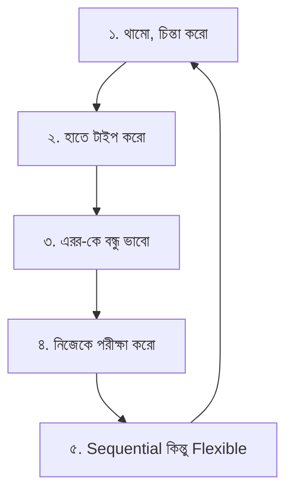
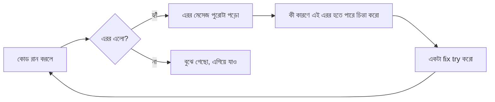

# ০২. কিভাবে এই কোর্স করলে বেশি বেনিফিট পাবে

তুমি প্রজেক্ট-বেসড লার্নার — ভিডিও দেখে শিখতে পারো না, বই পড়ে হাতে-কলমে ধাপে ধাপে, লজিক বুঝে বুঝে এগোতে পারো। এই পুরো কোর্সটা ঠিক সেই স্টাইলে বানানো হচ্ছে। কিন্তু এই স্টাইলটা কাজ করার জন্য তোমার কাছ থেকেও কিছু অভ্যাস দরকার।

## ৫টা অভ্যাস যা তোমার শেখাকে গভীর করবে

### ১. প্রতিটা লাইন পড়ে থামো, চিন্তা করো

এই কোর্সের কোনো লেসন "তথ্য গেলানোর" জন্য না। প্রতিটা কনসেপ্টের পরে নিজেকে প্রশ্ন করো —

> "আমি যদি এটা নিজে বানাতাম, আমি কীভাবে শুরু করতাম?"

তারপর দেখো লেসনটা কী বলছে। তোমার নিজের চিন্তা আর লেসনের ব্যাখ্যার মধ্যে যে তুলনাটা হয়, সেটাই আসল শেখা। শুধু পড়ে যাওয়া (পড়ে ফেলা) আর বোঝা — এই দুটো সম্পূর্ণ আলাদা জিনিস।

### ২. কোড টাইপ করো, কপি-পেস্ট না

বই পড়ে শেখা মানে শুধু চোখ দিয়ে পড়া না — হাতে-কলমে করাও তার অংশ। যখনই কোনো কোড ব্লক দেখবে:

- প্রথমে নিজে টাইপ করো টার্মিনালে বা এডিটরে
- টাইপ করার সময় প্রতিটা শব্দ পড়ো, বুঝে টাইপ করো
- হাত দিয়ে টাইপ করলে মস্তিষ্ক প্যাটার্নটা "শরীরে" মনে রাখে; চোখ দিয়ে শুধু পড়লে জিনিসটা "চেনা" লাগে কিন্তু নিজে থেকে লিখতে গেলে আটকে যায়

### ৩. ভুল করাটাই শেখার অংশ

তুমি কোড রান করবে, এরর আসবে। এটা ব্যর্থতা না — এটা আসলে সবচেয়ে দামি শেখার মুহূর্ত।

প্রতিটা এরর মেসেজ একটা ধাঁধা। ধাঁধা সমাধান করলে সিস্টেমটা তুমি আগের চেয়ে গভীরভাবে বুঝবে। এরর দেখলে ভয় পাওয়ার বদলে কৌতূহলী হও — "ও আচ্ছা, এই কারণে এরর আসছে!"

### ৪. প্রতিটা মডিউল শেষে নিজেকে পরীক্ষা করো

প্রতিটা মডিউলের শেষে একটা "নিজেকে যাচাই করো" সেকশন থাকবে। নিজেকে জিজ্ঞেস করো:

> "আমি কি এখন এই টপিকটা অন্য কাউকে বুঝিয়ে বলতে পারবো, কোনো নোট না দেখে?"

যদি উত্তর "না" হয়, সেই মডিউলটা আরেকবার পড়ো। পরের মডিউল আগেরটার উপর ভিত্তি করে বানানো — ভিত্তি দুর্বল হলে পরেরটা বোঝা কঠিন হয়ে যাবে। এটা কোনো "নিয়ম মানার" ব্যাপার না, এটা তোমার নিজের সময় বাঁচানোর কৌশল — কারণ দুর্বল ভিত্তির উপর দাঁড়িয়ে পরে ঘণ্টার পর ঘণ্টা confuse হয়ে থাকার চেয়ে, শুরুতে একটু বেশি সময় দেয়া অনেক সস্তা।

### ৫. Sequential থাকো, কিন্তু dogmatic না

মডিউলগুলো একটা নির্দিষ্ট ক্রমে সাজানো, কারণ প্রতিটা মডিউল আগেরটার উপর নির্ভর করে (dependency আছে — ঠিক যেমন কোডে একটা function আরেকটা function-কে কল করে)। তবে:

- যদি কোনো একটা টপিকে তোমার নিজের প্রজেক্টে দরকার পড়ে যা এখনো কোর্সে আসেনি, সেটা আগে থেকে একটু দেখে নিতে পারো
- কিন্তু ফিরে এসে ক্রম অনুযায়ী বেসিকটা শক্ত করে নিও — কারণ "দ্রুত কাজ চালানো" আর "গভীরভাবে বোঝা" দুটো আলাদা লক্ষ্য, এবং এই কোর্সের লক্ষ্য দ্বিতীয়টা

## সংক্ষেপে

| অভ্যাস | কেন দরকার |
|---|---|
| থেমে চিন্তা করা | তথ্য মুখস্থ না হয়ে বোঝায় পরিণত হয় |
| হাতে টাইপ করা | মাংসপেশীর মেমোরি + মনোযোগ তৈরি হয় |
| এররকে স্বাগত জানানো | ডিবাগিং স্কিল তৈরি হয়, যেটা রিয়েল কাজে সবচেয়ে বেশি লাগে |
| নিজেকে পরীক্ষা করা | দুর্বল ভিত্তি নিয়ে এগিয়ে যাওয়া রোধ হয় |
| ক্রম মেনে চলা (নমনীয়ভাবে) | কনসেপ্টের নির্ভরতা ঠিক থাকে |

**পরবর্তী:** [03-course-plan.md](03-course-plan.md)
