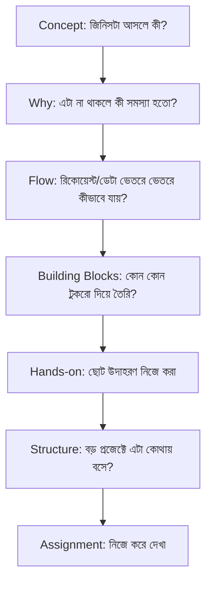
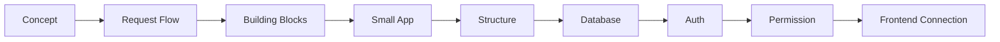
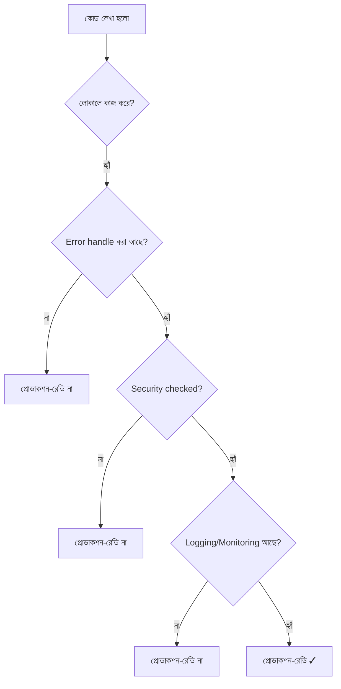

# ০৩. এই কোর্স কিভাবে নেয়া হবে? কিছু প্ল্যান

## প্রতিটা টপিকের গঠন (Template)

প্রতিটা মডিউল, প্রতিটা লেসন একটা নির্দিষ্ট প্যাটার্ন মেনে চলবে, যাতে তুমি জানো প্রতিবার কী আশা করতে হবে — এটা একটা অভ্যাসে পরিণত হবে, একধরনের "মানসিক চেকলিস্ট":

### প্রতিটা ধাপের মানে

1. **Concept** — জিনিসটা আসলে কী, এক কথায় সংজ্ঞা।
2. **Why (কেন)** — এটা না থাকলে কী সমস্যা হতো? *এই প্রশ্নটাই সবচেয়ে গুরুত্বপূর্ণ* — কারণ এখান থেকেই "মুখস্থ" আর "বোঝা"-র পার্থক্য তৈরি হয়।
3. **Flow** — ডেটা বা রিকোয়েস্ট ভেতরে ভেতরে কীভাবে চলাচল করে, ধাপে ধাপে।
4. **Building Blocks** — কোন কোন ছোট ছোট অংশ মিলে এই জিনিসটা তৈরি।
5. **Hands-on** — একটা ছোট, স্বয়ংসম্পূর্ণ উদাহরণ, যেটা তুমি নিজে টাইপ করে চালাবে।
6. **Structure** — একটা বড়, বাস্তব Production অ্যাপ্লিকেশনে এই টুকরোটা ঠিক কোথায় বসে।
7. **Assignment** — নিজে করে দেখার একটা ছোট কাজ, যাতে বোঝা যায় সত্যিই শিখেছো কিনা।

## Learning Order (কোর্সের বড় মানচিত্র)

এই ক্রমটা এমনি এমনি না — এটা বাস্তবে একটা প্রোডাক্ট বানানোর স্বাভাবিক ক্রম অনুসরণ করে:

1. আগে বুঝতে হবে কনসেপ্টটা কী (Concept)
2. তারপর বুঝতে হবে একটা রিকোয়েস্ট কীভাবে সিস্টেমের ভেতর দিয়ে যায় (Request Flow)
3. তারপর সেই সিস্টেম বানানোর টুকরোগুলো চিনতে হবে (Building Blocks)
4. একটা ছোট অ্যাপ বানিয়ে হাত পাকাতে হবে (Small App)
5. সেই ছোট অ্যাপকে বড়, মেইনটেইনেবল স্ট্রাকচারে সাজাতে হবে (Structure)
6. ডেটা স্থায়ীভাবে রাখতে Database লাগবে
7. কে কোন ডেটা দেখতে পারবে তা নিয়ন্ত্রণ করতে Auth এবং Permission লাগবে
8. সবশেষে এই ব্যাকএন্ডকে একটা Frontend-এর সাথে যুক্ত করতে হবে

## তোমার অগ্রাধিকার অনুযায়ী জোর দেয়া হবে যেখানে

তুমি বলেছো তোমার priority হলো **"প্রোডাকশনে স্মুথ, সলিড প্রোডাক্ট বানানো"** — শুধু "লোকালে কাজ করে" এমন কোড না। তাই কোর্সের নির্দিষ্ট কিছু মডিউলে বাড়তি গুরুত্ব দেয়া হবে:

| এলাকা | মডিউল | কেন গুরুত্বপূর্ণ |
|---|---|---|
| API Security | Module 30 | Production-এ সবচেয়ে বেশি আক্রমণ হয় এখানেই |
| Testing & Performance | Module 31 | "কাজ করে" আর "নির্ভরযোগ্যভাবে কাজ করে" — পার্থক্য এখানে |
| Logging & Observability | Module 32 | প্রোডাকশনে সমস্যা হলে কীভাবে বুঝবে কোথায় সমস্যা |
| Monitoring & Alerting | Module 33 | সমস্যা হওয়ার আগেই টের পাওয়া |
| Production Debugging | Module 34 | Live সিস্টেমে সমস্যা সমাধানের কৌশল |
| Software Architectural Patterns | Module 40 | প্রজেক্ট বড় হলে কীভাবে গঠন ধরে রাখা যায় |

## একটা গুরুত্বপূর্ণ পার্থক্য: "কাজ করা" বনাম "প্রোডাকশন-রেডি"

এই কোর্সের প্রতিটা মডিউলে আমরা শুধু "কীভাবে কাজ করানো যায়" তা না, বরং "কীভাবে নির্ভরযোগ্যভাবে কাজ করানো যায়" — এই দৃষ্টিভঙ্গি নিয়ে এগোবো।

**পরবর্তী:** [04-understanding-the-environment.md](04-understanding-the-environment.md)
