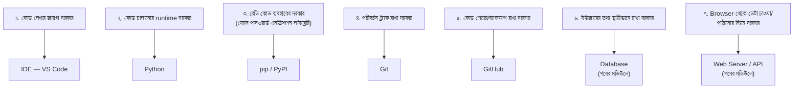
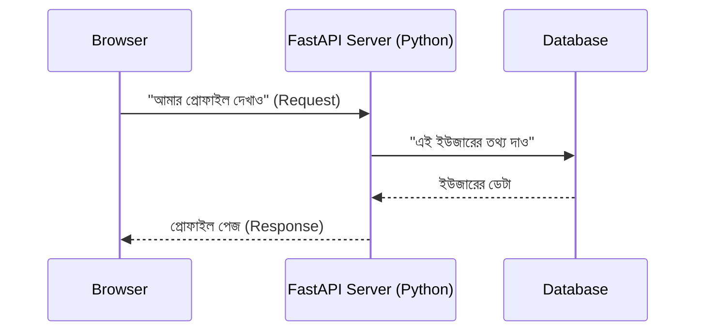

# ০৫. Connecting the Dots

এতক্ষণ যা শিখলে (OS, Runtime, Terminal, Package Manager) সেটা এখনো আলাদা আলাদা টুকরো মনে হচ্ছে হয়তো। চলো একটা বাস্তব দৃশ্য কল্পনা করি যেটা এই সব টুকরোকে একসাথে জোড়া লাগাবে।

## দৃশ্যকল্প: লগইন সিস্টেমসহ একটা ওয়েবসাইট

তুমি একটা ওয়েবসাইট বানাতে চাও যেখানে ইউজার লগইন করে তার প্রোফাইল দেখতে পারবে। এই একটা সাধারণ ফিচারের পেছনে কী কী লাগবে, একবার ধাপে ধাপে দেখি:

## প্রতিটা পয়েন্টের পেছনের যুক্তি

1. **একটা কোড লেখার জায়গা দরকার** → এখানেই IDE (VS Code) আসে। শুধু নোটপ্যাডেও কোড লেখা যায়, কিন্তু IDE এরর হাইলাইট করে, অটোকমপ্লিট করে, টার্মিনাল বিল্ট-ইন রাখে — কাজের গতি অনেক বাড়িয়ে দেয়।

2. **কোডটা চালানোর জন্য একটা runtime দরকার** → Python ফাইল লিখলেই সেটা এমনি এমনি চলে না, একটা runtime (Python interpreter) দরকার যেটা সেই কোডকে বাস্তবে "চালাবে"।

3. **অন্যের লেখা রেডি কোড ব্যবহার করার দরকার হতে পারে** → পাসওয়ার্ড এনক্রিপ্ট করা, ইমেইল পাঠানো, ফাইল আপলোড করা — এসব বহুবার সমাধান হওয়া সমস্যা। `pip` দিয়ে PyPI (Python Package Index) থেকে সেই সমাধানগুলো নিজের প্রজেক্টে টেনে আনা যায়।

4. **কোডের প্রতিটা পরিবর্তন ট্র্যাক রাখা দরকার** → যাতে ভুল হলে আগের ভার্সনে ফেরত যাওয়া যায়, এবং বোঝা যায় কে কখন কী পরিবর্তন করেছে। এই কাজটা করে Git।

5. **কোডটা অন্য কম্পিউটারে বা ইন্টারনেটে শেয়ার/ব্যাকআপ রাখা দরকার** → GitHub-এ আপলোড করলে কম্পিউটার নষ্ট হলেও কোড হারায় না, এবং টিমের অন্যরাও কাজ করতে পারে।

6. **ইউজারের ডেটা (নাম, পাসওয়ার্ড, প্রোফাইল তথ্য) স্টোর করা দরকার** → এটার জন্য দরকার Database। এই কোর্সে Module 15 থেকে গভীরে যাবো।

7. **ব্রাউজার থেকে এই ডেটা চাওয়ার এবং পাঠানোর একটা নিয়ম দরকার** → এটাই Web Server আর API-এর কাজ। Module 2 থেকে এটা নিয়ে শুরু করবো।

## একটা রিকোয়েস্টের সম্পূর্ণ যাত্রা (Preview)

সামনে যা শিখতে চলেছি তার একটা ঝলক — একটা ব্রাউজার রিকোয়েস্ট পাঠালে কী ঘটে:

এই একটা সাধারণ ইন্টারঅ্যাকশনের পেছনেই এই মডিউলের সব টুকরো (IDE দিয়ে কোড লেখা, Python দিয়ে চালানো, pip দিয়ে লাইব্রেরি ব্যবহার, Git/GitHub দিয়ে ভার্সন রাখা) কাজ করছে। এই কোর্সে ব্যাকএন্ড ফ্রেমওয়ার্ক হিসেবে আমরা মূলত **FastAPI** ব্যবহার করবো (Module 4 থেকে), তবে বিকল্প স্ট্যাক হিসেবে Node.js/Express.js (বোনাস Module 39) আর Go/Gin (Module 46-47)-ও কোর্সে আছে — একই সমস্যার সমাধান ভিন্ন ভাষায় দেখতে।

## এই মডিউলের বাকি অংশে কী করবো

আমরা প্রথম চারটা টুকরো (IDE, Python, pip — যেটা Python-এর সাথেই আসে, এবং Git/GitHub) এখনই সেটআপ করবো — কারণ এগুলো ছাড়া পরের কোনো মডিউলেই এগোনো যাবে না। Database আর Web Server নিয়ে বিস্তারিত কাজ শুরু হবে যথাক্রমে Module 15 এবং Module 2 থেকে।

**পরবর্তী:** [06-installing-python.md](06-installing-python.md)
