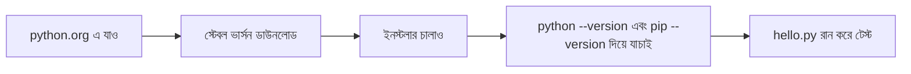
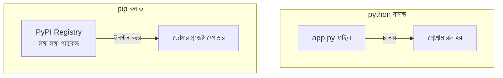

# ০৬. Installing Python (and pip/uv)

## কেন দরকার

Python হলো একটা প্রোগ্রামিং ভাষা এবং তার রানটাইম, যেটা দিয়ে ব্যাকএন্ড কোড, স্ক্রিপ্ট, ডেটা প্রসেসিং — সবকিছু চালানো যায়। এটাই আমাদের ব্যাকএন্ড কোড চালানোর ভিত্তি হবে। এই কোর্সের প্রায় প্রতিটা মডিউলে (Go Language অংশ ছাড়া) Python লাগবে।

## ইনস্টলেশন ধাপে ধাপে



### Windows

1. ব্রাউজারে যাও [python.org](https://www.python.org/downloads/)।
2. সবচেয়ে সাম্প্রতিক **স্টেবল ভার্সন** ডাউনলোড করো (যেমন Python 3.12+) — এটাই প্রোডাকশনের জন্য উপযুক্ত।
3. ডাউনলোড হওয়া `.exe` ফাইলে ডাবল ক্লিক করো ইনস্টলার চালু করার জন্য। **খুব গুরুত্বপূর্ণ:** ইনস্টলারের প্রথম স্ক্রিনেই নিচে **"Add python.exe to PATH"** চেকবক্সটা টিক দিয়ে দাও — এটা টিক না দিলে টার্মিনাল থেকে `python` কমান্ড কাজ করবে না। তারপর "Install Now" চাপো।
4. ইনস্টল শেষে, **Command Prompt** বা **PowerShell** খুলে চেক করো:

```bash
python --version
pip --version
```

দুটো কমান্ডই যদি একটা ভার্সন নম্বর দেখায় (যেমন `Python 3.12.1` এবং `pip 23.3.2`), ইনস্টলেশন সফল।

### macOS

```bash
# Homebrew ব্যবহার করে (রেকমেন্ডেড)
brew install python
```
অথবা python.org থেকে সরাসরি `.pkg` ইনস্টলার ডাউনলোড করেও করা যায়।

### Linux (Ubuntu/Debian)

অনেক Linux ডিস্ট্রোতে Python আগে থেকেই ইনস্টল থাকে। না থাকলে:

```bash
sudo apt-get update
sudo apt-get install -y python3 python3-pip
```

## `python` বনাম `pip` — পার্থক্যটা স্পষ্ট করে নেই

এই দুটো কমান্ড একসাথে ইনস্টল হয় বলে অনেকে গুলিয়ে ফেলে। কিন্তু কাজ সম্পূর্ণ আলাদা:

| কমান্ড | কাজ | উদাহরণ |
|---|---|---|
| `python` | সরাসরি একটা Python ফাইল **চালায়** | `python app.py` |
| `pip` | প্যাকেজ ইনস্টল/আনইনস্টল করে, প্রজেক্ট **ম্যানেজ করে** | `pip install fastapi` |



একটা সহজ মনে রাখার উপায়: **`python` = "চালাও"**, **`pip` = "আনো এবং সাজাও"**।

## যাচাই করার জন্য একটা ছোট পরীক্ষা

একটা ফাইল বানাও `hello.py` নামে, ভেতরে লেখো:

```python
print("Python কাজ করছে!")
```

টার্মিনালে গিয়ে সেই ফোল্ডারে চলে যাও এবং চালাও:

```bash
python hello.py
```

(Linux/macOS-এ কখনো কখনো `python` এর বদলে `python3` লিখতে হতে পারে, যদি সিস্টেমে দুই ভার্সন একসাথে থাকে।)

যদি টার্মিনালে `Python কাজ করছে!` প্রিন্ট হয়, তাহলে বুঝবে Python ঠিকভাবে ইনস্টল হয়েছে এবং কাজ করছে।

> **যদি এরর আসে:** সবচেয়ে সাধারণ এরর হলো `'python' is not recognized as an internal or external command` (Windows-এ) — এর মানে Python ইনস্টলেশনের সময় "Add to PATH" চেকবক্সটা টিক দেয়া হয়নি। ইনস্টলার আবার চালাও এবং নিশ্চিত করো সেই অপশনটা চেক করা আছে, অথবা কম্পিউটার একবার রিস্টার্ট দাও।

## বোনাস: `uv` — একটা আধুনিক, দ্রুত বিকল্প

`pip` ছাড়াও আজকাল অনেকে **`uv`** নামের একটা টুল ব্যবহার করে, যেটা প্যাকেজ ইনস্টলেশন এবং প্রজেক্ট/ভার্চুয়াল-এনভায়রনমেন্ট ম্যানেজমেন্ট — দুটোই করে, আর তাও `pip`-এর তুলনায় অনেক গুণ দ্রুত (এটা Rust ভাষায় লেখা)। এই কোর্সে আমরা মূলত `pip` দিয়েই শিখবো কারণ এটা সবচেয়ে প্রচলিত এবং বোঝা সহজ, কিন্তু ভবিষ্যতে প্রফেশনাল কাজে `uv`-এর মতো টুল দেখলে অবাক হবে না — এটা মূলত একই ধারণা, শুধু বাস্তবায়নটা বেশি অপ্টিমাইজড। চাইলে ইনস্টল করে দেখতে পারো:

```bash
# macOS/Linux
curl -LsSf https://astral.sh/uv/install.sh | sh

# Windows (PowerShell)
powershell -c "irm https://astral.sh/uv/install.ps1 | iex"
```

**পরবর্তী:** [07-installing-vscode.md](07-installing-vscode.md)
