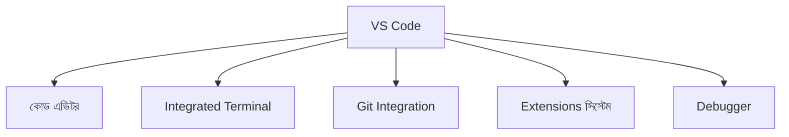
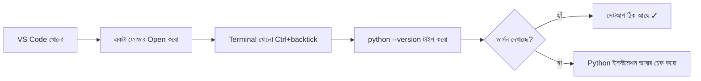

# ০৭. Installing VS Code (IDE)

## কেন দরকার

**IDE (Integrated Development Environment)** মানে শুধু একটা টেক্সট এডিটর না — এটা একটা পুরো "কর্মশালা" (workshop)। কোড লেখা, এরর দেখানো, টার্মিনাল চালানো, Git-এর সাথে কাজ করা — সব একই জায়গা থেকে করা যায়, বারবার অ্যাপ পাল্টাতে হয় না।



## ইনস্টলেশন

1. [code.visualstudio.com](https://code.visualstudio.com) থেকে তোমার OS অনুযায়ী ভার্সন ডাউনলোড করো।
2. ইনস্টল করো:
   - Windows-এ `.exe` ফাইল চালাও, Next চাপতে চাপতে শেষ করো
   - macOS-এ `.zip` থেকে বের করা অ্যাপটা Applications ফোল্ডারে ড্র্যাগ করো
   - Linux-এ `.deb` (Ubuntu/Debian) বা `.rpm` (Fedora) ব্যবহার করো
3. প্রথমবার খুললে একটা ফোল্ডার Open করো (`File > Open Folder`) — এটাই হবে তোমার প্রজেক্ট ফোল্ডার।

## শুরুতেই কাজে লাগবে এমন কিছু Extension

VS Code-এর বাম পাশে Extensions আইকনে ক্লিক করে এগুলো ইনস্টল করে নাও:

| Extension | কাজ |
|---|---|
| **Python** (Microsoft) | Python ইন্টেলিসেন্স, ডিবাগিং, লিন্টিং — Python কাজের মূল ভিত্তি |
| **Ruff** | কোডে ভুল বা bad practice থাকলে সাথে সাথে সতর্ক করে, এবং অটোমেটিক ফরম্যাট করে দেয় (আধুনিক পাইথন প্রজেক্টে Flake8+Black-এর দ্রুত বিকল্প) |
| **GitLens** | Git হিস্ট্রি এবং কে কখন কোন লাইন পরিবর্তন করেছে তা দেখায় |

> শুরুতে অনেক বেশি Extension ইনস্টল না করাই ভালো — যত দরকার হবে, তত ইনস্টল করবে। অতিরিক্ত Extension VS Code-কে ধীর করে দিতে পারে।

## Integrated Terminal

VS Code-এর ভেতরেই টার্মিনাল আছে — আলাদা করে টার্মিনাল অ্যাপ খোলার দরকার নেই।

**শর্টকাট:**

```
Windows/Linux: Ctrl + `
macOS: Cmd + `
```

(এখানে `` ` `` চিহ্নটা কীবোর্ডের সংখ্যা `1`-এর বাম পাশের ব্যাকটিক চিহ্ন)

এই টার্মিনাল থেকেই আমরা `python`, `pip`, `git` — সব কমান্ড চালাবো। **অভ্যাস করো এখান থেকেই কাজ করার** — এতে মাউস আর কীবোর্ডের মধ্যে বারবার হাত বদলাতে হবে না, কাজের গতি অনেক বাড়বে।

## একটা ছোট চেকলিস্ট — সেটআপ ঠিক আছে কিনা যাচাই



যদি VS Code-এর Integrated Terminal থেকে `python --version` চালিয়ে ভার্সন দেখতে পাও, তার মানে তোমার IDE আর Runtime দুটোই ঠিকভাবে একসাথে কাজ করছে — পরের ধাপে যাওয়ার জন্য প্রস্তুত।

**পরবর্তী:** [08-installing-git-github.md](08-installing-git-github.md)
