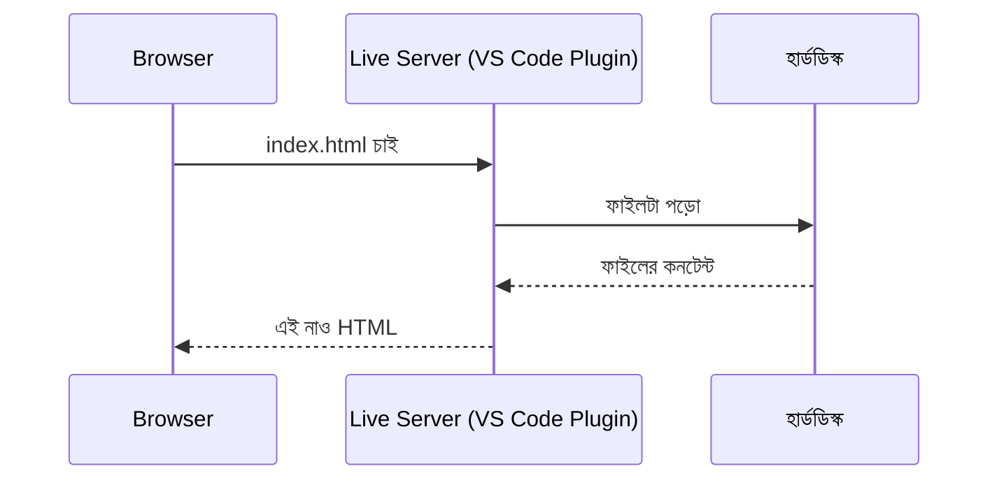

# ০২. How to Open HTML Using VS Code Plugin Webserver?

আগের লেসনে আমরা `file://` দিয়ে একটা HTML ফাইল খুলেছিলাম, সরাসরি ডাবল-ক্লিক করে। এবার একই ফাইলটা আরেকটা উপায়ে খুলবো, আর এই উপায়টাই আমাদের সার্ভার নামক জিনিসটার সাথে প্রথম বাস্তব পরিচয় করিয়ে দেবে।

VS Code-এ একটা জনপ্রিয় extension আছে, নাম **Live Server**। এটা ইনস্টল করার পর, যেকোনো HTML ফাইলে রাইট-ক্লিক করলে একটা অপশন আসে — "Open with Live Server"। ক্লিক করলে ব্রাউজার খুলে যায়, ঠিক আগেরবারের মতোই "Hello World" দেখায়। কিন্তু এবার ঠিকানার বারে তাকিয়ে দেখো — সেখানে আর `file://` লেখা নেই, বরং লেখা আছে এরকম কিছু:

```
http://127.0.0.1:5500/index.html
```

এই পার্থক্যটা তুচ্ছ মনে হতে পারে, কিন্তু আসলে এটা একটা বিশাল রূপান্তর। `file://` মানে ছিল "সরাসরি ডিস্ক থেকে ফাইল পড়া হচ্ছে"। কিন্তু `http://` মানে হলো — কোথাও একটা **প্রোগ্রাম চলছে**, যেটা "শুনছে" (listening) কেউ তার কাছে কিছু চাইছে কিনা, এবং কেউ চাইলে সে সেই ফাইলটা পাঠিয়ে দিচ্ছে। Live Server extension আসলে তোমার কম্পিউটারেই একটা ছোট্ট, অস্থায়ী **ওয়েব সার্ভার** চালু করে দিয়েছে।

তাহলে পার্থক্যটা কোথায় দাঁড়ালো? আগেরবার ব্রাউজার নিজে গিয়ে ডিস্ক থেকে ফাইল পড়ে নিয়েছিল। এবার মাঝখানে একটা তৃতীয় পক্ষ ঢুকে গেছে — একটা প্রোগ্রাম, যে ব্রাউজারের অনুরোধ শোনে, ফাইল খুঁজে বের করে, তারপর সেটা ব্রাউজারের কাছে "পাঠায়"। এই মধ্যস্থতাকারী প্রোগ্রামটাকেই আমরা বলবো **web server**।



আরেকটা জিনিস খেয়াল করার মতো — ঠিকানায় `127.0.0.1` আর `:5500` লেখা আছে। `127.0.0.1` একটা বিশেষ ঠিকানা, যেটা মানে "নিজের কম্পিউটার" (এটা নিয়ে বিস্তারিত আসছে "Localhost" লেসনে)। আর `:5500` হলো একটা **পোর্ট নম্বর** — একটা কম্পিউটারে একসাথে অনেক প্রোগ্রাম "শুনতে" পারে, তাই প্রতিটাকে আলাদা করার জন্য একটা নম্বর লাগে, যেন ডাকঘরের একটা বাক্সে অনেকগুলো "স্লট" থাকে, প্রতিটা স্লটের একটা নম্বর।

Live Server-এর আরেকটা সুবিধা হলো, তুমি ফাইলটা এডিট করে সেভ করলেই ব্রাউজার নিজে থেকে রিফ্রেশ হয়ে যায় — এটাকে বলে **hot reload**। এটা কোনো জাদু না, Live Server প্রোগ্রামটা ফাইলের পরিবর্তন লক্ষ্য রাখে, আর পরিবর্তন দেখলে ব্রাউজারকে বলে দেয় "আবার লোড করো"।

এই লেসনটা ছোট মনে হলেও এখানেই একটা বড় ধাপ পার হয়ে গেলাম — আমরা প্রথমবারের মতো দেখলাম, একটা "সার্ভার" আসলে কী করে: সে অনুরোধের অপেক্ষায় থাকে, অনুরোধ পেলে জবাব দেয়। পরের লেসনে আমরা এই ধারণাটাকে সঠিক সংজ্ঞায় বাঁধবো।
