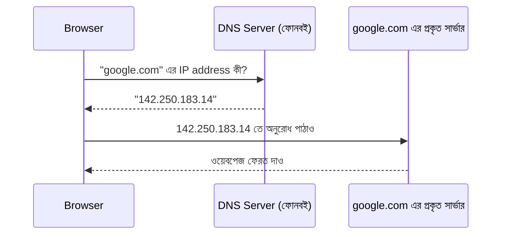

# ০৪. How Domain Names and IP Address Work Together?

ধরো তুমি তোমার এক বন্ধুর বাসায় যেতে চাও, যাকে তুমি চেনো "রাহুল" নামে। কিন্তু ডাকপিয়ন কখনো "রাহুল"-এর নাম শুনে চিঠি পৌঁছে দেয় না — তার দরকার হয় একটা সুনির্দিষ্ট ঠিকানা, বাড়ি নম্বর, রাস্তার নাম, এলাকা। "রাহুল" নামটা তোমার জন্য সহজ মনে রাখার উপায়, কিন্তু ডাকব্যবস্থার জন্য দরকার নির্দিষ্ট, সংখ্যাযুক্ত ঠিকানা।

ইন্টারনেটেও ঠিক একই সমস্যা আছে। প্রতিটা কম্পিউটার, প্রতিটা সার্ভার, ইন্টারনেটে একটা সংখ্যাযুক্ত ঠিকানা দিয়ে পরিচিত হয় — একে বলে **IP address** (Internet Protocol address)। দেখতে এরকম:

```
142.250.183.14
```

যখন তুমি ব্রাউজারে টাইপ করো `google.com`, কম্পিউটারের কাছে "google.com" শব্দটার কোনো মানে নেই — তার দরকার এই সংখ্যার ঠিকানাটা, যাতে সে জানতে পারে ঠিক কোন মেশিনের সাথে কথা বলতে হবে। কিন্তু আমাদের মানুষদের জন্য `142.250.183.14` মনে রাখা কঠিন, `google.com` মনে রাখা সহজ। এই ফাঁকটা পূরণ করে **Domain Name System (DNS)**।

DNS-কে তুমি ভাবতে পারো একটা বিশাল, বিশ্বব্যাপী ফোনবই হিসেবে। তুমি একটা নাম দাও (`google.com`), DNS সেই নামটার বিপরীতে থাকা IP address খুঁজে বের করে দেয়। এই পুরো প্রক্রিয়াটা ঘটে চোখের পলকে, প্রতিবার তুমি একটা ওয়েবসাইটে যাওয়ার চেষ্টা করলে।



এই লুকআপ প্রক্রিয়াটাকে বলে **DNS resolution**। প্রতিবার তুমি একটা নতুন ডোমেইনে যাও, ব্রাউজার প্রথমে DNS-এর কাছে জিজ্ঞেস করে "এই নামের বিপরীতে IP address কী", তারপর সেই IP address-এ গিয়ে আসল অনুরোধটা পাঠায়। (ব্রাউজার এই ফলাফলটা কিছুক্ষণের জন্য মনে রাখেও, যাকে বলে caching, যাতে বারবার একই প্রশ্ন করতে না হয় — কিন্তু এই ডিটেইলটা এখন গুরুত্বপূর্ণ না।)

একটা প্রশ্ন হয়তো মনে আসছে — Domain Name কেনার সময় (যেমন GoDaddy বা Namecheap থেকে) তুমি টাকা দাও নামটার জন্য, কিন্তু IP address আসে কোথা থেকে? IP address আসলে দেয় হোস্টিং প্রোভাইডার — যে কোম্পানির সার্ভারে তোমার ওয়েবসাইটটা রাখা হচ্ছে (যেমন AWS, DigitalOcean, Vercel)। তুমি শুধু DNS-এ একটা রেকর্ড যোগ করে বলে দাও, "আমার ডোমেইন নামের বিপরীতে এই IP address-টা ব্যবহার করো" — এটাকে বলে DNS record বা বিশেষভাবে A record।

এখন আমাদের হাতে দুটো জিনিস আছে — Domain Name (মানুষের জন্য সহজ নাম) আর IP address (মেশিনের জন্য প্রকৃত ঠিকানা)। কিন্তু একটা বিশেষ IP address আছে, যেটা প্রতিটা কম্পিউটারেই একই রকম, আর সেটা নিয়েই পরের লেসন — Localhost।
