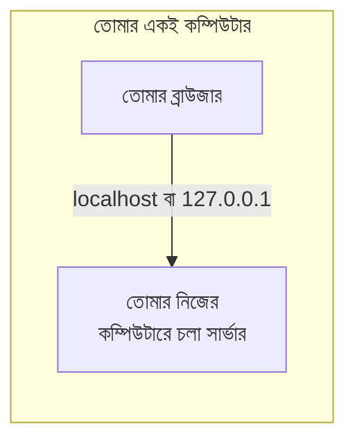

# ০৫. What is Localhost?

Live Server চালানোর সময় তুমি দেখেছিলে ঠিকানার বারে লেখা `http://127.0.0.1:5500`। এই `127.0.0.1` সংখ্যাটার একটা বিশেষত্ব আছে, যেটা এই লেসনে বুঝবো।

আগের লেসনে শিখেছিলাম, প্রতিটা কম্পিউটারের একটা IP address থাকে, যেটা দিয়ে অন্য কম্পিউটার তার সাথে যোগাযোগ করতে পারে — ঠিক যেমন তোমার বাসার একটা ঠিকানা আছে, যেটা দিয়ে অন্য কেউ তোমার কাছে চিঠি পাঠাতে পারে। কিন্তু মাঝে মাঝে তোমার নিজের বাসার মধ্যেই একটা জিনিস আরেকটা জিনিসের সাথে "কথা বলতে" চায় — যেমন তুমি নিজেই নিজেকে একটা নোট পাঠাচ্ছো।

`127.0.0.1` হলো ঠিক এরকম একটা বিশেষ ঠিকানা — এটাকে বলে **loopback address**। এই ঠিকানায় অনুরোধ পাঠানো মানে হলো, "নেটওয়ার্কের বাইরে কোথাও যেও না, নিজের কম্পিউটারের ভেতরেই থেকে যাও।" এই একই জিনিসকে বোঝানোর জন্য একটা নামও আছে, যেটা মনে রাখা আরও সহজ: **localhost**।

তার মানে এই দুটো ঠিকানা— `http://127.0.0.1:5500` এবং `http://localhost:5500` — একই জিনিস বোঝায়। `localhost` হলো `127.0.0.1`-এর একটা "সহজ নাম", ঠিক যেমন `google.com` হলো তাদের প্রকৃত IP address-এর একটা সহজ নাম। পার্থক্য শুধু এই যে `localhost`-এর জন্য DNS-এর কাছে জিজ্ঞেস করতে হয় না, কারণ এটা প্রতিটা কম্পিউটারেই সবসময় একইভাবে সংরক্ষিত থাকে, কম্পিউটারের নিজের ভেতরেই।

এখন প্রশ্ন হতে পারে, এই localhost জিনিসটা কেন দরকার আসলে? উত্তরটা খুব ব্যবহারিক। যখন তুমি একটা ওয়েবসাইট বা অ্যাপ্লিকেশন বানাচ্ছো, সেটা এখনো ইন্টারনেটে প্রকাশ (publish/deploy) করোনি — এটা এখনো শুধু তোমার নিজের কম্পিউটারে আছে, ডেভেলপমেন্ট চলছে। এই সময় তুমি চাও তোমার প্রোগ্রামটা চালিয়ে দেখতে, ব্রাউজারে খুলে টেস্ট করতে, কিন্তু ইন্টারনেটে বাকি দুনিয়াকে এখনো এটা দেখানোর দরকার নেই। localhost এই কাজটাই করে — তুমি তোমার সার্ভারটা চালাও, শুধু তোমার নিজের কম্পিউটারের ভেতরেই সেটার সাথে কথা বলো, বাইরের কেউ এতে অ্যাক্সেস করতে পারে না।

এই কারণেই প্রতিটা ব্যাকএন্ড ডেভেলপার তার ক্যারিয়ারে হাজার হাজার বার `localhost:3000`, `localhost:5000`, `localhost:8080` — এই ধরনের ঠিকানা দেখবে। এগুলো সবসময় বোঝাচ্ছে: "আমার নিজের কম্পিউটারে চলা একটা সার্ভার, যেটা এখনো শুধু আমিই দেখতে পাচ্ছি।"

এখন আমাদের হাতে সব উপকরণ চলে এসেছে — আমরা জানি ওয়েব সার্ভার কী, জানি IP address আর domain কীভাবে কাজ করে, জানি localhost মানে কী। পরের লেসনে এই সব টুকরো জোড়া লাগিয়ে ওয়েব সার্ভারের সম্পূর্ণ কর্মপ্রক্রিয়াটা একসাথে দেখবো।
