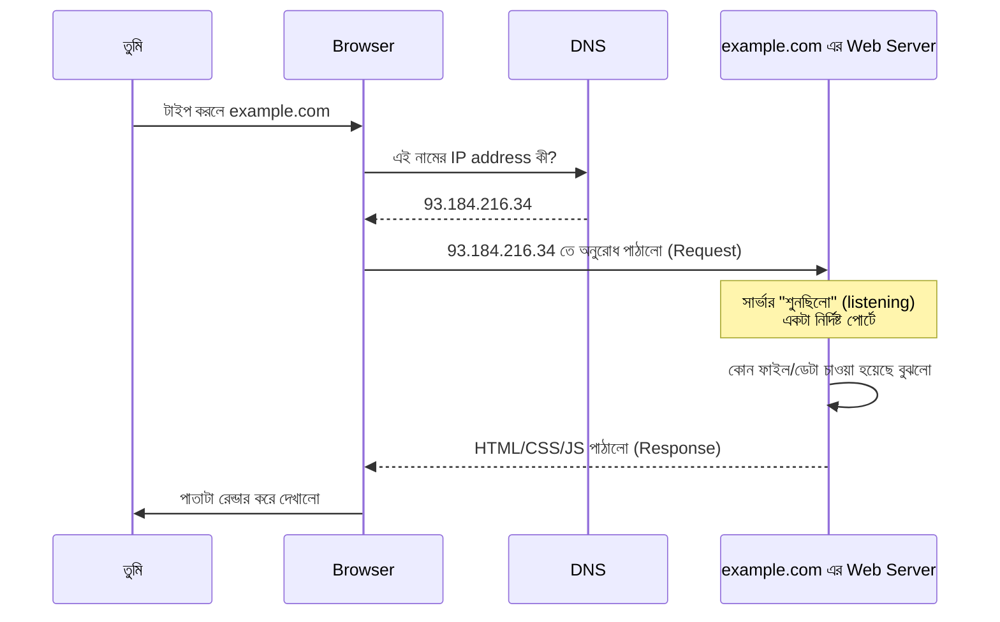

# ০৬. Introduction to Webserver: What Is It and How Does It Work?

এতক্ষণ আমরা টুকরো টুকরো করে কয়েকটা জিনিস দেখেছি — HTML ফাইল খোলা, Live Server, ওয়েব সার্ভারের সংজ্ঞা, Domain আর IP address, আর localhost। এই লেসনে এই সবগুলো টুকরো জোড়া লাগিয়ে একটা সম্পূর্ণ ছবি বানাবো — একটা রিকোয়েস্ট ব্রাউজার থেকে বেরিয়ে সার্ভার পর্যন্ত গিয়ে আবার ফিরে আসার পুরো যাত্রাটা।

চলো, একটা বাস্তব উদাহরণ কল্পনা করি। তুমি ব্রাউজারে টাইপ করলে `example.com`, আর এন্টার চাপলে। এই মুহূর্ত থেকে পাতা দেখা পর্যন্ত ঠিক কী কী ঘটে, ধাপে ধাপে দেখি:

এই পুরো প্রক্রিয়ার প্রতিটা ধাপ আমরা আগেই আলাদা আলাদাভাবে দেখেছি, শুধু এখন একসাথে সাজালাম:

**প্রথম ধাপ** — তুমি একটা নাম টাইপ করলে, যেটা মানুষের জন্য সহজ কিন্তু কম্পিউটারের জন্য অর্থহীন। **দ্বিতীয় ধাপ** — DNS সেই নামটাকে একটা সংখ্যাযুক্ত IP address-এ অনুবাদ করলো, যেটা কম্পিউটার বোঝে। **তৃতীয় ধাপ** — ব্রাউজার সেই IP address-এ একটা অনুরোধ পাঠালো। এই অনুরোধটা ইন্টারনেটের অসংখ্য তার আর রাউটারের মধ্য দিয়ে ভ্রমণ করে সঠিক মেশিনে পৌঁছায়।

**চতুর্থ ধাপ**, যেটা এই লেসনের মূল বিষয় — সেই মেশিনে একটা প্রোগ্রাম আগে থেকেই চলছিলো, "কান পেতে" বসে ছিলো, অপেক্ষা করছিলো কেউ অনুরোধ পাঠায় কিনা। এই প্রোগ্রামটাই ওয়েব সার্ভার। অনুরোধ পৌঁছানো মাত্র সে জেগে ওঠে (আসলে সে ঘুমায়নি, শুধু নিষ্ক্রিয় ছিলো — একে বলে **listening state**), বুঝে নেয় ঠিক কী চাওয়া হয়েছে (হোমপেজ, নাকি অন্য কোনো পাতা), সেটা তৈরি করে বা খুঁজে বের করে, তারপর ফেরত পাঠায়।

**পঞ্চম ধাপ** — ব্রাউজার সেই উত্তর (HTML, CSS, ছবি, ইত্যাদি) পায়, এবং সেটাকে দৃশ্যমান একটা পাতায় রূপান্তর করে দেখায় (আগে যেটাকে বলেছিলাম rendering)।

এখানে একটা গুরুত্বপূর্ণ শব্দজোড়া চিনে রাখা দরকার, যেটা সারা কোর্স জুড়ে বারবার আসবে: **Request** এবং **Response**। ব্রাউজার যা পাঠায় সেটা request, সার্ভার যা ফেরত পাঠায় সেটা response। এই "request পাঠানো, response পাওয়া"-র প্যাটার্নটাই পুরো ওয়েবের মূল ভিত্তি — সব কিছু আসলে এই একই প্যাটার্নের পুনরাবৃত্তি, শুধু জটিলতা বাড়ে।

একটা জিনিস স্পষ্ট করে নেয়া ভালো — এই পুরো প্রক্রিয়ায় সার্ভার কখনো নিজে থেকে ব্রাউজারের কাছে কিছু পাঠায় না। সবকিছু শুরু হয় request দিয়ে। সার্ভার শুধু জবাব দেয়, নিজে থেকে কথা শুরু করে না। এই বৈশিষ্ট্যকে বলে **request-response model**, বা কখনো **client-server architecture** — যেখানে ব্রাউজারকে বলা হয় client (যে চায়), আর সার্ভারকে বলা হয় server (যে দেয়)।

এখন আমরা তত্ত্বগতভাবে জানি একটা ওয়েব সার্ভার কীভাবে কাজ করে। পরের লেসনে আমরা এই তত্ত্বকে বাস্তবে রূপ দেবো — নিজের হাতে, Node.js দিয়ে, একটা আসল (যদিও ছোট) ওয়েব সার্ভার বানাবো।
