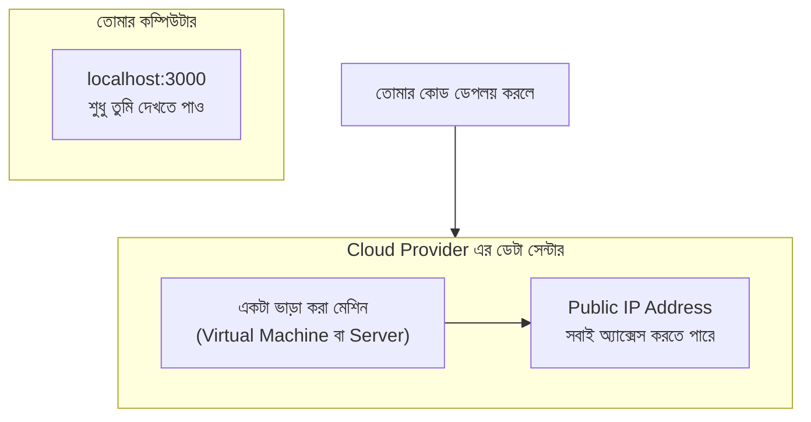

# ১০. Introduction to Cloud Systems and Webservers in Cloud System

আমরা এতক্ষণ যে সার্ভারটা বানিয়েছি, সেটা চলছে শুধু তোমার নিজের কম্পিউটারে, `localhost`-এ। এর মানে, তুমি ছাড়া দুনিয়ার আর কেউ এই সার্ভারটার সাথে কথা বলতে পারবে না — এমনকি তোমার পাশের রুমের বন্ধুও না, কারণ localhost মানেই "শুধু নিজের কম্পিউটারের ভেতরে সীমাবদ্ধ" (এটা আমরা লেসন ৫-এ দেখেছিলাম)। তাহলে facebook.com যখন সারা পৃথিবীর মানুষ দেখতে পায়, তাদের সার্ভারটা কোথায় চলছে?

উত্তরটা হলো — সেই সার্ভারটা তাদের কারো ব্যক্তিগত ল্যাপটপে চলছে না। এটা চলছে একটা এমন কম্পিউটারে, যেটা ২৪ ঘণ্টা, ৩৬৫ দিন চালু থাকে, শক্তিশালী ইন্টারনেট সংযোগ আছে, আর একটা পাবলিক (সবার জন্য অ্যাক্সেসযোগ্য) IP address আছে। এই ধরনের কম্পিউটারকে ভাড়া নেয়ার সুবিধা দেয় কিছু কোম্পানি — একে বলে **cloud hosting** বা **cloud computing**, আর এই কোম্পানিগুলোকে বলে **cloud provider** (যেমন AWS, DigitalOcean, Google Cloud, Vercel, Render)।

"Cloud" শব্দটা শুনলে মনে হতে পারে এটা কোনো রহস্যময়, আকাশে ভাসমান জিনিস। আসলে তা না — cloud মানে হলো, কোথাও একটা বিশাল ডেটা সেন্টারে হাজার হাজার শক্তিশালী কম্পিউটার (server machine) সারিবদ্ধভাবে রাখা আছে, আর তুমি ইন্টারনেটের মাধ্যমে সেগুলোর একটা অংশ (বা পুরোটা) ভাড়া নিতে পারো, ঠিক যেমন তুমি একটা বাসা ভাড়া নাও।

এখানে গুরুত্বপূর্ণ ধারণাটা হলো **deployment** — অর্থাৎ তোমার লোকাল কম্পিউটারে লেখা কোডটাকে সেই ভাড়া করা cloud মেশিনে নিয়ে গিয়ে চালু করা। একবার deploy হয়ে গেলে, সেই সার্ভারটা আর `localhost`-এ সীমাবদ্ধ থাকে না — সেটা একটা পাবলিক IP address পায় (এবং সেই IP address-এর সাথে যুক্ত করা যায় একটা domain name, যেটা আমরা আগেই শিখেছি)। তখন দুনিয়ার যে কেউ, যেকোনো জায়গা থেকে, সেই সার্ভারের সাথে কথা বলতে পারে।

এই cloud provider গুলো মূলত তিন ধরনের সুবিধা দেয়:

**প্রথমত, হার্ডওয়্যার তুমি কেনো না, ভাড়া নাও।** নিজে একটা শক্তিশালী কম্পিউটার কিনে, সেটা ২৪ ঘণ্টা চালু রেখে, ইন্টারনেট সংযোগ ব্যবস্থা করাটা অনেক ব্যয়বহুল আর ঝামেলার। Cloud provider এই ঝামেলাটা নিজেরাই সামলায়, তুমি শুধু ব্যবহার অনুযায়ী টাকা দাও।

**দ্বিতীয়ত, স্কেলেবিলিটি।** ধরো তোমার ওয়েবসাইট হঠাৎ খুব জনপ্রিয় হয়ে গেলো, একসাথে হাজার হাজার মানুষ ভিজিট করছে। Cloud provider থেকে সহজেই আরও শক্তিশালী মেশিন বা আরও বেশি মেশিন ভাড়া নিয়ে সেই চাপ সামলানো যায় — এটাকে বলে **scaling**।

**তৃতীয়ত, রিলায়েবিলিটি।** বড় cloud provider-দের একাধিক ডেটা সেন্টার থাকে, বিভিন্ন জায়গায়, যাতে একটা জায়গায় বিদ্যুৎ চলে গেলেও সার্ভিস বন্ধ না হয়ে যায়।

এই কোর্সে আমরা বিভিন্ন পর্যায়ে বিভিন্ন cloud service ব্যবহার করবো — কখনো একটা ছোট cloud VM-এ (Virtual Machine) সরাসরি Node.js চালাবো, কখনো Docker-এর মতো টুল দিয়ে (Module-এ পরে বিস্তারিত আসবে) সহজে deploy করবো। তবে আপাতত এই মডিউলের লক্ষ্য শুধু ধারণাটা পরিষ্কার করা: **cloud মানে হলো ভাড়া করা কম্পিউটার, যেখানে তুমি তোমার সার্ভার চালিয়ে সেটাকে সবার জন্য উন্মুক্ত করতে পারো।**

পরের দুই লেসনে আমরা একদম হাতে-কলমে দেখবো, একটা cloud lab-এ কীভাবে আমাদের এই Node.js সার্ভারটা প্রকৃতপক্ষে deploy করা যায়।
