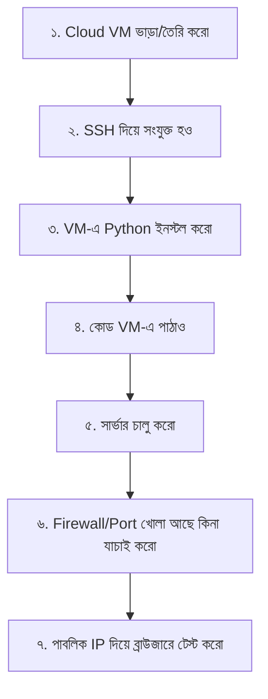

# ১২. ক্লাউড ল্যাব এ Python ডেপলয় করা: ডকুমেন্ট

আগের লেসনে আমরা হাতে-কলমে একটা VM-এ ডেপলয় করেছি। এই লেসনটা সেই পুরো প্রক্রিয়ার একটা সংক্ষিপ্ত, রেফারেন্স-যোগ্য ডকুমেন্ট — যখনই ভুলে যাবে ঠিক কী কমান্ড লাগবে, এখানে ফিরে এসে দেখে নিতে পারবে।

## সম্পূর্ণ প্রক্রিয়ার সারসংক্ষেপ



## দ্রুত রেফারেন্স: কমান্ডগুলো

**VM-এ সংযুক্ত হওয়া:**
```bash
ssh root@<তোমার-VM-IP>
```

**Python ইনস্টল (Ubuntu/Debian ভিত্তিক VM):**
```bash
sudo apt-get update
sudo apt-get install -y python3 python3-pip
python3 --version
```

**লোকাল থেকে ফাইল VM-এ পাঠানো:**
```bash
scp <ফাইলের-নাম> root@<তোমার-VM-IP>:/root/
```

**সার্ভার চালু করা:**
```bash
python3 server.py
```

**Firewall-এ পোর্ট খোলা (Ubuntu-তে `ufw` ব্যবহার করলে):**
```bash
sudo ufw allow 3000
sudo ufw status
```

## সাধারণ সমস্যা এবং সমাধান (Troubleshooting)

| সমস্যা | সম্ভাব্য কারণ | সমাধান |
|---|---|---|
| ব্রাউজারে কানেক্ট হচ্ছে না, লোড হতেই থাকে | Firewall পোর্ট বন্ধ রেখেছে | `ufw allow <port>` চালাও, cloud provider-এর ড্যাশবোর্ডেও চেক করো |
| `Permission denied` SSH করার সময় | ভুল ইউজারনেম বা key | cloud provider-এর দেয়া ইউজারনেম আর পাসওয়ার্ড/key ঠিক আছে কিনা চেক করো |
| `OSError: [Errno 98] Address already in use` এরর | একই পোর্টে আগে থেকে কিছু চলছে | `Ctrl+C` দিয়ে আগেরটা বন্ধ করো, বা অন্য পোর্ট ব্যবহার করো |
| SSH বন্ধ করলেই সার্ভারও বন্ধ হয়ে যায় | Python প্রসেসটা সেশনের সাথে যুক্ত | `nohup` বা `systemd` সার্ভিস ব্যবহার করো (বিস্তারিত Module 33-এ) |
| `command not found: python3` | Python ইনস্টল হয়নি বা PATH-এ নেই | ইনস্টলেশন কমান্ড আবার চালাও |

## কেন এই ধাপগুলো গুরুত্বপূর্ণ

এই পুরো প্রক্রিয়াটা — VM ভাড়া নেয়া, SSH দিয়ে ঢোকা, প্রয়োজনীয় সফটওয়্যার ইনস্টল করা, কোড পাঠানো, চালু করা — এটাই মূলত **deployment**-এর সবচেয়ে মৌলিক রূপ। পরবর্তীতে আমরা Docker-এর মতো টুল শিখবো, যেটা এই প্রক্রিয়ার অনেকটাই স্বয়ংক্রিয় করে দেয় (একটা কনটেইনারে সব বান্ডেল করে পাঠানো যায়), কিন্তু সেই সুবিধাজনক টুলগুলো ঠিক কী সমস্যার সমাধান করছে তা বোঝার জন্য, প্রথমে এই "কষ্টকর কিন্তু স্বচ্ছ" পদ্ধতিটা হাতে-কলমে করে দেখা জরুরি ছিলো।

**পরবর্তী:** [13-module-recap-questions.md](13-module-recap-questions.md)
