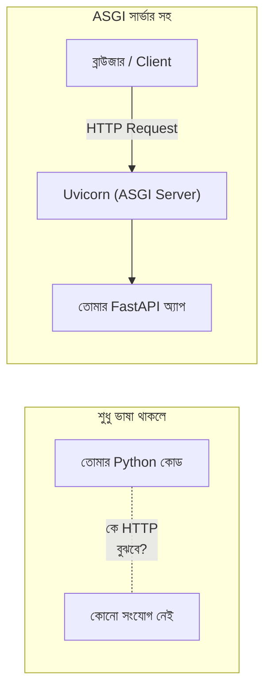

# ০২. Why Do We Need Tools Like Python (and an ASGI Server) for Backend?

এই প্রশ্নটা এমন একটা প্রশ্ন যেটা অনেকে এড়িয়ে যায়, মনে করে "সবাই তো Python শেখে, তাই আমিও শিখবো।" কিন্তু আমরা এই কোর্সে প্রতিটা টুলের পেছনের যুক্তি বুঝতে চাই। তাই প্রশ্নটা সরাসরি করি — Python আর তার ওয়েব ইকোসিস্টেম না থাকলে কী সমস্যা হতো?

চলো ইতিহাসের দিকে একটু তাকাই, কারণ ইতিহাস বুঝলে "কেন"-টা সবচেয়ে স্বচ্ছভাবে বোঝা যায়। ওয়েবের শুরুর দিকে ব্যাকএন্ড লেখার জন্য মূলত ব্যবহার হতো C, Perl, বা একদম হাতে-লেখা CGI স্ক্রিপ্ট — যেখানে প্রতিটা ছোট কাজের জন্য (একটা রিকোয়েস্ট পড়া, একটা রেসপন্স বানানো) অনেক বয়লারপ্লেট কোড লিখতে হতো, আর মেমরি ম্যানেজমেন্ট, স্ট্রিং হ্যান্ডলিং-এর মতো নিচু স্তরের কাজেও মাথা ঘামাতে হতো। ডেভেলপারের বেশিরভাগ সময় যেত "ব্যবসার লজিক" লেখার বদলে "ভাষার সাথে যুদ্ধ করায়"।

Python ভাষাটা ডিজাইন করা হয়েছিলো ঠিক এই সমস্যার বিপরীতে — পড়তে সহজ সিনট্যাক্স, বিশাল একটা built-in লাইব্রেরি, আর "ব্যাচেলর্স ইনক্লুডেড" দর্শন নিয়ে, যাতে ডেভেলপার নিচু স্তরের খুঁটিনাটি নিয়ে না ভেবে সরাসরি সমস্যার সমাধানে মনোযোগ দিতে পারে। কিন্তু শুধু ভাষা থাকলেই ওয়েব সার্ভার চলে না — Python কোড রান করানোর জন্য একটা **ইন্টারপ্রেটার** (CPython) লাগে, বাইরের লাইব্রেরি আনার জন্য একটা **প্যাকেজ ম্যানেজার** (`pip`) লাগে, আর সবচেয়ে গুরুত্বপূর্ণ — একটা এমন প্রোগ্রাম লাগে যেটা নেটওয়ার্ক থেকে আসা HTTP রিকোয়েস্টগুলো ধরে, Python কোডের কাছে পাঠায়, তারপর রেসপন্সটা আবার ফিরিয়ে দেয়। এই কাজটাই করে একটা **ASGI সার্ভার** (যেমন **Uvicorn**), যেটা আমরা FastAPI-এর সাথে ব্যবহার করবো।

এখানে তিনটা বাস্তব সুবিধা তৈরি হয়, যেগুলো আজও Python-কে ব্যাকএন্ডের জন্য জনপ্রিয় রাখে:

**প্রথমত, সিনট্যাক্স সহজ, তাই দল দ্রুত কাজ শিখে নিতে পারে।** Python-এর কোড পড়তে প্রায় ইংরেজি বাক্যের মতো লাগে, তাই নতুন কেউ দলে যুক্ত হলে দ্রুত কোডবেস বুঝে ফেলতে পারে — এটা টিমওয়ার্ক আর মেইনটেনেন্সের জন্য বড় সুবিধা।

**দ্বিতীয়ত, প্যাকেজ ইকোসিস্টেম বিশাল।** `pip install fastapi` লিখলেই হাজার হাজার রেডিমেড লাইব্রেরির একটা তুলে নেয়া যায় — ডেটাবেজ কানেকশন, ডেটা ভ্যালিডেশন, মেশিন লার্নিং, সবকিছুর জন্যই প্রায় রেডি সমাধান পাওয়া যায়, নিজে থেকে বানাতে হয় না।

**তৃতীয়ত, এবং এই কোর্সের জন্য সবচেয়ে গুরুত্বপূর্ণ — Uvicorn-এর মতো ASGI সার্ভার একটা বিশেষ ধরনের কাজে অসম্ভব ভালো, যার নাম হলো "একসাথে অনেক কাজ সামলানো, বসে না থেকে"।** এই বিশেষত্বটার নাম **non-blocking I/O** বা **asynchronous behavior**, যেটা নিয়ে আমরা Module 5-এ গভীরে যাবো (`async`/`await` দিয়ে)। সংক্ষেপে বলতে গেলে — একটা ASGI সার্ভার একটা সার্ভারকে এমনভাবে বানাতে দেয়, যাতে একজন ইউজারের ধীরগতির কাজ (যেমন ডেটাবেজ কোয়েরি) অন্য ইউজারদের অপেক্ষায় ফেলে না রাখে। এটা ওয়েব সার্ভারের জন্য একটা দারুণ উপযুক্ত বৈশিষ্ট্য, কারণ একটা সার্ভারকে সবসময়ই একসাথে অনেক ইউজারের অনুরোধ সামলাতে হয়।

তার মানে Python "যেহেতু জনপ্রিয়" তাই শেখাচ্ছি না — শেখাচ্ছি কারণ এটা একটা নির্দিষ্ট, বাস্তব সমস্যার (সহজ, পড়তে-সুবিধাজনক ভাষায় শক্তিশালী ওয়েব ব্যাকএন্ড লেখা, আর একসাথে অনেক অনুরোধ কার্যকরভাবে সামলানো) সুচিন্তিত সমাধান।
