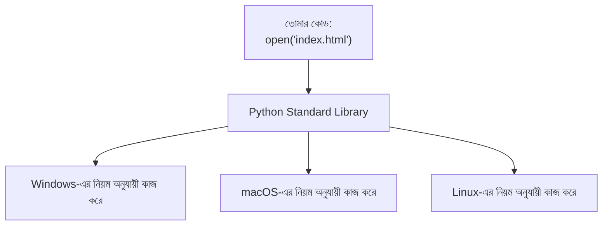

# ০৩. Purpose of Core Modules in Backend System

Module 2-তে আমরা কিছু জিনিস ব্যবহার করেছিলাম যেগুলো নিয়ে তেমন কথা বলিনি — যেমন `http`। এটাকে বলা হয় Python-এর **standard library module** বা **built-in module** — মানে এগুলো Python ইনস্টল করলেই সাথে চলে আসে, আলাদা করে `pip install` করতে হয় না। এই লেসনে আমরা বুঝবো, এই "core module" বা "standard library" ধারণাটার পেছনের যুক্তি কী, আর কেন Python এভাবেই ডিজাইন করা হয়েছে।

## সমস্যাটা কল্পনা করি

ধরো Python যদি একদম "খালি" থাকতো — কোনো built-in সুবিধা ছাড়াই, শুধু ভাষার মৌলিক জিনিস (variable, function, loop) থাকতো। তাহলে প্রতিবার একটা ফাইল পড়তে চাইলে, বা JSON ডেটা পার্স করতে চাইলে, তোমাকে অপারেটিং সিস্টেমের সাথে সরাসরি "কথা বলার" নিয়ম নিজে থেকে লিখতে হতো — যেটা অত্যন্ত জটিল, এবং প্রতিটা OS-এ (Windows, Mac, Linux) আলাদা আলাদাভাবে কাজ করে।

Python এই জটিলতা একবার সমাধান করে, একটা সহজ ইন্টারফেসের পেছনে লুকিয়ে দিয়েছে — এটাই core module বা standard library-র কাজ। তুমি লেখো `open('index.html')` বা `import json`, আর Python নিজে ভেতরে ভেতরে বুঝে নেয় সেটা Windows-এ কীভাবে করতে হবে, নাকি Linux-এ কীভাবে করতে হবে — তোমাকে এই পার্থক্য নিয়ে মাথা ঘামাতে হয় না।

## কিছু গুরুত্বপূর্ণ Core Module, যেগুলো সামনে বারবার আসবে

| Module | কাজ | এই কোর্সে কোথায় কাজে লাগবে |
|---|---|---|
| `http` | সার্ভার/ক্লায়েন্ট, request/response সামলানো | Module 2-এ ব্যবহার করেছি |
| `os` | ফাইল ও ফাইল পাথ নিয়ে কাজ করা (OS-নির্ভরতা এড়িয়ে) | প্রজেক্ট স্ট্রাকচার সাজানোর সময় |
| `json` | JSON ডেটা পার্স ও তৈরি করা | API রিকোয়েস্ট/রেসপন্স হ্যান্ডলিং-এর সময় |
| `sys` | কম্পিউটার/প্রসেস সম্পর্কে তথ্য | Process নিয়ে কাজ করার সময় (Module 10) |
| `hashlib` / `secrets` | এনক্রিপশন, হ্যাশিং | পাসওয়ার্ড নিরাপদ রাখার সময় (Module 12, JWT) |
| `asyncio` | asynchronous প্রোগ্রামিং-এর ভিত্তি | Module 5-এ async/await শেখার সময় |

লক্ষ্য করো — `hashlib` বা `secrets` module-টা আমরা এখনই ব্যবহার করবো না, কিন্তু Module 12-তে যখন আমরা পাসওয়ার্ড হ্যাশ করা শিখবো, তখন এটাই ব্যবহার করবো। এই মুহূর্তে শুধু নামটা চিনে রাখো — "ও, তার মানে Python-এর ভেতরেই এনক্রিপশনের জন্য বিল্ট-ইন সুবিধা আছে, বাইরে থেকে কিছু আনতে হয় না।"

## Core Module বনাম External Package — পার্থক্যটা এখনই স্পষ্ট করে নেই

সামনের মডিউলগুলোতে আমরা `fastapi` এর মতো প্যাকেজ ব্যবহার করবো, যেগুলো Python-এর সাথে built-in আসে না — সেগুলো `pip install` দিয়ে আলাদা করে আনতে হয়। পার্থক্যটা মনে রাখার সহজ উপায়:

- **Core Module (Standard Library)** — Python নিজেই তৈরি করে, নিজের সাথেই বিতরণ করে। `import http` লিখলেই কাজ করবে, কোনো ইনস্টলেশন লাগে না।
- **External Package (PyPI package)** — অন্য কোনো ডেভেলপার বা কোম্পানি তৈরি করেছে, PyPI (Python Package Index)-এ প্রকাশ করেছে। ব্যবহারের আগে `pip install <package-name>` দিয়ে ইনস্টল করতে হয়।

এই পার্থক্যটা মাথায় স্পষ্ট থাকলে, সামনে যখন কোনো নতুন `import ...` দেখবে, তুমি সহজেই বুঝতে পারবে এটা কি Python-এর নিজের কিছু, নাকি বাইরে থেকে ইনস্টল করা কোনো প্যাকেজ — আর সেই বোঝাটাই তোমাকে সাহায্য করবে ডিবাগ করতে, যদি কখনো "ModuleNotFoundError" ধরনের এরর আসে।
