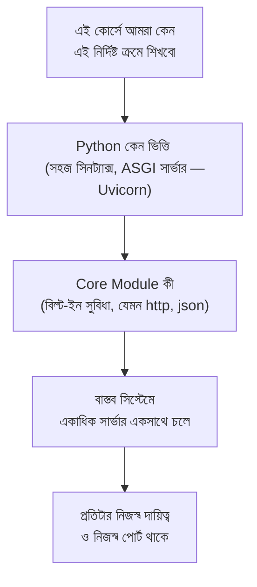

# ০৫. Conclusion

এই ছোট মডিউলটা মূলত একটা সেতু ছিলো — Module 2-তে আমরা শিখেছিলাম একটা সার্ভার কীভাবে কাজ করে টেকনিক্যালি, আর এখন আমরা একটু পিছিয়ে গিয়ে দেখলাম, বড় ছবিতে ব্যাকএন্ড ডেভেলপমেন্ট আসলে কীসের সমষ্টি — কোন কোন টুল কেন লাগে, কেন Python (আর তার ASGI সার্ভার)-কেই বেছে নেয়া হলো এই কোর্সের ভিত্তি হিসেবে, আর একটা বাস্তব সিস্টেমে কেন একাধিক আলাদা সার্ভার একসাথে কাজ করে।

## এই মডিউলের মূল শিক্ষাগুলো এক জায়গায়

চারটা লেসনে আমরা যা শিখেছি, সেগুলো একসাথে জোড়া দিলে দাঁড়ায় এরকম একটা চিত্র:

## কেন এই মডিউলটা এখনই দরকার ছিলো

তুমি হয়তো লক্ষ্য করেছো, এই মডিউলে কোনো নতুন কোড লেখা হয়নি — শুধু ধারণাগত আলোচনা হয়েছে। এটা ইচ্ছাকৃত। আমাদের কোর্সের দর্শন হলো, কোনো নতুন টুল হাতে নেয়ার আগে সেটার প্রয়োজনীয়তা এবং প্রেক্ষাপট বোঝা। এই মডিউলটা ঠিক সেই কাজটাই করেছে সামনে আসা FastAPI, Python Typing, Database — এই সবকিছুর জন্য একটা মানসিক কাঠামো তৈরি করে দিয়েছে।

এখন থেকে যখনই তুমি একটা নতুন টুল বা প্যাটার্নের মুখোমুখি হবে, নিজেকে জিজ্ঞেস করার অভ্যাস করো:

- এটা কোন ধরনের সমস্যার সমাধান — routing? ডেটা সংরক্ষণ? নিরাপত্তা?
- এটা কি Python-এর নিজস্ব (core module/standard library), নাকি বাইরে থেকে আনা (external package)?
- এটা কি একটা নতুন "সার্ভার" (আলাদা পোর্টে চলা কিছু), নাকি আমার বিদ্যমান Application সার্ভারের ভেতরেই একটা নতুন ফিচার?

## সামনে কী আসছে

এখন পর্যন্ত আমরা যা বানিয়েছি (Module 2-এর সার্ভার) সেটা একটামাত্র জিনিস জানে — যাই রিকোয়েস্ট আসুক, একই HTML ফাইল পাঠিয়ে দাও। এটা বাস্তব কোনো ওয়েবসাইটের জন্য যথেষ্ট না, কারণ বাস্তব ওয়েবসাইটে অনেক পাতা থাকে, অনেক ধরনের অনুরোধ থাকে — কখনো একটা পাতা দেখতে চাওয়া, কখনো একটা ফর্ম জমা দেয়া, কখনো একটা ছবি আপলোড করা।

**Module 4 — Python With FastAPI** থেকে আমরা প্রথমবারের মতো **FastAPI** framework ব্যবহার শুরু করবো, যেটা এই "কোন অনুরোধে কী করতে হবে" বোঝার কাজটা অনেক সহজ আর সুশৃঙ্খল করে দেয়। এবং তার আগে-পরে আমরা Python-এর সেই মৌলিক ধারণাগুলোও ঝালিয়ে নেবো, যেগুলো ব্যাকএন্ড কোড লেখার সময় বারবার লাগবে, আর কীভাবে একটা backend service নিজেই আরেকটা backend-এর client হতে পারে।
