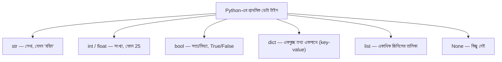

# ০২. Python Basics for FastAPI

ব্যাকএন্ড কোড লিখতে গেলে Python-এর কিছু মৌলিক জিনিস এত ঘন ঘন ব্যবহৃত হয় যে সেগুলো একদম হাতের তালুর মতো চেনা থাকা দরকার। এই লেসনে আমরা সেই জিনিসগুলো ঝালিয়ে নেবো, প্রতিটার সাথে বোঝার চেষ্টা করবো এটা ব্যাকএন্ডে ঠিক কোথায় লাগবে।

## Variable — ডেটা রাখার বাক্স

একটা variable-কে ভাবতে পারো একটা লেবেল-লাগানো বাক্স হিসেবে, যেটার ভেতরে তুমি কোনো একটা মান (value) রাখতে পারো।

```python
user_name = "রহিম"
age = 25
is_logged_in = True
```

## ডেটা টাইপ — বাক্সের ভেতরে কী ধরনের জিনিস থাকতে পারে



ব্যাকএন্ডে এই ধরনের প্রতিটা টাইপ বারবার আসবে — যেমন ধরো ইউজারের তথ্য একটা **dict** হিসেবে রাখা হয়:

```python
user = {
    "name": "রহিম",
    "age": 25,
    "is_logged_in": True,
}
```

আর একাধিক ইউজারের তালিকা রাখা হয় একটা **list of dicts** হিসেবে:

```python
users = [
    {"name": "রহিম", "age": 25},
    {"name": "করিম", "age": 30},
]
```

এই প্যাটার্নটা (list of dicts) আসলে বেশিরভাগ ব্যাকএন্ড ডেটার মূল আকৃতি — একটা ডেটাবেজ থেকে "সব ইউজার দাও" চাইলে, উত্তরটা এভাবেই সাজানো একটা তালিকা হয়ে ফেরত আসে। FastAPI-তে বাস্তব প্রজেক্টে আমরা সাধারণত এই dict-গুলো নিজে হাতে না লিখে **Pydantic model** দিয়ে সংজ্ঞায়িত করি — এই ধারণাটা Module 8-এ আরও গভীরে যাবো, যখন JSON আর data modeling নিয়ে বিস্তারিত কথা বলবো।

## Function — কাজের রেসিপি

একটা function হলো একটা নির্দেশাবলীর সেট, যেটা তুমি বারবার ব্যবহার করতে পারো, একই কোড বারবার না লিখে।

```python
def greet_user(name: str) -> str:
    return f"স্বাগতম, {name}!"

print(greet_user("রহিম"))  # স্বাগতম, রহিম!
```

লক্ষ্য করো — `name: str` আর `-> str` অংশগুলো হলো **type hint**, Python নিজে থেকে জোর করে না এগুলো মানতে, কিন্তু এটা লিখে রাখলে FastAPI (আর তোমার IDE) বুঝে যায় ফাংশনটা কী নেয়, কী ফেরত দেয়। FastAPI-এর পুরো জাদুটাই আসলে এই type hint-এর উপর দাঁড়িয়ে — এটা তুমি Module 13-এ আরও বিস্তারিত দেখবে।

## f-string — টেক্সটের ভেতরে ভ্যারিয়েবল বসানো

উপরের উদাহরণে যে `f"..."` আর `{name}` দেখলে, এটা একটা সুবিধাজনক উপায় টেক্সটের ভেতরে ভ্যারিয়েবলের মান বসানোর জন্য — একে বলে **f-string**। এটা এত বেশি ব্যবহৃত হবে যে এখনই অভ্যাস করে নেয়া ভালো:

```python
port = 8000
print(f"সার্ভার চালু আছে port {port}-এ")
```

## List-এর কিছু গুরুত্বপূর্ণ প্যাটার্ন

ব্যাকএন্ড কোডে ডেটার তালিকা নিয়ে কাজ করার সময় এই প্যাটার্নগুলো অসম্ভব ঘন ঘন ব্যবহৃত হয়:

```python
numbers = [1, 2, 3, 4, 5]

# list comprehension: প্রতিটা আইটেমকে পরিবর্তন করে নতুন list বানায় (map-এর সমতুল্য)
doubled = [n * 2 for n in numbers]  # [2, 4, 6, 8, 10]

# condition-সহ comprehension: শর্ত মেলে এমন আইটেমগুলো বেছে নেয় (filter-এর সমতুল্য)
even_numbers = [n for n in numbers if n % 2 == 0]  # [2, 4]

# next(): শর্ত মেলে এমন প্রথম আইটেমটা খুঁজে দেয় (find-এর সমতুল্য)
first_even = next(n for n in numbers if n % 2 == 0)  # 2
```

জাভাস্ক্রিপ্টের `map`/`filter`/`find` আর Python-এর `list comprehension`/`next()` — নাম আলাদা, সিনট্যাক্স আলাদা, কিন্তু সমস্যাটা একই: একটা তালিকা থেকে নতুন তালিকা বানানো, বা একটা নির্দিষ্ট আইটেম খুঁজে বের করা। এই পদ্ধতিগুলো Module 9-এ (Python Essentials for Backend Development) আরও বিস্তারিতভাবে দেখবো, কারণ এগুলো ছাড়া ব্যাকএন্ডে ডেটা প্রসেস করা প্রায় অসম্ভব — যেমন "সব ইউজারের মধ্যে যাদের বয়স ১৮-এর বেশি তাদের বের করো" — এটা এক লাইনে list comprehension দিয়ে করা যায়।

এই মৌলিক জিনিসগুলো মাথায় সতেজ রেখে, চলো এখন এমন একটা ধারণায় যাই যেটা নতুনদের কাছে প্রায়ই কিছুটা রহস্যময় লাগে — **callback / coroutine**।
</content>
