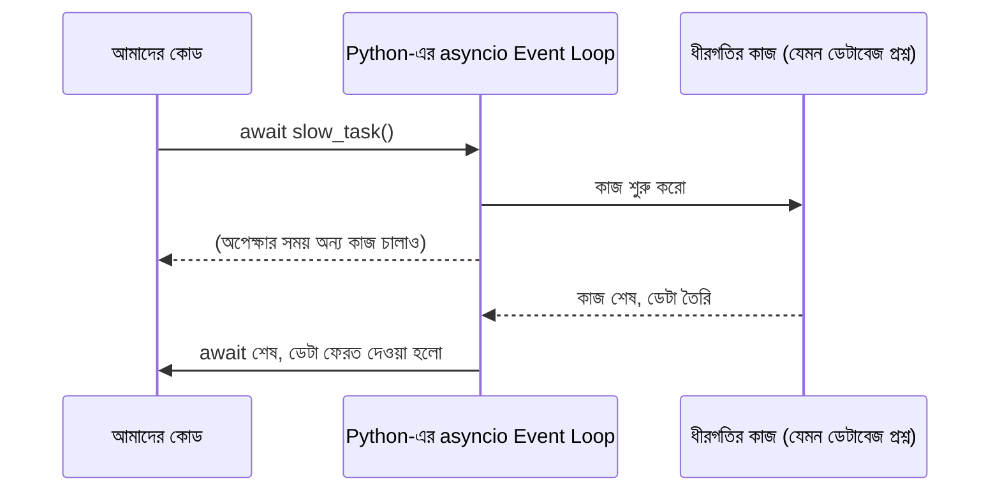

# ০৩. What is a Callback/Coroutine? How Does It Work?

আগের লেসনে আমরা function-এর ধারণাটা ঝালিয়ে নিয়েছি — একটা রেসিপি, যেটা বারবার ব্যবহার করা যায়। এখন একটা প্রশ্ন করি, যেটা প্রথমবার শুনলে অদ্ভুত লাগতে পারে — একটা function কি আরেকটা function-কে "প্যারামিটার" হিসেবে নিতে পারে? উত্তর হলো, হ্যাঁ, Python-এ পারে, আর এই ক্ষমতাটাই ব্যাকএন্ড ডেভেলপমেন্টের একদম প্রাণকেন্দ্রে বসে আছে।

যে function-টাকে আরেকটা function-এর ভেতরে "পরে ডাকার জন্য" পাঠানো হয়, তাকে বলা হয় **callback**। নামটা থেকেই আন্দাজ করা যায় — "কল ব্যাক", মানে কাজ শেষ হলে তুমি আমাকে ফিরে ডেকো।

## রেস্টুরেন্টের ওয়েটার দিয়ে বোঝা

ধরো তুমি একটা রেস্টুরেন্টে বসে আছো। ওয়েটারকে অর্ডার দিলে, ওয়েটার রান্নাঘরে গিয়ে দাঁড়িয়ে থাকে না যতক্ষণ না খাবার তৈরি হয়। সে বরং বলে যায় — "খাবার তৈরি হলে আমাকে জানিও, আমি টেবিলে নিয়ে যাবো।" এই "খাবার তৈরি হলে জানানো"-টাই একটা callback-এর মতো কাজ করে — একটা কাজ (রান্না) শেষ হওয়ার পর, আরেকটা কাজ (টেবিলে পৌঁছানো) স্বয়ংক্রিয়ভাবে ঘটে।

## নিজে হাতে একটা callback লেখা

চলো নিজেরাই ছোট একটা উদাহরণ বানাই, যাতে ব্যাপারটা আরও পরিষ্কার হয় — Python-এ function-কেও একটা সাধারণ variable-এর মতো আরেকটা function-এ পাঠানো যায়:

```python
def process_order(item_name: str, callback):
    print(f"{item_name} অর্ডার প্রসেস হচ্ছে...")
    callback(item_name)  # কাজ শেষে callback-টাকে ডাকা হচ্ছে


def notify_customer(item_name: str):
    print(f"{item_name} প্রস্তুত, গ্রাহককে জানানো হলো!")


process_order("বিরিয়ানি", notify_customer)
```

এখানে `process_order` ফাংশনটা দুইটা প্যারামিটার নিচ্ছে — একটা সাধারণ ডেটা (`item_name`), আর একটা ফাংশন (`callback`)। ফাংশনের ভেতরে কাজ শেষ হলে, সে `callback(item_name)` লিখে সেই ফাংশনটাকে চালু করে দিচ্ছে। ফলাফলে টার্মিনালে দেখা যাবে:

```
বিরিয়ানি অর্ডার প্রসেস হচ্ছে...
বিরিয়ানি প্রস্তুত, গ্রাহককে জানানো হলো!
```

## কেন এভাবে করার দরকার — সময়ের ব্যাপারটা

এই ছোট উদাহরণে callback ব্যবহার না করলেও চলতো — দুইটা লাইন সরাসরি একের পর এক লিখলেই একই ফলাফল পাওয়া যেতো। তাহলে callback-এর আসল গুরুত্ব কোথায়?

আসল গুরুত্ব তখন বোঝা যায়, যখন একটা কাজ **সময় নেয়** — যেমন একটা ফাইল পড়া, ইন্টারনেট থেকে ডেটা আনা, বা ডেটাবেজে প্রশ্ন করা। Node.js-এর জগতে এই ধরনের কাজের জন্য সরাসরি callback ব্যবহার করাটাই ঐতিহাসিকভাবে প্রচলিত রীতি ছিলো। Python-এ আধুনিক ব্যাকএন্ড কোডে (আর FastAPI-এ) এই একই সমস্যা সমাধান করা হয় **coroutine** দিয়ে — `async def` দিয়ে বানানো একটা বিশেষ ধরনের ফাংশন, যেটাকে "callback হিসেবে পাঠানো" লাগে না, বরং সরাসরি `await` করে তার জবাবের জন্য "থেমে থাকা" যায়, অথচ পুরো প্রোগ্রাম ব্লক হয়ে যায় না।



FastAPI-তে এই প্যাটার্নটা হাতেনাতে দেখা যায়:

```python
import asyncio

async def read_data_slowly():
    await asyncio.sleep(1)  # কল্পনা করো, এটা একটা ফাইল পড়া বা DB কল
    return "ফাইলের ভেতরের ডেটা"


async def main():
    print("ফাইল পড়া শুরু হয়েছে, এখন আমি অন্য কাজ করছি...")
    data = await read_data_slowly()
    print("ফাইলের ভেতরের ডেটা:", data)


asyncio.run(main())
```

এখানে `await read_data_slowly()` অংশটা বলছে — "এই কাজ শেষ না হওয়া পর্যন্ত এই ফাংশনের ভেতরে থেমে থাকো, কিন্তু বাকি প্রোগ্রামকে ব্লক করে দিও না।" এটা Node.js-এর `fs.readFile(path, callback)`-এর মতো "কাজ শেষে callback চালানো"-র ধারণাটাকেই ভিন্নভাবে প্রকাশ করে — শুধু callback-টাকে আলাদা প্যারামিটার হিসেবে পাঠাতে হয় না, `await` দিয়ে একই জায়গায় লেখা যায়, যেটা পড়তে অনেক বেশি স্বাভাবিক লাগে।

**Node.js-এর তুলনা:** Node.js-এ পুরনো রীতিতে এই একই কাজ লেখা হতো এভাবে —

```js
const fs = require('fs');

fs.readFile('data.txt', 'utf8', (error, data) => {
  if (error) {
    console.log('ফাইল পড়তে সমস্যা হয়েছে:', error);
    return;
  }
  console.log('ফাইলের ভেতরের ডেটা:', data);
});

console.log('ফাইল পড়া শুরু হয়েছে, এখন আমি অন্য কাজ করছি...');
```

এখানে `fs.readFile`-কে দেওয়া তৃতীয় প্যারামিটারটাই callback, আর প্রথম প্যারামিটার হিসেবে `error` রাখাটা Node.js-এর একটা সাধারণ প্রথা (**error-first callback**)। লক্ষ্য করো, দুটো কোডেই টার্মিনালে "শুরু হয়েছে..." লেখাটা **আগে** দেখা যাবে, ডেটা **পরে** — কারণ ধীরগতির কাজটা ব্যাকগ্রাউন্ডে চলে। পার্থক্যটা শুধু সিনট্যাক্সে — Node.js callback-টাকে প্যারামিটার হিসেবে পাঠায়, Python-এ `async`/`await` দিয়ে একই জিনিস উপর-নিচ পড়ার মতো ভাষায় লেখা যায়।

callback আর coroutine-এর এই ধারণাটাই Module 5-এ আমরা আরও গভীরে নিয়ে যাবো, যখন দেখবো Python-এর `asyncio` event loop ভেতরে ভেতরে ঠিক কীভাবে কাজ করে, আর কীভাবে এটা Node.js-এর event loop-এর সাথে তুলনীয় কিন্তু একরকম নয়। কিন্তু আপাতত, FastAPI-এর কোডে যেখানেই তুমি `async def endpoint(...):` দেখবে, মনে রেখো — এটাও একটা callback-এর মতোই ধারণা, ঠিক যেভাবে ওয়েটারকে বলা "খাবার তৈরি হলে জানিও।"

এখন চলো ফিরে যাই variable ঘোষণার scope আর mutability-র দিকে — কারণ FastAPI-এর কোডে এই ধারণাগুলোর সঠিক ব্যবহার বোঝা জরুরি।
</content>
