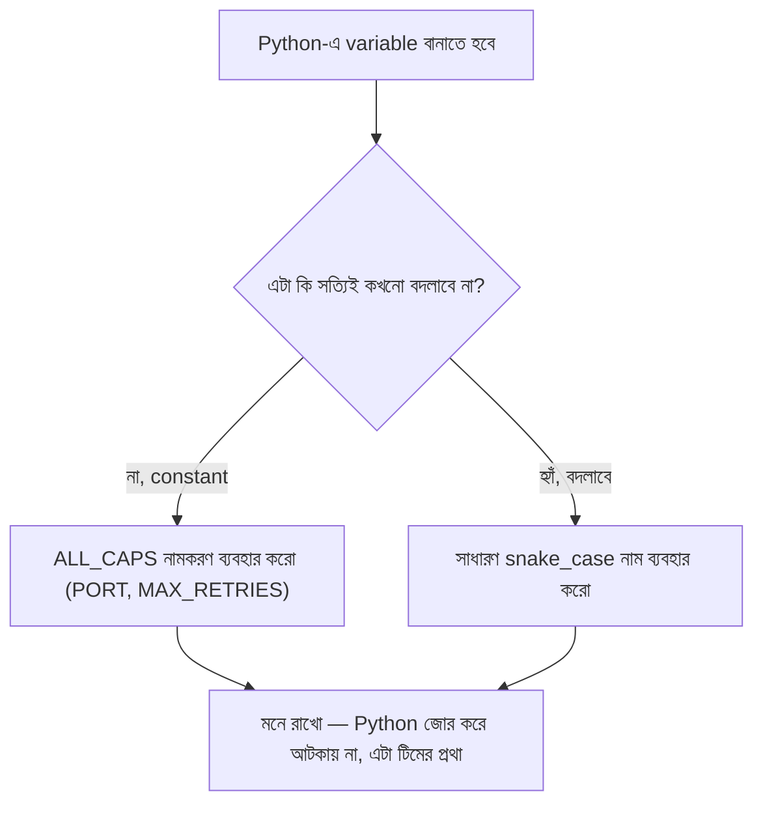

# ০৪. Scope and Mutability in Python (let/var/const-এর সমতুল্য চিন্তা)

Node.js-ভিত্তিক কোর্সে এই জায়গায় `let`, `var`, আর `const`-এর পার্থক্য শেখানো হয় — কারণ JavaScript-এ ভুল keyword বেছে নেওয়া অদ্ভুত বাগ তৈরি করতে পারে। Python-এ variable ঘোষণার জন্য আলাদা keyword নেই (`let x = 5`-এর মতো কিছু লিখতে হয় না, সরাসরি `x = 5` লিখলেই হয়), কিন্তু এর মানে এই না যে scope আর "এই মানটা কি বদলাবে" প্রশ্নগুলো Python-এ অবান্তর — বরং প্রশ্নগুলো ভিন্নভাবে দেখা দেয়, আর FastAPI-এর কোডে এই ধারণাগুলো ভুল বুঝলে একই রকম অদ্ভুত বাগ হতে পারে।

## Python-এ কোনো `var`/`let`/`const` নেই কেন

```python
message = "হ্যালো"
port = 8000
is_logged_in = True
```

Python-এ প্রতিটা assignment-ই একই রকম দেখতে — কোনো keyword ছাড়াই। তাহলে JavaScript-এর `var` (function-scoped, পুরনো, ঝামেলার), `let` (block-scoped, আধুনিক ডিফল্ট), আর `const` (block-scoped + অপরিবর্তনীয়) — এই তিনটার সমতুল্য চিন্তাভাবনা Python-এ কোথায় পাওয়া যায়?

## Scope — Python ব্লক-স্কোপড নয়, function-scoped

এটা একটা গুরুত্বপূর্ণ, প্রায়ই ভুল বোঝা পয়েন্ট: Python-এর `if`, `for`, `while` ব্লকের নিজস্ব কোনো scope নেই — এই দিক থেকে Python আচরণ করে ঠিক পুরনো দিনের JavaScript-এর `var`-এর মতো, `let`-এর মতো নয়!

```python
if True:
    message = "ভেতরে ঘোষণা করা হয়েছে"
print(message)  # "ভেতরে ঘোষণা করা হয়েছে" — if-block পার হয়েও দেখা যাচ্ছে!
```

Python-এ আসল scope boundary হলো **function**, module, আর class — `if`/`for`/`while` ব্লক নয়:

```python
def my_function():
    local_value = "এই function-এর ভেতরেই সীমাবদ্ধ"
    print(local_value)  # ঠিক আছে

my_function()
print(local_value)  # Error! NameError: name 'local_value' is not defined
```

এটাই JavaScript-এর `let`/`const`-এর block-scope-এর সবচেয়ে কাছের সমতুল্য — যে ব্লকের ভেতরে জিনিসটা "যুক্তিগতভাবে" থাকা উচিত, সেই ব্লকটাকে **function** দিয়ে ঘিরে ফেলো, `if`/`for` দিয়ে না।

## Mutability — `const`-এর প্রকৃত সমতুল্য

JavaScript-এ `const port = 3000; port = 4000;` করলে error হয় — কারণ `const` variable-এর নতুন মান বসানো (reassignment) আটকায়। Python-এ এই সমতুল্য ধারণাটা keyword দিয়ে না, বরং **প্রথা (convention)** দিয়ে প্রকাশ করা হয়:

```python
PORT = 8000  # সব বড় হাতের অক্ষরে লেখা — এটা বলছে "এটা বদলাবে না, এটা একটা constant"
request_count = 0  # ছোট হাতের অক্ষরে — এটা বদলাতে পারে
```

Python কিন্তু আসলে `PORT`-কে জোর করে বদলাতে বাধা দেয় না — তুমি চাইলে `PORT = 9000` লিখেই ফেলতে পারো, কোনো Error আসবে না। ALL_CAPS নামকরণটা শুধু অন্য ডেভেলপারদের (আর ভবিষ্যতের নিজেকে) একটা সংকেত — "এটাকে constant হিসেবে treat করো, বদলিও না।" এটা JavaScript-এর `const`-এর তুলনায় দুর্বল সুরক্ষা (compiler/runtime নিজে আটকায় না), কিন্তু বাস্তবে টিমে কাজ করার সময় এই প্রথাটাই যথেষ্ট শক্তিশালী অভ্যাস হিসেবে কাজ করে।

একটা গুরুত্বপূর্ণ বিষয় লক্ষ্য করার মতো — dict বা list-এর **ভেতরের** মান বদলানো Python-এও একইভাবে সম্ভব, ঠিক যেভাবে JavaScript-এর `const` object-এর ভেতরের মান বদলানো যায়:

```python
user = {"name": "রহিম"}
user["name"] = "করিম"  # ঠিক আছে, dict-এর ভেতরের মান বদলানো হচ্ছে
print(user["name"])  # "করিম"

user = {"name": "সালাম"}  # Python-এ এটাও চলে — পুরো variable রি-অ্যাসাইন করা যায়
```

লক্ষ্য করো, Python-এ এই শেষ লাইনটাও কোনো Error দেয় না — কারণ `user` কোনো `const`-এর মতো protected না। এটাই Python আর JavaScript-এর mutability-চিন্তার মূল পার্থক্য: JavaScript-এ `const` "লেবেলটা বদলাবে না" এই নিয়ম জোর করে চাপায়, Python পুরোটাই ডেভেলপারের নিয়ম-মানার উপর ছেড়ে দেয়।



## বাস্তব কোডে কোনটা কখন

FastAPI কোডে সাধারণ প্রথা হলো — কনফিগারেশন-জাতীয় মান (PORT, DATABASE_URL, MAX_CONNECTIONS) ALL_CAPS-এ লেখা, আর বাকি সব সাধারণ `snake_case`-এ:

```python
PORT = 8000  # এটা বদলাবে না, তাই ALL_CAPS
request_count = 0  # প্রতিটা request-এ বাড়বে, তাই সাধারণ নাম


def track_request():
    global request_count
    request_count += 1
    print(f"মোট {request_count}টা request এসেছে")
```

লক্ষ্য করো এখানে `global request_count` লাইনটা — function-এর ভেতরে থেকে বাইরের (module-level) variable-টা বদলাতে চাইলে Python-কে স্পষ্টভাবে বলে দিতে হয় "আমি বাইরের ওই variable-টাকেই বদলাতে চাইছি, নতুন local variable বানাচ্ছি না।" এটাও Python আর JavaScript-এর scope-নিয়ম আলাদা হওয়ার আরেকটা জায়গা — বাস্তব FastAPI প্রজেক্টে যদিও এই ধরনের global mutable state এড়িয়ে যাওয়াই ভালো অভ্যাস (এর বদলে dependency injection বা database ব্যবহার করা হয়, যেটা আমরা পরের মডিউলগুলোতে দেখবো)।

এখন যেহেতু callback/coroutine আর scope/mutability-র মৌলিক বিষয়গুলো ঝালিয়ে নেওয়া হয়েছে, চলো সত্যিকারের কাজে নেমে পড়ি — FastAPI ইনস্টল করে প্রথম সার্ভারটা বানাই, আর সেটাকে ব্রাউজার ছাড়াই Postman বা Thunder Client দিয়ে টেস্ট করি।
</content>
