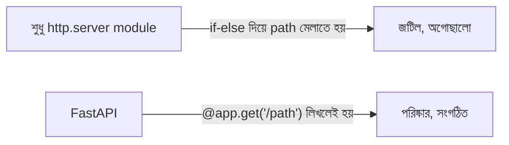
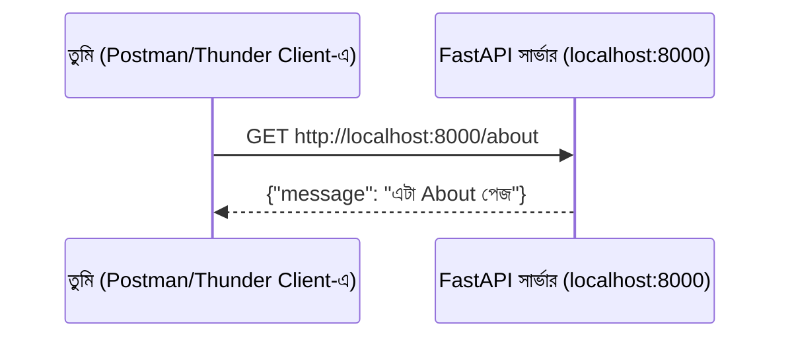

# ০৫. FastAPI Setup with Clients like Postman and Thunder Client

Module 2-এ আমরা `http.server` মডিউল দিয়ে নিজের হাতে একটা সার্ভার বানিয়েছিলাম, আর তার লেসনের শেষে একটা সীমাবদ্ধতার কথা বলেছিলাম — যেকোনো URL চাইলেই একই জবাব আসে, কারণ আমরা path পরীক্ষা করিনি। সেই সীমাবদ্ধতা কাটানোর কাজটা আমরা নিজে হাতেও করতে পারতাম (if-else দিয়ে url মিলিয়ে), কিন্তু এখন সময় হয়েছে এমন একটা টুল ব্যবহার করার যেটা এই কাজটা অনেক পরিষ্কারভাবে করে দেয় — **FastAPI**।

## FastAPI কী, এক কথায়

FastAPI হলো Python-এর উপরে তৈরি একটা **framework** — মানে এটা Python-এর নিজস্ব HTTP-হ্যান্ডলিং ক্ষমতাকে সম্পূর্ণ বাদ দেয় না, বরং তার উপরে একটা সুবিধাজনক স্তর (layer) যোগ করে। ভেতরে ভেতরে FastAPI দুটো লাইব্রেরির উপর দাঁড়িয়ে থাকে — **Starlette** (ওয়েব-লেয়ার, রুটিং, request/response হ্যান্ডলিং) আর **Pydantic** (ডেটা যাচাই আর টাইপ-সেফটি)। এই স্তরটা সবচেয়ে বড় যে সুবিধাটা দেয়, তা হলো **routing** — অর্থাৎ, "কে কোন URL চাইলে কী হবে" এটা পরিষ্কারভাবে, সংগঠিতভাবে লেখার ক্ষমতা।



## প্রজেক্ট শুরু করা

প্রথমে একটা নতুন ফোল্ডার বানাও, আর সেখানে একটা virtual environment তৈরি করো:

```bash
mkdir fastapi-shikhi
cd fastapi-shikhi
python -m venv venv
source venv/bin/activate   # Windows-এ: venv\Scripts\activate
```

`venv` একটা **virtual environment** — প্রজেক্টের নিজস্ব, বিচ্ছিন্ন একটা Python পরিবেশ, যেখানে ইনস্টল করা প্যাকেজ অন্য প্রজেক্টের সাথে মিশে যায় না। এটা Node.js-এর `node_modules`-এর ধারণার কাছাকাছি, তবে পার্থক্য হলো Node.js-এ ডিফল্টভাবেই প্রতিটা প্রজেক্টের প্যাকেজ আলাদা ফোল্ডারে থাকে, Python-এ এই "বিচ্ছিন্নতা" পেতে হলে ইচ্ছাকৃতভাবে virtual environment বানাতে হয়, নাহলে সব প্যাকেজ পুরো সিস্টেমে গ্লোবালভাবে ইনস্টল হয়ে যায়।

এবার FastAPI আর একটা ASGI সার্ভার (Uvicorn) ইনস্টল করি:

```bash
pip install fastapi uvicorn
```

`fastapi` হলো framework নিজে, আর `uvicorn` হলো সেই প্রোগ্রাম যেটা আসলে সার্ভারটা "চালায়" — FastAPI নিজে থেকে সার্ভার চালাতে পারে না, তার একটা ASGI সার্ভারের সাহায্য লাগে (Node.js-এ Express.js নিজে `app.listen()` দিয়ে সরাসরি সার্ভার চালাতে পারে, এটা একটা গঠনগত পার্থক্য মনে রাখার মতো)।

## প্রথম FastAPI সার্ভার লেখা

`main.py` নামে একটা ফাইল তৈরি করো:

```python
from fastapi import FastAPI

app = FastAPI()


@app.get("/")
def home():
    return {"message": "হ্যালো, এটা FastAPI থেকে জবাব!"}


@app.get("/about")
def about():
    return {"message": "এটা About পেজ"}
```

লাইন ধরে দেখা যাক ঠিক কী ঘটছে। `from fastapi import FastAPI` লাইনটা আমরা যে প্যাকেজ ইনস্টল করলাম, সেটাকে ফাইলে নিয়ে আসছে। `app = FastAPI()` একটা FastAPI অ্যাপ্লিকেশন তৈরি করছে, যেটাকে আমরা `app` নামের variable-এ রাখছি।

`@app.get("/")` — এই লাইনটাকে বলা হয় একটা **decorator**, আর এখানেই FastAPI-এর আসল শক্তি দেখা যায়। এই লাইনটা বলছে, "যখনই কেউ `/` পাতা GET পদ্ধতিতে চায়, ঠিক নিচের ফাংশনটা চালাও।" `home()` ফাংশনটা একটা dict রিটার্ন করছে, আর FastAPI নিজে থেকেই এটাকে JSON-এ রূপান্তর করে ক্লায়েন্টের কাছে পাঠায় — কোনো `.send()` বা `.json()` আলাদাভাবে ডাকতে হয় না।

লক্ষ্য করো, আমরা `/` আর `/about` — দুটো আলাদা পাতার জন্য দুটো আলাদা `@app.get(...)` লিখেছি, কোনো if-else ছাড়াই। এটাই FastAPI-এর routing-এর সৌন্দর্য।

সার্ভার চালাও:

```bash
uvicorn main:app --reload
```

`main:app` মানে হলো "`main.py` ফাইলের ভেতরের `app` নামের variable-টা চালাও।" `--reload` ফ্ল্যাগটা কোড বদলালে সার্ভারকে নিজে থেকে পুনরায় চালু করে দেয় — ডেভেলপমেন্টের সময় খুবই সুবিধাজনক, প্রোডাকশনে এটা বন্ধ রাখা হয়।

## বোনাস — FastAPI-এর স্বয়ংক্রিয় ডকুমেন্টেশন

FastAPI-এর একটা বিশেষ সুবিধা আছে, যেটা Express.js-এ ডিফল্টভাবে নেই — সার্ভার চালু থাকা অবস্থায় ব্রাউজারে `http://localhost:8000/docs` খুললে, স্বয়ংক্রিয়ভাবে তৈরি একটা interactive API ডকুমেন্টেশন পেজ দেখতে পাবে (Swagger UI নামে পরিচিত), যেখান থেকে সরাসরি প্রতিটা endpoint টেস্ট করা যায়। এটা আমরা নিচে যে Postman/Thunder Client নিয়ে কথা বলবো, তার একটা built-in বিকল্প — যদিও প্রফেশনাল কাজে দুটোই ব্যবহৃত হয়।

## ব্রাউজার ছাড়া API টেস্ট করা — Postman আর Thunder Client

এখন পর্যন্ত আমরা ব্রাউজারে গিয়ে URL টাইপ করে টেস্ট করেছি। কিন্তু বাস্তব ব্যাকএন্ড ডেভেলপমেন্টে, একটা API-কে প্রায়ই এমনভাবে টেস্ট করতে হয় যেটা ব্রাউজারের ঠিকানার বার দিয়ে সহজে করা যায় না — যেমন POST রিকোয়েস্ট পাঠানো, সাথে বাড়তি ডেটা বা header পাঠানো। এই কাজের জন্য দুটো জনপ্রিয় টুল হলো **Postman** আর **Thunder Client**।

**Postman** একটা আলাদা, স্বতন্ত্র অ্যাপ্লিকেশন, যেটা ইনস্টল করে ব্যবহার করতে হয়। এটাতে তুমি একটা URL লিখে, পদ্ধতি (GET, POST, ইত্যাদি) বেছে নিয়ে, প্রয়োজনে অতিরিক্ত ডেটা জুড়ে দিয়ে "Send" চাপলেই জবাব দেখতে পাও।

**Thunder Client** একই কাজ করে, কিন্তু এটা VS Code-এর ভেতরেই একটা extension হিসেবে বসানো যায় — ফলে কোড লেখা আর API টেস্ট করা একই জানালার মধ্যে হয়ে যায়, বারবার অ্যাপ বদলাতে হয় না।



Thunder Client ইনস্টল করে VS Code-এর সাইডবারে থান্ডার আইকনে ক্লিক করো, "New Request" চাপো, URL-এ লেখো `http://localhost:8000/about`, পদ্ধতি রাখো GET, তারপর "Send" চাপো। নিচের প্যানেলে জবাব দেখতে পাবে — ঠিক যেমনটা ব্রাউজারে দেখেছিলে, কিন্তু এবার এমন একটা টুলে, যেটা দিয়ে সামনে আরও জটিল রিকোয়েস্টও পাঠানো যাবে।

এই টুলগুলো এখন থেকে আমাদের নিত্যদিনের সঙ্গী হয়ে থাকবে, কারণ সামনে আমরা যখন এমন API বানাবো যেগুলো ডেটা গ্রহণ করে (যেমন ফর্ম সাবমিট করা, ইউজার তৈরি করা), তখন শুধু ব্রাউজারের ঠিকানার বার দিয়ে টেস্ট করা আর সম্ভব হবে না।

সার্ভার চালু রেখে, চলো এবার দেখি একটা URL-এর মধ্যে দিয়ে ডেটা পাঠানোর দুটো আলাদা পদ্ধতি — Query Parameter আর Path Parameter — এর পার্থক্য কী, আর কখন কোনটা ব্যবহার করা উচিত।
</content>
