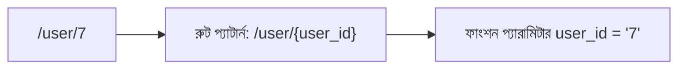
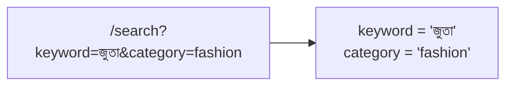

# ০৬. GET API and Query Param vs Path/Route Parameters

আগের লেসনে আমরা `/` আর `/about`-এর জন্য দুটো আলাদা, সম্পূর্ণ ফিক্সড রুট লিখেছিলাম। কিন্তু বাস্তব অ্যাপ্লিকেশনে প্রায়ই দরকার হয় এমন কিছু, যেখানে URL-এর একটা অংশ **পরিবর্তনশীল** — যেমন ধরো, প্রতিটা ইউজারের জন্য আলাদা প্রোফাইল পেজ দেখাতে হবে। প্রতিটা ইউজারের জন্য আলাদা করে `@app.get("/user/1")`, `@app.get("/user/2")` লিখতে যাওয়া তো অবাস্তব — হাজার ইউজার হলে হাজারটা লাইন লাগবে। এই সমস্যার সমাধানেই আসে দুটো ভিন্ন কৌশল — **Path Parameter** আর **Query Parameter**।

## Path Parameter — URL-এর ভেতরেই বসানো তথ্য

Path Parameter (একে Route Parameter-ও বলে) হলো URL-এর গঠনের ভেতরেই একটা "খালি জায়গা" রাখা, যেখানে প্রকৃত মান বসবে।

```python
@app.get("/user/{user_id}")
def get_user(user_id: str):
    return {"message": f"ইউজার নম্বর {user_id}-এর প্রোফাইল"}
```

এখানে `{user_id}` অংশটাই একটা placeholder — এর মানে হলো, "এই জায়গায় যেকোনো মান আসতে পারে, আর সেটাকে `user_id` নামে ধরে রাখো।" কেউ যদি `http://localhost:8000/user/7` চায়, তাহলে FastAPI স্বয়ংক্রিয়ভাবে ফাংশনের `user_id` প্যারামিটারে `"7"` বসিয়ে দেয় — লক্ষ্য করো, path-এর `{user_id}` আর ফাংশনের প্যারামিটারের নাম একই হতে হয়, এটাই FastAPI-কে বলে দেয় কোনটা কোথায় বসবে।



Path Parameter সাধারণত ব্যবহার করা হয় যখন মানটা **কোনো নির্দিষ্ট জিনিসের পরিচয়** নির্দেশ করে — যেমন কোন ইউজার, কোন পণ্য, কোন পোস্ট। এটা অনেকটা একটা বাড়ির ঠিকানার মতো — "বাড়ি নম্বর ৭" ঠিকানারই অবিচ্ছেদ্য অংশ, আলাদা কোনো "অতিরিক্ত তথ্য" না।

**Type hint দিয়ে বাড়তি সুবিধা:** যদি `user_id: int` লেখো (স্ট্রিং না দিয়ে int), FastAPI নিজে থেকেই যাচাই করে দেয় মানটা সংখ্যা কিনা — কেউ `/user/abc` চাইলে FastAPI নিজে থেকেই একটা 422 error ফেরত দেয়, তোমাকে নিজে হাতে `if isinstance(...)` লিখতে হয় না।

```python
@app.get("/user/{user_id}")
def get_user(user_id: int):
    return {"message": f"ইউজার নম্বর {user_id}-এর প্রোফাইল"}
```

## Query Parameter — URL-এর শেষে ঐচ্ছিক তথ্য

Query Parameter দেখতে ভিন্ন — এটা URL-এর শেষে `?` চিহ্নের পরে বসে, আর `key=value` জোড়া হিসেবে লেখা হয়, একাধিক হলে `&` দিয়ে জোড়া লাগানো হয়।

```python
@app.get("/search")
def search(keyword: str, category: str = "সব"):
    return {"message": f'খোঁজা হচ্ছে "{keyword}", ক্যাটাগরি: {category}'}
```

কেউ যদি এই URL-টা চায়: `http://localhost:8000/search?keyword=জুতা&category=fashion`, তাহলে `keyword` প্যারামিটারের মান হবে `"জুতা"`, আর `category`-এর মান হবে `"fashion"`।



লক্ষ্য করো — এখানে FastAPI-এর একটা গুরুত্বপূর্ণ ভিন্নতা আছে Express.js-এর তুলনায়: FastAPI নিজে থেকেই বুঝে নেয় কোনটা Path Parameter, কোনটা Query Parameter — path-এর `{}`-এর ভেতরে সংজ্ঞায়িত থাকলে সেটা Path Parameter, নাহলে সেটা স্বয়ংক্রিয়ভাবে Query Parameter হিসেবে ধরে নেওয়া হয়। Express.js-এ এই দুটো স্পষ্টভাবে আলাদা করে লিখতে হয় (`req.params` বনাম `req.query`)।

Query Parameter সাধারণত ব্যবহার হয় **ঐচ্ছিক, ফিল্টারিং, বা সাজানোর তথ্যের জন্য** — যেমন সার্চ করার শব্দ, পাতা নম্বর (pagination), সাজানোর ক্রম। উপরের কোডে `category: str = "সব"` — এখানে `= "সব"` অংশটা একটা **ডিফল্ট মান**, মানে যদি URL-এ `category` না দেওয়া থাকে, তাহলে এই মানটা ব্যবহার হবে, আর FastAPI এটাকে ঐচ্ছিক (optional) ধরে নেবে।

## দুটোর মধ্যে পার্থক্য, পাশাপাশি রেখে দেখা

| বিষয় | Path Parameter | Query Parameter |
|---|---|---|
| URL-এ দেখতে | `/user/7` | `/search?keyword=জুতা` |
| FastAPI-এ সংজ্ঞায়িত হয় | পথের `{}`-এর ভেতরে | সাধারণ ফাংশন প্যারামিটার, ডিফল্ট মান-সহ |
| কখন ব্যবহার | কোনো নির্দিষ্ট জিনিসের পরিচয় বোঝাতে | ঐচ্ছিক, ফিল্টার/সাজানোর তথ্যের জন্য |
| না দিলে কী হয় | সাধারণত রুটটাই মেলে না (404) | ডিফল্ট মান থাকলে চলে, নাহলে 422 error |
| উদাহরণ | কোন ইউজার, কোন প্রোডাক্ট আইডি | সার্চ শব্দ, পেজ নম্বর, সাজানোর ধরন |

একটা সহজ মনে রাখার উপায় — যদি প্রশ্নটা হয় **"কোনটা?"** (কোন ইউজার, কোন প্রোডাক্ট), তাহলে Path Parameter। যদি প্রশ্নটা হয় **"কীভাবে ফিল্টার/সাজাবে?"**, তাহলে Query Parameter।

## দুটো একসাথে ব্যবহার করা

বাস্তব অ্যাপ্লিকেশনে প্রায়ই দুটো একসাথে ব্যবহার করা হয়:

```python
@app.get("/user/{user_id}/orders")
def get_orders(user_id: str, status: str | None = None):
    return {
        "message": f"ইউজার {user_id}-এর অর্ডার, স্ট্যাটাস ফিল্টার: {status or 'সব'}"
    }
```

এখানে `http://localhost:8000/user/7/orders?status=pending` রিকোয়েস্ট করলে, FastAPI একসাথে `user_id` (`"7"`) আর `status` (`"pending"`) দুটোই বের করে দিতে পারে। লক্ষ্য করো, `status: str | None = None` লেখাটা বলছে — এই প্যারামিটারটা হয় একটা স্ট্রিং, নাহয় `None` (কিছু নেই), আর ডিফল্ট মান `None`। `status or 'সব'` অংশটা বলছে — যদি `status` কিছু না দেওয়া থাকে (`None`), তাহলে ডিফল্ট হিসেবে `'সব'` দেখাও। এটাই Query Parameter-এর "ঐচ্ছিক" স্বভাবের একটা বাস্তব প্রতিফলন।

এই দুটো টুল হাতে থাকলে, এখন আমরা এমন API বানাতে পারি যেগুলো সত্যিকারের অর্থবহ ডেটা আদান-প্রদান করতে পারে, শুধু একটা ফিক্সড টেক্সট ফেরত দেওয়ার বদলে। Postman বা Thunder Client দিয়ে এই দুটো ধরনের URL নিজে হাতে চালিয়ে দেখো, path আর query parameter-এর ভেতরে কী আসছে তা `print()` দিয়ে দেখলে ব্যাপারটা আরও স্পষ্ট হবে। আর `http://localhost:8000/docs` পেজে গিয়ে এই endpoint-গুলো টেস্ট করলে দেখবে, FastAPI স্বয়ংক্রিয়ভাবেই আলাদা করে দেখিয়ে দিয়েছে কোনটা path parameter, কোনটা query parameter।

এখন প্রশ্নটা আসে — এতক্ষণ আমাদের সার্ভার শুধু ব্রাউজার বা Postman-এর রিকোয়েস্ট সামলাচ্ছিলো, কিন্তু একটা backend কি নিজেই আরেকটা backend-কে রিকোয়েস্ট পাঠাতে পারে? চলো পরের লেসনে সেটাই দেখি।
</content>
