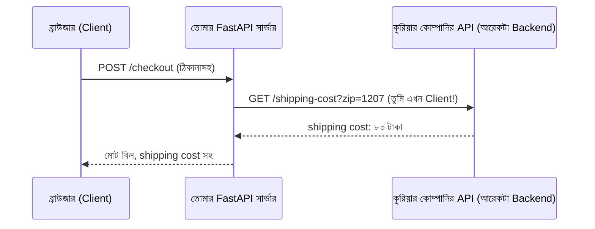

# ০৭. Backend Service as Client [Calling Backend from Other Backend]

এতদিন আমাদের চিন্তার কাঠামোটা ছিলো এরকম — একজন **client** (ব্রাউজার, বা Postman/Thunder Client) একটা রিকোয়েস্ট পাঠায়, আর একটা **server** (আমাদের FastAPI অ্যাপ) সেটার জবাব দেয়। এই সম্পর্কে সার্ভারের ভূমিকা সবসময় "জবাবদাতা"। কিন্তু বাস্তব জগতের অ্যাপ্লিকেশনে, একটা backend প্রায়ই নিজেই একটা **client**-এর ভূমিকা নেয়, আরেকটা backend-কে রিকোয়েস্ট পাঠিয়ে।

## কেন এটা দরকার হয়

ধরো তুমি একটা ই-কমার্স অ্যাপ বানাচ্ছো, আর চেকআউটের সময় গ্রাহকের ঠিকানা থেকে shipping cost হিসাব করতে হবে। এই হিসাবটা করার জন্য একটা third-party সার্ভিস (যেমন একটা কুরিয়ার কোম্পানির API) ব্যবহার করতে হয়। তোমার FastAPI সার্ভার এখানে দুটো ভূমিকায় থাকে একসাথে:



লক্ষ্য করো — ব্রাউজারের কাছে তোমার সার্ভার একজন **server**, কিন্তু কুরিয়ার কোম্পানির API-এর কাছে তোমার সার্ভার একজন **client**। এই দ্বৈত ভূমিকাটাই আধুনিক ব্যাকএন্ড সিস্টেমের বাস্তবতা — এই ধরনের একাধিক সার্ভিস একে অপরকে ডাকার প্যাটার্নটাকেই বলা হয় **microservices** বা **service-to-service communication**, যেটা নিয়ে আমরা আরও বিস্তারিত যাবো Module 40-এ।

## Python দিয়ে আরেকটা backend-কে কল করা — httpx দিয়ে

Python-এর সবচেয়ে জনপ্রিয় async HTTP ক্লায়েন্ট লাইব্রেরির নাম **httpx**। এটা ইনস্টল করতে হয়:

```bash
pip install httpx
```

আর ব্যবহার এরকম:

```python
import httpx

@app.get("/weather-report")
async def weather_report():
    async with httpx.AsyncClient() as client:
        response = await client.get("https://api.example.com/weather?city=Dhaka")
        data = response.json()

    return {"message": f"ঢাকার তাপমাত্রা: {data['temperature']}°C"}
```

এখানে কয়েকটা নতুন জিনিস চোখে পড়বে — `async` আর `await` শব্দদুটো, যেগুলো আমরা Module 3-এ (এই মডিউলের callback/coroutine লেসনে) সংক্ষেপে দেখেছি। `async with httpx.AsyncClient() as client:` অংশটা একটা ক্লায়েন্ট তৈরি করে, যেটা কাজ শেষ হলে নিজে থেকেই বন্ধ (cleanup) হয়ে যায় — এই প্যাটার্নটাকে বলে **context manager**। `await client.get(url)` রিকোয়েস্ট পাঠায় আর জবাবের জন্য অপেক্ষা করে ("এই কাজ শেষ না হওয়া পর্যন্ত পরের লাইনে যেও না, কিন্তু বাকি সার্ভারকে ব্লক করো না")। `response.json()` জবাবটাকে Python dict-এ রূপান্তর করে, যেটা নিয়ে Module 8-এ JSON আলোচনায় আরও বিস্তারিত জানবো। এই `async`/`await`-এর ভেতরের কাজের প্রক্রিয়া Module 5-এ গভীরে গিয়ে বুঝবো।

## requests দিয়ে করা — একটা সিঙ্ক্রোনাস বিকল্প

`httpx` ছাড়াও Python-এ **requests** লাইব্রেরিটা অনেক বেশি পরিচিত, কিন্তু এটা sync (async না) — মানে FastAPI-এর `async def` endpoint-এর ভেতরে সরাসরি ব্যবহার করলে পুরো সার্ভারকে সেই সময়টায় ব্লক করে ফেলতে পারে। এটা মনে রাখার মতো একটা গুরুত্বপূর্ণ পয়েন্ট — FastAPI-এর `async` endpoint-এর ভেতরে সবসময় async-compatible লাইব্রেরি (`httpx`) ব্যবহার করা উচিত, sync লাইব্রেরি (`requests`) দরকার হলে সেটাকে `def` (non-async) endpoint-এ ব্যবহার করা ভালো, যেটা FastAPI নিজে থেকেই একটা আলাদা থ্রেড-পুলে চালায়।

## Node.js/Express.js-এর তুলনা

Node.js-এ আধুনিক ভার্সনে (v18+) `fetch` বিল্ট-ইন হিসেবেই পাওয়া যায়:

```js
app.get('/weather-report', async (req, res) => {
  const response = await fetch('https://api.example.com/weather?city=Dhaka');
  const data = await response.json();
  res.send(`ঢাকার তাপমাত্রা: ${data.temperature}°C`);
});
```

লক্ষ্য করো — কাঠামোটা প্রায় হুবহু একই: `async` ফাংশন, `await` দিয়ে অপেক্ষা করা, `.json()` দিয়ে রূপান্তর। পার্থক্যটা শুধু সিনট্যাক্সে (Python-এ `client.get()`, Node.js-এ সরাসরি `fetch()`), ভাবনার কাঠামো একই।

## নিজের দুটো FastAPI সার্ভার দিয়ে হাতে-কলমে দেখা

ব্যাপারটা আরও স্পষ্ট করার জন্য, চলো দুটো ছোট সার্ভার বানাই। প্রথমটা, `service_a.py`, port 8001-এ চলবে:

```python
from fastapi import FastAPI

app = FastAPI()


@app.get("/greet")
def greet():
    return {"message": "Service A থেকে শুভেচ্ছা!"}
```

চালাও: `uvicorn service_a:app --port 8001`

দ্বিতীয়টা, `service_b.py`, port 8002-এ চলবে, আর এটা Service A-কে কল করবে:

```python
from fastapi import FastAPI
import httpx

app = FastAPI()


@app.get("/combined")
async def combined():
    async with httpx.AsyncClient() as client:
        response = await client.get("http://localhost:8001/greet")
        data = response.json()

    return {"message": f'Service B বলছে: "{data["message"]}" — এটা আমি Service A থেকে পেয়েছি!'}
```

চালাও: `uvicorn service_b:app --port 8002`

দুটো টার্মিনালে দুটো সার্ভার আলাদাভাবে চালাও, তারপর Postman বা ব্রাউজারে `http://localhost:8002/combined` চাইলে দেখবে — Service B, Service A-কে ভেতরে-ভেতরে কল করে তার জবাব নিজের জবাবের ভেতরে জুড়ে দিচ্ছে। এটাই Module 3-এর সেই "একাধিক সার্ভার একসাথে চলা" ছবির একটা জীবন্ত উদাহরণ, শুধু এখানে সবগুলোই Application Server, ডেটাবেজ বা ক্যাশ না।

এই প্যাটার্নটা মাথায় রেখে, এবার একটু ভিন্ন কোণ থেকে ব্যাপারটা দেখি — Node.js-এর জগতে FastAPI-এর মতোই একটা জনপ্রিয় framework আছে, নাম Express.js। পরের লেসনে দেখবো, দুটো সম্পূর্ণ ভিন্ন ভাষার framework কেন গঠনগতভাবে প্রায় একই রকম দেখতে লাগে।
</content>
