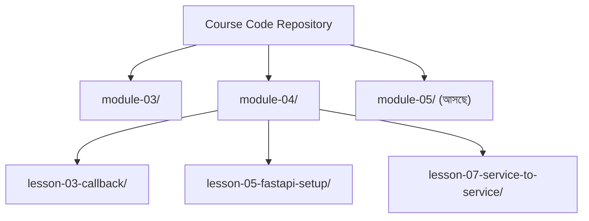

# ০৯. Code Links

এই মডিউলে আমরা বেশ কয়েকটা ছোট ছোট কোড লিখেছি — callback/coroutine-এর উদাহরণ, scope আর mutability-র তুলনা, প্রথম FastAPI সার্ভার, Path আর Query Parameter, আর দুটো সার্ভিসের একে অপরকে কল করার প্র্যাকটিস। এই প্রতিটা কোড আলাদা আলাদা ফাইলে, আলাদা সময়ে লেখা হয়েছে, আর টাইপ করতে করতে ছোটখাটো বানান ভুল বা অগোছালো ফোল্ডার-স্ট্রাকচার হয়ে যাওয়াটা খুবই স্বাভাবিক। এই মুহূর্তে একটা প্রশ্ন আসা উচিত — এই কোডগুলো যদি এমন এক জায়গায় গোছানো থাকতো, যেখান থেকে যেকোনো সময় আবার দেখা, ডাউনলোড করা, বা নিজের কোডের সাথে মিলিয়ে দেখা যায়, তাহলে কেমন হতো?

## কেন একটা companion কোড রিপোজিটরি দরকার

ধরো তুমি এই মডিউলের ৫ নম্বর লেসনের FastAPI সার্ভারটা নিজে লিখেছো, কিন্তু কোথাও একটা টাইপো করার কারণে এটা চলছে না। এই মুহূর্তে সবচেয়ে দ্রুত সমাধান হলো — তোমার লেখা কোডটা মূল, সঠিক কোডের সাথে পাশাপাশি রেখে মিলিয়ে দেখা। এই কাজটা সহজ হয়ে যায় যদি প্রতিটা লেসনের সম্পূর্ণ, চালু-করা-যায় এমন কোড একটা নির্দিষ্ট জায়গায়, লেসন নম্বর অনুযায়ী সাজানো থাকে — যেমন একটা GitHub রিপোজিটরি, যার ভেতরে প্রতিটা মডিউলের জন্য একটা ফোল্ডার, আর প্রতিটা লেসনের জন্য তার ভেতরে একটা সাব-ফোল্ডার বা ফাইল।



এই ধরনের একটা companion রিপোজিটরি কয়েকটা বাস্তব সুবিধা দেয়। **প্রথমত**, নিজের কোড আর মূল কোডের মধ্যে পার্থক্য খুঁজে বের করা সহজ হয়, যেটা ডিবাগিং শেখার একটা গুরুত্বপূর্ণ অংশ — নিজে থেকে ভুল বের করার অভ্যাস। **দ্বিতীয়ত**, যদি কোনো কারণে লোকাল কম্পিউটারে কোড হারিয়ে যায় (ভুলে ডিলিট হয়ে যাওয়া, নতুন কম্পিউটারে কাজ শুরু করা), তাহলে পুরো কোর্সের কোড আবার নতুন করে টাইপ না করে সরাসরি ডাউনলোড করে নেওয়া যায়। **তৃতীয়ত**, একটা রিপোজিটরিতে কমিট হিস্ট্রি থাকলে (Git ব্যবহার করে), দেখা যায় প্রতিটা লেসনে কোড কীভাবে ধাপে ধাপে বদলেছে, বেড়েছে — যেটা নিজে থেকে শেখার একটা চমৎকার মাধ্যম।

## কীভাবে ব্যবহার করবে এমন একটা রিপোজিটরি

ধরে নাও ভবিষ্যতে এই কোর্সের সাথে একটা এমন companion রিপোজিটরি যুক্ত হবে (বা তুমি নিজেই একটা বানিয়ে রাখতে পারো)। তাহলে সবচেয়ে কার্যকর অভ্যাসটা হলো — **আগে নিজে লেসনের কোড টাইপ করে চালানোর চেষ্টা করা, তারপর রিপোজিটরির কোডের সাথে মিলিয়ে দেখা**। সরাসরি copy-paste করে চালিয়ে দেখাটা প্রথম ধাপ হিসেবে এড়িয়ে চলাই ভালো, কারণ টাইপ করার সময় হাত-চোখ-মস্তিষ্কের যে অভ্যাস তৈরি হয়, সেটাই সত্যিকারের শেখা। রিপোজিটরির কোড বরং কাজ করছে একটা "উত্তরপত্র"-এর মতো — নিজে চেষ্টা করার পর মিলিয়ে দেখার জন্য।

নিজে যদি এখনই একটা ব্যক্তিগত অভ্যাস গড়তে চাও, সবচেয়ে সহজ উপায় হলো — নিজের কম্পিউটারেই একটা Git রিপোজিটরি শুরু করা, যেখানে এই কোর্সের প্রতিটা লেসনের কোড আলাদা ফোল্ডারে জমা রাখবে:

```bash
mkdir shikhar-course-code
cd shikhar-course-code
git init
mkdir module-04-lesson-05-fastapi-setup
```

এই অভ্যাসটা সামনে আরও বড় ভূমিকা রাখবে, যখন Module 6-7-এর দিকে আমরা Git আর GitHub নিয়ে বিস্তারিত কথা বলবো, আর দেখবো কীভাবে নিজের কোড অনলাইনে নিরাপদে রাখা যায়, অন্যদের সাথে শেয়ার করা যায়।

এই মডিউলে আমরা Python-এর কিছু মৌলিক ধারণা ঝালিয়ে নিয়ে, FastAPI দিয়ে প্রথম রুট বানিয়ে, Postman/Thunder Client দিয়ে টেস্ট করে, Path আর Query Parameter শিখে, এমনকি দুটো backend-কে একে অপরের সাথে কথা বলিয়ে, আর Express.js-এর সাথে তুলনা করে একটা পূর্ণাঙ্গ ভিত্তি তৈরি করেছি। এই ভিত্তির উপর দাঁড়িয়ে, পরের মডিউলে আমরা এমন একটা প্রশ্নের উত্তর খুঁজবো যেটা এই পুরো মডিউল জুড়ে বারবার উঁকি দিয়েছে কিন্তু গভীরে যাইনি — Python-এর `asyncio` আসলে কীভাবে একসাথে অনেক কাজ সামলায়, ভেতরে ভেতরে কী ঘটে যখন আমরা `async`/`await` লিখি, আর এটা Node.js-এর event loop-এর সাথে ঠিক কতটা মিলে, কতটা মেলে না। চলো যাই Module 5 — Async Python Inside FastAPI-এ।
</content>
