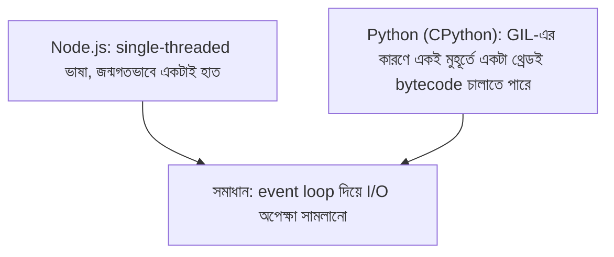
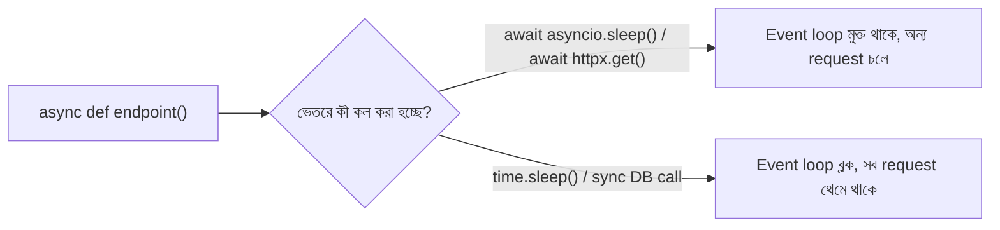

# ০১. Introduction to Async Code in Python - Nature of Python

Module 4-এ আমরা FastAPI দিয়ে API বানানো শুরু করেছি, coroutine-এর সাথেও সংক্ষেপে পরিচয় হয়েছে — `async def`, `await` শব্দগুলো চোখে পড়েছে, কিন্তু আমরা থেমে গিয়েছিলাম "এটা কাজ করে, কারণ এটা কাজ করে" পর্যায়ে। এখন সময় হয়েছে একটু গভীরে যাওয়ার — Python আসলে ভেতরে ভেতরে কীভাবে চলে, আর কেন এই ভাষায় "async" ব্যাপারটা এতটা বিশেষ মনযোগ দাবি করে।

উত্তরটা শুরু হয় একটা এমন শব্দ দিয়ে যা প্রায় প্রতিটা Python ডেভেলপার একবার না একবার শোনে, ভয়ও পায় — **GIL (Global Interpreter Lock)**। এটা বোঝা ছাড়া Python-এর asyncio-র নকশা কেন এমন হয়েছে, সেটা বোঝা কঠিন।

## GIL — একটামাত্র চাবি, একটামাত্র তালা

CPython (যে Python আমরা সাধারণত ব্যবহার করি, python.org থেকে ডাউনলোড করা ভার্সন) একটা নিয়ম মেনে চলে — একটা সময়ে **মাত্র একটা থ্রেড** Python-এর bytecode চালাতে পারে, পুরো প্রসেসের ভেতরে যতগুলো থ্রেডই থাকুক। এই নিয়মটাই GIL। এর মানে, তুমি চাইলেও Python-এর একাধিক থ্রেড দিয়ে "সত্যিকারের একসাথে" (true parallel) দুটো CPU-নির্ভর হিসাব চালাতে পারবে না একই প্রসেসে — যেটা Node.js-এর single-threaded স্বভাবের সাথে অদ্ভুতভাবে মিলে যায়, যদিও কারণটা আলাদা।

Node.js single-threaded, কারণ JavaScript ভাষাটাই মূলত একটা থ্রেড নিয়ে ডিজাইন হয়েছিলো ব্রাউজারের জন্য। Python multi-threaded হতে পারে (থ্রেড তৈরি করা যায়, `threading` module দিয়ে), কিন্তু GIL-এর কারণে CPU-বাউন্ড কাজে সেই থ্রেডগুলো বাস্তবে একে অপরকে টপকে যেতে পারে না, পালাক্রমে চলে। ফলাফলে দুটো ভাষাই এক জায়গায় গিয়ে মেলে — **I/O-এর অপেক্ষায় বসে না থেকে, সেই সময়টা অন্য কাজে লাগানোর একটা ব্যবস্থা দরকার**, আর এই ব্যবস্থার নামই **event loop**, দুই ভাষাতেই।



**একটা গুরুত্বপূর্ণ পার্থক্য মনে রাখার মতো** — Node.js-এ event loop-টা ভাষার একমাত্র পথ, বিকল্প নেই। Python-এ কিন্তু GIL সত্ত্বেও তুমি `multiprocessing` module দিয়ে সত্যিকারের parallel (একাধিক CPU core ব্যবহার করে) কাজ চালাতে পারো, কারণ প্রতিটা process-এর নিজস্ব আলাদা GIL থাকে। তাই "Python-এ parallel কাজ অসম্ভব" — এই ধারণাটা ভুল; সঠিক কথা হলো, **একটামাত্র process-এর ভেতরে থ্রেড দিয়ে CPU-bound parallel কাজ অসম্ভব**, কিন্তু process দিয়ে সম্ভব। এই পার্থক্যটা Module 10-এ Process আর Thread নিয়ে আলোচনার সময় আরও বিস্তারিতভাবে দেখবো।

## Synchronous বনাম Asynchronous — একই চায়ের দোকান, নতুন ভাষায়

মূল ধারণাটা কিন্তু ভাষা বদলালেও বদলায় না। একটা চায়ের দোকান কল্পনা করো, যেখানে একজনমাত্র কর্মচারী। **Synchronous** ভাবে কাজ করলে সে চা বানাতে দিয়ে চুলার সামনে দাঁড়িয়ে থাকবে, ৫ মিনিট অপেক্ষা করবে, এই সময় অন্য কাস্টমারের দিকে তাকাবেও না। **Asynchronous** ভাবে কাজ করলে সে চা চুলায় বসিয়ে দিয়ে, পরের কাস্টমারের অর্ডার নিতে চলে যায়, চা ফুটে গেলে ফিরে এসে কাপে ঢালে।

Python-এ ব্যাকএন্ড সার্ভারের জগতে "চা ফোটানো"-র সমতুল্য I/O অপারেশনগুলো হলো —

- ডেটাবেজ থেকে ডেটা আনা
- একটা ফাইল ডিস্ক থেকে পড়া
- অন্য কোনো API-কে রিকোয়েস্ট পাঠিয়ে উত্তরের অপেক্ষা করা (Module 4-এ "Backend Service as Client" লেসনে এই ধরনের কল আমরা `httpx` দিয়ে দেখেছি)

এই সবকিছুতেই সার্ভার আসলে CPU ব্যবহার করে না, শুধু বসে থাকে উত্তরের জন্য — আর এই বসে থাকার সময়টা কাজে লাগানোর জন্যই asyncio-র জন্ম।

চলো এবার একটা সরাসরি উদাহরণে যাই — নিচের কোডটা কী প্রিন্ট করবে অনুমান করো:

```python
import asyncio

async def slow_greeting():
    await asyncio.sleep(2)
    print("দুই — ২ সেকেন্ড পরে")

async def main():
    print("এক")
    task = asyncio.create_task(slow_greeting())
    print("তিন")
    await task

asyncio.run(main())
```

আউটপুট আসবে:

```
এক
তিন
দুই — ২ সেকেন্ড পরে
```

`asyncio.create_task(slow_greeting())` লাইনটা `slow_greeting`-কে ব্যাকগ্রাউন্ডে "শুরু করে দেয়", কিন্তু তার শেষ হওয়ার জন্য অপেক্ষা করে না। তাই `print("তিন")` সাথে সাথে চলে যায়। `create_task` আর `Task`-এর ব্যাপারটা পরের লেসনে আরও বিস্তারিতভাবে দেখবো — এখানে শুধু লক্ষ্য করার বিষয়টা হলো, ঠিক Node.js-এর `setTimeout`-এর মতোই, "কোড লেখা এক ক্রমে, চলা আরেক ক্রমে" — এই বিভ্রান্তিটা Python-এও একদম একইরকম দেখা যায়।

## Node.js-এর তুলনা

```js
console.log("এক");
setTimeout(() => console.log("দুই — ২ সেকেন্ড পরে"), 2000);
console.log("তিন");
```

আউটপুট হুবহু একই ক্রমে আসে — `এক`, `তিন`, `দুই`। কাঠামোগতভাবে দুটো ভাষাই একই সমস্যায় একই সমাধান দিচ্ছে, শুধু সিনট্যাক্স আলাদা — Node.js-এ `setTimeout`-এর callback নিজে থেকে event loop-এ যায়, Python-এ `asyncio.create_task` স্পষ্টভাবে বলে দিতে হয় "এটাকে ব্যাকগ্রাউন্ডে চালাও।"

## একটা কমন প্রোডাকশন ভুল — `time.sleep()` বনাম `asyncio.sleep()`

এখানে একটা বাস্তব, খুবই সাধারণ ভুল উল্লেখ করা জরুরি, যেটা নতুন FastAPI ডেভেলপাররা বারবার করে। Python-এর সাধারণ, sync `time` module-এর `time.sleep(2)` আর `asyncio.sleep(2)` — দেখতে একই রকম কাজ করে (২ সেকেন্ড থামা), কিন্তু ভেতরে ভেতরে সম্পূর্ণ ভিন্ন। `time.sleep()` পুরো থ্রেডকেই ব্লক করে দেয় — event loop-সহ, কারণ event loop নিজেও সেই থ্রেডেই চলে। এর মানে, যদি তুমি ভুল করে একটা `async def` ফাংশনের ভেতরে `time.sleep(2)` লিখে ফেলো, তাহলে সেই ২ সেকেন্ড পুরো সার্ভার **কারো কোনো request** সামলাতে পারবে না, কারণ event loop নিজেই আটকে গেছে। `asyncio.sleep(2)` কিন্তু event loop-কে সেই সময়টায় মুক্ত রাখে, অন্য কোনো coroutine চালানোর সুযোগ দেয়।

ডেভেলপমেন্টে একটামাত্র রিকোয়েস্ট টেস্ট করলে এই পার্থক্যটা চোখেই পড়ে না — দুটোই "কাজ করে বলে মনে হয়।" কিন্তু প্রোডাকশনে যখন একসাথে শত শত রিকোয়েস্ট আসে, `time.sleep()` ব্যবহার করা একটা `async def` endpoint পুরো সার্ভারকে সারি ধরে দাঁড় করিয়ে দেয় — একজন ইউজারের ২ সেকেন্ড অপেক্ষার কারণে বাকি সবাই আটকে থাকে। এই ভুলটা এতই প্রচলিত যে এটাকে বলা হয় "blocking call inside an async function" সমস্যা, আর এই মডিউলের ৫ নম্বর লেসনে আমরা এই একই ভুলটা FastAPI-এর প্রেক্ষাপটে আরও বিস্তারিতভাবে দেখবো, কারণ এটা শুধু `time.sleep()`-এই সীমাবদ্ধ না — sync ডেটাবেজ ড্রাইভার, sync HTTP লাইব্রেরি — সবকিছুতেই এই একই বিপদ ঘাপটি মেরে থাকে।



এই পুরো বিভ্রান্তি কাটানোই এই মডিউলের লক্ষ্য। পরের লেসনে আমরা coroutine, task, আর `create_task`-এর সম্পর্কটা আরও গভীরে গিয়ে বুঝবো — একটার পর একটা asynchronous কাজ চালাতে গেলে ঠিক কী কী বিকল্প আছে, আর কোনটা কখন ব্যবহার করা উচিত।
