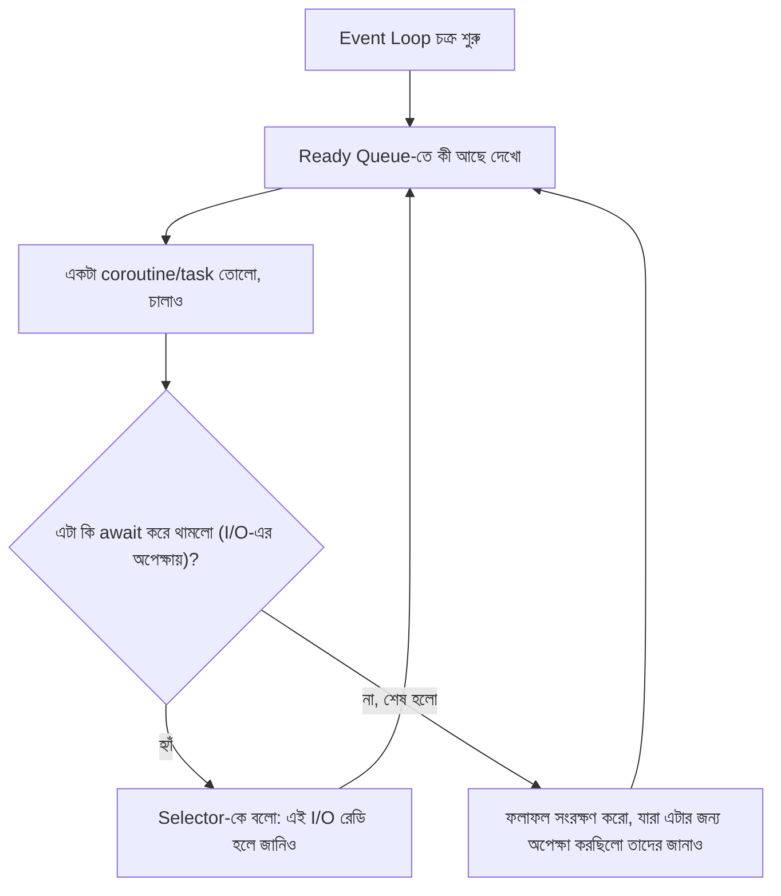
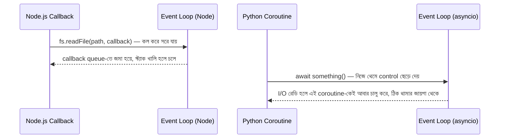

# ০৩. Event Loop and Callback — How They Are Related?

আগের দুই লেসনে আমরা coroutine আর task নিয়ে কথা বলেছি, বারবার "event loop" শব্দটা ব্যবহার করেছি যেন এটা একটা জাদুকরী ইঞ্জিন, যেটা ঠিক কাজটা ঠিক সময়ে চালিয়ে দেয়। এখন সময় হয়েছে সেই ইঞ্জিনের ভেতরে সত্যিকারের ঢুকে দেখার।

এটা বোঝার জন্য একটা analogy ব্যবহার করি — একটা কল সেন্টার কল্পনা করো, যেখানে একজনমাত্র অপারেটর কাজ করছে। অপারেটরের সামনে একটা ডেস্ক আছে (যেখানে সে একটামাত্র কল ধরে কথা বলতে পারে), আর তার পাশে একটা নোটবুক আছে, যেখানে লেখা থাকে — "অমুক কাস্টমারকে ফিরতি কল দিতে হবে, যখন তার রিপোর্ট রেডি হবে।"

## Python-এ ভেতরের অংশগুলো

Python-এর `asyncio` event loop-এর ভেতরে কয়েকটা জিনিস মিলে কাজ করে।

**Coroutine এবং Task** — এই মুহূর্তে যা "চলছে" বা "চলার অপেক্ষায় আছে", এটাই আগের লেসনে আমরা দেখেছি।

**Selector (বা epoll/kqueue, অপারেটিং সিস্টেম অনুযায়ী)** — এটা হলো সেই অংশ, যেটা নেটওয়ার্ক সকেট বা ফাইল ডেস্ক্রিপ্টরের দিকে তাকিয়ে থাকে, "কোনটা রেডি হলো ডেটা পড়ার/লেখার জন্য" — অনেকটা Node.js-এর ভেতরে থাকা libuv-এর মতোই একটা লো-লেভেল যন্ত্রাংশ, যেটা অপারেটিং সিস্টেমের সাথে সরাসরি কথা বলে।

**Ready Queue** — যে coroutine বা callback-গুলো এখন চালানোর জন্য প্রস্তুত, তাদের একটা তালিকা।

**Event Loop নিজে** — এটাই সেই অপারেটর। তার কাজ একটাই বারবার চক্রাকারে চলতে থাকা (এটাই "loop" নামের কারণ): ready queue থেকে একটা কাজ তোলা, সেটাকে চালানো যতক্ষণ না সে কোনো `await`-এ থামে (I/O-এর অপেক্ষায়), তারপর পরের কাজে যাওয়া।



## হাতেনাতে একটা উদাহরণ

```python
import asyncio

async def fetch_data(name: str, delay: float):
    print(f"{name}: শুরু হলো")
    await asyncio.sleep(delay)
    print(f"{name}: শেষ হলো")
    return f"{name}-এর ডেটা"

async def main():
    print("main শুরু")
    results = await asyncio.gather(
        fetch_data("A", 2),
        fetch_data("B", 1),
    )
    print("সব শেষ:", results)

asyncio.run(main())
```

আউটপুট আসবে:

```
main শুরু
A: শুরু হলো
B: শুরু হলো
B: শেষ হলো
A: শেষ হলো
সব শেষ: ['A-এর ডেটা', 'B-এর ডেটা']
```

লক্ষ্য করো — `A` আগে শুরু হয়েছে কিন্তু `B` আগে শেষ হয়েছে, কারণ `B`-এর delay কম (১ সেকেন্ড)। যখন `fetch_data("A", 2)` `await asyncio.sleep(2)`-এ পৌঁছে থামে, event loop তখনই control নিয়ে `fetch_data("B", 1)`-কে চালানোর সুযোগ দেয়। এই "একজন থামলে, অন্যকে সুযোগ দেওয়া" আচরণটাই event loop-এর মূল কাজ।

## একটা গুরুত্বপূর্ণ নিয়ম — `await` না দিলে কেউ "সুযোগ" পায় না

এখানে একটা সূক্ষ্ম কিন্তু অত্যন্ত গুরুত্বপূর্ণ পয়েন্ট আছে, যেটা Node.js-এর event loop থেকে Python-এর event loop-কে আলাদা করে দেয়। Node.js-এ callback-ভিত্তিক I/O (যেমন `fs.readFile`) নিজে থেকেই "নিচের স্তরে" (libuv thread pool-এ) চলে যায়, মূল কোড কিছু না করলেও। কিন্তু Python-এ event loop-এর কন্ট্রোল বদলানোর **একমাত্র রাস্তা** হলো `await` — যতক্ষণ একটা coroutine-এর ভেতরে কোনো `await` পয়েন্টে না পৌঁছাচ্ছে, ততক্ষণ event loop অন্য কাউকে সুযোগ দিতে পারবে না, ঠিক যেভাবে একটা সিঙ্ক্রোনাস ফাংশন কল স্ট্যাকে বসে থাকলে কেউ তাকে টেনে বের করতে পারে না।

এটার একটা বাস্তব ফলাফল — যদি তুমি একটা `async def` ফাংশনের ভেতরে একটা লম্বা, CPU-নির্ভর লুপ চালাও (কোনো `await` ছাড়া), সেই পুরো সময়টা event loop সম্পূর্ণ ব্লক হয়ে থাকবে, ঠিক যেভাবে Node.js-এ একটা ভারী synchronous লুপ পুরো সার্ভারকে আটকে দেয়:

```python
async def bad_endpoint():
    total = 0
    for i in range(100_000_000):  # কোনো await নেই এখানে
        total += i
    return total
```

এই ফাংশনটা `async def` হলেও, চলাকালীন এটা event loop-কে একটুও "শ্বাস" নিতে দেয় না — অন্য যত request-ই আসুক, সবাইকে অপেক্ষা করতে হবে এই লুপ শেষ হওয়া পর্যন্ত। এই ধারণাটা মনে রাখা জরুরি, কারণ এটাই পরের লেসনগুলোতে আমরা যে "async মানেই দ্রুত" — এই সরলীকৃত ভুল ধারণাটা ভাঙার ভিত্তি তৈরি করবে। **async মানে দ্রুত নয়, async মানে অপেক্ষার সময়টা অন্য কাজে লাগানোর সুযোগ — যদি সত্যিই কোনো `await`-যোগ্য অপেক্ষা থাকে।**

## Node.js-এর তুলনা

Node.js-এর event loop-এর একটা পরিচিত ছবি আছে — call stack, Node API, callback queue। Python-এর মডেলটা একই দর্শনে চলে, কিন্তু গঠনটা একটু আলাদা: Python-এ "callback queue" আর "Node API"-এর সমতুল্য কাজ করে selector আর নিচের `ready`/`scheduled` কাঠামো, আর `await`-এর মাধ্যমে explicit ভাবে control ছাড়া হয়, callback পাঠানোর বদলে। ফলে Node.js-এ পুরনো ধারার callback (`fs.readFile(path, callback)`) সরাসরি event loop-এর কাছে "কাজ শেষে ডাকো" বলে দিতে পারে, নিজে থেকেই — সেই ফাংশনটা কখনো `async`/`await` ব্যবহার না করলেও চলে। Python-এ কিন্তু asyncio ইকোসিস্টেমের সবকিছু `async def`/`await`-এর ভাষায় লেখা লাগে, নাহলে সেই কাজটা "asyncio-aware" হয় না, ঐ কাজটা এই cooperative scheduling-এ অংশগ্রহণই করতে পারে না।



এখন আমাদের কাছে event loop-এর একটা পরিষ্কার মানসিক ছবি আছে — একজন অপারেটর, যে `await`-এর মাধ্যমেই বুঝতে পারে কখন কাকে সুযোগ দিতে হবে। কিন্তু এই সম্পর্কটার আরেকটা গুরুত্বপূর্ণ স্তর বাকি আছে — **Future** নামের একটা জিনিস, যেটা আসলে coroutine আর event loop-এর মধ্যেকার "চুক্তিপত্র"। পরের লেসনে আমরা ঠিক সেই সম্পর্কটাই খুলে দেখবো।
