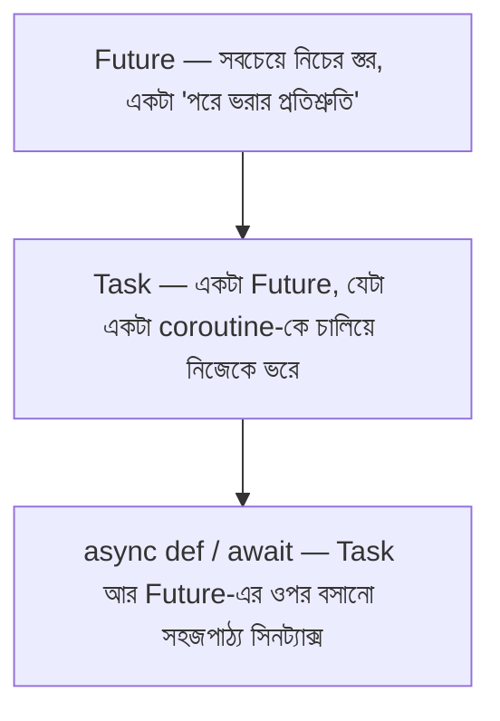

# ০৪. Event Loop, Futures, and Async/Await — How They Are Related?

গত লেসনে আমরা দেখেছি event loop কীভাবে coroutine-এর মধ্যে পালাক্রমে সুযোগ দেয়, `await`-এর মাধ্যমে। কিন্তু একটা প্রশ্ন এখনো অনুত্তরিত — যখন একটা coroutine `await asyncio.sleep(2)`-এ থামে, তখন ঠিক কোন জিনিসটা "মনে রাখে" যে ২ সেকেন্ড পরে এই coroutine-টাকেই ফিরে ডাকতে হবে, আর তার ফলাফল কোথায় জমা হয়? উত্তরটা হলো **Future**।

## Future — একটা "খালি বাক্স, যেটা পরে ভরবে"

একটা **Future**-কে ভাবতে পারো একটা খালি বাক্সের মতো, যেটা এই মুহূর্তে ফাঁকা, কিন্তু কেউ একজন প্রতিশ্রুতি দিয়েছে ভবিষ্যতে এই বাক্সে একটা মান (বা একটা exception) বসিয়ে দেবে। `asyncio`-র সবচেয়ে নিচের স্তরের বিল্ডিং ব্লক আসলে Future, coroutine না — event loop আসলে Future-এর সাথে কাজ করে, আর coroutine/`async def`/`await` হলো তার ওপরে বসানো একটা অনেক বেশি সহজপাঠ্য স্তর।

```python
import asyncio

async def show_future_state():
    loop = asyncio.get_running_loop()
    future = loop.create_future()

    print("Future তৈরি হলো, এখনো খালি:", future.done())

    async def resolve_later():
        await asyncio.sleep(1)
        future.set_result("এই মান বাক্সে বসানো হলো")

    asyncio.create_task(resolve_later())

    result = await future  # ফাঁকা বাক্সটা ভরা না হওয়া পর্যন্ত থেমে থাকা
    print("Future-এর মান:", result)

asyncio.run(show_future_state())
```

এখানে `await future` লাইনটা বলছে — "এই বাক্স ভরা না হওয়া পর্যন্ত থামো, কিন্তু বাকি event loop-কে ব্লক করো না।" `future.set_result(...)` কল হওয়ার পরই event loop জানে যে যে coroutine এই future-এর জন্য অপেক্ষা করছিলো, তাকে ফিরে জাগাতে হবে।

**একটা গুরুত্বপূর্ণ সম্পর্ক** — `Task` (আগের লেসনে দেখা `asyncio.create_task()`-এর ফলাফল) আসলে `Future`-এরই একটা উপশ্রেণী (subclass)। একটা `Task` একটা coroutine-কে "মুড়িয়ে" রাখে, আর সেই coroutine শেষ হলে Task নিজেই তার ফলাফল দিয়ে নিজের Future-অংশটা ভরে ফেলে। তাই যখন তুমি `await task` লেখো, ভেতরে ভেতরে তুমি আসলে একটা Future-এর জন্যই অপেক্ষা করছো।



## Node.js-এর Promise-এর সাথে তুলনা

এখানেই সবচেয়ে গুরুত্বপূর্ণ তুলনাটা আসে — Python-এর **Future** আর JavaScript-এর **Promise** ধারণাগতভাবে প্রায় একই জিনিস। দুটোই একটা "এখনো নেই, কিন্তু ভবিষ্যতে থাকবে এমন মান"-এর প্রতিনিধিত্ব করে, দুটোই তিনটা অবস্থায় থাকতে পারে — pending (অপেক্ষায়), resolved/fulfilled (মান বসানো হয়ে গেছে), অথবা rejected/exception (ব্যর্থ)।

```javascript
// JavaScript Promise
const promise = new Promise((resolve, reject) => {
  setTimeout(() => resolve("মান বসানো হলো"), 1000);
});

promise.then((value) => console.log(value));
```

```python
# Python Future — কম প্রচলিত সরাসরি ব্যবহারে, কিন্তু ধারণাগতভাবে সমতুল্য
loop = asyncio.get_running_loop()
future = loop.create_future()
loop.call_later(1, future.set_result, "মান বসানো হলো")
await future
```

পার্থক্যটা হলো — বাস্তব Python কোডে খুব কমই সরাসরি `Future` হাতে বানানো হয়; এটা মূলত asyncio-র ভেতরের ইঞ্জিন, যেটার ওপর `Task`, `asyncio.sleep`, `asyncio.gather` — সবকিছু বসানো। বাস্তব কোডে আমরা প্রায় সবসময় `async def`/`await`-এর ভাষাতেই কাজ করি, ঠিক যেভাবে JavaScript-এও আধুনিক কোড খুব কমই সরাসরি `new Promise(...)` লেখে, বরং `async`/`await` দিয়ে কাজ চালায়, Promise থাকে ভেতরে-ভেতরে।

## Microtask Queue-এর সমতুল্য কি Python-এ আছে?

JavaScript-এর জগতে একটা গুরুত্বপূর্ণ ধারণা আছে — **microtask queue** (Promise-এর `.then()`-এর জন্য) বনাম **macrotask queue** (`setTimeout`-এর জন্য), যেখানে microtask সবসময় আগে চলে। Python-এর asyncio-তে এই ধরনের দুটো আলাদা queue-এর ধারণা এতটা স্পষ্টভাবে আলাদা করা নেই — asyncio-র মূলত একটাই ready queue আছে, যেখানে সব রেডি callback/task ঢোকে, আর event loop প্রতিটা "চক্রে" (iteration) সেই মুহূর্তে যা রেডি আছে সব চালায়, তারপর selector-এর কাছে গিয়ে দেখে নতুন কোনো I/O রেডি হলো কিনা।

তবে একটা কাছাকাছি ধারণা আছে — `loop.call_soon()` (এই চক্রেই চালানোর জন্য শিডিউল করা, JS-এর microtask-এর মতোই "দ্রুত") বনাম `loop.call_later()` (নির্দিষ্ট সময় পরে চালানোর জন্য, JS-এর `setTimeout`-এর মতো)। বাস্তব FastAPI কোডে এই লো-লেভেল ফাংশনগুলো সরাসরি লিখতে হয় না, কিন্তু তাদের অস্তিত্ব জানা থাকা ভালো — কারণ ভবিষ্যতে যদি তুমি asyncio-নির্ভর একটা লাইব্রেরির সোর্স কোড পড়তে যাও, এই নামগুলো চেনা থাকলে ভয় লাগবে না।

## একটা কর্নার কেস — দুটো coroutine একই ভ্যারিয়েবল বদলাতে চাইলে কী হয় (race condition)

এখানে একটা প্রশ্ন আসা উচিত, যেটা প্রোডাকশনে বাস্তব বাগ তৈরি করে। GIL-এর কারণে Python-এ থ্রেড-লেভেল race condition কম দেখা যায়, কিন্তু **asyncio-লেভেলে race condition পুরোপুরি সম্ভব**, কারণ দুটো coroutine একই সম্পদ (যেমন একটা in-memory dict, একটা কাউন্টার) নিয়ে কাজ করতে পারে, আর তাদের মধ্যে `await` পয়েন্টে event loop সুইচ করতে পারে ঠিক ভুল সময়ে।

```python
balance = 100

async def withdraw(amount):
    global balance
    if balance >= amount:
        await asyncio.sleep(0.01)  # কল্পনা করো, এখানে একটা DB কল হচ্ছে
        balance -= amount
        print(f"{amount} টাকা তোলা হলো, বাকি আছে {balance}")
    else:
        print("পর্যাপ্ত ব্যালেন্স নেই")

async def main():
    await asyncio.gather(withdraw(80), withdraw(80))

asyncio.run(main())
```

এখানে `balance = 100` থাকা অবস্থায় দুটো coroutine একই সাথে `withdraw(80)` চালালে, দুটোই `if balance >= amount` চেক পাস করে যায় (কারণ কেউ এখনো balance বদলায়নি), তারপর `await asyncio.sleep(0.01)`-এ থামে — আর এই থামার সুযোগেই event loop অন্য coroutine-কে চালায়, যেটাও একই চেক পাস করে ফেলে। ফলাফলে দুজনেই টাকা তুলে নেয়, আর `balance` হয়ে যায় `-60` — বাস্তবে যেটা কখনোই হওয়ার কথা ছিলো না। এটাই **race condition**, আর এটা এমন এক ধরনের বাগ যা ডেভেলপমেন্টে (কম লোড, একটামাত্র রিকোয়েস্ট টেস্ট করার সময়) কখনোই ধরা পড়ে না, কিন্তু প্রোডাকশনে হাই-ট্র্যাফিকের সময় আচমকা আবির্ভূত হয়ে ডেটা করাপ্ট করে দেয়।

সমাধান হিসেবে asyncio-তে `asyncio.Lock` ব্যবহার করা হয়, যেটা নিশ্চিত করে একটা critical section-এ একটা সময়ে একটামাত্র coroutine ঢুকতে পারবে:

```python
lock = asyncio.Lock()

async def withdraw(amount):
    global balance
    async with lock:
        if balance >= amount:
            await asyncio.sleep(0.01)
            balance -= amount
            print(f"{amount} টাকা তোলা হলো, বাকি আছে {balance}")
        else:
            print("পর্যাপ্ত ব্যালেন্স নেই")
```

এই ধরনের race condition বাস্তব প্রজেক্টে সাধারণত ব্যালেন্স, ইনভেন্টরি কাউন্ট, বা কোনো shared in-memory state আপডেট করার সময় দেখা যায় — বাস্তব প্রোডাকশন সিস্টেমে এই সমস্যার সবচেয়ে ভালো সমাধান আসলে ডেটাবেজের নিজস্ব transaction/locking ব্যবস্থা ব্যবহার করা (যেটা Module 15-এর দিকে আমরা ডেটাবেজ নিয়ে কাজ করার সময় বিস্তারিত দেখবো), কিন্তু in-memory অবস্থায় `asyncio.Lock`-এর ধারণাটা জানা থাকা জরুরি।

Event loop, Future, আর race condition-এর এই তত্ত্ব এখন যথেষ্ট পরিষ্কার। পরের লেসনে আমরা এটাকে একটা বাস্তব FastAPI প্রজেক্টে প্রয়োগ করে দেখবো — আর সেখানেই আমরা দেখবো এই মডিউলের সবচেয়ে গুরুত্বপূর্ণ, সবচেয়ে বেশি প্রোডাকশনে বাগ তৈরি করা ভুলটা — sync ফাংশন async endpoint-এর ভেতরে ভুলবশত ডেকে ফেলা।
