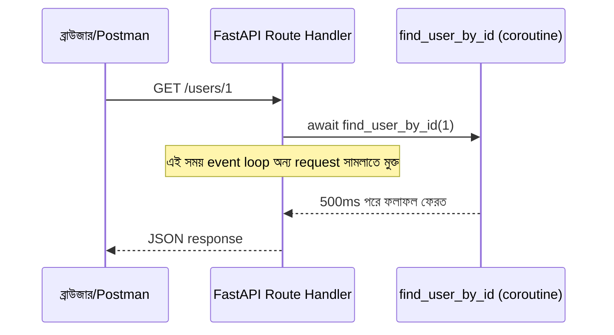
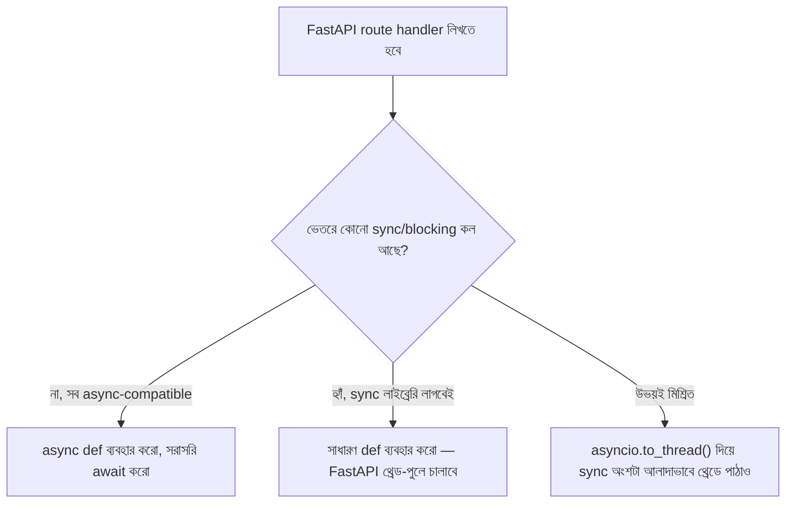

# ০৫. Using Async/Await Inside a FastAPI Project

তত্ত্ব যথেষ্ট হয়েছে — এবার সময় হয়েছে async/await-কে একটা বাস্তব FastAPI প্রজেক্টে ব্যবহার করে দেখার, ঠিক যেভাবে Module 4-এ আমরা প্রথমবার FastAPI সেটআপ করেছিলাম, একটা GET route বানিয়েছিলাম।

ধরো আমাদের একটা রুট দরকার, যেটা একটা ইউজারের প্রোফাইল ডেটাবেজ (এই মুহূর্তে আমরা এখনো আসল ডেটাবেজ শিখিনি, তাই একটা ফাংশন দিয়ে সেটা নকল করছি, যেটা বাস্তব ডেটাবেজের মতোই সময় নেয়) থেকে এনে ফেরত পাঠাবে।

```python
# db.py — একটা নকল ডেটাবেজ ফাংশন, বাস্তব ডেটাবেজ কলের মতো আচরণ করার জন্য
import asyncio

users = {
    1: {"id": 1, "name": "রহিম", "email": "rahim@example.com"},
    2: {"id": 2, "name": "করিম", "email": "karim@example.com"},
}

async def find_user_by_id(user_id: int):
    await asyncio.sleep(0.5)  # ৫০০ মিলিসেকেন্ড দেরি, যেন আসল ডেটাবেজ কলের মতো লাগে
    user = users.get(user_id)
    if user is None:
        raise ValueError("এই আইডির কোনো ইউজার পাওয়া যায়নি")
    return user
```

এখন এটাকে আমাদের FastAPI অ্যাপে ব্যবহার করি:

```python
# main.py
from fastapi import FastAPI, HTTPException
from db import find_user_by_id

app = FastAPI()

@app.get("/users/{user_id}")
async def get_user(user_id: int):
    try:
        user = await find_user_by_id(user_id)
        return user
    except ValueError as error:
        raise HTTPException(status_code=404, detail=str(error))
```

`async def get_user(...)` — এটা ছাড়া এই ফাংশনের ভেতরে `await` ব্যবহারই করা যেতো না। `try/except` ব্লকটা `find_user_by_id`-এর exception ধরে একটা পরিষ্কার HTTP 404 জবাবে রূপান্তর করছে — Node.js/Express-এর `try/catch` + `response.status(404).json(...)`-এর সাথে কাঠামোগতভাবে হুবহু মিল।



## Async DB কল — কেন `async def` আর sync ড্রাইভার একসাথে চলে না

বাস্তব প্রজেক্টে ডেটাবেজ কল প্রায়শই একটা লাইব্রেরি দিয়ে করা হয়, আর এখানে একটা গুরুত্বপূর্ণ সিদ্ধান্ত নিতে হয় — সেই লাইব্রেরিটা **async-native** কিনা। যেমন PostgreSQL-এর জন্য `asyncpg` বা `databases` লাইব্রেরি async-এ লেখা, `await`-যোগ্য মেথড দেয়। কিন্তু অনেক পুরনো, পরিচিত লাইব্রেরি (যেমন `psycopg2`, SQLAlchemy-র সাধারণ sync মোড) **sync** — মানে তাদের কোনো মেথড `await` করা যায় না, আর সরাসরি ডেকে ফেললে সেই কলটা event loop-কে ব্লক করে দেয়।

```python
# ভুল — sync DB ড্রাইভার সরাসরি async def-এর ভেতরে
import psycopg2

@app.get("/orders/{order_id}")
async def get_order(order_id: int):
    conn = psycopg2.connect("dbname=shop")
    cursor = conn.cursor()
    cursor.execute("SELECT * FROM orders WHERE id = %s", (order_id,))  # ব্লকিং কল!
    return cursor.fetchone()
```

এই কোডটা "কাজ করে" বলে মনে হবে — একটামাত্র রিকোয়েস্ট পাঠালে জবাব ঠিকঠাক আসবে। কিন্তু `cursor.execute(...)` লাইনটা যতক্ষণ ডেটাবেজের জবাবের জন্য অপেক্ষা করে, ততক্ষণ পুরো event loop আটকে থাকে — অন্য কোনো ইউজারের কোনো request, এমনকি একটা সাধারণ `/health` চেক-ও, সেই মুহূর্তে সাড়া দিতে পারবে না। ডেভেলপমেন্টে একজন ডেভেলপার একা টেস্ট করলে এই সমস্যা কখনো চোখে পড়ে না, কিন্তু প্রোডাকশনে যখন একসাথে ৫০ জন ইউজার আছে, তাদের মধ্যে একজনের ভারী কোয়েরি বাকি ৪৯ জনকেই সারিতে দাঁড় করিয়ে দেয় — এটাই এই মডিউলের প্রথম লেসনে উল্লেখ করা "blocking call inside an async function" সমস্যার সবচেয়ে সাধারণ, সবচেয়ে বিপজ্জনক বাস্তব রূপ।

**সঠিক উপায় দুটো:**

১. সত্যিকারের async-native ড্রাইভার ব্যবহার করা (যেমন `asyncpg`), যাতে `await cursor.execute(...)` লেখা যায়, আর সেই অপেক্ষার সময় event loop মুক্ত থাকে।

২. অথবা, sync লাইব্রেরিটা যদি বদলানো সম্ভব না হয়, FastAPI-কে বলে দেওয়া যে এই endpoint-টা `async def` না, সাধারণ `def` হিসেবে লিখতে — তখন FastAPI নিজে থেকেই এটাকে একটা আলাদা থ্রেড-পুলে চালায়, event loop-কে ব্লক না করে:

```python
# গ্রহণযোগ্য বিকল্প — sync def, FastAPI নিজেই থ্রেড-পুলে চালাবে
@app.get("/orders/{order_id}")
def get_order(order_id: int):
    conn = psycopg2.connect("dbname=shop")
    cursor = conn.cursor()
    cursor.execute("SELECT * FROM orders WHERE id = %s", (order_id,))
    return cursor.fetchone()
```



**তৃতীয় বিকল্প** — যদি একটা `async def` ফাংশনের ভেতরেই মাঝেমধ্যে একটা sync, ব্লকিং কল করতে হয় (পুরো endpoint sync করা সম্ভব না, কারণ তার অন্য অংশে async কলও আছে), তাহলে `asyncio.to_thread()` ব্যবহার করে সেই একটা অংশকে আলাদা থ্রেডে পাঠানো যায়:

```python
@app.get("/report")
async def generate_report():
    data = await fetch_data_async()          # async কল, সরাসরি await
    summary = await asyncio.to_thread(heavy_sync_computation, data)  # sync কল, থ্রেডে পাঠানো
    return summary
```

## Async httpx কল — Module 4-এর ধারাবাহিকতা

Module 4-এ আমরা `httpx.AsyncClient()` দিয়ে আরেকটা backend-কে কল করেছিলাম। এখানে সেই একই নিয়ম প্রযোজ্য — `httpx` async-native, তাই `async def` endpoint-এর ভেতরে নিরাপদে ব্যবহার করা যায়, কিন্তু sync `requests` লাইব্রেরি ব্যবহার করলে সেই একই ব্লকিং সমস্যা তৈরি হবে:

```python
# ভুল — sync requests, async def-এর ভেতরে
import requests

@app.get("/weather-report")
async def weather_report():
    response = requests.get("https://api.example.com/weather?city=Dhaka")  # ব্লকিং!
    return response.json()
```

```python
# সঠিক — async httpx
import httpx

@app.get("/weather-report")
async def weather_report():
    async with httpx.AsyncClient() as client:
        response = await client.get("https://api.example.com/weather?city=Dhaka")
        return response.json()
```

## একটা বাস্তব প্রোডাকশন কর্নার কেস — External API কল যদি টাইমআউট হয়

`await client.get(url)` কলটা যদি কোনো কারণে সাড়া না দেয় (নেটওয়ার্ক সমস্যা, বা other server ধীর হয়ে গেছে), ডিফল্টভাবে `httpx` অনির্দিষ্টকাল অপেক্ষা করবে না — কিন্তু যদি তুমি স্পষ্টভাবে timeout সেট না করো, ডিফল্ট timeout (৫ সেকেন্ড) কিছু কিছু ক্ষেত্রে যথেষ্ট না হতে পারে, বা উল্টো — কিছু ধীর কিন্তু বৈধ রিকোয়েস্টের জন্য খুব কম হতে পারে। এখানে একটা বাস্তব বিপদ হলো, যদি একটা downstream সার্ভিস ধীর হয়ে যায়, আর তোমার endpoint সেই কলের জন্য ৩০ সেকেন্ড পর্যন্ত অপেক্ষা করে (কোনো explicit timeout না থাকলে), তাহলে সেই একটা request-এর জন্য একটা worker/connection ৩০ সেকেন্ড ধরে ব্যস্ত থাকে — একসাথে অনেক ইউজার এই একই downstream সার্ভিস কল করলে, পুরো সার্ভারের কানেকশন পুল শেষ হয়ে যেতে পারে, নতুন কোনো রিকোয়েস্টই গ্রহণ করা যাবে না। এটাকে বলা হয় **cascading failure** — একটা ধীর সার্ভিস পুরো সিস্টেমকে টেনে নিচে নামিয়ে দেয়।

```python
async with httpx.AsyncClient(timeout=3.0) as client:
    try:
        response = await client.get("https://api.example.com/weather?city=Dhaka")
        return response.json()
    except httpx.TimeoutException:
        raise HTTPException(status_code=504, detail="Weather service সাড়া দিচ্ছে না")
```

স্পষ্ট timeout সেট করা আর সেই timeout-এর exception ধরে একটা সঠিক HTTP status (৫০৪ Gateway Timeout) ফেরত দেওয়া — এই দুটো একসাথে করাই প্রোডাকশন-রেডি কোডের একটা গুরুত্বপূর্ণ অভ্যাস, যেটা শেখার পর্যায়ে অনেকেই এড়িয়ে যায় কারণ ডেভেলপমেন্টে সবকিছু "লোকাল" থাকে, দ্রুত সাড়া দেয়, তাই টাইমআউট নিয়ে ভাবার প্রয়োজনটাই বোঝা যায় না।

## Node.js/Express-এর তুলনা

```js
app.get('/users/:id', async (req, res) => {
  try {
    const userId = Number(req.params.id);
    const user = await findUserById(userId);
    res.json(user);
  } catch (error) {
    res.status(404).json({ message: error.message });
  }
});
```

কাঠামোটা প্রায় হুবহু একই — `async` ফাংশন, `await`, `try/catch`। কিন্তু Node.js-এ "sync ব্লকিং লাইব্রেরি ভুলবশত async ফাংশনের ভেতরে ব্যবহার করা" সমস্যাটা তুলনামূলকভাবে কম দেখা যায়, কারণ Node.js ইকোসিস্টেমের বেশিরভাগ জনপ্রিয় লাইব্রেরি (DB ড্রাইভার, HTTP ক্লায়েন্ট) শুরু থেকেই async/Promise-ভিত্তিক ডিজাইন করা। Python-এর ইকোসিস্টেমে অনেক পুরনো, পরিণত লাইব্রেরি এখনো sync-first, কারণ asyncio Python-এ Node.js-এর তুলনায় পরে এসেছে — এই কারণেই "এই লাইব্রেরিটা কি async-compatible?" প্রশ্নটা Python ডেভেলপারদের জন্য প্রতিটা নতুন লাইব্রেরি বেছে নেওয়ার সময় সবসময় জিজ্ঞেস করা উচিত, Node.js ডেভেলপারদের চেয়ে বেশি সচেতনভাবে।

এখন পর্যন্ত আমরা async/await-এর ভেতরের আর বাইরের দুনিয়া দুটোই দেখে ফেলেছি, আর সবচেয়ে বিপজ্জনক প্রোডাকশন ভুলটাও চিনে নিয়েছি। এই মডিউলের বাকি অংশে আমরা একটু ভিন্ন দিকে যাবো — কোড লেখা শেষ হওয়ার পর সেটা কীভাবে নিরাপদে সংরক্ষণ আর শেয়ার করা যায়, অর্থাৎ Git-এর কার্যপ্রণালী, আর কীভাবে একটা প্রজেক্টকে একাধিক ফাইলে সুন্দরভাবে ভাগ করা যায়। চলো প্রথমে Git দিয়ে শুরু করি।
