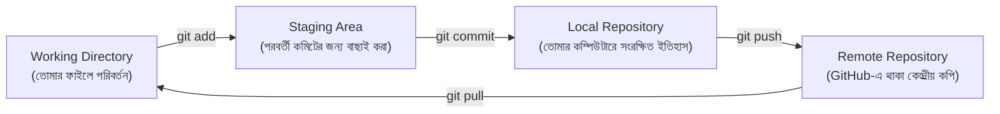

# ০৬. How Git Add, Commit and Push Pull Works Together?

Module 1 লেসন ৮-এ ("Installing Git and introduction to GitHub") আমরা Git ইনস্টল করেছিলাম আর GitHub কী জিনিস তার সাথে সংক্ষেপে পরিচয় হয়েছিলো। এতদিন ধরে আমরা যত কোড লিখেছি — Module 2-এর `http.server` সার্ভার, Module 4-এর FastAPI অ্যাপ, এই মডিউলের asyncio উদাহরণগুলো — এই সবকিছু নিরাপদে সংরক্ষণ করার, আর ভবিষ্যতে দলের অন্যদের সাথে শেয়ার করার সময় এসেছে। এই লেসনে আমরা দেখবো Git-এর সেই চারটা কমান্ড — `add`, `commit`, `push`, `pull` — আসলে কীভাবে একসাথে কাজ করে। এই ওয়ার্কফ্লো ভাষা-নিরপেক্ষ — Python, JavaScript, Go, যেকোনো ভাষার প্রজেক্টেই একইভাবে কাজ করে, কারণ Git কোডের ভাষা বোঝে না, শুধু ফাইলের পরিবর্তন বোঝে।

প্রথমেই একটা ভুল ধারণা ভাঙা দরকার — অনেকে ভাবে Git মানেই GitHub, কিন্তু আসলে এই দুটো আলাদা জিনিস। **Git** হলো তোমার নিজের কম্পিউটারে চলা একটা সংস্করণ-নিয়ন্ত্রণ (version control) সিস্টেম — এটা ইন্টারনেট ছাড়াই কাজ করে। **GitHub** হলো একটা ওয়েবসাইট, যেখানে তুমি তোমার Git প্রজেক্টের একটা কপি অনলাইনে রাখতে পারো, যাতে অন্যরাও অ্যাক্সেস করতে পারে। Git হলো ইঞ্জিন, GitHub হলো সেই ইঞ্জিনের জন্য একটা গ্যারেজ।

এই পুরো ব্যবস্থাটা বুঝতে একটা analogy কাজে লাগবে — চিঠি লেখার একটা পুরনো পদ্ধতি কল্পনা করো। তুমি প্রথমে একটা খসড়া (draft) লেখো টেবিলে বসে, তারপর সেটা যাচাই করে খামে ভরো (envelope-এ সিল করা), তারপর সেই খামটা পোস্ট অফিসে জমা দাও, আর পোস্ট অফিস থেকে সেটা দূরের ঠিকানায় পৌঁছে যায়। Git-এর কাজের ধাপগুলো ঠিক এভাবেই সাজানো।



চলো প্রতিটা ধাপ বাস্তব কমান্ড দিয়ে দেখি। ধরো আমরা `main.py`-তে নতুন একটা রুট যোগ করেছি।

**ধাপ ১ — Working Directory**: এই অবস্থায় ফাইলটা এখনো শুধু তোমার কম্পিউটারে বদলেছে, Git এখনো এই পরিবর্তন নিয়ে কিছু জানে না। এই মুহূর্তে যদি `git status` চালাও, Git দেখাবে ফাইলটা "modified" অবস্থায় আছে।

```bash
git status
```

**ধাপ ২ — Staging Area (git add)**: এখানে তুমি Git-কে বলছো, "এই নির্দিষ্ট পরিবর্তনগুলো পরবর্তী কমিটে অন্তর্ভুক্ত করো।" এটা অনেকটা চিঠিটা খামে ভরার মতো — এখনো পাঠানো হয়নি, কিন্তু পাঠানোর জন্য প্রস্তুত করা হয়েছে।

```bash
git add main.py
# অথবা সব পরিবর্তিত ফাইল একসাথে যোগ করতে
git add .
```

স্টেজিং এরিয়ার একটা বড় সুবিধা হলো নির্বাচনী স্বাধীনতা — ধরো তুমি একসাথে দুটো ফাইলে কাজ করেছো, কিন্তু এখন শুধু একটাকে কমিট করতে চাও, বাকিটা পরে। `git add` দিয়ে তুমি ঠিক করতে পারো কোনটা এখন যাবে, কোনটা পরে।

একটা Python প্রজেক্টে একটা বাস্তব সতর্কতা — `venv` ফোল্ডার (Module 4-এ যে virtual environment তৈরি করেছিলাম) কখনোই `git add`-এ যোগ করা উচিত না, কারণ এটা হাজার হাজার ফাইলের একটা বিশাল, প্রতিটা মেশিনে ভিন্ন হওয়া ফোল্ডার। এর বদলে একটা `.gitignore` ফাইলে লিখে রাখা হয়:

```
venv/
__pycache__/
*.pyc
.env
```

যাতে `git add .` চালালেও এই ফোল্ডার/ফাইলগুলো নিরবে উপেক্ষা হয়ে যায়। এই অভ্যাসটা এখনই গড়ে ফেলা ভালো, কারণ ভুলবশত `venv/` কমিট হয়ে গেলে GitHub রিপোজিটরির সাইজ অস্বাভাবিকভাবে বেড়ে যায়, আর পরে সেটা পরিষ্কার করা বিরক্তিকর, সময়সাপেক্ষ কাজ।

**ধাপ ৩ — Local Repository (git commit)**: এটা হলো "খামটা পোস্ট অফিসে জমা দেয়ার" ধাপ, কিন্তু এখনো দূরের ঠিকানায় পৌঁছায়নি — এটা এখনো তোমার নিজের কম্পিউটারেই একটা স্থায়ী ইতিহাস হিসেবে জমা হয়। প্রতিটা commit-এর সাথে একটা বার্তা (message) লেখা হয়, যেটা ভবিষ্যতে বোঝার সুবিধার জন্য বলে দেয় ঠিক কী পরিবর্তন হয়েছে।

```bash
git commit -m "add: user profile route with async/await"
```

এই কমান্ডের পর তোমার প্রজেক্টের একটা "স্ন্যাপশট" Git-এর ইতিহাসে যুক্ত হয়ে গেলো, যেটা তুমি চাইলে যেকোনো সময় ফিরে দেখতে পারবে, এমনকি প্রয়োজনে আগের অবস্থায় ফিরেও যেতে পারবে।

**ধাপ ৪ — Remote Repository (git push)**: এতক্ষণ যা হলো, সবই তোমার নিজের কম্পিউটারে সীমাবদ্ধ। `push` কমান্ড দিয়ে তুমি সেই commit history-টা GitHub-এ (বা অন্য কোনো remote সার্ভারে) পাঠিয়ে দাও, যাতে তোমার দলের অন্যরা সেটা দেখতে, ডাউনলোড করতে পারে।

```bash
git push origin main
```

এখানে `origin` হলো remote repository-র একটা ডাকনাম (সাধারণত GitHub-এর ঠিকানা বোঝায়), আর `main` হলো সেই branch-এর নাম যেখানে পাঠানো হচ্ছে।

**উল্টো দিক — git pull**: ধরো তোমার সহকর্মী GitHub-এ নতুন কিছু push করেছে। তোমার নিজের কম্পিউটারের কপিতে সেই পরিবর্তন আনতে হলে ব্যবহার করবে:

```bash
git pull origin main
```

`pull` আসলে দুটো কাজ একসাথে করে — প্রথমে remote থেকে নতুন পরিবর্তন নিয়ে আসে (`fetch`), তারপর সেটা তোমার নিজের কোডের সাথে মিলিয়ে দেয় (`merge`)। এই কারণেই দলগত কাজে সবসময় নতুন কিছু push করার আগে একবার `pull` করে নেয়া ভালো অভ্যাস — যাতে তোমার আর সহকর্মীর পরিবর্তন সংঘর্ষে (conflict) না জড়ায়।

**একটা বাস্তব কর্নার কেস** — ধরো তুমি আর তোমার সহকর্মী দুজনেই একই সময়ে `main.py`-এর একই লাইনে আলাদা পরিবর্তন করে, দুজনেই commit করে ফেলেছো, আর তুমি push করার আগে `pull` করলে। Git দুজনের পরিবর্তন নিজে মিলাতে না পারলে একটা **merge conflict** দেখাবে — ফাইলের ভেতরে `<<<<<<<`, `=======`, `>>>>>>>` চিহ্ন দিয়ে দুটো ভার্সন পাশাপাশি দেখিয়ে দেবে, আর তোমাকে হাতে বেছে নিতে হবে কোনটা রাখবে (বা দুটোই মিলিয়ে একটা তৃতীয় ভার্সন বানাতে হবে)। এই মুহূর্তে ভয় না পাওয়াটা জরুরি — merge conflict কোনো বিপর্যয় না, এটা Git-এর একটা স্বাভাবিক, প্রত্যাশিত অংশ, বিশেষ করে যখন একাধিক মানুষ একই ফাইলে কাজ করে। Git-এর আরও গভীর বিষয় — যেমন branch, merge conflict resolution, rebase — নিয়ে আমরা বিস্তারিত আলোচনা করবো Module 37-এ ("Git And Github Fundamentals")।

এই চারটা কমান্ড — `add`, `commit`, `push`, `pull` — মিলিয়ে তৈরি হয় দলগত কোডিংয়ের মেরুদণ্ড। প্রতিদিনের কাজের প্যাটার্নটা সাধারণত হয় এরকম — কোড লেখো, `git add` দিয়ে বাছাই করো, `git commit` দিয়ে স্থানীয়ভাবে সংরক্ষণ করো, তারপর `git push` দিয়ে সবার সাথে শেয়ার করো, আর কাজ শুরুর আগে `git pull` দিয়ে সবার শেষ পরিবর্তনগুলো নিয়ে নাও।

এখন যেহেতু আমরা জানি কীভাবে কোড নিরাপদে সংরক্ষণ আর শেয়ার করতে হয়, পরের লেসনে আমরা ফিরে যাবো কোড লেখার দুনিয়ায় — দেখবো একটা Python প্রজেক্ট যখন বড় হতে থাকে, তখন সেটাকে কীভাবে একাধিক ফাইলে সুন্দরভাবে ভাগ করা যায়, আর Python-এর import সিস্টেম কীভাবে কাজ করে, Node.js-এর `require`/`import`-এর তুলনায়।
