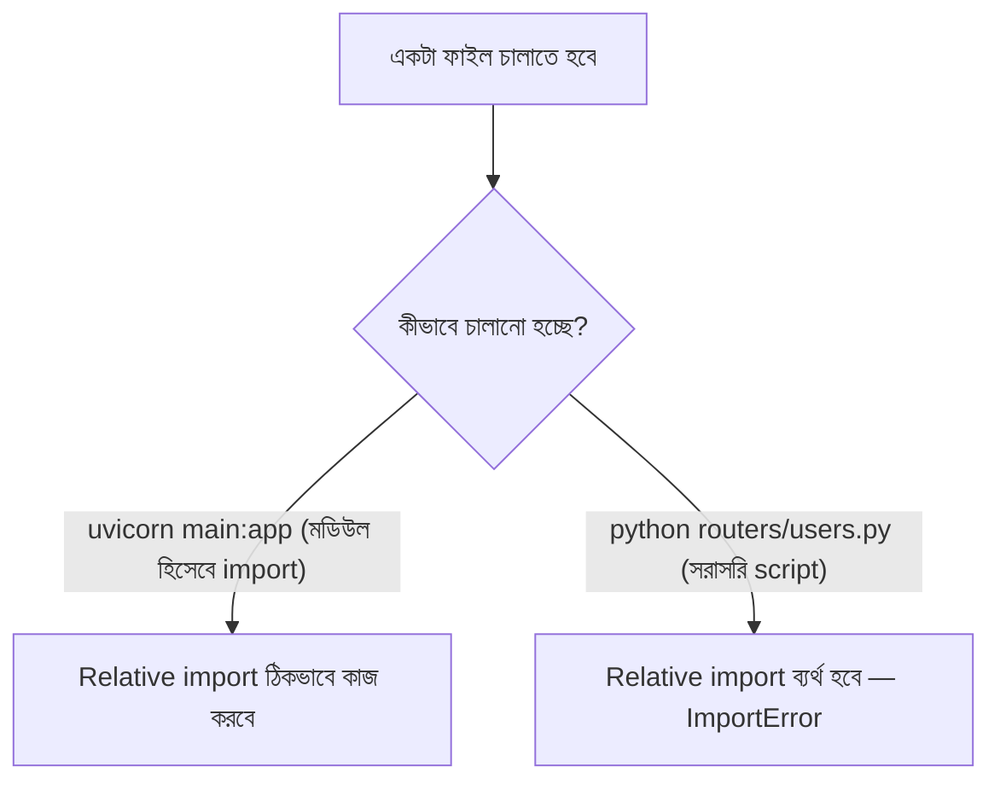

# ০৭. Working with Multiple Files in Python || Import System vs Node.js Require/Import

এখন পর্যন্ত আমাদের সব উদাহরণ প্রায় একটামাত্র ফাইলে (`main.py`) লেখা হয়েছে, সর্বোচ্চ আগের লেসনে আমরা `db.py` নামে একটা দ্বিতীয় ফাইল তৈরি করেছিলাম। বাস্তব প্রজেক্টে এই "একাধিক ফাইলে ভাগ করা" ব্যাপারটা এতটাই গুরুত্বপূর্ণ যে এখনই এর নিয়মগুলো ভালোভাবে বুঝে নেয়া দরকার, কারণ সামনে যখন আমরা Router আর বড় FastAPI প্রজেক্টের গঠন নিয়ে কাজ করবো, তখন এই ভিত্তিটাই কাজে লাগবে।

কেন একটামাত্র ফাইলে সব কোড লেখা যায় না? চিন্তা করো একটা বড় বাড়ি বানানোর সময় যদি সব কাজের যন্ত্রপাতি (হাতুড়ি, স্ক্রু, তার, পাইপ) একটামাত্র বড় বাক্সে জড়ো করে রাখা হয়, প্রতিবার একটা জিনিস দরকার হলে পুরো বাক্স হাতড়াতে হবে। তার বদলে যদি আলাদা আলাদা বাক্সে আলাদা জিনিস রাখা হয়, কাজ অনেক সহজ আর সুশৃঙ্খল হয়ে যায়। কোডেও ঠিক এই একই কারণে আমরা সম্পর্কিত কাজগুলোকে আলাদা আলাদা ফাইলে ভাগ করি — একে বলে **modular code**।

## Python-এর মডিউল সিস্টেম — একটাই পথ, কিন্তু কয়েকটা নিয়ম

Node.js-এ আমরা দুটো ভিন্ন সিস্টেম দেখি — পুরনো CommonJS (`require`/`module.exports`) আর আধুনিক ES Modules (`import`/`export`)। Python-এ এই ধরনের দুটো প্রতিদ্বন্দ্বী সিস্টেম নেই — একটামাত্র import সিস্টেম আছে, `import` কীওয়ার্ড দিয়ে, শুরু থেকেই ভাষার নিজস্ব অংশ। তবে জটিলতা তৈরি হয় প্যাকেজ, রিলেটিভ বনাম অ্যাবসোলিউট import নিয়ে।

ধরো একটা ফাইলে কিছু ইউটিলিটি ফাংশন রাখা আছে:

```python
# utils.py
def format_currency(amount: float) -> str:
    return f"৳{amount:.2f}"

def is_valid_email(email: str) -> bool:
    return "@" in email
```

অন্য একটা ফাইলে এটা আনতে হলে:

```python
# main.py
from utils import format_currency, is_valid_email

print(format_currency(150))       # ৳150.00
print(is_valid_email("test@example.com"))  # True
```

`from utils import ...` লাইনটা `utils.py` ফাইলটা খুঁজে বের করে, তার ভেতরের নাম-করা জিনিসগুলো নিয়ে আসে। লক্ষ্য করো, Node.js-এর `require("./utils")`-এর মতো `./` লিখতে হয় না, আর `.py` এক্সটেনশনও লেখা লাগে না — Python মডিউলের নাম দিয়েই খুঁজে নেয়, ফাইল সিস্টেম পাথ দিয়ে না।

## Package — একাধিক ফাইলের একটা ফোল্ডার

যখন একটা প্রজেক্ট বড় হয়, একটার বদলে একগুচ্ছ ফাইল একটা ফোল্ডারে রাখা হয়, যাকে বলে **package**। Python-এ একটা ফোল্ডারকে package হিসেবে চিনতে (পুরনো Python ভার্সনে) তার ভেতরে একটা `__init__.py` ফাইল থাকা লাগতো, এখন (Python 3.3+) এই ফাইলটা ছাড়াও একটা ফোল্ডার package হিসেবে কাজ করতে পারে (namespace package), কিন্তু বাস্তব FastAPI প্রজেক্টে `__init__.py` রাখাটা এখনো সাধারণ প্রথা, কারণ এটা স্পষ্টভাবে বলে দেয় "এই ফোল্ডারটা একটা Python package।"

```
myapp/
├── main.py
├── routers/
│   ├── __init__.py
│   └── users.py
└── services/
    ├── __init__.py
    └── db.py
```

```python
# routers/users.py
from fastapi import APIRouter
from services.db import find_user_by_id

router = APIRouter()

@router.get("/{user_id}")
async def get_user(user_id: int):
    return await find_user_by_id(user_id)
```

```python
# main.py
from fastapi import FastAPI
from routers.users import router as user_router

app = FastAPI()
app.include_router(user_router, prefix="/users")
```

## Absolute বনাম Relative Import — এখানেই আসল বিভ্রান্তি

উপরের উদাহরণে `from services.db import find_user_by_id` — এটা একটা **absolute import**, পুরো প্রজেক্ট রুট থেকে পথ লেখা হয়েছে। এর বিকল্প হলো **relative import**, যেখানে `.` (একই ফোল্ডার) বা `..` (এক লেভেল উপরে) দিয়ে পথ বোঝানো হয়:

```python
# routers/users.py-এর ভেতরে relative import
from ..services.db import find_user_by_id  # এক লেভেল উপরে গিয়ে services খুঁজছে
from .helpers import format_response         # একই ফোল্ডারের ভেতরে
```

Node.js-এর সাথে তুলনা করলে একটা গুরুত্বপূর্ণ পার্থক্য চোখে পড়ে — Node.js-এ `./utils`-এর `./` মানে "একই ফোল্ডার", এটা প্রায় সবসময়ই একইভাবে কাজ করে, ফাইলটা যেভাবেই চালানো হোক। কিন্তু **Python-এর relative import (`.`/`..`) তখনই কাজ করে যখন ফাইলটা একটা প্যাকেজের অংশ হিসেবে import হচ্ছে, সরাসরি script হিসেবে চালানো হচ্ছে না।** এটাই সবচেয়ে বেশি নতুন Python ডেভেলপারদের বিভ্রান্ত করা একটা এরর তৈরি করে:

```
ImportError: attempted relative import with no known parent package
```

এই এরর তখন আসে যখন কেউ `python routers/users.py` দিয়ে ফাইলটা সরাসরি চালানোর চেষ্টা করে, যেখানে সেই ফাইলের ভেতরে relative import (`from .helpers import ...`) লেখা আছে। Python জানে না এই ফাইলটা কোন প্যাকেজের "অংশ" — কারণ সরাসরি চালানো একটা script-কে Python কোনো প্যাকেজের সদস্য হিসেবে গণ্য করে না।



**সমাধান** — বাস্তব FastAPI প্রজেক্টে সবসময় প্রজেক্ট রুট থেকে অ্যাপটা চালানো হয় (`uvicorn main:app`), কোনো ফাইলে গিয়ে সরাসরি `python routers/users.py` চালানো হয় না। এই অভ্যাসটা মনে রাখলে relative import নিয়ে সমস্যা প্রায় কখনোই আসে না। তবুও, অনেক টিম বিভ্রান্তি এড়াতে সবসময় absolute import ব্যবহার করার নিয়ম বেছে নেয় (Google-এর Python স্টাইল গাইডও এটাই সুপারিশ করে) — এই কোর্সেও আমরা যেখানে সম্ভব absolute import-কেই ডিফল্ট রাখবো, কারণ এটা কোন ফাইল কোথা থেকে কী নিচ্ছে সেটা এক নজরে বোঝা সহজ করে, প্যাকেজের গভীরতা যত বাড়ুক না কেন।

## Python-এ `import` কি asynchronous হতে পারে?

Module 5-এর আগের লেসনগুলোতে আমরা asyncio নিয়ে অনেক কথা বলেছি, তাই একটা তুলনা এখানে করার লোভ সামলানো কঠিন — Node.js-এর ES Modules-এর `import()` ফাংশন-রূপ ব্যবহার করলে একটা Promise রিটার্ন করে (dynamic import), যেটা এই মডিউলে শেখা asynchronous ধারণার সাথে সরাসরি যুক্ত। Python-এর `import` স্টেটমেন্ট (উপরে লেখা `from x import y` ধরনের) সম্পূর্ণ **synchronous** — একটা ফাইল import হওয়ার সময় Python থামে, ফাইলটা পুরোপুরি পড়ে-চালিয়ে-ফেলে, তারপর পরের লাইনে যায়। Python-এও `importlib`-এর মাধ্যমে dynamic import সম্ভব, কিন্তু এটা সাধারণ প্রজেক্টে খুব কম ব্যবহার হয় — বাস্তবে Python-এর import সিস্টেমটাকে asyncio-র জগত থেকে সম্পূর্ণ আলাদা একটা জিনিস ধরে নেওয়াই ভালো, দুটো ভিন্ন সমস্যার সমাধান।

## Node.js-এর তুলনা, একনজরে

| বিষয় | Python | Node.js (CommonJS) | Node.js (ES Modules) |
|---|---|---|---|
| আমদানি কীওয়ার্ড | `import` | `require()` | `import` |
| এক্সপোর্ট | ফাইলের top-level নাম নিজেই এক্সপোর্টেবল | `module.exports` | `export` |
| Extension লিখতে হয়? | না (`.py` লেখা লাগে না) | না (`.js` লেখা লাগে না) | হ্যাঁ (`.js` লিখতে হয়) |
| Relative import নির্ভরতা | চালানোর পদ্ধতির ওপর নির্ভরশীল (package হিসেবে import হচ্ছে কিনা) | সবসময় কাজ করে | সবসময় কাজ করে |
| Sync/Async | সম্পূর্ণ synchronous | Synchronous | dynamic `import()` asynchronous |

এই ধারণাগুলো মাথায় রেখে, এখন এমন একটা FastAPI প্রজেক্ট বানানো সম্ভব যেটা একটামাত্র ফাইলে নয়, বরং router, service, আর utility-তে সুন্দরভাবে ভাগ করা — ঠিক যেভাবে বাস্তব প্রোডাকশন কোডবেস সাজানো থাকে। শেষ লেসনে আমরা একটু ভিন্নভাবে ভাবি — কোথা থেকে এই বিষয়গুলো আরও গভীরে শেখা যায়, তা নিয়ে কথা বলবো।
