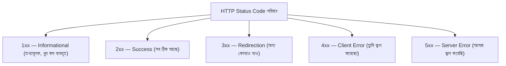

# ০১. Status Code in API: How to Use Status Code in API?

কল্পনা করো তুমি একটা রেস্টুরেন্টে বসে আছো, ওয়েটারকে অর্ডার দিয়েছো। ওয়েটার তোমার কাছে ফিরে আসবেই — কিন্তু কী নিয়ে ফিরবে সেটা নির্ভর করে অনেক কিছুর উপর। কখনো বলবে "আপনার খাবার তৈরি, এই নিন" (সব ঠিকঠাক), কখনো বলবে "দুঃখিত, এই আইটেমটা মেনুতে নেই আপনি যেভাবে চাইলেন" (তোমার ভুল), আবার কখনো বলবে "রান্নাঘরে একটা সমস্যা হয়েছে, এখন খাবার দিতে পারছি না" (রেস্টুরেন্টের ভুল)। প্রতিটা উত্তরই একটা বার্তা বহন করে, আর সেই বার্তা তোমাকে বলে দেয় পরে কী করতে হবে — অপেক্ষা করবে, অর্ডার বদলাবে, নাকি ম্যানেজারকে ডাকবে।

HTTP status code ঠিক এই কাজটাই করে ব্যাকএন্ড আর ফ্রন্টএন্ডের মধ্যে। যখন ফ্রন্টএন্ড (বা যেকোনো ক্লায়েন্ট — ব্রাউজার, মোবাইল অ্যাপ, অন্য কোনো সার্ভার) একটা রিকোয়েস্ট পাঠায়, ব্যাকএন্ড শুধু ডেটা ফেরত পাঠায় না — সাথে একটা তিন-অঙ্কের সংখ্যা পাঠায়, যেটা এক নজরে বলে দেয় কাজটা কেমন হলো। Module 4-তে আমরা `200` আর `500` কোড দুটো সংক্ষেপে দেখেছিলাম, যখন আমাদের নিজের বানানো FastAPI endpoint ডেটা পাঠাচ্ছিলো। এখন সময় হয়েছে পুরো পরিবারটা নিয়ে বিস্তারিত জানার, কারণ একটা প্রফেশনাল API বানাতে গেলে সঠিক status code বেছে নেয়াটা একটা মৌলিক দক্ষতা।

status code গুলো পাঁচটা পরিবারে ভাগ করা আছে, আর মজার ব্যাপার হলো প্রথম অঙ্কটা দেখলেই বোঝা যায় কোন পরিবার:



**2xx — যখন ওয়েটার বলে "খাবার তৈরি"।** সবচেয়ে বেশি ব্যবহৃত হলো `200 OK` — একটা সাধারণ সফল রিকোয়েস্ট, যেমন GET দিয়ে ডেটা চাওয়া হলো আর পাওয়া গেলো। কিন্তু `201 Created` আলাদা একটা অর্থ বহন করে — এটা তখন পাঠানো হয় যখন একটা নতুন জিনিস তৈরি হয়েছে, যেমন POST দিয়ে নতুন একজন ইউজার যোগ করা হলে। আরেকটা কম পরিচিত কিন্তু দরকারি কোড হলো `204 No Content` — এটা বলে "কাজ সফল হয়েছে, কিন্তু ফেরত দেয়ার মতো কোনো ডেটা নেই," যেমন কোনো কিছু ডিলিট করার পরে।

**3xx — যখন ওয়েটার বলে "ওই টেবিলে যান, ওখানে সার্ভ হবে"।** এই পরিবারটা বলে ক্লায়েন্টকে অন্য কোনো ঠিকানায় যেতে হবে। যেমন `301 Moved Permanently` মানে রিসোর্সটা স্থায়ীভাবে নতুন ঠিকানায় সরে গেছে। API ডেভেলপমেন্টে এই পরিবারটা ততটা ঘন ঘন লাগে না, কিন্তু ওয়েব ব্রাউজিং আর URL রিডাইরেক্টে এটা অত্যন্ত গুরুত্বপূর্ণ।

**4xx — যখন ওয়েটার বলে "আপনার অর্ডারে সমস্যা আছে"।** এটা সবচেয়ে গুরুত্বপূর্ণ পরিবার নতুনদের জন্য, কারণ এখানেই সবচেয়ে বেশি ভুল হয়। `400 Bad Request` মানে ক্লায়েন্ট যে ডেটা পাঠিয়েছে সেটার ফরম্যাট বা গঠন ভুল — যেমন ইমেইল ফিল্ডে সংখ্যা পাঠানো হয়েছে। `401 Unauthorized` মানে "তুমি কে সেটাই তো বলোনি" — লগইন করা নেই। `403 Forbidden` মানে "তোমাকে চেনা গেছে, কিন্তু তোমার এই কাজ করার অনুমতি নেই" — যেমন একজন সাধারণ ইউজার অ্যাডমিন প্যানেলে ঢুকতে চাইছে। আর `404 Not Found` তো সবচেয়ে পরিচিত — Module 4-এ আমরা path parameter নিয়ে কথা বলার সময় দেখেছিলাম, যখন `/users/999` চাওয়া হয় কিন্তু ৯৯৯ নম্বর ইউজার নেই, তখন এই কোডটাই পাঠানো উচিত। FastAPI নিজে থেকেও একটা 4xx পাঠায় — `422 Unprocessable Entity` — যখন request body বা parameter Pydantic মডেলের গঠনের সাথে না মেলে; এটার বিস্তারিত আমরা তিন নম্বর লেসনে দেখবো।

**5xx — যখন শেফ নিজেই ভুল করে ফেলেছে।** `500 Internal Server Error` মানে সমস্যাটা ক্লায়েন্টের দিকে না, ব্যাকএন্ডের কোডে বা সার্ভারে কোথাও ভুল হয়েছে — যেমন ডেটাবেজ কানেকশন হঠাৎ বিচ্ছিন্ন হয়ে গেলো। এই পার্থক্যটা মনে রাখা জরুরি: 4xx মানে "ক্লায়েন্ট, তুমি ঠিক করো," আর 5xx মানে "আমরা, ব্যাকএন্ড টিম, ঠিক করবো।"

FastAPI-এ status code পাঠানোর দুটো সাধারণ উপায় আছে। প্রথমটা হলো path operation decorator-এ `status_code` প্যারামিটার দিয়ে দেয়া, যখন সফল হলে সবসময় একই কোড ফেরত যাবে:

```python
from fastapi import FastAPI, HTTPException

app = FastAPI()

users_db = {1: {"id": 1, "name": "রহিম"}}


@app.get("/users/{user_id}")
def get_user(user_id: int):
    user = users_db.get(user_id)
    if not user:
        raise HTTPException(status_code=404, detail="ইউজার পাওয়া যায়নি")
    return user


@app.post("/users", status_code=201)
def create_user(name: str):
    new_id = len(users_db) + 1
    new_user = {"id": new_id, "name": name}
    users_db[new_id] = new_user
    return new_user
```

লক্ষ্য করো দুইটা ভিন্ন প্যাটার্ন। যখন সাফল্যের status code নির্দিষ্ট আর একটাই — যেমন POST endpoint-এর `201` — তখন decorator-এর `status_code=201` লিখে দেয়াই যথেষ্ট, ফাংশনের ভেতরে আলাদা করে কিছু লিখতে হয় না। কিন্তু যখন কোনো এরর অবস্থায় ভিন্ন status code পাঠাতে হয় — যেমন `404` — তখন `raise HTTPException(status_code=404, detail=...)` ব্যবহার করতে হয়। এটাই Express-এর `res.status(404).json(...)`-এর FastAPI সংস্করণ, কিন্তু একটা গুরুত্বপূর্ণ পার্থক্য নিয়ে — `HTTPException` raise করা মানে ফাংশনের বাকি কোড আর চলবে না, exception টাই সরাসরি response-এ রূপান্তরিত হয়ে যায়, `return` লেখার প্রয়োজন পড়ে না।

Express-এ যেমন `res.status()` না লিখলে ডিফল্টভাবে `200` চলে যায়, FastAPI-এও ঠিক এই একই ঝুঁকি আছে — যদি তুমি `status_code` না লিখো আর `HTTPException` ছাড়া কোনো এরর অবস্থায় শুধু একটা dict `return` করো (যেমন `return {"error": "না পাওয়া গেছে"}`), FastAPI ডিফল্টভাবে `200 OK` পাঠিয়ে দেবে — এমনকি বার্তায় "error" লেখা থাকলেও! এটা একটা খুব সাধারণ কিন্তু বিপজ্জনক ভুল, কারণ ফ্রন্টএন্ড ডেভেলপার status code দেখেই সিদ্ধান্ত নেয় ব্যর্থতা দেখাবে নাকি সফলতা — যদি body-এর ভেতরে "error" লেখা থাকলেও status code `200` থাকে, ফ্রন্টএন্ডের error-handling কোড (যেমন `if (response.ok)` চেক) ভুলভাবে সফল ধরে নিয়ে এগিয়ে যাবে। তাই এরর অবস্থায় সবসময় `HTTPException` ব্যবহার করা উচিত, শুধু dict return করার বদলে।

status code শেখা মানে হলো তোমার API-কে একটা "সৎ ওয়েটার" বানানো — যে সবসময় সঠিকভাবে জানায় কী ঘটেছে। এই ভিত্তির উপর দাঁড়িয়ে এখন আমরা দেখবো কীভাবে FastAPI-এ একাধিক রুট সুন্দরভাবে সাজানো যায়, যাতে আমাদের API শুধু সৎ না, গোছানোও হয়।
