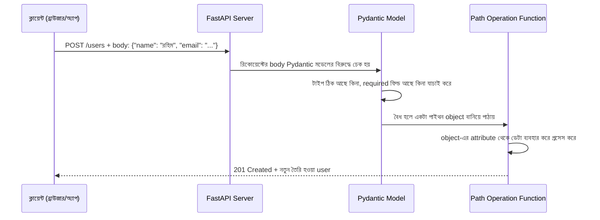

# ০৩. Anatomy of a POST Request Endpoint

Module 4-এ আমরা GET রিকোয়েস্টের দুইটা উপায়ে তথ্য পাঠানো শিখেছিলাম — query parameter (`?age=25`) আর path parameter (`/users/5`)। এই দুটোই একটা সীমাবদ্ধতা বহন করে — এগুলো URL-এর ভেতরেই বসে থাকে, আর URL সাধারণত ছোট, দৃশ্যমান, আর সীমিত পরিমাণ তথ্য বহন করতে পারে। কিন্তু ভাবো তো, যদি তোমাকে একজন নতুন ইউজারের পুরো তথ্য পাঠাতে হয় — নাম, ইমেইল, ঠিকানা, পাসওয়ার্ড — এতগুলো জিনিস URL-এ গুঁজে দেয়া অস্বাভাবিক আর অনিরাপদও, কারণ পাসওয়ার্ড URL-এ থাকলে সেটা ব্রাউজার হিস্টোরি, সার্ভার লগ সব জায়গায় দৃশ্যমান থাকবে।

এই সমস্যার সমাধান হলো POST রিকোয়েস্ট, আর এর সাথে আসা **request body** — একটা আলাদা "প্যাকেজ" যেখানে তুমি যত ইচ্ছা তথ্য, যেকোনো গঠনে, লুকিয়ে পাঠাতে পারো। এটাকে ভাবতে পারো এভাবে — URL হলো খামের উপরের ঠিকানা, আর body হলো খামের ভেতরের চিঠি। ঠিকানা দিয়ে বোঝা যায় চিঠিটা কোথায় যাচ্ছে, কিন্তু আসল বার্তাটা থাকে ভেতরে।

একটা POST রিকোয়েস্ট ঠিক কী কী ধাপ পার হয়ে ব্যাকএন্ডে পৌঁছায়, সেটা দেখা যাক:



এখানে একটা গুরুত্বপূর্ণ জিনিস আছে যেটা প্রথমবার দেখলে অনেকের কাছে জাদুর মতো লাগে — request body-কে একটা **Pydantic model** দিয়ে সংজ্ঞায়িত করা। Express-এ `express.json()` middleware শুধু raw JSON টেক্সটকে একটা প্লেইন JavaScript object-এ রূপান্তর করে দিতো, গঠন নিয়ে কোনো মাথাব্যথা ছিলো না — `req.body`-তে যা আসে তাই বসে যায়। FastAPI-এর দর্শনটা ভিন্ন: তুমি আগেই একটা ক্লাস লিখে বলে দাও body-টা ঠিক কেমন দেখতে হবে, আর FastAPI নিজে থেকেই সেই গঠনের বিরুদ্ধে যাচাই করে নেয়, তোমার ফাংশন চলার আগেই।

চলো এখন একটা পূর্ণাঙ্গ POST endpoint বানাই, শুরু থেকে শেষ পর্যন্ত:

```python
from fastapi import FastAPI
from pydantic import BaseModel

app = FastAPI()


# request body-এর গঠন সংজ্ঞায়িত করা হচ্ছে
class UserCreate(BaseModel):
    name: str
    email: str


# ধরা যাক এটা আপাতত আমাদের "ডেটাবেজ", একটা সাধারণ list
users = []


@app.post("/users", status_code=201)
def create_user(user: UserCreate):
    new_user = {
        "id": len(users) + 1,
        "name": user.name,
        "email": user.email,
    }
    users.append(new_user)
    return new_user
```

লাইন ধরে বুঝি কী ঘটছে।

```python
class UserCreate(BaseModel):
    name: str
    email: str
```
এখানে `BaseModel` থেকে ইনহেরিট করে একটা ক্লাস বানানো হচ্ছে, যেটা বলে দিচ্ছে — "একটা `UserCreate` অবজেক্টে `name` নামের একটা string আর `email` নামের একটা string থাকতে হবে, দুটোই বাধ্যতামূলক (কোনো ডিফল্ট মান নেই বলে)।" এটাই FastAPI-এর ডেটা যাচাইয়ের ভিত্তি, আর একে ভাবতে পারো Express-এ `express.json()` আর ম্যানুয়াল validation — দুটোর কাজ একসাথে করে ফেলার মতো।

```python
def create_user(user: UserCreate):
```
এখানে ফাংশন প্যারামিটারে `user: UserCreate` টাইপ হিন্ট লেখাই যথেষ্ট — FastAPI নিজে থেকেই বুঝে নেয় এটা request body থেকে আসবে (কারণ এটা একটা Pydantic model, `str` বা `int`-এর মতো সাধারণ টাইপ না), body-টা parse করে, `UserCreate` ক্লাসের বিরুদ্ধে validate করে, আর একটা প্রস্তুত `user` object বানিয়ে ফাংশনে পাঠিয়ে দেয়। Express-এ এই পুরো কাজটা করতে হতো `app.use(express.json())` middleware বসিয়ে, তারপর `req.body`-কে বিশ্বাসের ভিত্তিতে গ্রহণ করে, আলাদা করে ম্যানুয়াল ভ্যালিডেশন লিখে।

```python
new_user = {
    "id": len(users) + 1,
    "name": user.name,
    "email": user.email,
}
```
এখানে একটা নতুন dict তৈরি হচ্ছে, যেখানে `id` নিজে থেকেই বসানো হচ্ছে — বাস্তব জীবনে ক্লায়েন্টকে কখনোই `id` ঠিক করতে দেয়া হয় না, কারণ `id` ব্যাকএন্ডের নিয়ন্ত্রণে থাকা উচিত, নইলে দুইজন ইউজার একই `id` চেয়ে বসলে সিস্টেম গুলিয়ে যাবে। লক্ষ্য করো `user.name` আর `user.email` — Pydantic model-এর attribute হিসেবে ডেটা অ্যাক্সেস করা হচ্ছে, dict-এর মতো `user["name"]` লেখার বদলে।

```python
@app.post("/users", status_code=201)
```
আগের লেসনে শেখা `201 Created` কোডটা এখানে decorator-এর `status_code` প্যারামিটার দিয়ে ব্যবহার করা হলো, কারণ সত্যিই একটা নতুন রিসোর্স তৈরি হয়েছে। আর response হিসেবে নতুন তৈরি হওয়া user-টাই ফেরত পাঠানো হচ্ছে, যাতে ক্লায়েন্ট নিশ্চিত হতে পারে ঠিক কী তৈরি হলো, বিশেষ করে সার্ভার-জেনারেটেড `id`-টা কী হলো।

এই endpoint-টা টেস্ট করার জন্য তোমাকে ব্রাউজারের ঠিকানার বার ব্যবহার করলে চলবে না, কারণ ব্রাউজার ঠিকানার বারে টাইপ করে সবসময় GET রিকোয়েস্ট পাঠায়। এর বদলে দরকার হবে Postman, `curl`, বা সরাসরি FastAPI-এর `/docs` পেজ, যেগুলো দিয়ে ইচ্ছামতো method আর body দিয়ে রিকোয়েস্ট পাঠানো যায়:

```bash
curl -X POST http://localhost:8000/users \
  -H "Content-Type: application/json" \
  -d '{"name": "রহিম", "email": "rahim@example.com"}'
```

এখানে `-H "Content-Type: application/json"` header-টা গুরুত্বপূর্ণ, ঠিক Express-এর মতোই — এটাই সার্ভারকে বলে দেয় "আমি যা পাঠাচ্ছি সেটা JSON।"

এখানে একটা বড় প্রোডাকশন নুয়ান্স আছে, যেটা FastAPI-কে Express থেকে আলাদা করে। যদি তুমি `curl -d '{"name": "রহিম"}'` পাঠাও — মানে `email` ফিল্ডটা বাদ দিয়ে — Express-এ `req.body.email` হবে `undefined`, আর কোড চলতেই থাকবে, যতক্ষণ না তুমি নিজে হাতে `if (!req.body.email)` লিখে চেক করো; না লিখলে `undefined` একটা user object-এর ভেতরে ঢুকে যাবে, ডেটাবেজ পর্যন্ত পৌঁছে যেতে পারে। FastAPI-এ ঠিক এই পরিস্থিতিতে ফাংশনটাই কখনো চলবে না — Pydantic যখন দেখে `email` নেই, সাথে সাথে একটা `422 Unprocessable Entity` response স্বয়ংক্রিয়ভাবে ফেরত যায়, ঠিক কোন ফিল্ড মিসিং তার বিস্তারিত বার্তাসহ, আর তোমার `create_user` ফাংশনের একটা লাইনও চলে না। এই স্বয়ংক্রিয় প্রতিরক্ষাটাই পরের লেসনের বিষয় হয়ে উঠবে আরও গভীরভাবে, যখন আমরা validation নিয়ে কথা বলবো।

এখন আমরা জানি কীভাবে ডেটা গ্রহণ করতে হয়, কিন্তু একটা বড় প্রশ্ন এখনো বাকি — সেই ডেটার "আকৃতি" বা গঠনটা কেমন হওয়া উচিত, কোড লেখার আগেই সেটা কীভাবে ঠিক করে নিতে হয়। এটাই পরের লেসনের বিষয় — data modeling।
