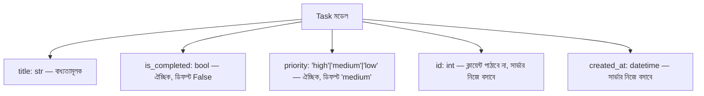
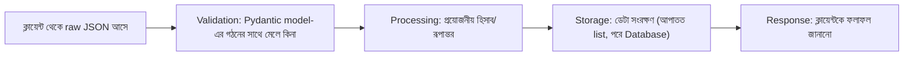

# ০৪. Data Modeling and Data Flow in a Backend Application

একজন ছুতোর মিস্ত্রি কখনো কাঠ কেটে ফেলার আগে হাতুড়ি ধরে না। সে প্রথমে বসে ভাবে — জিনিসটা দেখতে কেমন হবে, কয়টা তাক লাগবে, কোন কাঠ কোথায় বসবে, মাপ কত হবে। এই পরিকল্পনার ধাপটা বাদ দিয়ে সরাসরি কাটাকাটি শুরু করলে ফলাফল হয় এলোমেলো, মাপে না মেলা একটা আসবাব। ব্যাকএন্ড ডেভেলপমেন্টেও ঠিক এই একই শৃঙ্খলা দরকার — কোড লেখা শুরু করার আগে, ভাবতে হয় ডেটাটা দেখতে ঠিক কেমন হবে। এই চিন্তার প্রক্রিয়াটার নাম **data modeling**।

আগের লেসনে আমরা একটা `UserCreate` নামের Pydantic model বানিয়েছিলাম `name` আর `email` দিয়ে — এটা যত সাধারণ মনে হোক না কেন, এটাও আসলে একটা তথ্যচিন্তা বা মডেল। আমরা সিদ্ধান্ত নিয়েছিলাম একজন ইউজারের দুইটা বৈশিষ্ট্য থাকবে, প্রতিটার একটা নির্দিষ্ট টাইপ (Module 4-এর লেসনে আমরা `str`, `int`, `bool` এসব ডেটা টাইপ নিয়ে কথা বলেছিলাম) থাকবে। বাস্তব প্রজেক্টে এই চিন্তাটা আরও গভীরে যায় — একটা "Task" অ্যাপের একটা টাস্কের কী কী বৈশিষ্ট্য থাকা উচিত? শিরোনাম (string), সম্পন্ন হয়েছে কিনা (boolean), তৈরির তারিখ (date), অগ্রাধিকার (একটা নির্দিষ্ট তালিকা থেকে, যেমন "high"/"medium"/"low")। এই সিদ্ধান্তগুলো যদি শুরুতে ভালোভাবে না নেয়া হয়, পরে কোড লেখার সময় বারবার মডেল বদলাতে হয়, যেটা একটা বড় প্রজেক্টে ব্যয়বহুল ভুল।

data modeling শুধু "কী কী ফিল্ড থাকবে" তা ঠিক করা না, সাথে এটাও ঠিক করা — কোনটা বাধ্যতামূলক (required), কোনটা ঐচ্ছিক (optional), আর কোনটা সার্ভার নিজে থেকে বসাবে (যেমন `id`, বা তৈরির তারিখ)। যেমন একটা Task মডেল এভাবে চিন্তা করা যায়:



এই মডেলের চিন্তাটা এখন সরাসরি একটা Pydantic ক্লাসে রূপ নেয়। খেয়াল করার বিষয়, বাস্তবে আমরা সাধারণত দুইটা আলাদা মডেল লিখি — একটা ক্লায়েন্ট থেকে *গ্রহণ* করার জন্য (যেখানে শুধু ক্লায়েন্টের দেয়া ফিল্ডগুলো থাকে), আর একটা সার্ভার থেকে *ফেরত পাঠানোর* জন্য (যেখানে `id`, `created_at`-এর মতো সার্ভার-জেনারেটেড ফিল্ডও থাকে):

```python
from pydantic import BaseModel
from datetime import datetime


# ক্লায়েন্ট থেকে যা আসবে
class TaskCreate(BaseModel):
    title: str
    priority: str = "medium"  # ঐচ্ছিক, ডিফল্ট মান দেয়া আছে


# ক্লায়েন্টকে যা ফেরত পাঠাবো — সার্ভার-জেনারেটেড ফিল্ডসহ
class Task(BaseModel):
    id: int
    title: str
    priority: str
    is_completed: bool
    created_at: datetime
```

মডেল ঠিক হয়ে গেলে, পরের প্রশ্নটা আসে — এই ডেটা ব্যাকএন্ডের ভেতর দিয়ে কীভাবে "ভ্রমণ" করে? একটা POST রিকোয়েস্ট যখন আসে, ডেটাটা একেবারে সরাসরি ডেটাবেজে গিয়ে বসে না — এটা কয়েকটা ধাপ পার হয়, প্রতিটা ধাপের নিজস্ব দায়িত্ব থাকে:



এই চারটা ধাপ প্রতিটা backend অপারেশনের মেরুদণ্ড। **Validation** ধাপে ক্লায়েন্ট যা পাঠিয়েছে তা বিশ্বাসযোগ্য কিনা — FastAPI-এ এই ধাপটার বড় একটা অংশ Pydantic model নিজেই স্বয়ংক্রিয়ভাবে করে ফেলে, ফাংশন শুরু হওয়ার আগেই; এটা এত গুরুত্বপূর্ণ বিষয় যে এর জন্য পুরো পরের লেসনটাই বরাদ্দ থাকবে। **Processing** ধাপে আমরা ডেটার উপর প্রয়োজনীয় কাজ করি — যেমন `id` বসানো, `created_at` তৈরি করা, বা কোনো হিসাব করা। **Storage** ধাপে ডেটা কোথাও সংরক্ষিত হয় — এখন পর্যন্ত আমরা একটা সাধারণ Python list ব্যবহার করছি (Module 15-এ আমরা প্রকৃত ডেটাবেজে যাবো)। আর **Response** ধাপে ক্লায়েন্টকে জানানো হয় কী ঘটলো, উপযুক্ত status code সহ।

চলো আগের লেসনের কোডটাকেই একটু বড় করি, Task মডেল অনুযায়ী, এই চারটা ধাপ স্পষ্টভাবে আলাদা করে দেখাই:

```python
from fastapi import FastAPI, HTTPException
from pydantic import BaseModel
from datetime import datetime

app = FastAPI()


class TaskCreate(BaseModel):
    title: str
    priority: str = "medium"


tasks = []
next_id = 1


@app.post("/tasks", status_code=201)
def create_task(task: TaskCreate):
    global next_id

    # ধাপ ১: ক্লায়েন্টের ডেটা — Pydantic ইতিমধ্যে টাইপ আর required-fields যাচাই করে ফেলেছে
    # ধাপ ২: Validation (সংক্ষিপ্ত, পরের লেসনে বিস্তারিত)
    if not task.title.strip():
        raise HTTPException(status_code=400, detail="title আবশ্যক")

    # ধাপ ৩: Processing — মডেল অনুযায়ী চূড়ান্ত object বানানো
    new_task = {
        "id": next_id,
        "title": task.title,
        "priority": task.priority,
        "is_completed": False,
        "created_at": datetime.now(),
    }
    next_id += 1

    # ধাপ ৪: Storage
    tasks.append(new_task)

    # ধাপ ৫: Response
    return new_task
```

লক্ষ্য করো, `TaskCreate` ক্লাসে `priority: str = "medium"` লেখাটা কী করছে — যদি ক্লায়েন্ট `priority` না পাঠায়, তাহলে ডিফল্ট মান `"medium"` বসে যায়, ঠিক Pydantic মডেলের ভেতরেই। এটাই হলো মডেলে করা সিদ্ধান্তের ("priority ঐচ্ছিক, ডিফল্ট medium") সরাসরি কোডে প্রতিফলন — Express-এ এই কাজটা করতে হতো ফাংশনের ভেতরে ম্যানুয়ালি `priority || 'medium'` লিখে, কিন্তু FastAPI-এ এই ডিফল্ট-মান বসানোর দায়িত্বটাই মডেলের সংজ্ঞায় উঠে আসে, ফাংশনের লজিক থেকে আলাদা হয়ে। এভাবে যখন তুমি আগে থেকে মডেলটা কাগজে বা মাথায় স্পষ্ট করে ফেলো, কোড লেখাটা হয়ে যায় শুধু সেই সিদ্ধান্তগুলোকে Pydantic ক্লাসে অনুবাদ করা — অনেকটা ছুতোর মিস্ত্রির নকশা অনুযায়ী কাঠ কাটার মতো, এলোমেলো আন্দাজে না।

এখানে একটা গুরুত্বপূর্ণ নুয়ান্স মনে রাখা দরকার — ফ্রন্টএন্ড থেকে ব্যাকএন্ডে ডেটার পুরো যাত্রাটা আসলে তিনটা ভিন্ন "গঠন" পার হয়। ফ্রন্টএন্ডে ডেটা থাকে একটা JavaScript object হিসেবে, নেটওয়ার্কে যাওয়ার সময় সেটা একটা raw JSON টেক্সট স্ট্রিং-এ রূপান্তরিত হয়, ব্যাকএন্ডে পৌঁছালে FastAPI/Pydantic সেটাকে আবার একটা টাইপ-চেক-করা Python object (যেমন `TaskCreate` ইনস্ট্যান্স) বানায়, আর অবশেষে ডেটাবেজে সংরক্ষণের সময় সেটা আরেকবার রূপান্তরিত হয় (ডেটাবেজের row বা document হিসেবে)। প্রতিটা রূপান্তরের ধাপে ডেটার "আকৃতি" কিছুটা বদলাতে পারে — যেমন JSON-এ তারিখ থাকে একটা স্ট্রিং হিসেবে, কিন্তু Python object-এ সেটা `datetime` টাইপে রূপান্তরিত হয়। এই রূপান্তরগুলো যদি স্পষ্টভাবে মাথায় না থাকে, তাহলে "ডেটা ঠিকমতো সেভ হচ্ছে না" বা "তারিখ ভুল ফরম্যাটে আসছে"-এর মতো বাগ খুঁজে পেতে অনেক সময় লেগে যায়।

আমরা উপরের কোডে `if not task.title.strip()` দিয়ে একটা সাধারণ validation দেখিয়েছি, কিন্তু বাস্তবে ভ্যালিডেশন অনেক বেশি সতর্কতা দাবি করে — কারণ ক্লায়েন্ট থেকে আসা যেকোনো ডেটাকে সন্দেহের চোখে দেখা উচিত, এমনকি Pydantic-এর টাইপ চেকিং পার হয়ে যাওয়ার পরও। পরের লেসনে আমরা ঠিক এই বিষয়টা নিয়েই গভীরে যাবো।
