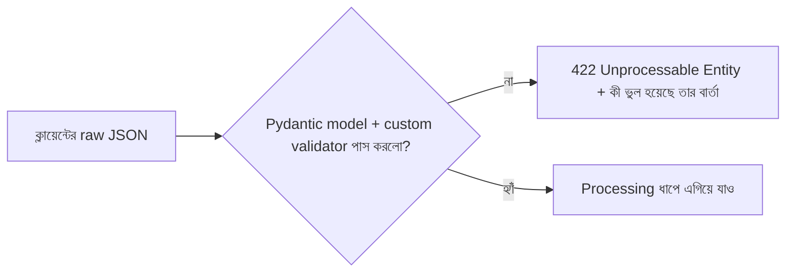

# ০৫. Data Validation in a Backend Application

সীমান্তে একজন কাস্টমস অফিসারের কথা চিন্তা করো। প্রতিটা ব্যাগ, প্রতিটা মানুষ দেশে ঢোকার আগে চেক হয় — পাসপোর্ট ঠিক আছে কিনা, ব্যাগে নিষিদ্ধ জিনিস আছে কিনা। অফিসার কখনো ধরে নেয় না যে "সবাই তো ভালো মানুষ, চেক না করলেও চলবে।" প্রতিটা প্রবেশকারীকে সমানভাবে যাচাই করা হয়, তা সে যত ভদ্রভাবেই কথা বলুক না কেন।

ব্যাকএন্ড ডেভেলপমেন্টের একটা সবচেয়ে গুরুত্বপূর্ণ নীতি হলো ঠিক এই কাস্টমস অফিসারের মতো চিন্তা করা — **client থেকে আসা কোনো ডেটাকেই বিশ্বাস করা যাবে না, যতক্ষণ না সেটা যাচাই করা হয়েছে।** এই নীতিটার একটা পরিচিত নাম আছে ইন্ডাস্ট্রিতে: "never trust user input"। কেন এত কড়াকড়ি? কারণ ক্লায়েন্ট (ব্রাউজার, মোবাইল অ্যাপ, বা Postman-এর মতো টুল) থেকে যেকোনো কিছু পাঠানো সম্ভব — একজন ব্যবহারকারী ভুল করে খালি ফর্ম সাবমিট করতে পারে, আবার একজন দুষ্টু ব্যবহারকারী ইচ্ছাকৃতভাবে ভুল বা ক্ষতিকর ডেটা পাঠানোর চেষ্টা করতে পারে। ফ্রন্টএন্ডে যতই ভ্যালিডেশন থাকুক (যেমন ফর্মে "এই ফিল্ড খালি রাখা যাবে না" লেখা), সেই ফ্রন্টএন্ড এড়িয়ে সরাসরি API-তে রিকোয়েস্ট পাঠানো টেকনিক্যালি সহজ — তাই আসল, নির্ভরযোগ্য প্রতিরক্ষা-ব্যুহ সবসময় ব্যাকএন্ডেই বসাতে হয়।

আগের লেসনে আমরা data flow-এর মধ্যে "Validation" ধাপটা দেখেছিলাম, request-এর একদম শুরুতেই বসানো:



লক্ষ্য করার বিষয়, validation ব্যর্থ হলে সাথে সাথে থেমে যাওয়া উচিত — processing বা storage ধাপে না গিয়ে। এটা অনেকটা কাস্টমস অফিসারের মতোই, পাসপোর্ট ঠিক না থাকলে আর ভেতরে ঢুকতে দেয়া হয় না, বাকি প্রক্রিয়া চলেই না। ভালো খবর হলো, FastAPI-এ এই থেমে যাওয়াটা বেশিরভাগ ক্ষেত্রে তোমাকে হাতে লিখতে হয় না — Pydantic নিজেই এই কাজটা করে।

আগের লেসনে আমরা দেখেছিলাম, `title: str` টাইপ হিন্ট দিলেই Pydantic যাচাই করে নেয় ফিল্ডটা string কিনা আর আছে কিনা। কিন্তু বাস্তবে এর চেয়ে বেশি শর্ত লাগে — যেমন `title` খালি স্ট্রিং হতে পারবে না, বা ১০০ অক্ষরের বেশি হতে পারবে না, বা `priority` একটা নির্দিষ্ট তালিকার বাইরের কিছু হতে পারবে না। এই অতিরিক্ত শর্তগুলোর জন্য Pydantic-এ দুইটা প্রধান কৌশল আছে — **constrained types** আর **`@field_validator`**:

```python
from pydantic import BaseModel, field_validator
from typing import Literal


class TaskCreate(BaseModel):
    title: str
    priority: Literal["high", "medium", "low"] = "medium"

    @field_validator("title")
    @classmethod
    def title_must_be_valid(cls, value: str) -> str:
        trimmed = value.strip()
        if len(trimmed) == 0:
            raise ValueError("title খালি রাখা যাবে না")
        if len(trimmed) > 100:
            raise ValueError("title ১০০ অক্ষরের বেশি হতে পারবে না")
        return trimmed
```

এখানে দুইটা জিনিস লক্ষ্য করো। প্রথমত, `priority: Literal["high", "medium", "low"]` — এটাই "এই ফিল্ডের মান শুধু এই তিনটার একটা হতে পারবে" নিয়মটা টাইপ হিন্টের মধ্যেই লিখে ফেলছে, আলাদা করে `if priority not in [...]` লিখতে হচ্ছে না। এটা Express-এ ম্যানুয়ালি `allowedPriorities.includes(priority)` চেক করার কাজটার সাথে তুলনীয়, কিন্তু এখানে এটা declarative — নিয়মটা টাইপ সিস্টেমের অংশ হয়ে যায়। দ্বিতীয়ত, `@field_validator("title")` দিয়ে একটা কাস্টম ফাংশন লেখা হচ্ছে, যেটা `title` ফিল্ডের উপর অতিরিক্ত শর্ত বসায় — খালি না হওয়া, ১০০ অক্ষরের কম হওয়া। এই ফাংশনের ভেতরে `raise ValueError(...)` করলে Pydantic সেটা ধরে নিয়ে একটা সুন্দর 422 error বানিয়ে ফেলে, বার্তাসহ। এটাই Express-এর একগুচ্ছ `if` ব্লকের সমতুল্য, কিন্তু মডেলের সংজ্ঞার মধ্যেই বাঁধা, ফাংশনের লজিক থেকে আলাদা।

এই মডেলটা এখন কীভাবে endpoint-এ ব্যবহার হয়, সেটা দেখা যাক:

```python
from fastapi import FastAPI

app = FastAPI()

tasks = []
next_id = 1


@app.post("/tasks", status_code=201)
def create_task(task: TaskCreate):
    global next_id
    new_task = {
        "id": next_id,
        "title": task.title,
        "priority": task.priority,
        "is_completed": False,
    }
    next_id += 1
    tasks.append(new_task)
    return new_task
```

লক্ষ্য করো, এই ফাংশনের ভেতরে কোনো `if` দিয়ে validation নেই — সব validation logic `TaskCreate` মডেলের ভেতরেই বসে গেছে। যদি ক্লায়েন্ট `title` না পাঠায়, খালি স্ট্রিং পাঠায়, বা `priority`-তে `"urgent"`-এর মতো তালিকার বাইরের কিছু পাঠায়, তাহলে `create_task` ফাংশনটাই কখনো চলবে না — Pydantic তার আগেই একটা `422` ফেরত পাঠিয়ে দেবে, ঠিক কোন ফিল্ডে কী সমস্যা তার বিস্তারিত বার্তাসহ। Express-এ এই প্রতিটা চেক ম্যানুয়ালি লিখতে হতো প্রতিটা endpoint-এ, বারবার — যেটা দশ-বিশটা endpoint হয়ে গেলে অনেক পুনরাবৃত্তিমূলক আর ভুলের সম্ভাবনাময় কোড হয়ে যায়।

এখানে একটা সূক্ষ্ম কিন্তু গুরুত্বপূর্ণ edge case মনে রাখা দরকার — টাইপ কোয়ার্সন (type coercion)। Pydantic ডিফল্টভাবে কিছুটা "নরম" — যদি `age: int` লেখা মডেলে ক্লায়েন্ট `"25"` (স্ট্রিং হিসেবে সংখ্যা) পাঠায়, Pydantic সেটাকে স্বয়ংক্রিয়ভাবে `25`-এ রূপান্তর করে নেয়, error দেয় না। এটা অনেক সময় সুবিধাজনক (JSON-এ সংখ্যা কখনো কখনো স্ট্রিং হিসেবে আসে), কিন্তু কখনো কখনো এটাই একটা বাগের উৎস হতে পারে — যেমন `is_completed: bool` ফিল্ডে ক্লায়েন্ট যদি `"false"` (স্ট্রিং) পাঠায়, Pydantic-এর পুরনো আচরণে এটা truthy স্ট্রিং হিসেবে ধরা পড়ে `True`-এ রূপান্তরিত হয়ে যেতে পারে, যা প্রত্যাশিত না। আরেকটা পরিচিত edge case — একটা "required" স্ট্রিং ফিল্ড খালি স্ট্রিং (`""`) দিয়ে পাঠালে টাইপ চেক পাস করে যায় (কারণ `""` টেকনিক্যালি একটা বৈধ `str`), কিন্তু ব্যবহারিক অর্থে সেটা "নেই"-এর সমান। এই কারণেই শুধু টাইপ হিন্টের উপর ভরসা না করে, উপরের উদাহরণের মতো `@field_validator` দিয়ে "খালি স্ট্রিং গ্রহণযোগ্য না" স্পষ্টভাবে লিখে দেয়া উচিত — টাইপ চেক পাস করা মানেই ডেটা ব্যবসায়িক অর্থে বৈধ, এটা ধরে নেয়া ভুল।

এখন খেয়াল করার বিষয়, উপরের কৌশলগুলো একটা মাত্র মডেলের জন্য দেখানো হলো। বাস্তব প্রজেক্টে যেখানে দশটা, বিশটা মডেল থাকে, প্রতিটাতে এভাবে সুনির্দিষ্ট constrained type আর validator বসালে কোড অনেক পরিষ্কার আর পুনর্ব্যবহারযোগ্য থাকে — এটাই Pydantic-এর সবচেয়ে বড় শক্তি Express-এর তুলনায়। Express-এ `Joi` বা `Zod`-এর মতো আলাদা লাইব্রেরি বসাতে হতো এই সুবিধা পাওয়ার জন্য; FastAPI-এ Pydantic এমনিতেই framework-এর অংশ, তাই সেই ধাপটা এড়িয়ে যাওয়া যায়।

এই মডিউলে আমরা status code, routing, POST endpoint-এর গঠন, data modeling আর validation — এই পাঁচটা বিষয় একটার পর একটা শিখেছি, আর প্রতিটাই একে অপরের সাথে জড়িত। এখন সময় হয়েছে এই সবগুলো জ্ঞান একসাথে করে নিজের হাতে একটা সম্পূর্ণ API বানানোর — সেটাই পরের ও এই মডিউলের শেষ লেসন, একটা হাতে-কলমে অ্যাসাইনমেন্ট।
