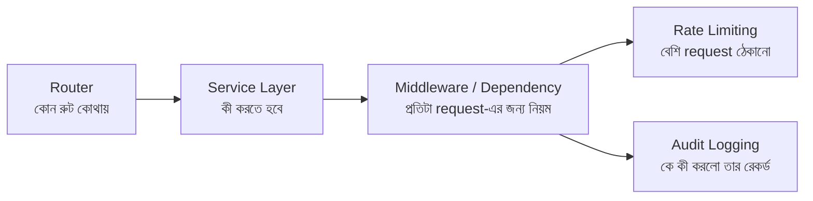

# ০১. Module Recap and New Module Introduction

Module 6-এ আমরা প্রথমবারের মতো FastAPI দিয়ে "আসল" API বানানো শুরু করেছিলাম। মনে করে দেখো — আমরা শিখেছিলাম status code মানে কী আর কখন কোনটা পাঠাতে হয়, `@app.get`/`@app.post` দিয়ে কীভাবে routing করা যায়, একটা POST request-এর ভেতরে ঠিক কী কী থাকে (headers, body, path params), ব্যাকএন্ডে ডেটা কীভাবে মডেল করে রাখা হয়, আর সবশেষে শিখেছিলাম কীভাবে Pydantic দিয়ে ইউজারের পাঠানো ডেটা validate করতে হয় — যাতে ভুল বা ক্ষতিকর ডেটা আমাদের সিস্টেমে ঢুকতে না পারে।

এই সবকিছু মিলিয়ে তুমি এখন একটা কাজ করা API বানাতে পারো — একটা রুট, তার ভেতরে কিছু লজিক, একটা রেসপন্স। কিন্তু একটা প্রশ্ন যদি মাথায় আসে — "আমার অ্যাপে যদি ৫০টা রুট থাকে, প্রতিটার ভেতরে যদি ২০ লাইন করে লজিক থাকে, তাহলে পুরো ফাইলটা কেমন দেখাবে?" — উত্তরটা খুব সুখকর না। একটামাত্র `main.py` ফাইলের ভেতরে হাজার লাইনের কোড, যেখানে routing আর business logic একসাথে জট পাকিয়ে আছে। এটাই বাস্তব জীবনের ব্যাকএন্ড প্রজেক্টে সবচেয়ে সাধারণ সমস্যাগুলোর একটা, আর ঠিক এই সমস্যাটা সমাধান করার জন্যই এই মডিউল।

এই মডিউলে আমরা একটা প্রজেক্টকে ধীরে ধীরে "পরিণত" (mature) একটা স্ট্রাকচারের দিকে নিয়ে যাবো। ভাবতে পারো এটাকে একটা ছোট দোকান থেকে একটা সুসংগঠিত প্রতিষ্ঠানে রূপান্তরের গল্প হিসেবে। প্রথমে আমরা শিখবো **Router** — কীভাবে একগাদা রুটকে ফাইলে ফাইলে ভাগ করে রাখা যায়, FastAPI-র `APIRouter` দিয়ে, ঠিক যেমন একটা বড় অফিসে প্রতিটা বিভাগের নিজস্ব ডেস্ক থাকে। তারপর শিখবো **Controller-স্টাইল সংগঠন** — যেখানে আসল কাজের লজিকটা থাকে, রুট থেকে আলাদা করে (FastAPI-তে এটাকে সাধারণত router + service layer বলা হয়, module 23-এ এই প্যাটার্নটা আরও গভীরে যাবো)। এরপর আমরা ঢুকবো **Middleware আর Dependency**-র জগতে — FastAPI-তে এই দুইটা ধারণা একসাথে সেই কাজ করে যেটা Express.js-এ একা middleware করতো, আর দুটোর পার্থক্য বোঝাটাই এই মডিউলের একটা গুরুত্বপূর্ণ শিক্ষা।

মিডলওয়্যার/ডিপেন্ডেন্সি বোঝার পর আমরা সেটাকে ব্যবহার করে দুটো বাস্তব সমস্যা সমাধান করবো — **Rate Limiting** (একজন ইউজার যাতে সার্ভারে অতিরিক্ত request পাঠিয়ে সিস্টেম বিপর্যস্ত করে না ফেলে) আর **Audit Logging** (কে, কখন, কী করলো — সেটার একটা রেকর্ড রাখা)। দুটোই এমন ফিচার, যেগুলো ছোট প্রজেক্টে অনেকে ভুলে যায়, কিন্তু প্রোডাকশনে যাওয়া যেকোনো সিস্টেমে এগুলো প্রায় বাধ্যতামূলক।

এই পুরো যাত্রাটা একটা নির্দিষ্ট লক্ষ্যে এগোচ্ছে — মডিউল শেষে তুমি একটা ছোট কিন্তু বাস্তবসম্মত FastAPI প্রজেক্ট বানাতে পারবে, যেটার routing, business logic, আর security/monitoring লজিক পরিষ্কারভাবে আলাদা আলাদা জায়গায় থাকবে — ঠিক যেভাবে বড় বড় কোম্পানির আসল কোডবেজ সাজানো থাকে।

চলো তাহলে প্রথম ধাপ দিয়ে শুরু করি — Router আসলে কেন দরকার, সেটা বোঝার মধ্য দিয়ে।
