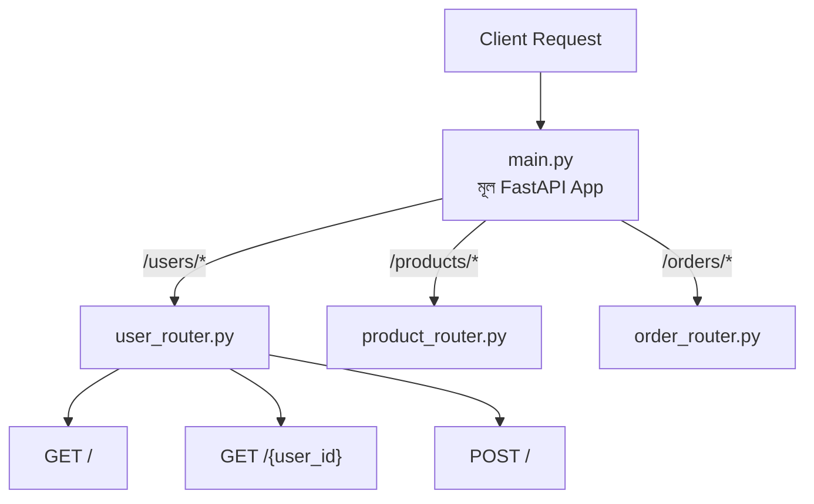

# ০২. Why Do We Need Router? Implementing Routers

Module 6-এর দ্বিতীয় লেসনে আমরা `@app.get("/users")`, `@app.post("/users")` এভাবে সরাসরি `app` অবজেক্টের উপরে decorator বসিয়ে রুট লিখতে শিখেছিলাম। এই পদ্ধতিটা ছোট প্রজেক্টের জন্য একদম ঠিকঠাক। কিন্তু এখন কল্পনা করো একটা বাস্তব অ্যাপ্লিকেশন, যেখানে ইউজার ম্যানেজমেন্টের জন্য ১০টা রুট, প্রোডাক্টের জন্য ১৫টা রুট, অর্ডারের জন্য ১২টা রুট — সব মিলিয়ে ৪০-৫০টা রুট। যদি এই সবগুলো একই `main.py` ফাইলে একের পর এক লেখা হয়, তাহলে ফাইলটা হয়ে যায় একটা অগোছালো গুদামঘর, যেখানে দরকারি জিনিস খুঁজে পাওয়াই কঠিন হয়ে যায়।

এই সমস্যার সমাধান হলো **Router**। FastAPI-র `APIRouter` তোমাকে দেয় একটা "মিনি অ্যাপ্লিকেশন" তৈরি করার ক্ষমতা, যেটার নিজস্ব রুটের সেট থাকে, যেটা তুমি আলাদা একটা ফাইলে লিখে রাখতে পারো, আর পরে মূল `app`-এর সাথে জুড়ে দিতে পারো। এটাকে ভাবতে পারো একটা বড় শপিং মলের মতো — পুরো মলটা হলো তোমার FastAPI `app`, আর প্রতিটা দোকান (ইলেকট্রনিক্সের দোকান, কাপড়ের দোকান, খাবারের দোকান) হলো আলাদা আলাদা `APIRouter`। প্রতিটা দোকানের নিজস্ব সেকশন আছে, নিজস্ব কর্মী আছে, কিন্তু সবগুলো মিলেই একটা মল তৈরি করে, আর মলের গেটে একটা সাইনবোর্ড বলে দেয় কোন দিকে গেলে কোন দোকান পাওয়া যাবে।

চলো একটা বাস্তব উদাহরণ দিয়ে দেখি। ধরো আমাদের একটা `users` রিসোর্স আছে। আমরা একটা আলাদা ফাইল বানাবো, `routers/user_router.py`:

```python
# routers/user_router.py
from fastapi import APIRouter

router = APIRouter(prefix="/users", tags=["users"])


@router.get("/")
def get_all_users():
    return {"message": "সব ইউজারের তালিকা"}


@router.get("/{user_id}")
def get_user_by_id(user_id: str):
    return {"message": f"ইউজার আইডি: {user_id}"}


@router.post("/")
def create_user(payload: dict):
    return {"message": "নতুন ইউজার তৈরি হলো", "data": payload}
```

লক্ষ করো, এখানে `FastAPI()` না, বরং `APIRouter()` ব্যবহার করা হয়েছে — এটাই আমাদের "মিনি অ্যাপ্লিকেশন"। আর `prefix="/users"` প্যারামিটারটাই বলে দিচ্ছে "এই router-এর সব রুট `/users` দিয়ে শুরু হবে" — তাই router-এর ভেতরে আমরা শুধু `/` আর `/{user_id}` লিখেছি, `/users` বারবার লেখার দরকার নেই। `tags=["users"]` প্যারামিটারটা কোনো লজিক্যাল প্রভাব ফেলে না, কিন্তু এটা স্বয়ংক্রিয়ভাবে জেনারেট হওয়া Swagger ডকুমেন্টেশনে (`/docs`) এই রুটগুলোকে একটা গ্রুপে সাজিয়ে দেখায় — একটা ছোট কিন্তু মূল্যবান সুবিধা, যেটা Express.js-এর `express.Router()`-এ সরাসরি নেই।

এবার মূল `main.py` ফাইলে:

```python
# main.py
from fastapi import FastAPI
from routers.user_router import router as user_router

app = FastAPI()

app.include_router(user_router)


@app.get("/")
def health_check():
    return {"status": "সার্ভার চালু আছে"}
```

এই `app.include_router(user_router)` লাইনটাই আসল জাদু — Express.js-এর `app.use('/users', userRoutes)`-এর ঠিক সমান্তরাল। এটা বলছে — "এই router-এর সব রুট এখন মূল অ্যাপ্লিকেশনের অংশ হয়ে গেলো।" `prefix` আগেই router-এর ভেতরে সেট করা ছিলো বলে, `router.get("/{user_id}", ...)` আসলে কার্যকর হয় `/users/{user_id}` হিসেবে, আর `router.post("/", ...)` কার্যকর হয় `/users` হিসেবে। এভাবে router নিজে জানে তার "পূর্ণ ঠিকানার প্রিফিক্স" কী, আর `main.py` জানে না তার ভেতরে ঠিক কী কী সাব-রুট আছে — আর এই আলাদা করে রাখাটাই একে reusable আর maintainable করে তোলে।



এভাবে একই প্যাটার্নে তুমি `product_router.py`, `order_router.py` তৈরি করতে পারো, আর `main.py` ফাইলটা থেকে যাবে ছোট, পরিষ্কার, শুধু কোন রিসোর্সের রুট কোথায় মাউন্ট হচ্ছে তার একটা তালিকার মতো — অনেকটা মলের প্রবেশপথে থাকা ডিরেক্টরি বোর্ডের মতো।

একটা ছোট কিন্তু গুরুত্বপূর্ণ পার্থক্য মনে রাখা ভালো — Express.js-এ `app.use('/users', userRoutes)` লিখলে prefix মাউন্টের সময় বসানো হয়, কিন্তু FastAPI-তে `prefix` router তৈরি করার সময়েই দেওয়া হয় (`APIRouter(prefix="/users")`)। দুটোই একই কাজ করে, কিন্তু প্রিফিক্স কোথায় লেখা হচ্ছে সেটা আলাদা জায়গায় — এই সূক্ষ্ম পার্থক্যটা নতুনদের প্রায়ই একটু বিভ্রান্ত করে যখন তারা একটা কোডবেজ থেকে আরেকটায় সুইচ করে।

router দিয়ে আমরা "কোন request কোথায় যাবে" এই সমস্যাটা সমাধান করলাম। কিন্তু "সেখানে গিয়ে ঠিক কী কাজ হবে" — সেই লজিকটা এখনো রুট ফাইলের ভেতরেই লেখা আছে। পরের লেসনে আমরা সেই লজিককেও আলাদা করে ফেলবো, একটা নতুন স্তরে — যাকে আমরা **controller-স্টাইল সংগঠন** বলবো।
