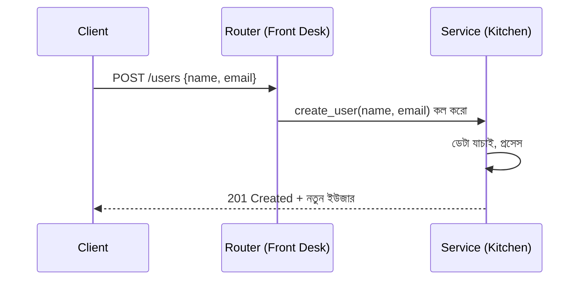

# ০৩. Introduction to Controller - Why and How to Implement This

আগের লেসনে আমরা রুটগুলোকে আলাদা ফাইলে ভাগ করে ফেললাম, কিন্তু একটা জিনিস খেয়াল করলে দেখবে — প্রতিটা রুটের পাশে এখনো একটা করে ফাংশন লেখা আছে, যেখানে আসল কাজটা হচ্ছে। যদি এই ফাংশনগুলো ছোট হয় (এক-দুই লাইন), তাহলে সমস্যা নেই। কিন্তু বাস্তব জীবনে একটা রুট হ্যান্ডলার প্রায়ই অনেক কাজ করে — ডেটাবেজ থেকে তথ্য আনা, সেটাকে যাচাই করা, হিসাব করা, তারপর সঠিক ফরম্যাটে রেসপন্স পাঠানো। এই সবকিছু যদি `routers/user_router.py` ফাইলের ভেতরেই লেখা হয়, তাহলে রুট ফাইলটা আর "রুট কোথায় যাবে সেটার তালিকা" থাকে না — এটা হয়ে যায় একটা জগাখিচুড়ি, যেখানে "ঠিকানা" আর "কাজ" মিশে যায়।

এই সমস্যার সমাধান, Express.js-এর জগতে যাকে বলা হয় **Controller**, FastAPI-র জগতে আমরা সেটাকে বলি **Service Layer** — ধারণাটা একই, নাম আলাদা। ধারণাটা রেস্টুরেন্টের সাথে তুলনা করলে সহজে বোঝা যায় — যেটা আমরা আগেও ব্যবহার করেছি। **Router হলো রেস্টুরেন্টের ফ্রন্ট ডেস্ক বা ওয়েটার** — সে অর্ডার নেয়, বলে দেয় কোন টেবিলের জন্য কোন খাবার, কিন্তু নিজে রান্না করে না। **Service Layer হলো রেস্টুরেন্টের কিচেন** — এখানেই আসল কাজটা হয়, রান্নার প্রতিটা ধাপ এখানে ঘটে। ওয়েটার শুধু অর্ডারটা কিচেনে পাঠায় আর রান্না শেষ হলে খাবারটা টেবিলে নিয়ে যায়। এই বিভাজনের একটা বড় সুবিধা হলো — ওয়েটার বদলালেও কিচেনের রেসিপি বদলায় না, আর রেসিপি উন্নত করলেও ওয়েটারের কাজের ধরন বদলায় না। দুটো সম্পূর্ণ আলাদা দায়িত্ব, আলাদা জায়গায় থাকে।

সফটওয়্যারের ভাষায় এটাকে বলে **Separation of Concerns** — প্রতিটা অংশের একটাই নির্দিষ্ট দায়িত্ব থাকা উচিত। এই চিন্তাটাই বড় বড় ফ্রেমওয়ার্কে **MVC (Model-View-Controller)** নামের একটা জনপ্রিয় প্যাটার্নের ভিত্তি — যেখানে Model ডেটা সামলায়, View (আমাদের ক্ষেত্রে JSON রেসপন্স) ইউজারকে যা দেখানো হবে সেটা সামলায়, আর Controller/Service মাঝখানে থেকে ব্যবসায়িক লজিকটা চালায়। আমরা এখনো পুরোপুরি Model (Pydantic দিয়ে ডেটা মডেলিং) নিয়ে কথা বলিনি (সেটা Module 8-এ, ডেটা মডেলিং নিয়ে বিস্তারিত আলোচনায় আসবে), কিন্তু service layer-এর ধারণাটা এখনই কাজে লাগানো যায়। *(এই মডিউলে আমরা service layer-কে যত সহজভাবে দেখাচ্ছি, বাস্তবে বড় প্রজেক্টে এটা আরও কয়েকটা স্তরে ভাগ হয় — যেমন repository layer ডেটাবেজের সাথে কথা বলে, service layer ব্যবসায়িক নিয়ম প্রয়োগ করে। Module 23-এ আমরা এই পূর্ণাঙ্গ প্যাটার্নটা নিয়ে ফিরে আসবো।)*

চলো বাস্তবে করে দেখাই। প্রথমে একটা `services/user_service.py` ফাইল বানাই:

```python
# services/user_service.py
from fastapi import HTTPException
from datetime import datetime

# বাস্তবে এখানে ডেটাবেজ থেকে ইউজার তালিকা আনা হতো
FAKE_USERS = [
    {"id": 1, "name": "রহিম"},
    {"id": 2, "name": "করিম"},
]


def get_all_users():
    return FAKE_USERS


def get_user_by_id(user_id: int):
    return {"id": user_id, "name": "রহিম"}


def create_user(name: str | None, email: str | None):
    # Module 6 লেসন ৫-এর ভ্যালিডেশনের মতোই, শুধু সেটা এখানে Pydantic মডেল
    # দিয়ে হয় বেশিরভাগ সময়ে — এখানে ম্যানুয়ালি দেখানো হলো ধারণাটা স্পষ্ট করতে
    if not name or not email:
        raise HTTPException(status_code=400, detail="নাম আর ইমেইল আবশ্যক")
    new_user = {"id": int(datetime.now().timestamp()), "name": name, "email": email}
    return new_user
```

এবার `routers/user_router.py` ফাইলটা হয়ে যাবে অনেক পরিষ্কার — এটা শুধু বলে দেবে কোন পাথ, কোন মেথড, কোন service ফাংশনে যাবে:

```python
# routers/user_router.py
from fastapi import APIRouter
from services.user_service import get_all_users, get_user_by_id, create_user

router = APIRouter(prefix="/users", tags=["users"])


@router.get("/")
def list_users():
    return {"success": True, "data": get_all_users()}


@router.get("/{user_id}")
def read_user(user_id: int):
    return {"success": True, "data": get_user_by_id(user_id)}


@router.post("/", status_code=201)
def add_user(name: str | None = None, email: str | None = None):
    return {"success": True, "data": create_user(name, email)}
```

এখন রুট ফাইলটা পড়লেই তুমি এক নজরে বুঝে যাবে এই রিসোর্সে কী কী এন্ডপয়েন্ট আছে, আর প্রতিটার আসল কাজ কোথায় খুঁজতে হবে সেটাও স্পষ্ট। Module 6 লেসন ৩-এ আমরা যে POST request-এর ভেতরের অ্যানাটমি (headers, body) নিয়ে কথা বলেছিলাম, সেই ডেটাটাই এখন `create_user` সার্ভিস ফাংশনের ভেতরে ব্যবহৃত হচ্ছে, কিন্তু এই ডেটাটা রুট হয়ে ঠিক জায়গায় পৌঁছানো পর্যন্ত রাউটার তার কাজ করেছে মাত্র — বিশ্লেষণ, যাচাই, প্রক্রিয়াকরণ, সব হচ্ছে সার্ভিস লেয়ারে।



এই বিভাজনের সবচেয়ে বড় ব্যবহারিক সুবিধা বোঝা যায় যখন প্রজেক্ট বড় হতে থাকে — নতুন একজন ডেভেলপার টিমে যোগ দিলে, তাকে পুরো কোডবেজ না বুঝেই বলা যায় "শুধু `services` ফোল্ডারটা দেখো, ওখানেই ব্যবসায়িক লজিক।" আর টেস্ট লেখার সময়ও এই আলাদা করে রাখা ফাংশনগুলো (`get_all_users`, `create_user`) স্বাধীনভাবে টেস্ট করা অনেক সহজ হয়, কারণ এগুলো FastAPI-র routing সিস্টেমের সাথে জড়িয়ে নেই — এগুলো নিছক সাধারণ Python ফাংশন, তাই `pytest` দিয়ে সরাসরি কল করে টেস্ট করা যায়, কোনো HTTP request সিমুলেট করার দরকারই পড়ে না।

router আর service layer মিলিয়ে এখন আমাদের কাছে একটা পরিষ্কার, স্তরভিত্তিক স্ট্রাকচার আছে। কিন্তু এখনো একটা গুরুত্বপূর্ণ প্রশ্ন বাকি — প্রতিটা request-এর জন্য এমন কিছু কাজ থাকে যা প্রায় সব রুটেই দরকার হয়, যেমন "ইউজার লগইন করা আছে কিনা যাচাই করা" বা "request-টা লগ করে রাখা"। এই একই কাজ কি প্রতিটা service ফাংশনে বারবার লিখতে হবে? এই প্রশ্নের উত্তর নিয়েই পরের লেসনে আমরা যাচ্ছি — **Middleware আর Dependency**-র জগতে।
