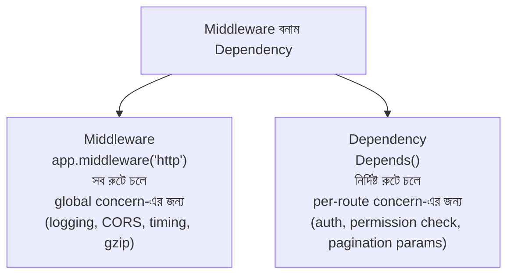

# ০৪. Introduction to Middleware

আগের লেসনের শেষে একটা প্রশ্ন রেখে এসেছিলাম — এমন কাজ যা প্রায় সব রুটের জন্যই দরকার (যেমন ইউজার লগইন করা আছে কিনা যাচাই করা, বা প্রতিটা request-এর একটা লগ রাখা), সেটা কি প্রতিটা service ফাংশনে বারবার কপি-পেস্ট করে লিখতে হবে? উত্তরটা অবশ্যই "না" — কিন্তু এখানেই FastAPI Express.js থেকে একটা গুরুত্বপূর্ণ জায়গায় ভিন্ন পথে হাঁটে। Express.js-এ এই সব কাজের জন্য একটাই টুল আছে — middleware। FastAPI-তে দুটো আলাদা টুল আছে — **middleware** আর **dependency (`Depends`)** — আর কোনটা কখন ব্যবহার করবে সেটা বোঝাটাই এই লেসনের মূল লক্ষ্য।

একটা এয়ারপোর্টের কথা চিন্তা করো। একজন যাত্রী প্লেনে ওঠার আগে একে একে কয়েকটা চেকপয়েন্ট পার হয় — টিকিট চেক, ব্যাগেজ স্ক্যান, ইমিগ্রেশন, বোর্ডিং গেট। প্রতিটা চেকপয়েন্ট তার নিজের কাজটা করে, তারপর যাত্রীকে পরের চেকপয়েন্টে যেতে দেয়। কোনো একটা চেকপয়েন্টে যদি সমস্যা হয় (যেমন টিকিট না থাকে), যাত্রীকে সেখানেই আটকে দেয়া হয়, সে আর সামনে এগোতে পারে না। FastAPI-র middleware আর dependency দুটোই এই একই ধারণা বাস্তবায়ন করে, কিন্তু ভিন্ন স্কোপে — middleware হলো **এয়ারপোর্টের প্রধান গেট**, যেটার ভেতর দিয়ে *প্রত্যেক* যাত্রীকে যেতেই হয়, তার গন্তব্য যেখানেই হোক; আর dependency হলো **নির্দিষ্ট বোর্ডিং গেটের চেকপয়েন্ট**, যেটা শুধু সেই একটা ফ্লাইটের যাত্রীদের জন্য প্রযোজ্য।

## Middleware — সম্পূর্ণ অ্যাপ্লিকেশনের জন্য একটা স্তর

FastAPI-তে middleware লেখা হয় `@app.middleware("http")` দিয়ে, আর এটা *প্রতিটা* incoming request-এর জন্য চলে, রুট যেটাই হোক না কেন:

```python
# main.py
import time
from fastapi import FastAPI, Request

app = FastAPI()


@app.middleware("http")
async def log_requests(request: Request, call_next):
    start = time.time()
    print(f"[{request.method}] {request.url.path} শুরু হলো")
    response = await call_next(request)  # পরের ধাপে/হ্যান্ডলারে যাও
    duration = time.time() - start
    print(f"[{request.method}] {request.url.path} শেষ হলো, সময় লাগলো {duration:.3f}s")
    return response
```

এখানে `call_next(request)` ফাংশনটাই Express.js-এর `next()`-এর সমান্তরাল — এটাই মূল চাবিকাঠি। যদি middleware-এর ভেতরে `await call_next(request)` কল না করে সরাসরি একটা `Response` রিটার্ন করা হয়, request রুট হ্যান্ডলার পর্যন্ত পৌঁছাবেই না — ঠিক Express.js-এর `next()` না ডাকার মতো। কিন্তু একটা গুরুত্বপূর্ণ পার্থক্য — FastAPI middleware-এ `call_next` কল করার *পরেও* কোড চলতে পারে (উপরের উদাহরণে `duration` হিসাব করাটা যেমন), কারণ `call_next` নিজেই response রিটার্ন করে, যেটার উপর middleware আরও কাজ করতে পারে response client-এর কাছে যাওয়ার আগে। Express.js-এর `next()` এভাবে সরাসরি response রিটার্ন করে না।

## Dependency — নির্দিষ্ট রুটের জন্য একটা নিয়ম

এখন প্রশ্ন — "ইউজার লগইন করা আছে কিনা" যাচাই করার কাজটা কি middleware দিয়ে করা উচিত? এখানেই সবচেয়ে সাধারণ ভুলটা হয়। **middleware-এ authentication-এর মতো per-route লজিক বসানো একটা সাধারণ কিন্তু ভুল সিদ্ধান্ত** — কারণ middleware প্রতিটা request-এর জন্যই চলে, এমনকি এমন রুটের জন্যও যেগুলোর auth-এর দরকারই নেই (যেমন `/health` বা পাবলিক `GET /products`)। middleware-এর ভেতরে `if request.url.path.startswith(...)` দিয়ে পাথ চেক করে করে বাদ দেওয়া শুরু করলে, কোডটা দ্রুত জটিল আর ভঙ্গুর হয়ে যায়।

FastAPI-র সঠিক সমাধান হলো **Dependency**, `Depends` দিয়ে — এটা প্রতিটা রুটে আলাদাভাবে যোগ করা হয়, ঠিক প্রয়োজনের জায়গায়:

```python
# dependencies/auth.py
from fastapi import Header, HTTPException


def auth_check(authorization: str = Header(default=None)):
    if not authorization:
        raise HTTPException(status_code=401, detail="অনুমতি নেই — টোকেন পাওয়া যায়নি")
    if authorization != "Bearer my-secret-token":
        raise HTTPException(status_code=403, detail="ভুল টোকেন — প্রবেশাধিকার নিষিদ্ধ")
    return {"id": 1, "name": "রহিম"}  # request-এর সাথে জুড়ে দেওয়া ইউজার তথ্য
```

```python
# routers/product_router.py
from fastapi import APIRouter, Depends
from dependencies.auth import auth_check

router = APIRouter(prefix="/products", tags=["products"])


@router.get("/")
def list_products():
    return {"message": "সবার জন্য উন্মুক্ত"}


@router.post("/")
def create_product(current_user: dict = Depends(auth_check)):
    return {"message": "তৈরি হলো", "created_by": current_user["name"]}
```

এখানে `Depends(auth_check)` লেখা মানেই — "এই রুটটা চালানোর *আগে* `auth_check` চালাও, আর তার রিটার্ন ভ্যালুটা `current_user` প্যারামিটারে বসিয়ে দাও।" যে রুটে `Depends(auth_check)` লেখা নেই, সেখানে এটা মোটেও চলবে না — এটাই dependency-র সবচেয়ে বড় সুবিধা middleware-এর তুলনায়: এটা **opt-in**, প্রতিটা রুটে আলাদাভাবে সিদ্ধান্ত নেওয়া যায়, আর FastAPI-র dependency injection সিস্টেম স্বয়ংক্রিয়ভাবে এটাকে Swagger ডকুমেন্টেশনেও দেখায় (কোন রুটে auth লাগে, কোনটায় লাগে না)।



**সাধারণ ভুল যেটা এড়ানো উচিত:** নতুনরা প্রায়ই দুটো দিকেই ভুল করে — কেউ কেউ authentication middleware-এ বসিয়ে দেয় (ফলে পাবলিক রুটেও অদরকারি চেক চলে, বা পাথ-ভিত্তিক if-else-এর জঞ্জাল তৈরি হয়), আর কেউ কেউ সত্যিকারের global concern (যেমন request timing log করা, বা প্রতিটা response-এ একটা কাস্টম header যোগ করা) dependency দিয়ে করতে চায়, যেটা প্রতিটা রুটে আলাদা করে `Depends(...)` লিখে যোগ করতে হয় — অপ্রয়োজনীয় পুনরাবৃত্তি। সহজ নিয়ম: **"এটা কি সত্যিই সবার জন্য, ব্যতিক্রমহীনভাবে?" হলে middleware; "এটা নির্দিষ্ট কিছু রুটের একটা শর্ত?" হলে dependency।**

এখন আমরা middleware আর dependency-র তত্ত্ব আর তাদের সঠিক ব্যবহারের জায়গা জানি। পরের লেসনে আমরা এই জ্ঞানটা কাজে লাগিয়ে হাতেকলমে একটা বাস্তব প্রজেক্ট বানাবো, যেখানে authentication-এর জন্য dependency আর logging-এর জন্য middleware — দুটোই একসাথে কাজ করবে।
