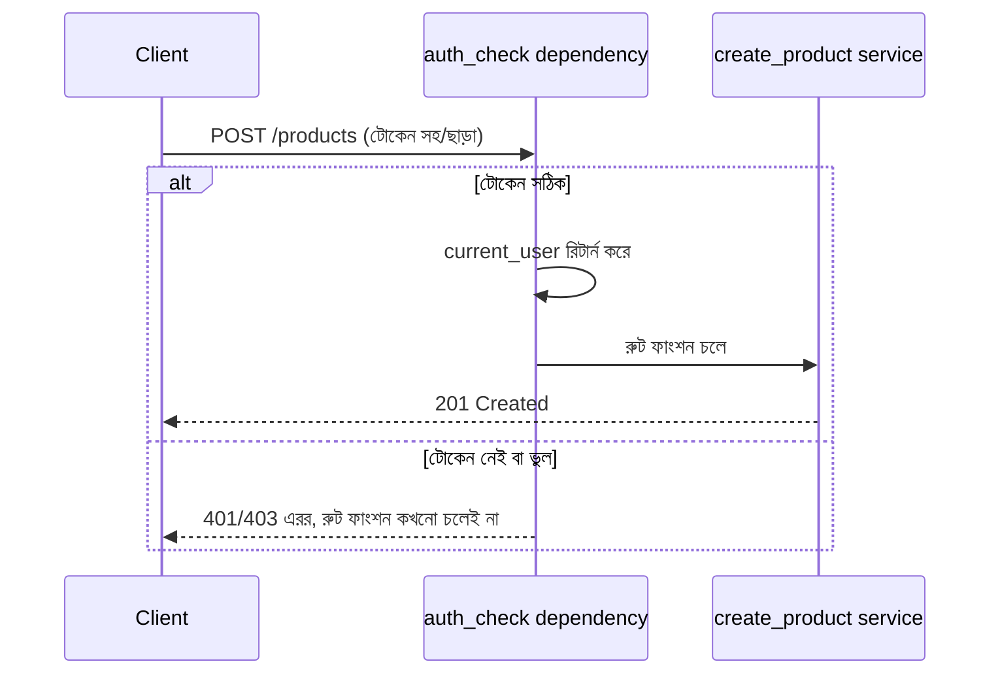

# ০৫. Middleware Project One

তত্ত্ব যথেষ্ট হয়েছে — এবার হাতেকলমে একটা বাস্তব প্রজেক্ট বানানোর পালা, যেখানে আমরা middleware আর dependency দুটোই একসাথে ব্যবহার করবো, প্রতিটাকে তার সঠিক জায়গায় বসিয়ে। আমরা এমন একটা পরিস্থিতি নেবো যেটা প্রায় প্রতিটা API-তেই থাকে — কিছু রুট আছে যেগুলো সবার জন্য উন্মুক্ত (যেমন প্রোডাক্ট তালিকা দেখা), আবার কিছু রুট আছে যেগুলোর জন্য একজন ইউজারকে "লগইন করা" প্রমাণ করতে হয় (যেমন নতুন প্রোডাক্ট তৈরি করা)। আগের লেসনের নিয়ম মেনে — এই যাচাইটা per-route, তাই এটা হবে একটা **dependency**, `auth_check`। আর সাথে আমরা একটা global request logger বসাবো, যেটা হবে সত্যিকারের **middleware**, কারণ এটা সব রুটের জন্যই সমানভাবে দরকার।

বাস্তব জীবনে এই এয়ারপোর্ট চেকপয়েন্টের সাথে তুলনাটা এখানে আরও স্পষ্ট হয় — টিকিট চেক না হলে কাউকে বোর্ডিং গেটের ভেতরেই ঢুকতে দেয়া হয় না। আমাদের ক্ষেত্রে, "টিকিট" হবে একটা টোকেন, যেটা request-এর header-এ পাঠানো হবে। আমরা এখনো প্রকৃত authentication সিস্টেম (যেমন JWT) নিয়ে বিস্তারিত পড়িনি — সেটা পরের মডিউলগুলোতে আসবে। এখন আমরা সহজ একটা সংস্করণ বানাবো, যাতে dependency-র প্যাটার্নটা স্পষ্ট বোঝা যায়।

প্রথমে dependency ফাংশনটা লিখি:

```python
# dependencies/auth.py
from fastapi import Header, HTTPException


def auth_check(authorization: str = Header(default=None)):
    if not authorization:
        raise HTTPException(
            status_code=401,
            detail="অনুমতি নেই — টোকেন পাওয়া যায়নি",
        )

    if authorization != "Bearer my-secret-token":
        raise HTTPException(
            status_code=403,
            detail="ভুল টোকেন — প্রবেশাধিকার নিষিদ্ধ",
        )

    # টোকেন ঠিক থাকলে, ইউজারের তথ্য রিটার্ন করলাম
    return {"id": 1, "name": "রহিম"}
```

এখানে দুটো গুরুত্বপূর্ণ জিনিস লক্ষ করার মতো। প্রথমত, প্রতিটা ব্যর্থ যাচাইয়ে আমরা `raise HTTPException(...)` করেছি — Express.js-এর `return res.status(...).json(...)`-এর সমান্তরাল, কিন্তু FastAPI-তে এটা আরও নিরাপদ, কারণ `raise` করার পর কোডের নিচের কোনো লাইনই চলে না, আর ভুলবশত সফল রেসপন্স তৈরি হয়ে যাওয়ার সুযোগ নেই — Express.js-এ `return` ভুলে গেলে যেই বিপজ্জনক bug হতো, Python-এর `raise` এই সমস্যাটা কাঠামোগতভাবেই দূর করে দেয়। দ্বিতীয়ত, টোকেন সঠিক হলে আমরা একটা dictionary রিটার্ন করছি — Express.js-এ যেখানে `req.user = {...}` লিখে request অবজেক্টে তথ্য যুক্ত করা হতো, FastAPI-তে dependency তার রিটার্ন ভ্যালুটা সরাসরি রুট ফাংশনের একটা প্যারামিটারে বসিয়ে দেয়, request অবজেক্টে কোনো mutation না করেই — এটা একটা পরিষ্কার, explicit ডেটা-পাসিং, যেখানে dependency ঠিক কী দিচ্ছে সেটা ফাংশন সিগনেচার দেখেই বোঝা যায়।

এবার এটাকে নির্দিষ্ট রুটে বসাই, পুরো রাউটারে না:

```python
# routers/product_router.py
from fastapi import APIRouter, Depends
from dependencies.auth import auth_check
from services.product_service import get_all_products, create_product

router = APIRouter(prefix="/products", tags=["products"])


@router.get("/")
def list_products():
    return {"success": True, "data": get_all_products()}  # সবার জন্য উন্মুক্ত


@router.post("/", status_code=201)
def add_product(name: str, price: float, current_user: dict = Depends(auth_check)):
    # শুধু লগইন করা ইউজারের জন্য
    product = create_product(name, price, created_by=current_user["name"])
    return {"success": True, "data": product}
```

`current_user: dict = Depends(auth_check)` — এই লাইনটাই মূল ধাঁধার সমাধান। FastAPI request আসার সাথে সাথে দেখে নেয় রুট ফাংশনের কোন প্যারামিটার `Depends(...)`-এর সাথে বাঁধা, আর সেই dependency ফাংশনটাকে আগে চালায়। যদি `auth_check` একটা `HTTPException` raise করে, FastAPI রুট ফাংশনটা মোটেও চালায় না — সরাসরি error response পাঠিয়ে দেয়। যদি সফলভাবে রিটার্ন করে, তার রিটার্ন ভ্যালুটা `current_user`-এ চলে আসে, আর তখনই `add_product` ফাংশনের ভেতরের কোড চলা শুরু হয়।



এবার global logging middleware যোগ করি `main.py`-তে, যেটা প্রতিটা request-এর জন্যই চলবে, auth লাগুক বা না লাগুক:

```python
# main.py
import time
from fastapi import FastAPI, Request
from routers.product_router import router as product_router

app = FastAPI()
app.include_router(product_router)


@app.middleware("http")
async def request_logger(request: Request, call_next):
    start = time.time()
    response = await call_next(request)
    duration_ms = (time.time() - start) * 1000
    print(f"[{request.method}] {request.url.path} -> {response.status_code} ({duration_ms:.1f}ms)")
    return response
```

লক্ষ করো, `request_logger` কোনো auth চেক করে না, কোনো রুট বাদ দেয় না — এটা শুধু প্রতিটা request-response জোড়ার সময় আর status code লগ করে, তারপর `call_next` থেকে পাওয়া response-টাই ফেরত দেয়। এটাই middleware-এর সঠিক ব্যবহার — global, ব্যতিক্রমহীন, কোনো ব্যবসায়িক সিদ্ধান্ত নেয় না।

এই ছোট প্রজেক্টটা দেখিয়ে দিলো middleware আর dependency কীভাবে বাস্তবে একসাথে কাজ করে — একটা নিরাপত্তার স্তর (dependency) যেটা controller/service-এর লজিক থেকে সম্পূর্ণ আলাদা, আর যেকোনো নির্দিষ্ট রুটে চাইলেই জুড়ে দেয়া যায় শুধু `Depends(...)` লিখে, আর একটা মনিটরিং স্তর (middleware) যেটা কোনো রুট-নির্দিষ্ট সিদ্ধান্ত ছাড়াই সব জায়গায় সমানভাবে কাজ করে। Module 6 লেসন ৫-এ শেখা validation-এর ধারণার সাথে এটার একটা সুন্দর মিল আছে — দুটোই "খারাপ ডেটা বা অননুমোদিত ব্যবহার সিস্টেমের গভীরে ঢোকার আগেই আটকানো"-র নীতিতে কাজ করে, শুধু validation যাচাই করে ডেটার আকৃতি, আর dependency যাচাই করতে পারে তার চেয়েও বিস্তৃত অনেক কিছু।

এখন আমাদের হাতে middleware আর dependency লেখা, আর তাদের সঠিক জায়গায় বসানোর অভিজ্ঞতা আছে। পরের লেসনে আমরা এই একই ধারণা ব্যবহার করে সমাধান করবো আরেকটা বাস্তব সমস্যা — কীভাবে একজন ইউজারকে সার্ভারে অতিরিক্ত request পাঠিয়ে সিস্টেম বিপর্যস্ত করে ফেলা থেকে ঠেকানো যায়, যার নাম **Rate Limiting**।
