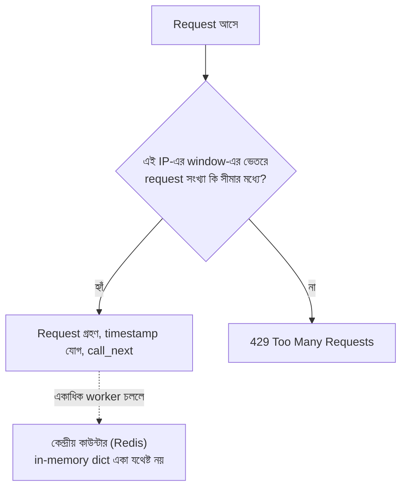

# ০৬. Module Recap with Rate Limiting Middleware

এই পর্যন্ত আমরা যে পথটা পাড়ি দিয়েছি সেটা একবার ঝালিয়ে নেই। আমরা রুটকে ফাইলে ফাইলে ভাগ করেছি (Router), তারপর ব্যবসায়িক লজিককে আলাদা করেছি (Service Layer), তারপর দেখেছি কীভাবে সাধারণ কাজগুলো — per-route কাজ (যেমন authentication) dependency দিয়ে, আর global কাজ (যেমন logging) middleware দিয়ে — সংগঠিত করা যায়। এখন এই middleware-এর ধারণা দিয়ে আমরা সমাধান করবো ব্যাকএন্ড ডেভেলপমেন্টের আরেকটা পরিচিত সমস্যা — **Rate Limiting**। এটা একটা global concern — সব রুটেই কমবেশি প্রযোজ্য — তাই এটা middleware-এর জন্য একটা ভালো উদাহরণ।

কল্পনা করো একটা ব্যাংকের শাখা, যেখানে একজন গ্রাহক প্রতি সেকেন্ডে ১০০ বার লাইনে দাঁড়িয়ে একই প্রশ্ন জিজ্ঞেস করছে। এতে অন্য গ্রাহকরা সেবা পাচ্ছে না, কর্মীরা ক্লান্ত হয়ে পড়ছে, পুরো শাখার কার্যক্ষমতা কমে যাচ্ছে। ঠিক এই একই জিনিস ঘটতে পারে একটা API-তে — একজন ইউজার (ইচ্ছাকৃতভাবে, বা কোনো bug-এর কারণে) সেকেন্ডে শত শত request পাঠাতে পারে, যেটা সার্ভারের রিসোর্স (CPU, মেমোরি, ডেটাবেজ কানেকশন) শেষ করে দিতে পারে, এমনকি পুরো সার্ভারকে অন্য সবার জন্য অকার্যকর করে দিতে পারে। এই আক্রমণকে অনেক সময় বলা হয় **DoS (Denial of Service)**, আর এমনকি সরল, দুর্ঘটনাবশত বাগ থেকেও একই ক্ষতি হতে পারে।

**Rate Limiting** হলো এই সমস্যার সমাধান — একটা নিয়ম যা বলে দেয়, "একজন নির্দিষ্ট ইউজার (বা IP address) একটা নির্দিষ্ট সময়ের মধ্যে সর্বোচ্চ এতগুলো request পাঠাতে পারবে, তার বেশি হলে তাকে সাময়িকভাবে আটকে দেয়া হবে।" চলো একটা সহজ, নিজে হাতে বানানো (hand-rolled) rate limiter middleware লিখি, যাতে ভেতরের যুক্তিটা স্পষ্ট বোঝা যায়:

```python
# middlewares/rate_limiter.py
import time
from collections import defaultdict
from fastapi import Request
from fastapi.responses import JSONResponse

request_log: dict[str, list[float]] = defaultdict(list)

WINDOW_SECONDS = 60   # ১ মিনিট সময়সীমা
MAX_REQUESTS = 5      # এই সময়ে সর্বোচ্চ ৫টা request


async def simple_rate_limiter(request: Request, call_next):
    ip = request.client.host
    now = time.time()

    # পুরনো (window-এর বাইরের) টাইমস্ট্যাম্পগুলো বাদ দিলাম
    request_log[ip] = [t for t in request_log[ip] if now - t < WINDOW_SECONDS]

    if len(request_log[ip]) >= MAX_REQUESTS:
        return JSONResponse(
            status_code=429,
            content={"success": False, "message": "অনেক বেশি request পাঠানো হয়েছে, একটু পরে আবার চেষ্টা করো"},
        )

    request_log[ip].append(now)
    return await call_next(request)
```

এখানে `429` স্ট্যাটাস কোডটা লক্ষণীয় — এটা HTTP-এর নির্দিষ্ট একটা কোড, যার নাম **"Too Many Requests"**, ঠিক এই পরিস্থিতির জন্যই তৈরি। আমরা এখানে প্রতিটা IP address-এর জন্য একটা তালিকা রাখছি তার সাম্প্রতিক request-এর সময়ের, আর প্রতিবার নতুন request এলে পুরনো (window-এর বাইরে চলে যাওয়া) টাইমস্ট্যাম্পগুলো ফেলে দিচ্ছি, তারপর দেখছি এখনো কতগুলো বৈধ request আছে। লক্ষ করো, সীমা পার হয়ে গেলে আমরা `call_next(request)` মোটেও ডাকিনি — সরাসরি একটা `JSONResponse` রিটার্ন করেছি, ঠিক যেমন লেসন ৪-এ শিখেছিলাম, request-টাকে এখানেই আটকে দেয়া।

এটাকে আমরা পুরো অ্যাপে বসাতে পারি:

```python
# main.py
from fastapi import FastAPI
from middlewares.rate_limiter import simple_rate_limiter

app = FastAPI()
app.middleware("http")(simple_rate_limiter)
```

বাস্তব প্রোডাকশন প্রজেক্টে অবশ্য নিজে থেকে এই লজিক লেখার বদলে সাধারণত `slowapi` নামের একটা জনপ্রিয় প্যাকেজ ব্যবহার করা হয় (এটা Flask-এর পরিচিত `flask-limiter`-এর FastAPI সংস্করণ থেকে অনুপ্রাণিত), কারণ সেটা আরও দক্ষভাবে এই একই কাজ করে, আর দরকার হলে Redis-এর সাথে জুড়ে দেওয়া সহজ করে দেয়:

```python
from slowapi import Limiter
from slowapi.util import get_remote_address

limiter = Limiter(key_func=get_remote_address)
app.state.limiter = limiter

@app.get("/products")
@limiter.limit("5/minute")
def list_products(request: Request):
    return {"message": "সব প্রোডাক্ট"}
```

লক্ষ করো, `slowapi`-র কনফিগারেশনটা আমাদের নিজে লেখা middleware-এর মূল ধারণার সাথে হুবহু মিলে যায় — একটা সময়ের জানালা, একটা সীমা। আমরা নিজে হাতে লিখে দেখালাম যাতে বুঝতে পারো একটা রেডিমেড প্যাকেজের ভেতরে আসলে কী ঘটছে — একটা প্যাকেজ ব্যবহার করা তখনই বুদ্ধিমানের কাজ, যখন তুমি জানো সেটা ভেতরে ভেতরে কী করছে।

**একটা গুরুত্বপূর্ণ প্রোডাকশন নুয়্যান্স** — উপরের `simple_rate_limiter`-এ `request_log` ডিকশনারিটা পাইথন প্রসেসের মেমোরিতে রাখা হয়েছে (in-memory)। এটা লোকালি টেস্ট করার সময় দিব্যি কাজ করবে, কিন্তু প্রোডাকশনে যখন তুমি Gunicorn বা Uvicorn workers দিয়ে একই অ্যাপ্লিকেশনের **একাধিক প্রসেস** চালাবে (যেমন `gunicorn -w 4 main:app`), তখন প্রতিটা worker-এর নিজস্ব আলাদা মেমোরি থাকে — তার মানে `request_log` ডিকশনারিটাও চারবার আলাদাভাবে তৈরি হবে, প্রতিটা worker তার নিজের কাউন্ট রাখবে, একে অপরের হিসাব জানবে না। ফলাফল — একজন ইউজার আসলে সীমার ৪ গুণ বেশি request পাঠিয়ে ফেলতে পারবে, শুধু ভাগ্যক্রমে বিভিন্ন worker-এর হাতে request পড়ার কারণে, আর rate limiter নিজেই সেটা কখনো ধরতে পারবে না। এই সমস্যার সমাধান হলো কাউন্ট রাখার জায়গাটা প্রতিটা worker-এর নিজের মেমোরির বাইরে নিয়ে যাওয়া — সাধারণত **Redis**-এ, যেখানে সব worker একই কেন্দ্রীয় কাউন্টার দেখে আর আপডেট করে। `slowapi` আর `express-rate-limit`-এর মতোই, প্রোডাকশন-মানের rate limiting লাইব্রেরিগুলো একটা Redis backend কনফিগার করার সুযোগ ঠিক এই কারণেই রাখে।



Rate limiting আমাদের সার্ভারকে অতিরিক্ত ব্যবহার থেকে রক্ষা করে। কিন্তু নিরাপত্তার আরেকটা গুরুত্বপূর্ণ দিক আছে, যেটা rate limiting সমাধান করে না — যদি কিছু একটা ভুল হয়, বা সন্দেহজনক কিছু ঘটে, তাহলে আমরা কীভাবে জানবো কে, কখন, কী করেছিলো? এই প্রশ্নের উত্তরেই পরের লেসনে আমরা বানাবো একটা **Audit Logger**।
