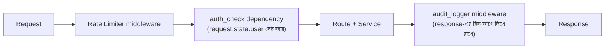

# ০৭. Audit Logger Project

ধরো একদিন সকালে দেখা গেলো, একটা প্রোডাক্টের দাম হঠাৎ ভুলভাবে বদলে গেছে, অথবা একজন ইউজারের অ্যাকাউন্ট ডিলিট হয়ে গেছে যেটা হওয়ার কথা ছিলো না। প্রশ্ন উঠবে — এটা কে করলো, কখন করলো, ঠিক কী request পাঠিয়েছিলো? যদি তোমার সিস্টেমে এই প্রশ্নের কোনো উত্তর না থাকে, তাহলে তুমি একটা অন্ধকারে হাতড়ানোর মতো পরিস্থিতিতে পড়ে যাবে। এই সমস্যার সমাধান হলো **Audit Logging** — সিস্টেমের গুরুত্বপূর্ণ প্রতিটা কাজের একটা স্থায়ী রেকর্ড রাখা, ঠিক যেমন একটা ব্যাংকের প্রতিটা লেনদেনের একটা রশিদ থাকে, যাতে পরে দরকার হলে পুরো ইতিহাসটা ফিরে দেখা যায়।

Audit logging আর সাধারণ ডিবাগ লগিং (যেমন আমরা লেসন ৫-এ বানানো `request_logger`) এক জিনিস না, যদিও দুটোই middleware দিয়ে বানানো যায়। ডিবাগ লগ মূলত ডেভেলপারের জন্য, সাময়িক, আর প্রায়ই কনসোলেই থেকে যায়। কিন্তু **audit log** হলো একটা দায়বদ্ধতার (accountability) রেকর্ড — কে করলো, কী করলো, কখন করলো — যেটা সাধারণত স্থায়ীভাবে সংরক্ষণ করা হয় (ফাইলে, বা ডেটাবেজে), কারণ এটা প্রায়ই আইনি বা নিরাপত্তাজনিত কারণে পরে যাচাই করার দরকার পড়ে। আর এটা একটা global concern — সব "পরিবর্তনমূলক" রুটে সমানভাবে চলা উচিত — তাই middleware-ই এর সঠিক জায়গা।

একটা ছোট কিন্তু গুরুত্বপূর্ণ চ্যালেঞ্জ আছে এখানে। লেসন ৫-এ `auth_check` একটা **dependency**, আর এটার রিটার্ন ভ্যালু (`current_user`) সরাসরি শুধু রুট ফাংশনের ভেতরে পাওয়া যায় — middleware সেটা সরাসরি দেখতে পায় না, কারণ middleware চলে dependency resolve হওয়ার *আগে*। এই সমস্যার সমাধান হলো FastAPI-র `request.state` — একটা জায়গা যেখানে dependency চাইলে তথ্য রেখে যেতে পারে, আর middleware (response পাঠানোর ঠিক আগে) সেটা পড়তে পারে।

প্রথমে `auth_check` dependency-টা একটু বদলে দিই, যাতে এটা `request.state.user`-এ তথ্য রেখে যায়:

```python
# dependencies/auth.py
from fastapi import Header, HTTPException, Request


def auth_check(request: Request, authorization: str = Header(default=None)):
    if not authorization:
        raise HTTPException(status_code=401, detail="অনুমতি নেই — টোকেন পাওয়া যায়নি")
    if authorization != "Bearer my-secret-token":
        raise HTTPException(status_code=403, detail="ভুল টোকেন — প্রবেশাধিকার নিষিদ্ধ")

    user = {"id": 1, "name": "রহিম"}
    request.state.user = user  # পরে middleware এখান থেকে পড়বে
    return user
```

এবার audit logger middleware লিখি, যেটা প্রতিটা "পরিবর্তনমূলক" request (POST, PUT, DELETE) একটা ফাইলে রেকর্ড করে রাখবে:

```python
# middlewares/audit_logger.py
import json
from datetime import datetime, timezone
from pathlib import Path
from fastapi import Request

LOG_FILE = Path(__file__).parent.parent / "audit.log"

WRITE_METHODS = {"POST", "PUT", "DELETE"}


async def audit_logger(request: Request, call_next):
    response = await call_next(request)  # আগে আসল কাজটা হয়ে যাক, response তৈরি হোক

    if request.method in WRITE_METHODS:
        user = getattr(request.state, "user", None)
        entry = {
            "time": datetime.now(timezone.utc).isoformat(),
            "method": request.method,
            "path": request.url.path,
            "user": user["name"] if user else "অজানা (auth ছাড়া)",
            "ip": request.client.host,
            "status": response.status_code,
        }
        with LOG_FILE.open("a", encoding="utf-8") as f:
            f.write(json.dumps(entry, ensure_ascii=False) + "\n")

    return response
```

এই কোডে কয়েকটা বিষয় লক্ষ করার মতো। প্রথমত, আমরা `await call_next(request)`-কে ফাংশনের *শুরুতেই* কল করেছি, রুট আর dependency চলে যাওয়ার পরের response-টা হাতে পাওয়ার জন্য — এটাই সেই সুযোগ যা আগের লেসনে বলেছিলাম, FastAPI middleware `call_next`-এর পরেও কোড চালাতে পারে। এভাবে আমরা response-এর `status_code`-টাও লগে রেখে দিতে পারছি, যেটা ব্যর্থ হওয়া অপারেশনও (যেমন `403`) রেকর্ড করে রাখে। দ্বিতীয়ত, আমরা `request.state.user` ব্যবহার করছি — dependency-র বসিয়ে যাওয়া তথ্য মিডলওয়্যারে পড়ার এই প্যাটার্নটা মনে রাখা জরুরি, কারণ dependency আর middleware আলাদা লেয়ার হলেও `request.state` দুটোর মধ্যে একটা সংযোগ তৈরি করে দেয়। তৃতীয়ত, ফাইলে লেখাটা এখানে synchronous (`with LOG_FILE.open(...)`) রাখা হয়েছে সরলতার জন্য — বাস্তব প্রোডাকশন সিস্টেমে ভারী I/O-এর জন্য `aiofiles`-এর মতো async লাইব্রেরি বা একটা ব্যাকগ্রাউন্ড টাস্ক কিউ ব্যবহার করা হয়, যাতে ফাইলে লেখা শেষ হওয়া পর্যন্ত ইভেন্ট লুপ ব্লক না হয়।

এবার এটাকে অ্যাপে বসাই। FastAPI-তে middleware-এর ক্রম গুরুত্বপূর্ণ, কিন্তু একটু উল্টো দিক থেকে ভাবতে হয় Express.js-এর তুলনায় — যে middleware সবার *শেষে* `app.middleware(...)` দিয়ে যোগ করা হয়, request-এর জন্য সেটাই সবার *আগে* চলে (এটা একটা স্ট্যাক-এর মতো আচরণ করে):

```python
# main.py
from fastapi import FastAPI
from middlewares.rate_limiter import simple_rate_limiter
from middlewares.audit_logger import audit_logger
from routers.product_router import router as product_router

app = FastAPI()
app.include_router(product_router)

app.middleware("http")(audit_logger)       # request-এর জন্য এটা পরে চলে
app.middleware("http")(simple_rate_limiter)  # request-এর জন্য এটা আগে চলে
```



চালানোর পর `audit.log` ফাইলে এরকম এন্ট্রি জমা হতে থাকবে:

```
{"time": "2026-08-08T10:15:32.120000+00:00", "method": "POST", "path": "/products", "user": "রহিম", "ip": "127.0.0.1", "status": 201}
{"time": "2026-08-08T10:16:05.400000+00:00", "method": "DELETE", "path": "/products/3", "user": "অজানা (auth ছাড়া)", "ip": "127.0.0.1", "status": 401}
```

এই ধরনের একটা লগ ফাইল থেকে পরে যেকোনো সময় প্রশ্নের উত্তর বের করা যায় — কে, কবে, কী পরিবর্তন করতে চেয়েছিলো (সফল হোক বা ব্যর্থ)। বাস্তব প্রোডাকশন সিস্টেমে এই লগ সাধারণত ফাইলের বদলে একটা ডেটাবেজে বা বিশেষায়িত লগিং সার্ভিসে (যেমন CloudWatch, Datadog) পাঠানো হয়, কিন্তু মূল নীতিটা একই থাকে — একটা middleware যা প্রতিটা গুরুত্বপূর্ণ কাজের ছাপ রেখে যায়।

এই প্রজেক্টটা দিয়ে আমরা middleware আর dependency-র ধারণাটাকে একটা বাস্তব, উৎপাদন-মানের ফিচারে রূপান্তরিত করলাম। এখন router, service layer, authentication dependency, rate limiting middleware, আর audit logging middleware — সবগুলো টুকরা আমাদের হাতে আছে। পরের লেসনে আমরা একটু ভিন্নভাবে এগোবো — rate limiting-এর পেছনের অ্যালগরিদমগুলো নিয়ে আরও গভীরে চিন্তা করবো।
