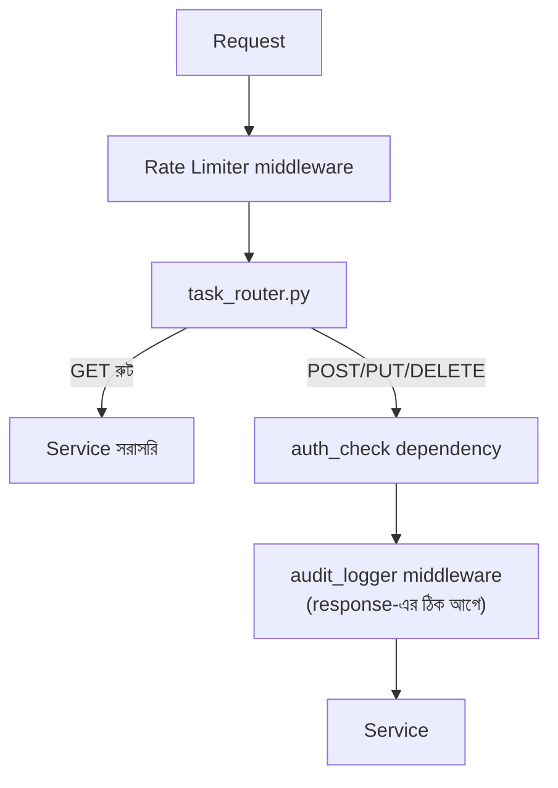

# ১০. Assignment

এই মডিউলে আমরা যা যা শিখেছি — router দিয়ে রুট ভাগ করা, service layer দিয়ে লজিক আলাদা করা, dependency দিয়ে authentication আর middleware দিয়ে rate limiting আর audit logging বসানো — এখন সময় হয়েছে এগুলো একসাথে জোড়া দিয়ে নিজের হাতে একটা সম্পূর্ণ, ছোট কিন্তু বাস্তবসম্মত FastAPI প্রজেক্ট বানানোর। এই অ্যাসাইনমেন্টটাই এই মডিউলের আসল পরীক্ষা, কারণ আলাদা আলাদা লেসনে টুকরা টুকরা কোড বোঝা এক কথা, আর সেগুলোকে নিজে একসাথে সাজিয়ে একটা কাজ করা সিস্টেম দাঁড় করানো সম্পূর্ণ আলাদা একটা দক্ষতা।

তোমার কাজ হলো একটা **"টাস্ক ম্যানেজমেন্ট" (Task Management) API** বানানো, যেটা নিচের কাঠামো আর ফিচারগুলো মেনে চলবে।

**প্রজেক্ট স্ট্রাকচার** এমন হতে হবে যেন এই মডিউলে শেখা বিভাজন স্পষ্ট বোঝা যায়:

```
task-manager/
├── main.py
├── requirements.txt
├── routers/
│   └── task_router.py
├── services/
│   └── task_service.py
├── dependencies/
│   └── auth.py
├── middlewares/
│   ├── rate_limiter.py
│   └── audit_logger.py
└── audit.log
```

**এন্ডপয়েন্টগুলো** নিচের মতো হওয়া উচিত, `task_router.py` আর `task_service.py`-এ ভাগ করে লেখা:

- `GET /tasks` — সব টাস্কের তালিকা দেখাবে, কারো authentication লাগবে না।
- `GET /tasks/{task_id}` — নির্দিষ্ট একটা টাস্ক দেখাবে, authentication লাগবে না।
- `POST /tasks` — নতুন টাস্ক তৈরি করবে, শুধু authentication করা ইউজারের জন্য। Module 6 লেসন ৫-এর মতো validation থাকতে হবে (Pydantic মডেল ব্যবহার করে) — `title` ফাঁকা হলে `400` জবাব দেবে।
- `PUT /tasks/{task_id}` — টাস্কের তথ্য আপডেট করবে, শুধু authentication করা ইউজারের জন্য।
- `DELETE /tasks/{task_id}` — টাস্ক ডিলিট করবে, শুধু authentication করা ইউজারের জন্য।

**Middleware আর Dependency-র প্রয়োগ** নিচের নিয়ম মেনে হতে হবে — এই মডিউলের সবচেয়ে গুরুত্বপূর্ণ শিক্ষাটাই এখানে পরীক্ষা করা হচ্ছে, তাই কোনটা middleware আর কোনটা dependency হবে সেই সিদ্ধান্তটা ইচ্ছামতো না, লেসন ৪-এর নিয়ম মেনে নিতে হবে:

- একটা `auth_check` **dependency** থাকবে (লেসন ৫-এর প্যাটার্ন অনুসরণ করে, `Depends()` দিয়ে), যেটা `POST`, `PUT`, `DELETE` রুটে বসবে, কিন্তু `GET` রুটে বসবে না। এটা dependency হবে, middleware না — কারণ এটা per-route সিদ্ধান্ত, সব রুটে না।
- একটা rate limiter **middleware** থাকবে (লেসন ৬-এর প্যাটার্ন অনুসরণ করে, নিজে হাতে লেখা অথবা `slowapi` ব্যবহার করে), যেটা পুরো অ্যাপ্লিকেশনের সব রুটে প্রযোজ্য হবে — কোনো একটা IP থেকে ১ মিনিটে ১০টার বেশি request এলে `429` জবাব দেবে। এটা middleware হবে, dependency না — কারণ এটা global, ব্যতিক্রমহীন একটা নিয়ম।
- একটা `audit_logger` **middleware** থাকবে (লেসন ৭-এর প্যাটার্ন অনুসরণ করে), যেটা শুধু `POST`, `PUT`, `DELETE` request-এর জন্য `audit.log` ফাইলে একটা এন্ট্রি লিখবে — কে (ইউজারের নাম, `request.state.user` থেকে পড়ে), কী (মেথড আর পাথ), আর কখন (টাইমস্ট্যাম্প)।

**গ্রহণযোগ্যতার মানদণ্ড (Acceptance Criteria)** নিচেরগুলো পূরণ হলে ধরে নেবে তোমার প্রজেক্ট সম্পূর্ণ:

১. `main.py` ফাইলে কোনো সরাসরি রুট ডেফিনিশন (`@app.get`, `@app.post` ইত্যাদি) থাকবে না, `/docs` বা health-check ছাড়া — শুধু middleware বসানো আর router মাউন্ট (`app.include_router`) করা থাকবে।
২. `task_router.py`-এ কোনো ব্যবসায়িক লজিক থাকবে না — শুধু পাথ, মেথড, আর কোন dependency/service ফাংশন চলবে তার তালিকা থাকবে।
৩. authentication টোকেন ছাড়া `POST /tasks` কল করলে `401` জবাব আসবে, service-এর কোড এক্সিকিউটই হবে না।
৪. এক মিনিটে ১০টার বেশি request পাঠালে `429` জবাব আসতে শুরু করবে।
৫. যেকোনো সফল `POST`/`PUT`/`DELETE` request-এর পর `audit.log` ফাইলে একটা নতুন লাইন যোগ হবে।
৬. `title` ছাড়া `POST /tasks` কল করলে `400` (বা Pydantic ব্যবহার করলে FastAPI-র স্বাভাবিক `422`) জবাব আসবে, কোনো টাস্ক তৈরি হবে না।

এই অ্যাসাইনমেন্টটা টেস্ট করার জন্য FastAPI-র স্বয়ংক্রিয়ভাবে জেনারেট হওয়া `/docs` পেজ (Swagger UI), Postman, বা `curl` ব্যবহার করে প্রতিটা পরিস্থিতি নিজে চালিয়ে দেখো — সফল কেস, ব্যর্থ authentication, ভুল ডেটা, আর অতিরিক্ত request পাঠানোর কেস। প্রতিটা ক্ষেত্রে সার্ভার কী জবাব দিচ্ছে সেটা মিলিয়ে দেখো উপরের মানদণ্ডের সাথে।



এই অ্যাসাইনমেন্ট শেষ করলে তোমার হাতে একটা প্রজেক্ট থাকবে যেটার স্ট্রাকচার প্রায় বাস্তব প্রোডাকশন কোডবেজের মতো — routing, business logic, security, আর monitoring পরিষ্কারভাবে আলাদা আলাদা স্তরে সাজানো। এখন পর্যন্ত আমরা যে ডেটা নিয়ে কাজ করেছি (টাস্ক, ইউজার, প্রোডাক্ট) সবই সহজ, ইন-মেমোরি অবজেক্ট বা লিস্ট হিসেবে রাখা হয়েছে। কিন্তু বাস্তব অ্যাপ্লিকেশনে ডেটা আরও গঠিত, আরও জটিল সম্পর্কযুক্ত হয় — আর ঠিক সেই বিষয়টা নিয়েই পরের মডিউলে আমরা গভীরে যাচ্ছি: **Module 8 — Data Modeling Part One**, যেখানে আমরা শিখবো Object-Oriented চিন্তাভাবনা, JSON আর Pydantic মডেলের প্রকৃত ভূমিকা, আর কীভাবে বাস্তব ডেটাকে সুচিন্তিতভাবে মডেল করতে হয়।
