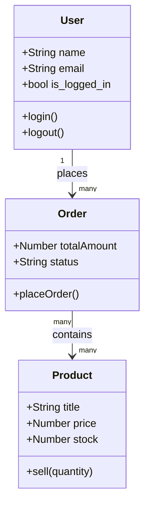

# ০২. Object Oriented Coding In Real Life

আগের লেসনে আমরা গাড়ির উদাহরণ দিয়ে OOP-এর মূল ধারণাটা বুঝেছি — properties আর methods মিলিয়ে একটা object, আর সেই object-দের নকশা হলো class। এখন আমরা এই ধারণাটাকে সত্যিকারের ব্যাকএন্ড ডেভেলপমেন্টের প্রেক্ষাপটে নিয়ে আসবো, কারণ শুধু গাড়ির উদাহরণ মনে রাখলে চলবে না — প্রতিদিনের কাজে আমাদের চিন্তা করতে হবে **User**, **Product**, **Order**-এর মতো এন্টিটি নিয়ে।

ধরো তুমি একটা ই-কমার্স ওয়েবসাইট বানাচ্ছো। প্রথম প্রশ্নটা হওয়া উচিত — এই সিস্টেমে কোন কোন "জিনিস" বা "এন্টিটি" আছে, যাদের নিজস্ব পরিচয়, বৈশিষ্ট্য আর আচরণ আছে? একটু চিন্তা করলেই বোঝা যায় — একজন **User** আছে, যার নাম, ইমেইল, পাসওয়ার্ড আছে, আর সে লগইন/লগআউট করতে পারে। একটা **Product** আছে, যার নাম, দাম, স্টক পরিমাণ আছে। এই প্রতিটা এন্টিটিকে আমরা আলাদা আলাদা class হিসেবে মডেল করতে পারি।

চলো `User` class দিয়ে শুরু করি:

```python
class User:
    def __init__(self, name, email, password):
        self.name = name
        self.email = email
        self.password = password  # বাস্তবে পাসওয়ার্ড কখনো plain text-এ রাখা হয় না, hash করে রাখা হয়
        self.is_logged_in = False

    def login(self):
        self.is_logged_in = True
        print(f"{self.name} লগইন করেছে।")

    def logout(self):
        self.is_logged_in = False
        print(f"{self.name} লগআউট করেছে।")


arman = User("আরমান", "arman@example.com", "hashed_password_123")
arman.login()  # আরমান লগইন করেছে।
```

আর `Product` class-টা দেখা যাক:

```python
class Product:
    def __init__(self, title, price, stock):
        self.title = title
        self.price = price
        self.stock = stock

    def sell(self, quantity):
        if quantity > self.stock:
            print("পর্যাপ্ত স্টক নেই!")
            return
        self.stock -= quantity
        print(f"{quantity} টি {self.title} বিক্রি হলো। বাকি স্টক: {self.stock}")


shoe = Product("রানিং শু", 1500, 20)
shoe.sell(3)  # ৩ টি রানিং শু বিক্রি হলো। বাকি স্টক: ১৭
```

লক্ষ্য করো, প্রতিটা class-এর ভেতরের method-গুলো শুধু ডেটা দেখায় না, বরং সেই ডেটার উপর ভিত্তি করে সিদ্ধান্তও নেয় — যেমন `sell()` method চেক করে স্টক আছে কিনা, তারপর সিদ্ধান্ত নেয়। এটাই OOP-এর আসল শক্তি — ডেটা আর সেই ডেটা নিয়ে কী করা যাবে, এই দুটোকে একসাথে একই জায়গায় গুছিয়ে রাখা। একে বলা হয় **encapsulation** — object তার নিজের ডেটা আর সেই ডেটা পরিবর্তনের নিয়মকানুন নিজের ভেতরেই "মুড়িয়ে" রাখে।

বাস্তব একটা ই-কমার্স সিস্টেমে User আর Product ছাড়াও Order নামের আরেকটা এন্টিটি থাকে, যেটা এই দুটোকে একসাথে যুক্ত করে — কোন User কোন Product কিনেছে। এই সম্পর্কগুলো একটা classDiagram-এ দেখলে পুরো ছবিটা পরিষ্কার হয়ে যায়:



এই ডায়াগ্রামটা আসলে একটা মিনি "ব্লুপ্রিন্ট" — কোডে হাত দেওয়ার আগেই আমরা বুঝে ফেলছি সিস্টেমে কী কী এন্টিটি থাকবে, আর তাদের মধ্যে সম্পর্ক কেমন। এই ধরনের চিন্তা আমরা Module 6-এ ডেটা মডেলিং আর ভ্যালিডেশন শেখার সময় সংক্ষেপে ছুঁয়ে গিয়েছিলাম; এখন আমরা সেটাকে আরও গঠিতভাবে করছি।

এখন প্রশ্ন হলো — এই class আর object-এর ভেতরের ডেটাগুলো, যখন frontend থেকে backend-এ বা backend থেকে database-এ পাঠাতে হয়, তখন কোন ফরম্যাটে পাঠানো হয়? উত্তরটা হলো এমন একটা ফরম্যাট, যেটা প্রায় প্রতিটা প্রোগ্রামিং ভাষা আর প্রতিটা সিস্টেম বুঝতে পারে — এটাই আমাদের পরের লেসনের বিষয়, **JSON**।
