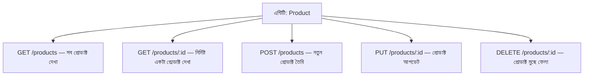

# ০৫. How to Approach API Design? Keeping Data Modeling in Mind

নতুন ডেভেলপাররা প্রায়ই একটা সাধারণ ভুল করে — প্রজেক্ট শুরু হওয়ার সাথে সাথে সরাসরি কোড লিখতে বসে যায়, `app.post()` লিখে ফেলে, তারপর মাঝপথে বুঝতে পারে যে ডেটার গঠনটাই ভুল ছিল, আর তখন পুরো কাঠামো ভেঙে আবার বানাতে হয়। এটা অনেকটা এমন, যেন কেউ ঘরের নকশা না করেই ইট গাঁথা শুরু করে দিলো — কোথায় দরজা বসবে, কোথায় জানালা, সেটা পরে ঠিক করবে। বাস্তবে ভালো ইঞ্জিনিয়াররা উল্টো পথে হাঁটে — আগে নকশা, তারপর নির্মাণ। API ডিজাইনেও ঠিক এই নিয়মটা প্রযোজ্য।

তাহলে কোড লেখার আগে ঠিক কী কী প্রশ্নের উত্তর খুঁজে বের করা উচিত? চলো একটা ধাপে ধাপে চিন্তার প্রক্রিয়া তৈরি করি।

**প্রথম প্রশ্ন — সিস্টেমে কী কী এন্টিটি আছে?** Module 8-এর দ্বিতীয় লেসনে আমরা যেভাবে User, Product, Order-কে আলাদা এন্টিটি হিসেবে চিহ্নিত করেছিলাম, প্রতিটা নতুন প্রজেক্টেই এই কাজটা প্রথমে করতে হয়। কাগজে বা মাথায় লিখে ফেলো — "এই অ্যাপে কোন কোন বাস্তব জিনিস থাকবে, যাদের নিজস্ব ডেটা আর আচরণ আছে?"

**দ্বিতীয় প্রশ্ন — প্রতিটা এন্টিটির কী কী ফিল্ড (property) দরকার?** এখানে অতিরিক্ত ফিল্ড যোগ করার লোভ সামলাতে হয়। একটা ভালো অভ্যাস হলো — শুধু সেই ফিল্ডগুলো রাখা, যেগুলো সত্যিই ব্যবহার হবে। Module 6-এ আমরা ডেটা ভ্যালিডেশন শিখেছিলাম — কোন ফিল্ড আবশ্যিক (required), কোনটা ঐচ্ছিক (optional), এই সিদ্ধান্তগুলোও এই ধাপেই নেওয়া উচিত।

**তৃতীয় প্রশ্ন — এন্টিটিগুলোর মধ্যে সম্পর্ক কেমন?** একটা Order কি একটা মাত্র Product ধারণ করবে, নাকি একাধিক? একজন User কি একাধিক Order করতে পারবে? এই সম্পর্কগুলো বোঝা মানেই তোমার ডেটাবেজ আর JSON রেসপন্সের গঠন কেমন হবে সেটা আগে থেকেই স্পষ্ট হয়ে যাওয়া।

**চতুর্থ প্রশ্ন — কোন কোন কাজ (operation) দরকার?** প্রতিটা এন্টিটির উপর সাধারণত চারটা মৌলিক কাজ করা লাগে — তৈরি করা (Create), পড়া (Read), পরিবর্তন করা (Update), মুছে ফেলা (Delete)। একসাথে এদের বলা হয় **CRUD**। প্রতিটা কাজের জন্য একটা করে endpoint দরকার হবে।

এই চারটা প্রশ্নের উত্তর একসাথে সাজালে একটা এন্টিটির জন্য endpoint-এর তালিকা এভাবে দাঁড়ায়:

লক্ষ্য করো, HTTP method (GET, POST, PUT, DELETE) নিজেই বলে দিচ্ছে কাজটা কী ধরনের — এটা একটা প্রচলিত নিয়ম (convention), যেটা মেনে চললে অন্য ডেভেলপাররাও তোমার API সহজে বুঝতে পারবে।

এই পুরো চিন্তার প্রক্রিয়াটা যদি একটা বাক্যে বলি — কোড লেখার আগে কাগজে বা মাথায় উত্তর দাও: **কী ডেটা আছে (entities + fields), কীভাবে তারা একে অপরের সাথে যুক্ত (relationships), আর তাদের নিয়ে কী কাজ করা যাবে (operations)।** এই তিনটা প্রশ্নের উত্তর স্পষ্ট থাকলে কোড লেখাটা হয়ে যায় শুধু সেই নকশাকে বাস্তবায়ন করার কাজ, অনুমান করে করে এগোনোর কাজ না।

তত্ত্বীয়ভাবে এই প্রক্রিয়াটা বোঝা একটা ব্যাপার, কিন্তু বাস্তব একটা উদাহরণে প্রয়োগ করে দেখা আরেকটা ব্যাপার। পরের লেসনে আমরা ঠিক এই চারটা প্রশ্ন ব্যবহার করে একটা সত্যিকারের ই-কমার্স Product API ডিজাইন করবো, শুরু থেকে শেষ পর্যন্ত।
