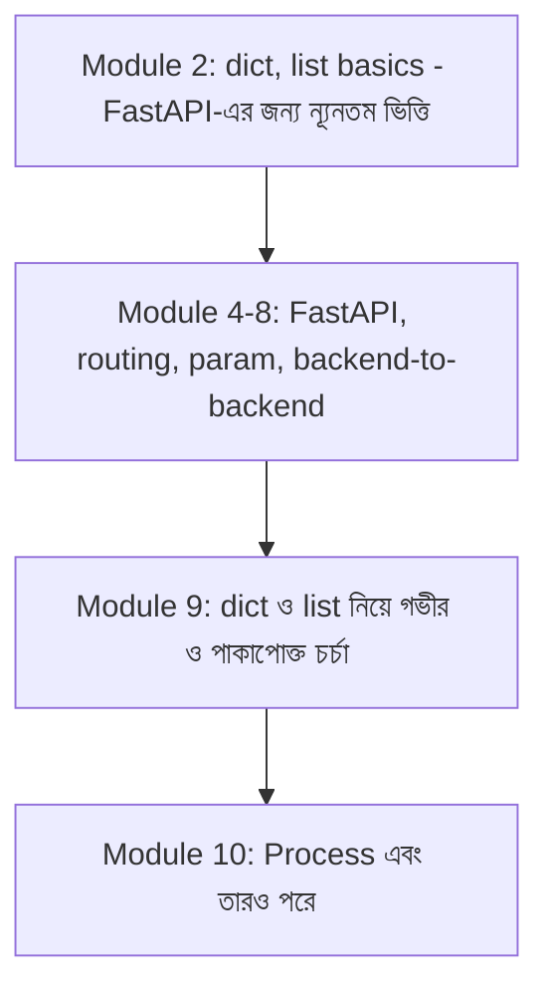

# ০১. Module Introduction

গত কয়েকটা মডিউলে আমরা অনেকটা পথ পেরিয়ে এসেছি। Module 4-এ আমরা FastAPI দিয়ে সার্ভার বানানো শিখেছি, Module 5-এ শিখেছি asynchronous কোড কীভাবে কাজ করে, আর Module 6, 7, 8-এ আমরা সত্যিকারের API বানিয়েছি — routing, path/query parameter, backend-to-backend call, এমনকি Express.js-এর সাথে তুলনা করে ব্যাকএন্ডের মূল ধারণাগুলো ভাষা-নিরপেক্ষ কীভাবে সেটাও দেখেছি।

এতটা পথ পেরিয়ে আসার পর একটা স্বাভাবিক প্রশ্ন উঠতে পারে — "আমরা তো এখন সত্যিকারের API বানাতে পারি, তাহলে আবার নতুন করে dict আর list নিয়ে একটা পুরো মডিউল কেন?"

উত্তরটা একটা বাস্তব অভিজ্ঞতা থেকে আসে। ধরো তুমি একটা বাড়ি বানিয়ে ফেলেছো — দেয়াল উঠেছে, ছাদ হয়েছে, রঙও করা হয়ে গেছে। কিন্তু ভিতের (foundation) কংক্রিট যদি পুরোপুরি শক্ত না হয়, তাহলে বাড়িটা কিছুদিন পর ফাটল ধরতে শুরু করে — আর সেই ফাটলগুলো সবচেয়ে বেশি দেখা যায় ঠিক তখন, যখন প্রোডাকশনে হাজার হাজার রিকোয়েস্ট একসাথে আসে, আর তোমার লেখা একটা `for` লুপ বা একটা "সহজ" dict lookup আচমকা `KeyError` বা `O(n²)` স্লো-ডাউন তৈরি করে। Module 2-এ আমরা list comprehension, dict, আর basic function-এর সাথে পরিচিত হয়েছি খুব দ্রুত গতিতে, কারণ সেই মডিউলের মূল লক্ষ্য ছিলো FastAPI-এর জন্য দরকারি ন্যূনতম ভিত্তি তৈরি করা। এই মডিউলে আমরা সেই ভিতটাকেই আরেকবার শক্ত করে ঢালাই করবো — ধীরে, গভীরভাবে, প্রতিটা খুঁটিনাটি আর প্রোডাকশনে যেসব ভুল সবচেয়ে বেশি হয় সেগুলো নিয়ে।

কেন এটা গুরুত্বপূর্ণ ব্যাকএন্ড ডেভেলপমেন্টের জন্য? কারণ ব্যাকএন্ডে যা কিছু ঘটে — একটা ইউজারের তথ্য, একটা অর্ডারের লিস্ট, একটা প্রোডাক্টের ক্যাটালগ — সবকিছুই শেষ পর্যন্ত Python-এর `dict` আর `list` দিয়েই প্রকাশ পায়, তারপর সেটা `dataclass` বা Pydantic model-এর মতো একটু বেশি গোছানো কাঠামোতে রূপ নেয়। Node.js-ভিত্তিক পুরনো ভার্সনের কোর্সে ঠিক এই জায়গায় object আর array নিয়ে একটা গভীর মডিউল ছিলো — কারণ JavaScript-এ সবকিছু object আর array দিয়েই প্রকাশ পায়। Python-এ সমতুল্য ধারণাগুলো আছে, কিন্তু তাদের নিজের নিয়ম-কানুন, নিজের ফাঁদ, আর নিজের elegance আছে — আর সেগুলোই এই মডিউলে আমরা খুঁটিয়ে দেখবো।

এই মডিউলে আমরা যা করবো তার একটা রোডম্যাপ দিয়ে রাখি। প্রথমে ডেটা টাইপ আর object-এর গঠন নিয়ে কথা বলবো — `dict`, `dataclass`, আর Pydantic model-এর মধ্যে সীমারেখা কোথায় সেটা স্পষ্ট করবো। তারপর বাস্তব জীবনের উদাহরণ দিয়ে "object"-এর ধারণা বুঝবো। এরপর list আর list of dicts — যেটা প্রায় প্রতিটা API রেসপন্সের আসল রূপ। তারপর destructuring/unpacking শিখবো, যেটা কোড লেখাকে অনেক পরিষ্কার করে দেয়, সাথে সাথে দেখবো এখানে কোন কোন সাধারণ ভুল হয়। শেষে আমরা backend-এ সবচেয়ে বেশি ব্যবহৃত প্যাটার্নগুলো — list comprehension দিয়ে filter, search, pagination-এর মতো জিনিস — একসাথে জোড়া দেবো, আর দেখবো কখন list comprehension ব্যবহার করা উচিত, কখন না।

তাহলে চলো শুরু করি একদম গোড়া থেকে — Python-এর ডেটা টাইপ আর object দিয়ে।
