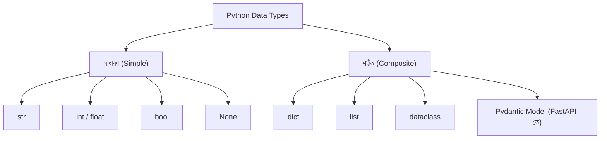
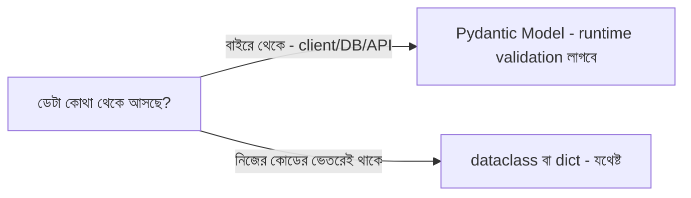

# ০২. Python Data Types and Objects

একটা ফাইলিং ক্যাবিনেটের কথা কল্পনা করো। কিছু ড্রয়ারে থাকে একটা করে কাগজ — একটা নাম, একটা সংখ্যা, একটা তারিখ। আর কিছু ড্রয়ারে থাকে পুরো একটা ফোল্ডার, যার ভেতরে আবার অনেকগুলো কাগজ গোছানো থাকে, একটার সাথে আরেকটা সম্পর্কিত। Python-এর ডেটা টাইপগুলোকেও ঠিক এভাবে ভাগ করা যায় — সাধারণ (একলা কাগজ) আর গঠিত/composite (গোছানো ফোল্ডার)।

সাধারণ টাইপগুলো হলো সবচেয়ে মৌলিক, একক মান বহনকারী টাইপ — `str` (টেক্সট), `int`/`float` (সংখ্যা), `bool` (`True`/`False`), আর `None` (কিছু নেই)। Module 2-এ আমরা এগুলোর সাথে প্রাথমিকভাবে পরিচিত হয়েছিলাম।

```python
name = "Arman"
age = 25
is_active = True
city = None  # ইচ্ছাকৃতভাবে "কিছু নেই" বোঝানো হচ্ছে

print(type(name))       # <class 'str'>
print(type(age))        # <class 'int'>
print(type(is_active))  # <class 'bool'>
```

`type()` ফাংশনটা একটা ডিটেক্টিভের মতো কাজ করে — যেকোনো ভ্যারিয়েবলের ভেতরে কী ধরনের মান লুকিয়ে আছে, সেটা বলে দেয়। ব্যাকএন্ড ডেভেলপমেন্টে এটা প্রায়ই দরকার হয় — যেমন ধরো ইউজার একটা ফর্মে বয়স লিখলো, কিন্তু সেটা টেক্সট হিসেবে এসেছে নাকি নাম্বার হিসেবে, সেটা যাচাই করার জন্য।

একটা লক্ষ্য করার মতো পার্থক্য — JavaScript-এ `undefined` আর `null` দুটো আলাদা "খালি" ধারণা আছে, Python-এ শুধু `None` আছে। এটা আসলে সরলীকরণ, কিন্তু একটা সাধারণ ভুল এখানে হয় — dict-এ একটা key না থাকা, আর key থাকলেও তার মান `None` হওয়া — এই দুটো এক জিনিস না। `user.get("nickname")` করলে key না থাকলে `None` ফেরত আসবে, কিন্তু key থেকেও যদি ইচ্ছাকৃতভাবে `None` সেট করা থাকে, তাহলেও একই `None` ফেরত আসবে। দুই অবস্থা আলাদা করে বুঝতে চাইলে `"nickname" in user` দিয়ে যাচাই করতে হয়, নাহলে "ইউজার নিকনেম দেয়নি" আর "ইউজার ইচ্ছা করে নিকনেম খালি রেখেছে" — এই দুইয়ের মধ্যে গুলিয়ে ফেলার মতো বাগ হতে পারে, যা সচরাচর প্রোডাকশন কোডে "কেন এই ফিল্ড সবসময় None দেখাচ্ছে" জাতীয় ডিবাগিং সেশনের কারণ হয়ে দাঁড়ায়।

আসল গল্পটা শুরু হয় `dict` দিয়ে। একটা `dict` হলো related তথ্যের একটা গুচ্ছ, key-value জোড়া আকারে সাজানো।

```python
student = {
    "name": "Arman",
    "age": 25,
    "is_active": True,
    "address": {
        "city": "Dhaka",
        "country": "Bangladesh",
    },
}
```

এখানে `student` একটা ফোল্ডারের মতো, যার ভেতরে আলাদা আলাদা কাগজ (`name`, `age`, `is_active`) আছে, আবার একটা সাব-ফোল্ডারও (`address`) আছে যার ভেতরে আরও কাগজ। এই নেস্টেড গঠনটাই বাস্তব জগতের ডেটাকে প্রকাশ করার সবচেয়ে স্বাভাবিক উপায় — আর এটাই JSON-এর সাথে প্রায় একই আকৃতির, কারণ JSON মূলত এই ধরনের নেস্টেড key-value গঠনকেই টেক্সট আকারে প্রকাশ করে।



## dict, dataclass, আর Pydantic model — তিনটা আলাদা টুল, একই সমস্যার তিনটা সমাধান-স্তর

এখানে একটা প্রশ্ন প্রায় প্রতিটা নতুন Python ব্যাকএন্ড ডেভেলপারের মাথায় আসে — "ইউজারের তথ্য রাখার জন্য আমি কি সবসময় dict লিখবো, নাকি আরেকটা কিছু আছে?" উত্তরটা নির্ভর করে তুমি কতটা "কাঠামো" (structure) চাও তার উপর।

`dict` হলো সবচেয়ে নমনীয়, কিন্তু সবচেয়ে কম সুরক্ষিত। তুমি ইচ্ছেমতো key যুক্त করতে পারো, বাদ দিতে পারো, বানান ভুল করলেও কোনো Error আসবে না — যা প্রোটোটাইপিং-এর সময় সুবিধা, কিন্তু বড় কোডবেসে বিপদজনক।

```python
user = {"name": "Arman", "age": 25}
print(user["naem"])  # KeyError! বানান ভুল, কিন্তু runtime-এর আগে কেউ ধরতে পারবে না
```

`dataclass` একটু বেশি কাঠামো দেয় — তুমি আগে থেকে বলে দিচ্ছ কী কী field থাকবে, কী টাইপের হবে, আর IDE/type-checker সেটা যাচাই করতে পারে (যদিও runtime-এ জোর করে আটকায় না, ঠিক যেমন Module 4-এ আমরা দেখেছিলাম type hint নিজে থেকে জোর করে না)।

```python
from dataclasses import dataclass

@dataclass
class User:
    name: str
    age: int

user = User(name="Arman", age=25)
print(user.name)     # "Arman"
print(user.naem)     # AttributeError! এবার IDE-ই আগে থেকে টের পাবে, লাল দাগ দেখাবে
```

আর Pydantic model — যা আমরা FastAPI-তে বারবার দেখি — `dataclass`-এর মতোই কাঠামো দেয়, কিন্তু সাথে **runtime validation** যুক্त করে। মানে যদি ভুল টাইপের ডেটা আসে (যেমন `age="পঁচিশ"` টেক্সট আসে যেখানে সংখ্যা আশা করা হচ্ছিলো), Pydantic নিজে থেকেই একটা স্পষ্ট error ছুঁড়ে দেবে, তোমাকে নিজে হাতে `if isinstance(...)` লিখতে হবে না।

```python
from pydantic import BaseModel

class UserModel(BaseModel):
    name: str
    age: int

# এটা ঠিকভাবে চলবে
user = UserModel(name="Arman", age=25)

# এটা ValidationError দেবে - "value is not a valid integer"
bad_user = UserModel(name="Arman", age="পঁচিশ")
```

তাহলে সীমারেখাটা কোথায়? সহজ নিয়ম — **যেই ডেটা বাইরে থেকে (client, database, external API) আসে, তার জন্য Pydantic model ব্যবহার করো**, কারণ সেখানে ডেটা যে ঠিক তোমার আশানুরূপ আকৃতির হবে তার গ্যারান্টি নেই। **যেই ডেটা তোমার নিজের কোডের ভেতরেই তৈরি হয়ে ভেতরেই থেকে যায়** (যেমন একটা internal helper function-এর মধ্যবর্তী হিসাব), সেখানে `dataclass` বা এমনকি সাধারণ `dict`-ই যথেষ্ট — অতিরিক্ত validation যুক্त করলে অকারণে পারফরম্যান্স খরচ হয়। বাস্তব FastAPI প্রজেক্টে দেখা যায়, endpoint-এর request/response-এ Pydantic model, আর তার ভেতরের ছোট business-logic হেল্পারে সাধারণ dict বা dataclass — এই মিশ্রণটাই সবচেয়ে ব্যবহারিক।



লক্ষ্য করার মতো একটা মজার তথ্য — Python-এ `list`-ও আসলে composite টাইপের একটা রূপ, ঠিক `dict`-এর মতো। এই কথাটা মনে রাখলে পরের লেসনগুলো বুঝতে সুবিধা হবে, কারণ আমরা এখন dict-কে বাস্তব জীবনের সাথে মিলিয়ে আরেকটু গভীরে যাবো।
