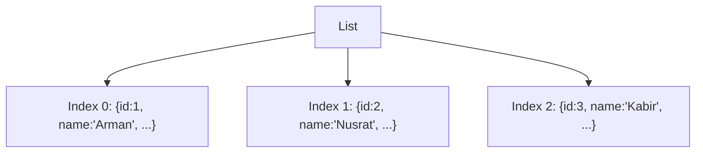

# ০৪. Lists and Lists of Dicts/Objects

একটা ট্রেনের কথা কল্পনা করো। প্রতিটা বগির (compartment) একটা নাম্বার আছে — ০, ১, ২... এভাবে। Python-এর **list** ঠিক এরকম — একগুচ্ছ মান, প্রতিটার একটা নির্দিষ্ট অবস্থান (index), যেটা শুরু হয় শূন্য (０) থেকে।

```python
cities = ["Dhaka", "Chittagong", "Sylhet"]

print(cities[0])      # "Dhaka"
print(cities[1])      # "Chittagong"
print(len(cities))    # 3
print(cities[-1])     # "Sylhet" - নেগেটিভ index দিয়ে পেছন থেকে গোনা যায়
```

লক্ষ্য করো `cities[-1]` — Python-এর একটা সুবিধা, যেটা JavaScript-এর array-তে সরাসরি নেই। শেষ আইটেম পেতে JavaScript-এ `cities[cities.length - 1]` লিখতে হয়, Python-এ শুধু `-1`। এটা ছোট একটা জিনিস, কিন্তু বাস্তব কোডে "সবচেয়ে সাম্প্রতিক অর্ডারটা দেখাও" জাতীয় লজিকে খুব ঘন ঘন আসে।

এই সাধারণ list-এ আমরা শুধু টেক্সট রেখেছি। কিন্তু বাস্তব ব্যাকএন্ড অ্যাপ্লিকেশনে ডেটা সাধারণত এতটা সরল হয় না। মনে করো তোমাকে সব ইউজারের তালিকা রাখতে হবে — শুধু নাম না, প্রতিটা ইউজারের নাম, ইমেইল, বয়স সবকিছু। তখন দরকার হয় **list of dicts** — যেখানে প্রতিটা বগিতে (index) বসানো থাকে একটা পুরো ফোল্ডার (dict), শুধু একটা কাগজ না।

```python
users = [
    {"id": 1, "name": "Arman", "email": "arman@example.com", "age": 25},
    {"id": 2, "name": "Nusrat", "email": "nusrat@example.com", "age": 22},
    {"id": 3, "name": "Kabir", "email": "kabir@example.com", "age": 30},
]

print(users[0]["name"])   # "Arman"
print(users[1]["email"])  # "nusrat@example.com"
```

এই গঠনটাকে চিনে রাখা খুব গুরুত্বপূর্ণ, কারণ প্রায় প্রতিটা API-ই যখন একাধিক জিনিসের তালিকা রিটার্ন করে (যেমন সব প্রোডাক্টের লিস্ট, সব অর্ডারের লিস্ট), তখন সেটা এভাবেই আসে — একটা list, যার ভেতরে অনেকগুলো dict।



FastAPI-তে একটা GET endpoint বানালে সেটা দেখতে এমন হয়:

```python
@app.get("/users")
def get_users():
    return users  # পুরো list of dicts রেসপন্স হিসেবে যাবে
```

আর ক্লায়েন্টের দিক থেকে, এটাই ঠিক সেই JSON array, যেটা Module 6-এ আমরা status code সহ রেসপন্স পাঠানো শিখেছিলাম। বাস্তব প্রজেক্টে অবশ্য raw dict-এর বদলে সাধারণত একটা Pydantic model দিয়ে `response_model` সংজ্ঞায়িত করা হয়, যাতে output-এর গঠনটাও validate ও document (Swagger UI-তে) হয়ে যায় — এটা আমরা পরের মডিউলগুলোতে আরও বিস্তারিত দেখবো।

## একটা প্রোডাকশন-লেভেল সতর্কতা — list-এর ভেতরে `in` অপারেটর কতটা "সস্তা"

একটা ভুল যা প্রায়ই নতুন ডেভেলপাররা করে — বড় একটা list-এর ভেতরে বারবার `if item_id in list_of_ids:` জাতীয় চেক করা। সমস্যাটা হলো, Python-এর `list`-এ কোনো একটা মান খুঁজতে গেলে Python লিস্টের শুরু থেকে একটা একটা করে চেক করে — এই অপারেশনের জটিলতা (complexity) `O(n)`। যদি এই চেকটা একটা লুপের ভেতরে বসে, আর দুটোই বড় হতে থাকে, তাহলে সম্পূর্ণ কাজটা `O(n²)`-এ চলে যায়।

```python
order_ids = [order["id"] for order in orders]  # ধরো ১০,০০০টা অর্ডার

# বিপদজনক প্যাটার্ন - বড় ডেটাতে খুব স্লো হয়ে যাবে
for user_order_id in incoming_ids:  # ধরো ৫,০০০টা ইনকামিং আইডি
    if user_order_id in order_ids:  # প্রতিটা চেক O(n) - মোট O(n * m)
        ...
```

সমাধান খুব সহজ — যখন তোমার শুধু "এটা আছে কিনা" যাচাই করা লাগবে, ক্রম (order) বা ডুপ্লিকেট গুরুত্বপূর্ণ না, তখন `list`-এর বদলে `set` ব্যবহার করো। `set`-এ `in` চেক করা `O(1)` — প্রায় তাৎক্ষণিক, ডেটার আকার যতই বড় হোক।

```python
order_ids = {order["id"] for order in orders}  # set comprehension, লক্ষ্য করো {} বন্ধনী

for user_order_id in incoming_ids:
    if user_order_id in order_ids:  # প্রতিটা চেক O(1)
        ...
```

এটা এমন একটা বাগ/স্লো-ডাউন যা ডেভেলপমেন্টে ছোট টেস্ট ডেটায় কখনো টের পাওয়া যায় না — ১০-২০টা আইটেমে `O(n²)` আর `O(n)` প্রায় একই রকম লাগে। কিন্তু প্রোডাকশনে যখন লিস্টের আকার হাজার-লাখে পৌঁছায়, তখনই একটা এন্ডপয়েন্ট আচমকা "স্লো" হয়ে যায়, আর ডিবাগ করতে গিয়ে বোঝা যায় সমস্যাটা আসলে একটা সাধারণ `in` চেক-এর ভুল ডেটা-স্ট্রাকচার বেছে নেওয়া।

এখন কল্পনা করো, একটা ফাংশনে যদি তোমাকে `users[0]["name"]` আর `users[0]["email"]` — দুটোই আলাদা করে বের করতে হয়, প্রতিবার `users[0][...]` লিখে লিখে ক্লান্ত হয়ে যাবে। এই সমস্যার সুন্দর সমাধান হলো destructuring/unpacking, যেটা আমরা ঠিক পরের লেসনেই শিখবো।
