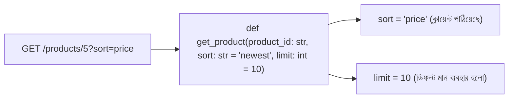

# ০৫. Destructuring/Unpacking in Lists and Dicts

একটা কুরিয়ার বক্সের কথা ভাবো, যার ভেতরে তিনটা জিনিস আছে — একটা বই, একটা কলম, একটা নোটবুক। বক্সটা খুলে একটা একটা করে জিনিস বের করে সরাসরি নির্দিষ্ট শেলফে রেখে দেওয়াকেই বলা যায় **unpacking** (Python-এর পরিভাষায় সাধারণত "destructuring" না বলে "unpacking" বলা হয়) — বক্সের (list বা dict) ভেতর থেকে সরাসরি প্রতিটা জিনিস তার নিজের ভ্যারিয়েবলে বসিয়ে দেওয়া, বারবার ইন্ডেক্স বা key লিখে বের না করে।

## Tuple/List Unpacking

গত লেসনে আমরা দেখেছিলাম মান বের করতে হলে `users[0]["name"]` এভাবে লিখতে হয়। Python-এ list-এর মান একসাথে বেশ কয়েকটা ভ্যারিয়েবলে unpack করে ফেলা যায়:

```python
cities = ["Dhaka", "Chittagong", "Sylhet"]
capital, second, third = cities
print(capital)  # "Dhaka"
print(second)   # "Chittagong"
```

লক্ষ্য করার মতো — এখানে unpacking-এর মান আর ভ্যারিয়েবলের সংখ্যা **অবশ্যই মিলতে হবে**। এটা এমন একটা জায়গা যেখানে নতুনরা প্রায়ই একটা `ValueError` পায়:

```python
cities = ["Dhaka", "Chittagong", "Sylhet"]
capital, second = cities  # ValueError: too many values to unpack (expected 2)
```

JavaScript-এ `const [capital, second] = cities;` করলে বাদ পড়া বাকি আইটেমগুলো নিঃশব্দে উপেক্ষা করা হয় (কোনো error দেয় না), কিন্তু Python এখানে কড়া — সংখ্যা না মিললে সরাসরি error ছুঁড়ে দেয়। এটা আসলে সুরক্ষার দিক থেকে ভালো (silent bug কম হয়), কিন্তু যারা JavaScript থেকে আসছে তাদের জন্য একটা চমক। যদি শুধু প্রথম কয়েকটা লাগে আর বাকিটা এক জায়গায় জমা রাখতে চাও, `*` ব্যবহার করা যায়:

```python
first, *rest = cities
print(first)  # "Dhaka"
print(rest)   # ["Chittagong", "Sylhet"]
```

## Dict Unpacking — `.items()` আর সরাসরি key বসানো

dict-এর ক্ষেত্রে সরাসরি `name, email = user` লিখলে Python ভাববে তুমি dict-এর **key**-গুলো unpack করতে চাইছো (কারণ dict-কে loop করলে key-ই আসে), value না। এটাও একটা সাধারণ ভুল বোঝাপড়ার জায়গা:

```python
user = {"name": "Arman", "email": "arman@example.com"}
a, b = user  # a = "name", b = "email" — value না, key!
```

value বের করার জন্য সরাসরি key দিয়ে assign করাই সবচেয়ে common প্যাটার্ন:

```python
user = {"id": 1, "name": "Arman", "email": "arman@example.com", "age": 25}
name = user["name"]
email = user["email"]
```

আর dict-এর একাধিক key-value জোড়া নিয়ে একসাথে লুপ করতে চাইলে `.items()` দিয়ে unpacking করা হয় — এটাই dict-এর জন্য সবচেয়ে কাছের "destructuring" অনুভূতি:

```python
for key, value in user.items():
    print(f"{key}: {value}")
```

## `**kwargs` Unpacking — একটা dict-কে ফাংশনের argument-এ ছড়িয়ে দেওয়া

Python-এর আরেকটা শক্তিশালী unpacking প্যাটার্ন হলো `**` দিয়ে dict-কে সরাসরি keyword argument হিসেবে পাস করা — এটা FastAPI বা database লেয়ারের কোডে খুব ঘন ঘন দেখা যায়:

```python
def create_user(name: str, email: str, age: int):
    return {"name": name, "email": email, "age": age}

user_data = {"name": "Arman", "email": "arman@example.com", "age": 25}
new_user = create_user(**user_data)  # dict-এর প্রতিটা key যেন আলাদা argument হিসেবে গেলো
```

## একটা সাধারণ ভুল — builtin নাম শ্যাডো করা

Python-এ unpacking করার সময় একটা প্রোডাকশন-লেভেল সাধারণ ভুল হয় — অসাবধানে এমন ভ্যারিয়েবল নাম বেছে নেওয়া যেটা Python-এর নিজস্ব builtin function/টাইপের নামের সাথে মিলে যায়, যেমন `list`, `dict`, `id`, `type`, `str`, `sum`।

```python
users = [{"id": 1}, {"id": 2}]

for id, user in enumerate(users):  # bug: 'id' নামটা builtin id() ফাংশনকে শ্যাডো করে ফেললো
    print(id)  # আসলে index চাইছিলাম কিন্তু নামটা বিভ্রান্তিকর

# আরও খারাপ:
list = [1, 2, 3]  # এখন এই ফাইলের বাকি অংশে list() ফাংশনটাই আর কাজ করবে না!
new_list = list((4, 5, 6))  # TypeError: 'list' object is not callable
```

এই ভুলটা মারাত্মক এই কারণে যে Python এখানে কোনো ওয়ার্নিং বা error দেয় না — `list` নামের ভ্যারিয়েবল তৈরি করা পুরোপুরি বৈধ, শুধু এর ফলে ওই স্কোপের ভেতরে builtin `list()` ফাংশনটা আর অ্যাক্সেসযোগ্য থাকে না। বড় ফাইলে এই সমস্যাটা অনেক নিচে গিয়ে, অনেক পরে হঠাৎ `TypeError` হিসেবে ফুটে ওঠে, আর তখন খুঁজে বের করা কঠিন হয়ে যায় কেন। সমাধান হলো — কখনো `id`, `list`, `dict`, `type`, `str`, `sum`, `input` -এর মতো builtin নাম নিজের ভ্যারিয়েবলের জন্য ব্যবহার না করা; পরিবর্তে `user_id`, `id_`, `data_list`, `record` জাতীয় নাম বেছে নেওয়া।

Destructuring/unpacking-এর সবচেয়ে বড় কাজে লাগার জায়গাটা হলো FastAPI-এর route handler। Module 4 লেসন ৬-এ আমরা query param আর path param নিয়ে কথা বলেছিলাম — FastAPI-তে এগুলো ফাংশনের প্যারামিটার হিসেবেই আসে, তাই সরাসরি নাম দিয়ে ব্যবহার করা যায়, ডিফল্ট মান সহ:

```python
@app.get("/products/{product_id}")
def get_product(product_id: str, sort: str = "newest", limit: int = 10):
    return {"id": product_id, "sort": sort, "limit": limit}
```

মানে ক্লায়েন্ট কিছু না পাঠালেও `sort` এর মান স্বয়ংক্রিয়ভাবে `"newest"` হয়ে যাবে। এটা অনেকটা রেস্টুরেন্টে অর্ডার না দিলে "আজকের স্পেশাল" পাঠিয়ে দেওয়ার মতো — একটা নিরাপদ ডিফল্ট আচরণ।



Unpacking শুধু কোড সংক্ষিপ্ত করে না, কোড পড়াও সহজ করে দেয় — একনজরে বোঝা যায় একটা dict বা list থেকে ঠিক কোন কোন তথ্য দরকার। এখন চলো দেখি, বাস্তব প্রজেক্টে list কীভাবে ঘুরেফিরে ব্যবহার হয়, তার কিছু জীবন্ত উদাহরণ দিয়ে।
