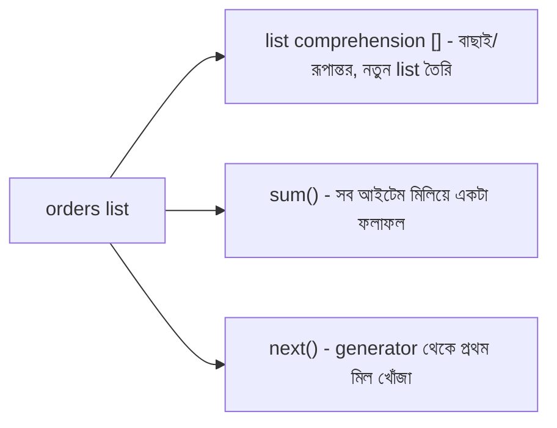

# ০৬. Lists In Real Life

এতক্ষণ আমরা list-কে থিওরির চোখে দেখেছি। এবার কল্পনা করো তুমি একটা ই-কমার্স সাইটের ব্যাকএন্ডে কাজ করছো, আর তোমার কাছে একটা অর্ডার তালিকা আছে।

```python
orders = [
    {"id": 101, "customer": "Arman", "amount": 1500, "status": "delivered"},
    {"id": 102, "customer": "Nusrat", "amount": 800, "status": "pending"},
    {"id": 103, "customer": "Kabir", "amount": 3200, "status": "delivered"},
    {"id": 104, "customer": "Rafi", "amount": 450, "status": "cancelled"},
]
```

বাস্তব জীবনে এই তালিকা নিয়ে তোমাকে নানা প্রশ্নের উত্তর দিতে হবে — "কতগুলো অর্ডার ডেলিভার হয়েছে?", "মোট বিক্রি কত টাকা?", "শুধু pending অর্ডারগুলোর নাম কী কী?" জাভাস্ক্রিপ্টে এই কাজগুলোর জন্য `filter`/`map`/`reduce`/`find` থাকে; Python-এ এই একই সমস্যাগুলোর সমাধান হয় **list comprehension**, `sum()`, আর `next()`-এর মাধ্যমে।

List comprehension ব্যবহার করে শুধু ডেলিভার হওয়া অর্ডার বের করা যায়, অনেকটা ছাঁকনি দিয়ে চাল থেকে কাঁকর আলাদা করার মতো:

```python
delivered = [order for order in orders if order["status"] == "delivered"]
print(len(delivered))  # 2
```

List comprehension দিয়ে প্রতিটা অর্ডার থেকে শুধু customer-এর নাম বের করা যায় — অনেকটা একটা তালিকার প্রতিটা লাইন একই নিয়মে রূপান্তর করার মতো:

```python
customer_names = [order["customer"] for order in orders]
print(customer_names)  # ["Arman", "Nusrat", "Kabir", "Rafi"]
```

`sum()` ব্যবহার করে মোট বিক্রির অংক বের করা যায় — একটা ক্যালকুলেটরের মতো, যেটা তালিকার প্রতিটা মান একে একে যোগ করে একটা চূড়ান্ত ফলাফলে নিয়ে আসে (এটাই জাভাস্ক্রিপ্টের `reduce`-এর সবচেয়ে কমন ব্যবহারের Python-সংস্করণ):

```python
total_amount = sum(order["amount"] for order in orders)
print(total_amount)  # 5950
```

আর `next()` দিয়ে একটা নির্দিষ্ট শর্ত পূরণ করা প্রথম আইটেমটা খুঁজে বের করা যায় — যেমন একটা নির্দিষ্ট আইডির অর্ডার:

```python
order_103 = next(order for order in orders if order["id"] == 103)
print(order_103["customer"])  # "Kabir"
```

লক্ষ্য করো — এখানে `next(order for order in orders if order["id"] == 103)`-এ `[]` বন্ধনী নেই, `()` বন্ধনী। এটা একটা **generator expression**, list comprehension না। পার্থক্যটা গুরুত্বপূর্ণ এবং এটাই এই লেসনের সবচেয়ে বড় প্রোডাকশন-নুয়ান্স।



## কেন `next()`-এর সাথে generator ব্যবহার করা হয়, list না

যদি আমরা লিখতাম `next([order for order in orders if order["id"] == 103])`, তাহলে Python প্রথমে **পুরো list স্ক্যান করে একটা সম্পূর্ণ নতুন list বানাতো** (এমনকি যদি ম্যাচ প্রথম আইটেমেই পাওয়া যায়!), তারপর সেই list-এর প্রথম আইটেম নিতো। কিন্তু generator expression (`()` বন্ধনী দিয়ে) ব্যবহার করলে Python **lazy** থাকে — এটা একটা একটা আইটেম চেক করে, প্রথম মিল পাওয়া মাত্র থেমে যায়, বাকি তালিকা আর স্পর্শ করে না।

এই পার্থক্যটা ৫টা অর্ডারের ক্ষেত্রে চোখে পড়ার মতো না, কিন্তু বাস্তব প্রোডাকশন সিস্টেমে যদি ১০ লাখ অর্ডারের মধ্যে থেকে একটা নির্দিষ্ট আইডি খুঁজতে হয়, আর সেই আইডিটা তালিকার শুরুর দিকেই থাকে, তাহলে list comprehension পদ্ধতিতে অনর্থক ১০ লাখ আইটেমের একটা নতুন list মেমরিতে তৈরি হবে, যেখানে generator মাত্র কয়েকটা আইটেম দেখেই থেমে যাবে। এটা একটা খুব সাধারণ ভুল যেটা কোড রিভিউতে চোখে পড়ে — `next([x for x in items if condition])` লেখা, যেখানে `next(x for x in items if condition)` (বন্ধনী ছাড়া, generator) লিখলেই যথেষ্ট এবং অনেক বেশি efficient।

একটা বাড়তি সতর্কতা — যদি কোনো আইটেম শর্ত পূরণ না করে, `next()` একটা `StopIteration` এক্সেপশন ছুঁড়ে দেয়, যা হ্যান্ডেল না করলে পুরো রিকোয়েস্ট ক্র্যাশ করতে পারে। বাস্তব কোডে সাধারণত একটা ডিফল্ট মান দিয়ে রাখা হয়:

```python
order_999 = next((order for order in orders if order["id"] == 999), None)
print(order_999)  # None, এক্সেপশন হয় না
```

এই চারটা প্যাটার্ন — list comprehension, `sum()`, generator expression, আর `next()` — ব্যাকএন্ড ডেভেলপারের হাতিয়ারবাক্সের সবচেয়ে বেশি ব্যবহৃত টুল বলা চলে। Module 6-এ যখন আমরা API-তে ডেটা প্রসেস করার কথা বলেছিলাম, তখন পর্দার আড়ালে ঠিক এই ধরনের প্যাটার্নই কাজ করে। এখন যেহেতু আমরা list আর dict দুটোই ভালোভাবে বুঝে গেছি, একটু থেমে বাইরের কিছু শেখার সহায়ক উৎস নিয়ে কথা বলা যাক, তারপর আমরা এই দুটো ধারণাকে এক জায়গায় জড়ো করবো।
