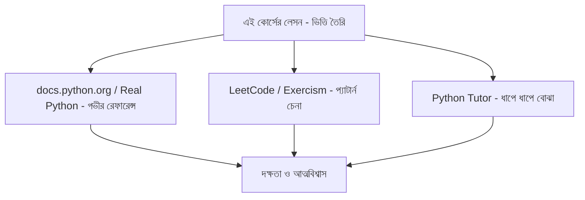

# ০৭. Some External Learning Sources 1

এই পর্যায়ে এসে dict আর list নিয়ে তোমার হাতে বেশ ভালো একটা ভিত্তি তৈরি হয়ে গেছে। কিন্তু যেকোনো ভাষা শেখার ক্ষেত্রে একটা বাস্তবতা মেনে নেওয়া দরকার — একটা কোর্সের লেসন যতই ভালোভাবে লেখা হোক, সেটা কখনোই একমাত্র সম্বল হওয়া উচিত না। ভাষা শেখাটা অনেকটা সাঁতার শেখার মতো — একজন প্রশিক্ষক তোমাকে কৌশল শেখাতে পারে, কিন্তু আসল দক্ষতা আসে বারবার পানিতে নেমে অনুশীলন করা আর বিভিন্ন কোণ থেকে একই জিনিস দেখা থেকে।

এই মুহূর্তে যে ধরনের বাড়তি রিসোর্স সবচেয়ে বেশি কাজে দেবে, তা হলো নির্ভরযোগ্য অফিসিয়াল ডকুমেন্টেশন — Python-এর ক্ষেত্রে এর মানে **docs.python.org**, বিশেষভাবে "Data Structures" অধ্যায় (`list`, `dict`, `tuple`, `set` নিয়ে) আর "Built-in Functions" রেফারেন্স। এই ধরনের ডকুমেন্টেশনের সুবিধা হলো, এতে প্রতিটা মেথডের (যেমন `.get()`, `.items()`, `.sort()`) সম্ভাব্য সব প্যারামিটার, রিটার্ন ভ্যালু, আর এজ-কেস উদাহরণ দেওয়া থাকে — যেটা কোনো একটা কোর্স তার সীমিত পরিসরে সবসময় কভার করতে পারে না। এছাড়া **Real Python** ওয়েবসাইটের list comprehension আর dictionary-সংশ্লিষ্ট আর্টিকেলগুলো ব্যাখ্যার গভীরতা আর প্রোডাকশন-লেভেল উদাহরণের জন্য বিশেষভাবে ভালো।

দ্বিতীয় ধরনের সহায়ক রিসোর্স হলো ছোট ছোট প্র্যাকটিস প্রবলেম — যেখানে তোমাকে একটা list of dicts দেওয়া থাকবে, আর কিছু নির্দিষ্ট শর্ত পূরণ করে ফলাফল বের করতে বলা হবে (যেমন LeetCode-এর সহজ প্রবলেমগুলো, বা exercism.org-এর Python ট্র্যাক)। এই ধরনের অনুশীলন তোমার মাথায় "কোন সমস্যায় কোন টুল ব্যবহার করবো" — এই প্যাটার্ন-চেনার ক্ষমতা তৈরি করে। যেমন, "সব ইউজারের মধ্যে যাদের বয়স ১৮-এর বেশি, তাদের নাম বের করো" — এই বাক্যটা পড়েই যদি তোমার মাথায় সাথে সাথে list comprehension-এর syntax ভেসে ওঠে, বুঝবে তুমি এই টুলগুলোতে সাবলীল হয়ে গেছো।

তৃতীয়ত, যদি ভিজ্যুয়াল বা ইন্টারেক্টিভভাবে শিখতে ভালো লাগে, তাহলে **Python Tutor** (pythontutor.com)-এর মতো টুল খুঁজে বের করা যায়, যেখানে কোড লাইন বাই লাইন চালিয়ে দেখানো যায় ঠিক কীভাবে একটা list-এর প্রতিটা আইটেম প্রসেস হচ্ছে, মেমরিতে কী ঘটছে — এই ধরনের ভিজ্যুয়ালাইজেশন comprehension বা generator expression-এর মতো একটু জটিল মনে হওয়া ধারণা বোঝাতে খুব কার্যকর।

তবে মনে রাখার বিষয় হলো, এই বাড়তি রিসোর্সগুলো এই কোর্সের বিকল্প নয় — বরং একে সমৃদ্ধ করার সহায়ক অংশ। মূল পথটা আমরা এখানেই আঁকছি, ধাপে ধাপে, প্রজেক্ট-ভিত্তিকভাবে। এখন চলো, dict আর list নিয়ে যা যা শিখেছি, সেগুলোকে একটা সংক্ষিপ্ত ও গোছানো রেফারেন্স আকারে একসাথে সাজিয়ে ফেলি।
