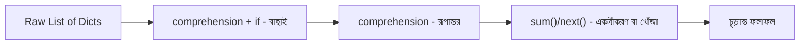

# ০৮. Python List and Dict Text Lesson Part One

এই মডিউলে আমরা বেশ কিছু পথ পেরিয়ে এসেছি — ডেটা টাইপ, dict, list, list of dicts, unpacking, আর comprehension-ভিত্তিক প্রসেসিং। এবার একটু থেমে, একটা লিখিত রেফারেন্স আকারে সবকিছু একসাথে সাজিয়ে ফেলা যাক, যাতে ভবিষ্যতে কোনো একটা জিনিস ভুলে গেলে এই লেসনে ফিরে এসে দ্রুত মনে করে নেওয়া যায়।

শুরু করি dict দিয়ে। একটা dict হলো key-value জোড়ার সংগ্রহ, বাস্তব জীবনের কোনো একটা জিনিসের বৈশিষ্ট্য প্রকাশ করার জন্য।

```python
book = {
    "title": "Clean Code",
    "pages": 464,
    "is_available": True,
}

def get_summary(b: dict) -> str:
    return f"{b['title']} - {b['pages']} pages"

print(get_summary(book))  # "Clean Code - 464 pages"
```

এরপর list — একই ধরনের একাধিক মান রাখার জন্য, ক্রমানুসারে সাজানো।

```python
numbers = [10, 20, 30, 40]
print(numbers[2])  # 30
```

এই দুটো একসাথে হলে তৈরি হয় list of dicts — বাস্তব ব্যাকএন্ড অ্যাপ্লিকেশনের সবচেয়ে কমন ডেটা গঠন।

```python
books = [
    {"title": "Clean Code", "pages": 464},
    {"title": "The Pragmatic Programmer", "pages": 352},
]
```

Unpacking আমাদের সাহায্য করে এই গঠন থেকে দ্রুত মান বের করতে।

```python
first_book, second_book = books
title = books[0]["title"]
pages = books[0]["pages"]
```

আর list comprehension — এই সব list of dicts নিয়ে কাজ করার আসল শক্তি।

```python
long_books = [b for b in books if b["pages"] > 400]
titles = [b["title"] for b in books]
total_pages = sum(b["pages"] for b in books)
found = next((b for b in books if b["title"] == "Clean Code"), None)
```

এই সবগুলো টুল একসাথে কল্পনা করলে একটা প্রসেসিং পাইপলাইনের মতো দেখতে লাগে — কাঁচামাল (raw list) একদিক দিয়ে ঢোকে, বিভিন্ন ধাপ পেরিয়ে দরকারি ফলাফল বের হয়ে আসে অন্যদিক দিয়ে।



একটা জিনিস মনে রাখা জরুরি — list comprehension সবসময় একটা **নতুন list** রিটার্ন করে, মূল list-কে বদলায় না, যদি না তুমি ইচ্ছাকৃতভাবে `[:] =` বা `.append()`-এর মতো mutating অপারেশন করো। এই আচরণকে বলে **immutability by convention** — মূল ডেটা অক্ষত থাকে, শুধু তার একটা নতুন সংস্করণ তৈরি হয়। এটা ব্যাকএন্ড ডেভেলপমেন্টে বিশেষভাবে গুরুত্বপূর্ণ, কারণ একই ডেটার উপর যদি একাধিক জায়গা থেকে কাজ চলে, তাহলে অনিচ্ছাকৃতভাবে মূল ডেটা পাল্টে যাওয়াটা বাগের একটা বড় উৎস হতে পারে।

তবে এখানে Python-এর একটা নিজস্ব ফাঁদ আছে যা এই সুরক্ষার অনুভূতিকে ভেঙে দিতে পারে — **mutable default argument**। যদি একটা function-এর ডিফল্ট প্যারামিটার হিসেবে একটা খালি list বা dict দেওয়া হয়, সেই list/dict object-টা মাত্র **একবারই** তৈরি হয় (function সংজ্ঞায়িত হওয়ার সময়), এবং ফাংশনটা যতবার কল হবে ততবারই ওই একই object পুনরায় ব্যবহৃত হয়:

```python
def add_item(item, cart=[]):  # বিপদজনক! cart এখানে শুধু একবারই তৈরি হয়
    cart.append(item)
    return cart

print(add_item("apple"))   # ["apple"]
print(add_item("banana"))  # ["apple", "banana"] - আগের কলের ডেটা এখনো আছে!
```

এটা ভয়ংকর একটা বাগের উৎস কারণ প্রথম কলে সবকিছু ঠিকই দেখায়, কিন্তু পরের কলগুলোতে আগের রিকোয়েস্টের ডেটা "লিক" করে ঢুকে যায় — যেন দুটো ভিন্ন ইউজারের শপিং কার্ট একে অপরের সাথে মিশে যাচ্ছে। সমাধান হলো ডিফল্ট হিসেবে `None` দেওয়া, আর function-এর ভেতরে নতুন list তৈরি করা:

```python
def add_item(item, cart=None):
    if cart is None:
        cart = []
    cart.append(item)
    return cart
```

এই রেফারেন্সটা মাথায় গেঁথে নিয়ে, এখন চলো দেখি বাস্তব ব্যাকএন্ড অ্যাপ্লিকেশনে এই টুলগুলো দিয়ে ঠিক কী কী কমন প্যাটার্ন তৈরি হয় — যেমন সার্চ, ফিল্টার, আর পেজিনেশন।
